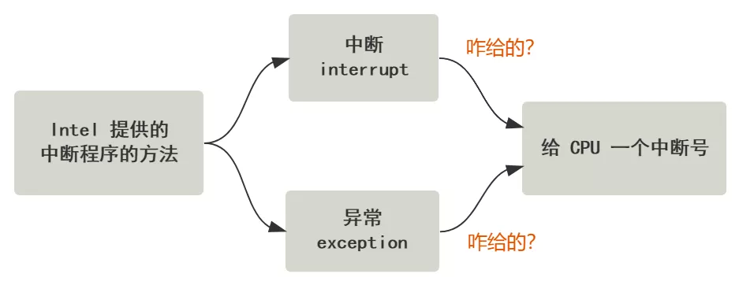

# 中断

<!-- START doctoc generated TOC please keep comment here to allow auto update -->
<!-- DON'T EDIT THIS SECTION, INSTEAD RE-RUN doctoc TO UPDATE -->

- [零、开篇](#%E9%9B%B6%E5%BC%80%E7%AF%87)
- [一、五花八门的中断分类](#%E4%B8%80%E4%BA%94%E8%8A%B1%E5%85%AB%E9%97%A8%E7%9A%84%E4%B8%AD%E6%96%AD%E5%88%86%E7%B1%BB)
- [二、收到中断号之后 CPU 干嘛？](#%E4%BA%8C%E6%94%B6%E5%88%B0%E4%B8%AD%E6%96%AD%E5%8F%B7%E4%B9%8B%E5%90%8E-cpu-%E5%B9%B2%E5%98%9B)
- [三、中断描述符表是啥？](#%E4%B8%89%E4%B8%AD%E6%96%AD%E6%8F%8F%E8%BF%B0%E7%AC%A6%E8%A1%A8%E6%98%AF%E5%95%A5)
- [四、中断描述符是啥？](#%E5%9B%9B%E4%B8%AD%E6%96%AD%E6%8F%8F%E8%BF%B0%E7%AC%A6%E6%98%AF%E5%95%A5)
- [五、CPU 怎么找到中断描述符表](#%E4%BA%94cpu-%E6%80%8E%E4%B9%88%E6%89%BE%E5%88%B0%E4%B8%AD%E6%96%AD%E6%8F%8F%E8%BF%B0%E7%AC%A6%E8%A1%A8)
- [六、谁把中断描述符表这个结构写在内存的](#%E5%85%AD%E8%B0%81%E6%8A%8A%E4%B8%AD%E6%96%AD%E6%8F%8F%E8%BF%B0%E7%AC%A6%E8%A1%A8%E8%BF%99%E4%B8%AA%E7%BB%93%E6%9E%84%E5%86%99%E5%9C%A8%E5%86%85%E5%AD%98%E7%9A%84)
- [七、找到中断描述符后，干嘛](#%E4%B8%83%E6%89%BE%E5%88%B0%E4%B8%AD%E6%96%AD%E6%8F%8F%E8%BF%B0%E7%AC%A6%E5%90%8E%E5%B9%B2%E5%98%9B)
- [八、总结](#%E5%85%AB%E6%80%BB%E7%BB%93)

<!-- END doctoc generated TOC please keep comment here to allow auto update -->

[TOC]

## 零、开篇

**整个操作系统就是一个中断驱动的死循环**，操作系统原理如果用一行代码解释，下面这样再合适不过了。

```
while(true) {
    doNothing();
}
```

**其他所有事情都是由操作系统提前注册的中断机制和其对应的中断处理函数完成**，我们点击一下鼠标，敲击一下键盘，执行一个程序，都是用中断的方式来通知操作系统帮我们处理这些事件，当没有任何需要操作系统处理的事件时，它就乖乖停在死循环里不出来。

所以，中断，非常重要，它也是理解整个操作系统的根基，掌握它，不亏！

那我们开始吧。

## 一、五花八门的中断分类

关于中断的分类，教科书上和网上有很多"标准"答案了，如果你用搜索引擎去寻找答案，可能会找出很多不一样的分类结果。

所以我打算直接在 Intel 手册上找个最官方的标准答案。

在 *Intel 手册 Volume 1 Chapter 6.4 Interrupts and Exception* 给出。


翻译过来就是，**中断可以分为中断和异常，异常又可以分为故障、陷阱、中止**。

第一句话有点奇怪，啥叫中断分为中断和异常呢？你看好多文章的时候也是这么写的，不知道你有没有曾疑惑过。

但其实原文的意思准确说是，**CPU 提供了两种中断程序执行的机制，中断和异常**。第一个中断是个动词，第二个中断才是真正的机制种类。

好吧，我感觉原文也挺奇怪的，但人家就这么叫，没辙。

接下来我只需要翻译一下就好了，再夹杂点自己的解读。

An interrupt is an asynchronous event that is typically triggered by an I/O device.

先说第一个机制中断（interrupt），**中断是一个异步事件，通常由 IO 设备触发**。比如点击一下鼠标、敲击一下键盘等。

An exception is a synchronous event that is generated when the processor detects one or more predefined conditions while executing an instruction.

再说第二个机制异常（exception），**异常是一个同步事件，是 CPU 在执行指令时检测到的反常条件**。比如除法异常、错误指令异常，缺页异常等。

这两个机制，殊途同归，**都是让 CPU 收到一个中断号**，至于 CPU 收到这个中断号之后干嘛，我们暂且不管。



我们先看看收到中断号之前，具体就是中断和异常到底是怎么做到给 CPU 一个中断号的。

先说中断，别眨眼。

有一个设备叫做**可编程中断控制器**，它有很多的 **IRQ** 引脚线，接入了一堆能发出中断请求的硬件设备，当这些硬件设备给 IRQ 引脚线发一个信号时，由于可编程中断控制器提前被设置好了 IRQ 与中断号的对应关系，所以就转化成了对应的中断号，把这个中断号存储在自己的一个端口上，然后给 CPU 的 **INTR** 引脚发送一个信号，CPU 收到 INTR 引脚信号后去刚刚的那个端口读取到这个中断号的值。

估计你被绕晕了，但读我的文章有个好处，太复杂就上动图，来吧。


你看，**最终的目标，就是让 CPU 知道，有中断了，并且也知道中断号是多少**。

比如上图中按下了键盘，最终到 CPU 那里的反应就是，得到了一个中断号 **0x21**。

那异常的机制就更简单了，是 CPU 自己执行指令时检测到的一些反常情况，然后自己给自己一个中断号即可，无需外界给。

比如 CPU 执行到了一个无效的指令，则自己给自己一个中断号 **0x06**，这个中断号是 Intel 的 CPU 提前就规定好写死了的硬布线逻辑。

好了，到目前为止，我们知道了无论是**中断**还是**异常**，最终都是通过各种方式，让 CPU 得到一个中断号。只不过中断是通过外部设备给 CPU 的 INTR 引脚发信号，异常是 CPU 自己执行指令的时候发现特殊情况触发的，自己给自己一个中断号。

还有一种方式可以给到 CPU 一个中断号，但 Intel 手册写在了后面，*Chapter 6.4.4 INT n*，就是大名鼎鼎的 **INT 指令**。


INT 指令后面跟一个数字，就相当于直接用指令的形式，告诉 CPU 一个中断号。

比如 **INT 0x80**，就是告诉 CPU 中断号是 **0x80**。Linux 内核提供的**系统调用**，就是用了 INT 0x80 这种指令。

那我们上面的图又丰富了起来。


有的地方喜欢把他们做一些区分，把 INT n 这种方式叫做**软件中断**，因为他是由软件程序主动触发的。相应的把上面的中断和异常叫做**硬件中断**，因为他们都是硬件自动触发的。

但我觉得大可不必，一共就这么几个分类，干嘛还要增加一层理解的成本呢，记三个方式不好么？

好了，总结一下，给 CPU 一个中断号有三种方式，而这也是中断分类的依据。

***1.*** **通过中断控制器给 CPU 的 INTR 引脚发送信号**，并且允许 CPU 从中断控制器的一个端口上读取中断号，比如按下键盘的一个按键，最终会给到 CPU 一个 0x21 中断号。

***2.*** **CPU 执行某条指令发现了异常**，会自己触发并给自己一个中断号，比如执行到了无效指令，CPU 会给自己一个 0x06 的中断号。

***3.*** **执行 INT n 指令**，会直接给 CPU 一个中断号 n，比如触发了 Linux 的系统调用，实际上就是执行了 INT 0x80 指令，那么 CPU 收到的就是一个 0x80 中断号。

再往后，CPU 以各种不同的方式收到的这些 0x21 0x06 0x80，都会**一视同仁**，做同样的后续处理流程，所以从现在开始，前面的事情就不用再管了，这也体现了分层的好处。

## 二、收到中断号之后 CPU 干嘛？

那 CPU 收到中断号后，如何处理呢？

先用一句不太准确的话总结，**CPU 收到一个中断号 n 后，会去中断向量表中寻找第 n 个中断描述符，从中断描述符中找到中断处理程序的地址，然后跳过去执行**。

为什么说不准确呢？因为从中断描述符中找到的，并不直接是程序的地址，而是**段选择子**和**段内偏移地址**。然后段选择子又会去**全局描述符表**中寻找**段描述符**，从中取出**段基址**。之后段基址 + 段内偏移地址，才是最终处理程序的入口地址。


当然这个入口地址，还不是最终的物理地址，如果开启了分页，又要经历分页机制的转换，就像下面这样。


不过不要担心，这不是中断的主流程，**因为分段机制和分页机制是所有地址转换过程的必经之路，并不是中断这个流程所特有的**。

所以我们简单的把中断描述符表中存储的地址，直接当做 CPU 可以跳过去执行的中断处理程序的入口地址，就好了，不影响理解他们。


你看，这是不是简单很多。

那接下来的问题就很简单了，这里出现了两个名词，那就分别对他们进行发问。

***1.*** 中断描述符表是啥？

***2.*** 中断描述符是啥？

***3.*** 去哪里找他们？

分别回答即可

## 三、中断描述符表是啥？

**就是一个在内存中的数组而已**，操作系统初始化过程中，有很多结构都称之为 XXX 表，其实就是个数组罢了。

以 linux-2.6.0 源码为例，就很直观了。

```
struct desc_struct idt_table[256] = { {0, 0}, };
```

你看，是一个大小为 256 的数组。idt_table 这个名字就是 **Interrupt Descriptor Table**，逐字翻译过来确实就是**中断描述符表**。

## 四、中断描述符是啥？

**就是中断描述符表这个数组里的存储的数据结构**，通过刚刚的源码也可以看出来，是一个叫 **desc_struct** 的结构。

```
struct desc_struct {
    unsigned long a,b;
};
```

好家伙，Linux 源码里就这么简单粗暴表示，一个中断描述符的大小为 64 位，也就是 8 个字节，具体里面存的啥通过这个源码看不出来。

翻一下 Intel 手册，在 *Volumn 3 Chapter 5.11 IDT Descriptors* 中找到了一张图。


可以看到，中断描述符具体还分成好几个种类，有：

**Task Gate**：任务门描述符

**Interrupt Gate**：中断门描述符

**Trap Gate**：陷阱门描述符

不要慌，其中任务门描述符 Linux 中几乎没有用到。

中断门描述符和陷阱门描述符的区别仅仅是**是否允许中断嵌套**，实现方式非常简单粗暴，就是 CPU 如果收到的中断号对应的是一个中断门描述符，就修改 IF 标志位（就是一个寄存器中一位的值），修改了这个值后就屏蔽了中断，也就防止了中断的嵌套。而陷阱门没有改这个标志位，也就允许了中断的嵌套。

所以简单理解的话，你把他们当做同样一个描述符就好了，先别管这些细节，他们的结构几乎完全一样，只是差了一个类型标识罢了。

那这个中断描述符的结构长什么样呢？我们可以清晰地看到，里面有**段选择子**和**段内偏移地址**。


回顾下刚刚说的中断处理流程：


没骗你吧。

但以上这些如果你都搞不明白，还是那句话，记这个最简单的流程就好了，不影响理解：


好了，现在我们直观地看到了中断描述符表这个 256 大小的数组，以及它里面存的中断描述符长什么样子，**最终的目的，还是帮助 CPU 找到一个程序的入口地址，然后跳转过去**。

OK，下一个问题，就是 CPU 怎么寻找到这个中断描述符表的位置呢？它是在内存中一个固定的位置么？

## 五、CPU 怎么找到中断描述符表

答案是否定的，**中断描述符表在哪里，全凭各个操作系统的喜好，想放在哪里就放在哪里**，但需要通过某种方式告诉 CPU，即可。

怎么告诉呢？CPU 提前预留了一个寄存器叫 **IDTR 寄存器**，这里面存放的就是中断描述符表的起始地址，以及中断描述符表的大小。

在 *Volumn 3 Chapter 5.10 Interrupt Descriptor Table* 中告诉了我们 IDTR 寄存器的结构。


操作系统的代码可以通过 **LIDT 指令**，将中断描述符表的地址放在这个寄存器里。

还记得刚刚看的源码么？中断描述符表就是这个。

```
struct desc_struct idt_table[256] = { {0, 0}, };
```

然后操作系统把这个的地址用 **LIDT** 指令放在 **IDTR 寄存器**就行了。IDTR 寄存器里的值一共 48 位，前 16 位是中断描述符表大小（字节数），后 32 位是中断描述符表的起始内存地址，就是这个 idt_table 的位置。

Linux-2.6.0 源码中是这样构造这个结构的，简单粗暴。

```
idt_descr:
    .word 256 * 8 - 1
    .long idt_table
```

紧接着，一个 LIDT 指令把这个结构放到 IDTR 寄存器中。

```
lidt idt_descr
```

整个过程一气呵成，呵得我连代码格式都懒得调了，是不是很清晰明了。

这样，CPU 收到一个中断号后，**中断描述符表的起始位置从 IDTR 寄存器中可以知道，而且里面的每个中断描述符都是 64 位大小，也就是 8 个字节，那自然就可以找到这个中断号对应的中断描述符**。

接下来的问题就是，这个中断描述符表是谁来提前写好的？又是怎么写的？

## 六、谁把中断描述符表这个结构写在内存的

很简单，操作系统呗。

在 Linux-2.6.0 内核源码的 traps.c 文件中，有这样一段代码。

```
void __init trap_init(void) {
    set_trap_gate(0, &divide_error);
    ...
    set_trap_gate(6, &invalid_op);
    ...
    set_intr_gate(14, &page_fault);
    ...
    set_system_gate(0x80, &system_call);
}
```

你看，我们刚刚提到的**除法异常、非法指令异常、缺页异常**，以及之后可能通过 INT 0x80 触发**系统调用**的中断处理函数 system_call，就是这样被写到了中断描述符表里。

经过这样一番操作后，我们的中断描述符表里的值就丰富了起来。

好了，现在只剩下最后一个问题了，CPU 在找到一个中断描述符后，如何跳过去执行？

## 七、找到中断描述符后，干嘛

现在这个问题可以再问得大一些了，就是 **CPU 在收到一个中断号并且找到了中断描述符之后，究竟做了哪些事**？

当然，最简单的办法就是，**直接把中断描述符里的中断程序地址取出来，放在自己的 CS:IP 寄存器中**，因为这里存的值就是下一跳指令的地址，只要放进去了，到下一个 CPU 指令周期时，就会去那里继续执行了。

但 CPU 并没有这样简单粗暴，而是帮助我们程序员做了好多额外的事情，这增加了我们的学习和理解成本，但方便了写操作系统的程序员，拿到一些中断的信息，以及中断程序结束后的返回工作。

但其实，就是做了一些**压栈操作**。

***1.*** 如果发生了特权级转移，压入之前的堆栈段寄存器 SS 及栈顶指针 ESP 保存到栈中，并将堆栈切换为 TSS 中的堆栈。

***2.*** 压入标志寄存器 EFLAGS。

***3.*** 压入之前的代码段寄存器 CS 和指令寄存器 EIP，相当于压入返回地址。

***4.*** 如果此中断有错误码的，压入错误码 ERROR_CODE

***5.*** 结束（之后就跳转到中断程序了）

压栈操作结束后，栈就变成了这个样子。


特权级的转移需要切换栈，所以提前将之前的**栈指针**压入。**错误码**可以方便中断处理程序做一些工作，如果需要，从栈顶拿到就好了。

抛开这两者不说，剩下的就只有**标志寄存器**和**中断发生前的代码地址**，被压入了栈，这很好理解，就是方便中断程序结束后，返回原来的代码嘛~

具体的压栈工作，以及如何利用这些栈的信息达到结束中断并返回原程序的效果，Intel 手册中也写得很清楚。

*Volumn 3A System Programming Guide Chapter 5.12.1Exception- or Interrupt-Handler Procedures*


看下面的话，通过配合 **IRET** 或 **IRETD** 指令返回。

由于后续版本的 Linux 自己的玩法比较多，已经不用 Intel 提供的现成指令了，所以这回我们从 Linux-0.11 版源码中寻找答案。

比如除法异常的中断处理函数，在 asm.s 中。

```
_divide_error:
 push dword ptr _do_divide_error ;
no_error_code: ;
 xchg [esp],eax ;
 push ebx
 push ecx
 push edx
 push edi
 push esi
 push ebp
 push ds ;
 push es
 push fs
 push 0 ;
 lea edx,[esp+44] ;
 push edx
 mov edx,10h ;
 mov ds,dx
 mov es,dx
 mov fs,dx
 call eax ;
 add esp,8 ;
 pop fs
 pop es
 pop ds
 pop ebp
 pop esi
 pop edi
 pop edx
 pop ecx
 pop ebx
 pop eax ;// 弹出原来eax 中的内容。
 iretd
```

只看最后一行，确实用了 iretd 指令。

这个指令会依次弹出栈顶的三个元素，把它们分别赋值给 **EIP，CS 和 EFLAGS**，而栈顶的三个元素，又恰好是 **EIP，CS 和 EFLAGS** 这样的顺序，你说这巧不巧？

当然不巧，人家 CPU 执行中断函数前做了压栈操作，然后又提供了 iret 指令做弹栈操作，当然是给你配套使用的！

你看，**中断是如何切到中断处理程序的？就是靠中断描述符表中记录的地址。那中断又如何回到原来的代码继续执行呢？是通过 CPU 帮我们把中断发生前的地址压入了栈中**，然后我们程序自己利用他们去返回，当然也可以不返回。

这就是 CPU 和操作系统配合的结果，把中断这个事给解决了。

## 八、总结

所以总结起来就是，理解中断，只要回答了这几个问题就好。

**如何给 CPU 一个中断号？**

外部设备通过 INTR 引脚，或者 CPU 执行指令的过程中自己触发，或者由软件通过 INT n 指令强行触发。

同样中断也是这样进行分类的。

**CPU 收到中断号后如何寻找到中断程序的入口地址？**

通过 IDTR 寄存器找到中断描述符表，通过中断描述符表和中断号定位到中断描述符，取出中断描述符表中存储的程序入口地址。

**中断描述符表是谁写的？**

操作系统代码写上去的。

**找到程序入口地址之后，CPU 做了什么？**

简单说，实际上做的事情就是压栈，并跳转到入口地址处执行代码。而压栈的目的，就是保护现场（原来的程序地址、原来的程序堆栈、原来的标志位）和传递信息（错误码）

好了，中断讲完了，如果再往后扩大一点点概念，以上说的中断，统统都是**硬中断**。注意，不叫硬件中断哦。

为什么叫硬中断呢？因为这是 Intel CPU 这个硬件实现的中断机制，注意这里是实现机制，并不是触发机制，因为触发可以通过外部硬件，也可以通过软件的 INT 指令。

那与硬中断对应的还有**软中断**，这个概念网上好多地方都讲错了，把软中断和 INT 指令这种软件中断混淆了，**所以我觉得软件中断最好称其为，由软件触发的中断，而软中断称其为软件实现的中断**。

**软中断是纯粹由软件实现的一种类似中断的机制**，实际上它就是模仿硬件，在内存中有一个地方存储着软中断的标志位，然后由内核的一个线程不断轮询这些标志位，如果有哪个标志位有效，则再去另一个地方寻找这个软中断对应的中断处理程序。

软中断是 Linux 实现中断的**下半部**的一种非常常见的方式，之后我讲 Linux 内核如何接受网络包这个事情的时候也可以看到，软中断是研究整个过程的一个突破口。

