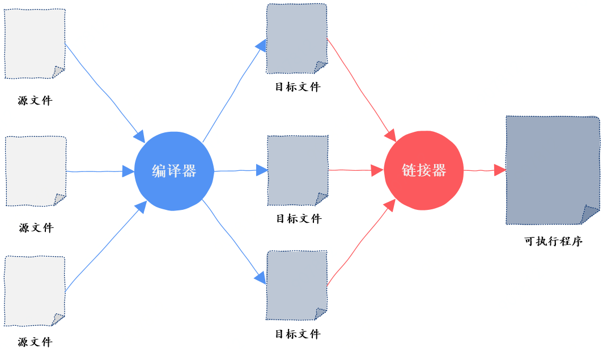
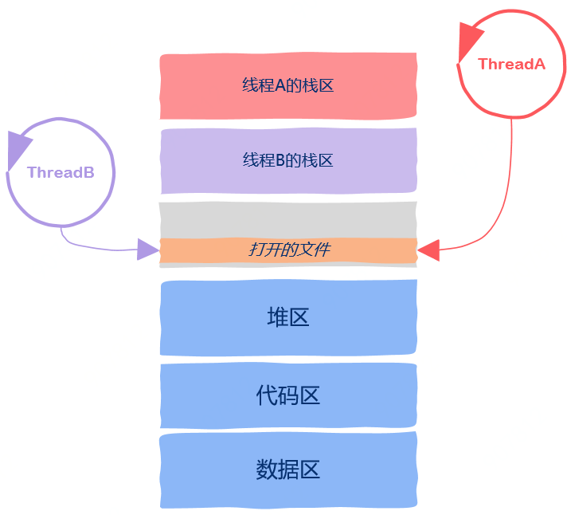

# 线程间共享资源

<!-- START doctoc generated TOC please keep comment here to allow auto update -->
<!-- DON'T EDIT THIS SECTION, INSTEAD RE-RUN doctoc TO UPDATE -->

- [1. 记住了不一定真懂](#1-%E8%AE%B0%E4%BD%8F%E4%BA%86%E4%B8%8D%E4%B8%80%E5%AE%9A%E7%9C%9F%E6%87%82)
- [2. 逆向思考](#2-%E9%80%86%E5%90%91%E6%80%9D%E8%80%83)
- [3. 线程私有资源](#3-%E7%BA%BF%E7%A8%8B%E7%A7%81%E6%9C%89%E8%B5%84%E6%BA%90)
- [4. 代码区](#4-%E4%BB%A3%E7%A0%81%E5%8C%BA)
- [5.  数据区](#5--%E6%95%B0%E6%8D%AE%E5%8C%BA)
- [6. 堆区](#6-%E5%A0%86%E5%8C%BA)
- [7. 栈区](#7-%E6%A0%88%E5%8C%BA)
- [8. 动态链接库](#8-%E5%8A%A8%E6%80%81%E9%93%BE%E6%8E%A5%E5%BA%93)
- [9. 文件](#9-%E6%96%87%E4%BB%B6)
- [10. One More Thing：TLS](#10-one-more-thingtls)

<!-- END doctoc generated TOC please keep comment here to allow auto update -->

[TOC]

## 1. 记住了不一定真懂

关于这个问题有的同学可能已经“背得”滚瓜烂熟了：“进程是操作系统分配资源的单位，线程是调度的基本单位，**线程之间共享进程资源**”。

可是你真的理解了上面最后一句话吗？**到底线程之间共享了哪些进程资源，共享资源意味着什么？共享资源这种机制是如何实现的？**对此如果你没有答案的话，那么这意味着**你几乎很难写出能正确工作的多线程程序**，同时也意味着这篇文章就是为你准备的。

## 2. 逆向思考

查理芒格经常说这样一句话：“反过来想，总是反过来想”，如果你对线程之间共享了哪些进程资源这个问题想不清楚的话那么也可以反过来思考，那就是**有哪些资源是线程私有的**。

## 3. 线程私有资源

线程运行的本质其实就是函数的执行，函数的执行总会有一个源头，这个源头就是所谓的入口函数，CPU从入口函数开始执行从而形成一个执行流，只不过我们人为的给执行流起一个名字，这个名字就叫线程。

既然线程运行的本质就是函数的执行，那么函数执行都有哪些信息呢？

我们知道，函数运行时的信息保存在栈帧中，栈帧中保存了函数的返回值、调用其它函数的参数、该函数使用的局部变量以及该函数使用的寄存器信息，如图所示，假设函数A调用函数B：


此外，CPU执行指令的信息保存在一个叫做程序计数器的寄存器中，通过这个寄存器我们就知道接下来要执行哪一条指令。由于操作系统随时可以暂停线程的运行，因此我们保存以及恢复程序计数器中的值就能知道线程是从哪里暂停的以及该从哪里继续运行了。

由于线程运行的本质就是函数运行，函数运行时信息是保存在栈帧中的，因此每个线程都有自己独立的、私有的栈区。


同时函数运行时需要额外的寄存器来保存一些信息，像部分局部变量之类，这些寄存器也是线程私有的，**一个线程不可能访问到另一个线程的这类寄存器信息**。

从上面的讨论中我们知道，到目前为止，所属线程的栈区、程序计数器、栈指针以及函数运行使用的寄存器是线程私有的。

以上这些信息有一个统一的名字，就是**线程上下文**，thread context。

我们也说过操作系统调度线程需要随时中断线程的运行并且需要线程被暂停后可以继续运行，操作系统之所以能实现这一点，依靠的就是线程上下文信息。

现在你应该知道哪些是线程私有的了吧。

除此之外，剩下的都是线程间共享资源。

那么剩下的还有什么呢？还有图中的这些。


这其实就是进程地址空间的样子，也就是说线程共享进程地址空间中除线程上下文信息中的所有内容，意思就是说线程可以**直接读取**这些内容。

接下来我们分别来看一下这些区域。

## 4. 代码区

进程地址空间中的代码区，这里保存的是什么呢？从名字中有的同学可能已经猜到了，没错，这里保存的就是我们写的代码，**更准确的是编译后的可执行机器指令**。

那么这些机器指令又是从哪里来的呢？答案是从可执行文件中加载到内存的，可执行程序中的代码区就是用来初始化进程地址空间中的代码区的。


线程之间共享代码区，**这就意味着程序中的任何一个函数都可以放到线程中去执行，不存在某个函数只能被特定线程执行的情况**。

## 5.  数据区

进程地址空间中的数据区，这里存放的就是所谓的全局变量。

什么是全局变量？所谓全局变量就是那些你定义在函数之外的变量，在C语言中就像这样：

```c
char c; // 全局变量
void func() {    }
```

其中字符c就是全局变量，存放在进程地址空间中的数据区。


在程序员运行期间，也就是run time，**数据区中的全局变量有且仅有一个实例，所有的线程都可以访问到该全局变量**。

值得注意的是，在C语言中还有一类特殊的“全局变量”，那就是用static关键词修饰过的变量，就像这样：

```
void func(){    
	static int a = 10;
}
```

注意到，**虽然变量a定义在函数内部，但变量a依然具有全局变量的特性**，也就是说变量a放在了进程地址空间的数据区域，**即使函数执行完后该变量依然存在**，而普通的局部变量随着函数调用结束和函数栈帧一起被回收掉了，但这里的变量a不会被回收，因为其被放到了数据区。

这样的变量对每个线程来说也是可见的，也就是说每个线程都可以访问到该变量。

## 6. 堆区

堆区是程序员比较熟悉的，我们在C/C++中用malloc或者new出来的数据就存放在这个区域，很显然，**只要知道变量的地址，也就是指针，任何一个线程都可以访问指针指向的数据**，因此堆区也是线程共享的属于进程的资源。


## 7. 栈区

唉，等等！刚不是说栈区是线程私有资源吗，怎么这会儿又说起栈区了？

确实，从线程这个抽象的概念上来说，栈区是线程私有的，然而从实际的实现上看，**栈区属于线程私有这一规则并没有严格遵守**，这句话是什么意思？

通常来说，注意这里的用词是**通常**，通常来说栈区是线程私有，既然有通常就有不通常的时候。

不通常是因为不像进程地址空间之间的严格隔离，线程的栈区没有严格的隔离机制来保护，因此如果一个线程能拿到来自另一个线程栈帧上的指针，**那么该线程就可以改变另一个线程的栈区**，也就是说这些线程可以任意修改本属于另一个线程栈区中的变量。


这从某种程度上给了程序员极大的便利，但同时，这也会导致极其难以排查到的bug。

试想一下你的程序运行的好好的，结果某个时刻突然出问题，定位到出问题代码行后根本就排查不到原因，你当然是排查不到问题原因的，因为你的程序本来就没有任何问题，是别人的问题导致你的函数栈帧数据被写坏从而产生bug，这样的问题通常很难排查到原因，需要对整体的项目代码非常熟悉，常用的一些debug工具这时可能已经没有多大作用了。

## 8. 动态链接库

进程地址空间中除了以上讨论的这些实际上还有其它内容，还有什么呢？

这就要从可执行程序说起了。

什么是可执行程序呢？在Windows中就是我们熟悉的exe文件，在Linux世界中就是ELF文件，这些可以被操作系统直接运行的程序就是我们所说的可执行程序。

那么可执行程序是怎么来的呢？

有的同学可能会说，废话，不就是编译器生成的吗？

实际上这个答案只答对了一半。

假设我们的项目比较简单只有几个源码文件，编译器是怎么把这几个源代码文件转换为最终的一个可执行程序呢？

原来，编译器在将可执行程序翻译成机器指令后，接下来还有一个重要的步骤，这就是链接，链接完成后生成的才是可执行程序。

完成链接这一过程的就是链接器。



其中链接器可以有两种链接方式，这就是**静态链接**和**动态链接**。

静态链接的意思是说把所有的机器指令一股脑全部打包到可执行程序中，动态链接的意思是我们不把动态链接的部分打包到可执行程序，而是在可执行程序运行起来后去内存中找动态链接的那部分代码，这就是所谓的静态链接和动态链接。

动态链接一个显而易见的好处就是可执行程序的大小会很小，就像我们在Windows下看一个exe文件可能很小，**那么该exe很可能是动态链接的方式生成的**。

而动态链接的部分生成的库就是我们熟悉的动态链接库，在Windows下是以DLL结尾的文件，在Linux下是以so结尾的文件。

说了这么多，这和线程共享资源有什么关系呢？

原来如果一个程序是动态链接生成的，**那么其地址空间中有一部分包含的就是动态链接库**，否则程序就运行不起来了，这一部分的地址空间也是被所有线程所共享的。


也就是说进程中的所有线程都可以使用动态链接库中的代码。

## 9. 文件

最后，如果程序在运行过程中打开了一些文件，那么进程地址空间中还保存有打开的文件信息，进程打开的文件也可以被所有的线程使用，这也属于线程间的共享资源。



## 10. One More Thing：TLS

本文就这些了吗？

实际上关于线程私有数据还有一项没有详细讲解，因为再讲下去本篇就撑爆了，而且本篇已经讲解的部分足够用了，剩下的这一点仅仅作为补充，也就是选学部分，如果你对此不感兴趣的话完全可以跳过，没有问题。

关于线程私有数据还有一项技术，那就是线程局部存储，Thread Local Storage，TLS。

这是什么意思呢？

其实从名字上也可以看出，所谓线程局部存储，是指存放在该区域中的变量有两个含义：

- 存放在该区域中的变量是全局变量，所有线程都可以访问
- 虽然看上去所有线程访问的都是同一个变量，但该全局变量独属于一个线程，一个线程对此变量的修改对其他线程不可见。

