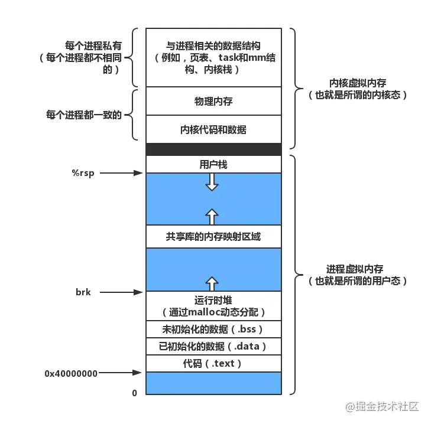

# 虚拟内存

[TOC]

## 零、开篇

我们都知道一个进程是与其他进程共享CPU和内存资源的。正因如此，操作系统需要有一套完善的内存管理机制才能防止进程之间内存泄漏的问题。

为了更加有效地管理内存并减少出错，现代操作系统提供了一种对主存的抽象概念，即是虚拟内存（Virtual Memory）。**虚拟内存为每个进程提供了一个一致的、私有的地址空间，它让每个进程产生了一种自己在独享主存的错觉（每个进程拥有一片连续完整的内存空间）**。

理解不深刻的人会认为虚拟内存只是“使用硬盘空间来扩展内存“的技术，这是不对的。**虚拟内存的重要意义是它定义了一个连续的虚拟地址空间**，使得程序的编写难度降低。并且，**把内存扩展到硬盘空间只是使用虚拟内存的必然结果，虚拟内存空间会存在硬盘中，并且会被内存缓存（按需），有的操作系统还会在内存不够的情况下，将某一进程的内存全部放入硬盘空间中，并在切换到该进程时再从硬盘读取**（这也是为什么Windows会经常假死的原因...）。

虚拟内存主要提供了如下三个重要的能力：

- 它把主存看作为一个存储在硬盘上的虚拟地址空间的高速缓存，并且只在主存中缓存活动区域（按需缓存）。
- 它为每个进程提供了一个一致的地址空间，从而降低了程序员对内存管理的复杂性。
- 它还保护了每个进程的地址空间不会被其他进程破坏。

介绍了虚拟内存的基本概念之后，接下来的内容将会从虚拟内存在硬件中如何运作逐渐过渡到虚拟内存在操作系统（Linux）中的实现。

## 一、CPU寻址

内存通常被组织为一个由M个连续的字节大小的单元组成的数组，每个字节都有一个唯一的物理地址（Physical Address PA），作为到数组的索引。CPU访问内存最简单直接的方法就是使用物理地址，这种寻址方式被称为物理寻址。

现代处理器使用的是一种称为虚拟寻址（Virtual  Addressing）的寻址方式。**使用虚拟寻址，CPU需要将虚拟地址翻译成物理地址，这样才能访问到真实的物理内存。**

虚拟寻址需要硬件与操作系统之间互相合作。**CPU中含有一个被称为内存管理单元（Memory Management Unit, MMU）的硬件，它的功能是将虚拟地址转换为物理地址。MMU需要借助存放在内存中的页表来动态翻译虚拟地址，该页表由操作系统管理。**

## 二、页表

虚拟内存空间被组织为一个存放在硬盘上的M个连续的字节大小的单元组成的数组，每个字节都有一个唯一的虚拟地址，作为到数组的索引（这点其实与物理内存是一样的）。

**操作系统通过将虚拟内存分割为大小固定的块来作为硬盘和内存之间的传输单位，这个块被称为虚拟页（Virtual Page, VP），每个虚拟页的大小为`P=2^p`字节。物理内存也会按照这种方法分割为物理页（Physical Page, PP），大小也为`P`字节。**

CPU在获得虚拟地址之后，需要通过MMU将虚拟地址翻译为物理地址。而在翻译的过程中还需要借助页表，所谓**页表就是一个存放在物理内存中的数据结构，它记录了虚拟页与物理页的映射关系。**

**页表是一个元素为页表条目（Page Table Entry, PTE）的集合，每个虚拟页在页表中一个固定偏移量的位置上都有一个PTE**。下面是PTE仅含有一个有效位标记的页表结构，该有效位代表这个虚拟页是否被缓存在物理内存中。

虚拟页`VP 0`、`VP 4`、`VP 6`、`VP 7`被缓存在物理内存中，虚拟页`VP 2`和`VP 5`被分配在页表中，但并没有缓存在物理内存，虚拟页`VP 1`和`VP 3`还没有被分配。

在进行动态内存分配时，例如`malloc()`函数或者其他高级语言中的`new`关键字，操作系统会在硬盘中创建或申请一段虚拟内存空间，并更新到页表（分配一个PTE，使该PTE指向硬盘上这个新创建的虚拟页）。

**由于CPU每次进行地址翻译的时候都需要经过PTE，所以如果想控制内存系统的访问，可以在PTE上添加一些额外的许可位（例如读写权限、内核权限等）**，这样只要有指令违反了这些许可条件，CPU就会触发一个一般保护故障，将控制权传递给内核中的异常处理程序。一般这种异常被称为“段错误（Segmentation Fault）”。

### 1. 页命中

如上图所示，MMU根据虚拟地址在页表中寻址到了`PTE 4`，该PTE的有效位为1，代表该虚拟页已经被缓存在物理内存中了，最终MMU得到了PTE中的物理内存地址（指向`PP 1`）。

### 2. 缺页

如上图所示，MMU根据虚拟地址在页表中寻址到了`PTE 2`，该PTE的有效位为0，代表该虚拟页并没有被缓存在物理内存中。**虚拟页没有被缓存在物理内存中（缓存未命中）被称为缺页。**

**当CPU遇见缺页时会触发一个缺页异常，缺页异常将控制权转向操作系统内核，然后调用内核中的缺页异常处理程序，该程序会选择一个牺牲页，如果牺牲页已被修改过，内核会先将它复制回硬盘（采用写回机制而不是直写也是为了尽量减少对硬盘的访问次数），然后再把该虚拟页覆盖到牺牲页的位置，并且更新PTE。**

**当缺页异常处理程序返回时，它会重新启动导致缺页的指令，该指令会把导致缺页的虚拟地址重新发送给MMU**。由于现在已经成功处理了缺页异常，所以最终结果是页命中，并得到物理地址。

这种在硬盘和内存之间传送页的行为称为页面调度（paging）：页从硬盘换入内存和从内存换出到硬盘。当缺页异常发生时，才将页面换入到内存的策略称为按需页面调度（demand paging），所有现代操作系统基本都使用的是按需页面调度的策略。

**虚拟内存跟CPU高速缓存（或其他使用缓存的技术）一样依赖于局部性原则**。虽然处理缺页消耗的性能很多（毕竟还是要从硬盘中读取），而且程序在运行过程中引用的不同虚拟页的总数可能会超出物理内存的大小，但是**局部性原则保证了在任意时刻，程序将趋向于在一个较小的活动页面（active page）集合上工作，这个集合被称为工作集（working set）**。根据空间局部性原则（一个被访问过的内存地址以及其周边的内存地址都会有很大几率被再次访问）与时间局部性原则（一个被访问过的内存地址在之后会有很大几率被再次访问），只要将工作集缓存在物理内存中，接下来的地址翻译请求很大几率都在其中，从而减少了额外的硬盘流量。

如果一个程序没有良好的局部性，将会使工作集的大小不断膨胀，直至超过物理内存的大小，这时程序会产生一种叫做抖动（thrashing）的状态，页面会不断地换入换出，如此多次的读写硬盘开销，性能自然会十分“恐怖”。**所以，想要编写出性能高效的程序，首先要保证程序的时间局部性与空间局部性。**

### 3. 多级页表

我们目前为止讨论的只是单页表，但在实际的环境中虚拟空间地址都是很大的（一个32位系统的地址空间有`2^32 = 4GB`，更别说64位系统了）。在这种情况下，使用一个单页表明显是效率低下的。

**常用方法是使用层次结构的页表**。假设我们的环境为一个32位的虚拟地址空间，它有如下形式：

- 虚拟地址空间被分为4KB的页，每个PTE都是4字节。
- 内存的前2K个页面分配给了代码和数据。
- 之后的6K个页面还未被分配。
- 再接下来的1023个页面也未分配，其后的1个页面分配给了用户栈。

下图是为该虚拟地址空间构造的二级页表层次结构（真实情况中多为四级或更多），一级页表（1024个PTE正好覆盖4GB的虚拟地址空间，同时每个PTE只有4字节，这样一级页表与二级页表的大小也正好与一个页面的大小一致都为4KB）的每个PTE负责映射虚拟地址空间中一个4MB的片（chunk），每一片都由1024个连续的页面组成。二级页表中的每个PTE负责映射一个4KB的虚拟内存页面。

这个结构看起来很像是一个`B-Tree`，这种层次结构有效的减缓了内存要求：

- 如果一个一级页表的一个PTE是空的，那么相应的二级页表也不会存在。这代表一种巨大的潜在节约（对于一个普通的程序来说，虚拟地址空间的大部分都会是未分配的）。
- 只有一级页表才总是需要缓存在内存中的，这样虚拟内存系统就可以在需要时创建、页面调入或调出二级页表（只有经常使用的二级页表才会被缓存在内存中），这就减少了内存的压力。

## 三、地址翻译的过程

从形式上来说，**地址翻译是一个N元素的虚拟地址空间中的元素和一个M元素的物理地址空间中元素之间的映射。**

下图为MMU利用页表进行寻址的过程：

页表基址寄存器（PTBR）指向当前页表。**一个n位的虚拟地址包含两个部分，一个p位的虚拟页面偏移量（Virtual Page Offset, VPO）和一个（n - p）位的虚拟页号（Virtual Page Number, VPN）。**

**MMU根据VPN来选择对应的PTE**，例如`VPN 0`代表`PTE 0`、`VPN 1`代表`PTE 1`....因为物理页与虚拟页的大小是一致的，所以物理页面偏移量（Physical Page Offset, PPO）与VPO是相同的。那么之后**只要将PTE中的物理页号（Physical Page Number, PPN）与虚拟地址中的VPO串联起来，就能得到相应的物理地址**。

多级页表的地址翻译也是如此，只不过因为有多个层次，所以VPN需要分成多段。**假设有一个k级页表，虚拟地址会被分割成k个VPN和1个VPO，每个`VPN i`都是一个到第i级页表的索引**。为了构造物理地址，MMU需要访问k个PTE才能拿到对应的PPN。

### TLB

页表是被缓存在内存中的，尽管内存的速度相对于硬盘来说已经非常快了，但与CPU还是有所差距。**为了防止每次地址翻译操作都需要去访问内存，CPU使用了高速缓存与TLB来缓存PTE。**

在最糟糕的情况下（不包括缺页），MMU需要访问内存取得相应的PTE，这个代价大约为几十到几百个周期，如果PTE凑巧缓存在L1高速缓存中（如果L1没有还会从L2中查找，不过我们忽略多级缓冲区的细节），那么性能开销就会下降到1个或2个周期。然而，许多系统甚至需要消除即使这样微小的开销，TLB由此而生。

TLB（Translation Lookaside Buffer, TLB）被称为翻译后备缓冲器或翻译旁路缓冲器，它是**MMU中的一个缓冲区，其中每一行都保存着一个由单个PTE组成的块。用于组选择和行匹配的索引与标记字段是从VPN中提取出来的，如果TLB中有`T = 2^t`个组，那么TLB索引（TLBI）是由VPN的t个最低位组成的，而TLB标记（TLBT）是由VPN中剩余的位组成的。**

下图为地址翻译的流程（TLB命中的情况下）：

- 第一步，CPU将一个虚拟地址交给MMU进行地址翻译。
- 第二步和第三步，MMU通过TLB取得相应的PTE。
- 第四步，MMU通过PTE翻译出物理地址并将它发送给高速缓存/内存。
- 第五步，高速缓存返回数据到CPU（如果缓存命中的话，否则还需要访问内存）。

**当TLB未命中时，MMU必须从高速缓存/内存中取出相应的PTE，并将新取得的PTE存放到TLB（如果TLB已满会覆盖一个已经存在的PTE）。**

## 四、Linux中的虚拟内存系统

**Linux为每个进程维护了一个单独的虚拟地址空间**。虚拟地址空间分为内核空间与用户空间，用户空间包括代码、数据、堆、共享库以及栈，内核空间包括内核中的代码和数据结构，内核空间的某些区域被映射到所有进程共享的物理页面。**Linux也将一组连续的虚拟页面（大小等于内存总量）映射到相应的一组连续的物理页面，这种做法为内核提供了一种便利的方法来访问物理内存中任何特定的位置。**

**Linux将虚拟内存组织成一些区域（也称为段）的集合，区域的概念允许虚拟地址空间有间隙。一个区域就是已经存在着的已分配的虚拟内存的连续片（chunk）**。例如，代码段、数据段、堆、共享库段，以及用户栈都属于不同的区域，**每个存在的虚拟页都保存在某个区域中，而不属于任何区域的虚拟页是不存在的，也不能被进程所引用。**

内核为系统中的每个进程维护一个单独的任务结构（task_struct）。**任务结构中的元素包含或者指向内核运行该进程所需的所有信息（PID、指向用户栈的指针、可执行目标文件的名字、程序计数器等）。**

- mm_struct：描述了虚拟内存的当前状态。pgd指向一级页表的基址（当内核运行这个进程时，pgd会被存放在CR3控制寄存器，也就是页表基址寄存器中），mmap指向一个vm_area_structs的链表，其中每个vm_area_structs都描述了当前虚拟地址空间的一个区域。
- vm_starts：指向这个区域的起始处。
- vm_end：指向这个区域的结束处。
- vm_prot：描述这个区域内包含的所有页的读写许可权限。
- vm_flags：描述这个区域内的页面是与其他进程共享的，还是这个进程私有的以及一些其他信息。
- vm_next：指向链表的下一个区域结构。

## 五、内存映射

