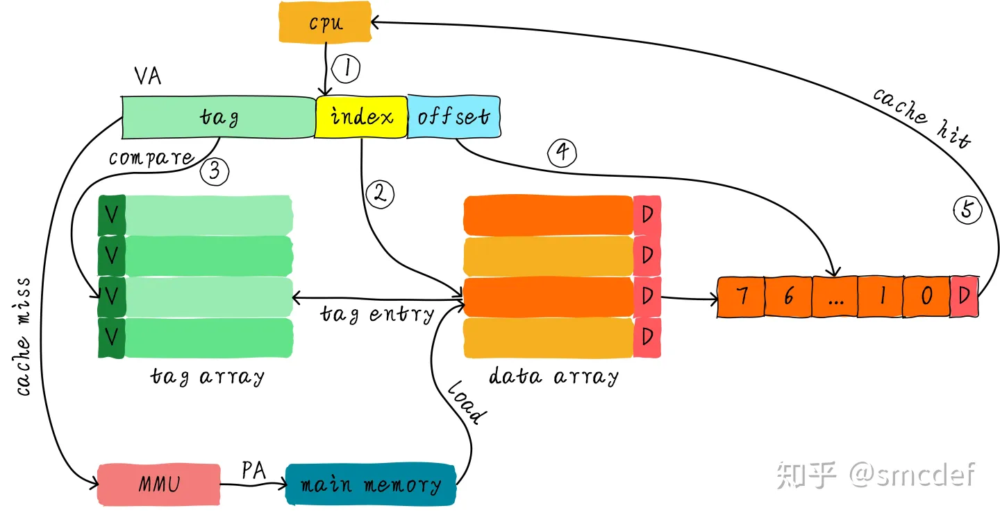
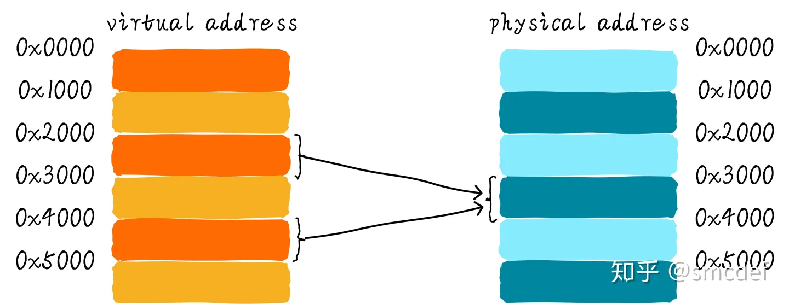
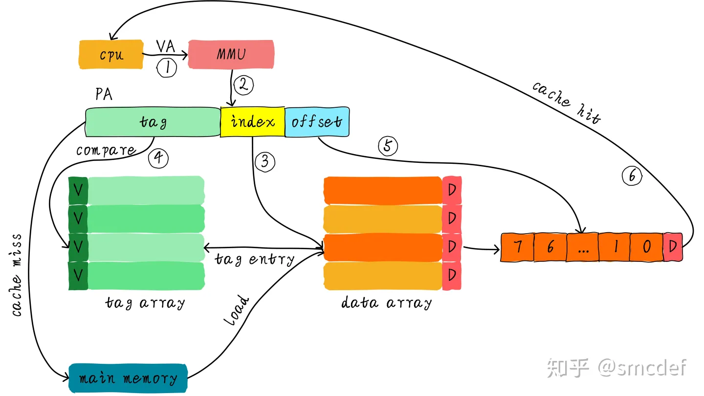
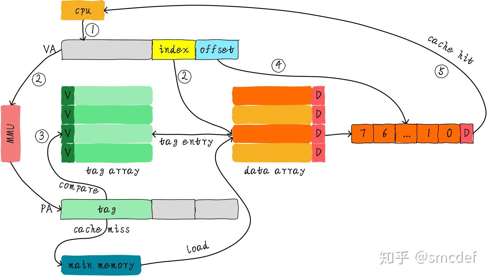

# Cache组织方式

<!-- START doctoc generated TOC please keep comment here to allow auto update -->
<!-- DON'T EDIT THIS SECTION, INSTEAD RE-RUN doctoc TO UPDATE -->

- [零、开篇](#%E9%9B%B6%E5%BC%80%E7%AF%87)
- [一、虚拟高速缓存(VIVT)](#%E4%B8%80%E8%99%9A%E6%8B%9F%E9%AB%98%E9%80%9F%E7%BC%93%E5%AD%98vivt)
    - [1. 歧义(ambiguity)](#1-%E6%AD%A7%E4%B9%89ambiguity)
    - [2. 别名(alias)](#2-%E5%88%AB%E5%90%8Dalias)
- [二、物理高速缓存(PIPT)](#%E4%BA%8C%E7%89%A9%E7%90%86%E9%AB%98%E9%80%9F%E7%BC%93%E5%AD%98pipt)
- [三、物理标记的虚拟高速缓存(VIPT)](#%E4%B8%89%E7%89%A9%E7%90%86%E6%A0%87%E8%AE%B0%E7%9A%84%E8%99%9A%E6%8B%9F%E9%AB%98%E9%80%9F%E7%BC%93%E5%AD%98vipt)
    - [1. VIPT Cache为什么不存在歧义](#1-vipt-cache%E4%B8%BA%E4%BB%80%E4%B9%88%E4%B8%8D%E5%AD%98%E5%9C%A8%E6%AD%A7%E4%B9%89)
    - [2. VIPT Cache什么情况不存在别名](#2-vipt-cache%E4%BB%80%E4%B9%88%E6%83%85%E5%86%B5%E4%B8%8D%E5%AD%98%E5%9C%A8%E5%88%AB%E5%90%8D)
    - [3. VIPT Cache的别名问题](#3-vipt-cache%E7%9A%84%E5%88%AB%E5%90%8D%E9%97%AE%E9%A2%98)
    - [4. 如何解决VIPT Cache别名问题](#4-%E5%A6%82%E4%BD%95%E8%A7%A3%E5%86%B3vipt-cache%E5%88%AB%E5%90%8D%E9%97%AE%E9%A2%98)
- [四、不存在的PIVT高速缓存](#%E5%9B%9B%E4%B8%8D%E5%AD%98%E5%9C%A8%E7%9A%84pivt%E9%AB%98%E9%80%9F%E7%BC%93%E5%AD%98)
- [五、总结](#%E4%BA%94%E6%80%BB%E7%BB%93)

<!-- END doctoc generated TOC please keep comment here to allow auto update -->

[TOC]

## 零、开篇

经过前面文章的介绍，我们已经知道[Cache的基本工作原理](Cache的基本原理.md)。

但是，我们一直避开了一个关键问题。我们都知道cache控制器根据地址查找判断是否命中，这里的地址究竟是虚拟地址(virtual address，VA)还是物理地址(physical address，PA)
？我们应该清楚CPU发出对某个地址的数据访问，这个地址其实是虚拟地址，虚拟地址经过MMU转换成物理地址，最终从这个物理地址读取数据。因此cache的硬件设计既可以采用虚拟地址也可以采用物理地址甚至是取两者地址部分组合作为查找cache的依据。

## 一、虚拟高速缓存(VIVT)

我们首先介绍的是虚拟高速缓存，这种cache硬件设计简单。在cache诞生之初，大部分的处理器都使用这种方式。虚拟高速缓存以虚拟地址作为查找对象。如下图所示。

虚拟地址直接送到cache控制器，如果cache hit，直接从cache中返回数据给CPU；如果cache miss，则把虚拟地址发往MMU，经过MMU转换成物理地址，根据物理地址从主存(main memory)读取数据。

由于我们根据虚拟地址查找高速缓存，所以我们是用虚拟地址中部分位域作为索引(index)，找到对应的的cacheline。然后根据虚拟地址中部分位域作为标记(tag)来判断cache是否命中。因此，我们针对这种**
index和tag都取自虚拟地址的高速缓存称为虚拟高速缓存**，简称VIVT(Virtually Indexed Virtually Tagged)。另外，我们复习下cache控制器查找数据以及判断是否命中的规则：**
通过index查找对应的cacheline，通过tag判断是否命中cache**。

虚拟高速缓存的优点是不需要每次读取或者写入操作的时候把虚拟地址经过MMU转换为物理地址，这在一定的程度上提升了访问cache的速度，毕竟MMU转换虚拟地址需要时间。同时硬件设计也更加简单。

但是，正是使用了虚拟地址作为tag，所以引入很多软件使用上的问题。 操作系统在管理高速缓存正确工作的过程中，主要会面临两个问题。歧义(ambiguity)和别名(alias)。为了保证系统的正确工作，操作系统负责避免出现歧义和别名。

### 1. 歧义(ambiguity)

歧义是指不同的数据在cache中具有相同的tag和index。cache控制器判断是否命中cache的依据就是tag和index，因此这种情况下，cache控制器根本没办法区分不同的数据。这就产生了歧义。

什么情况下发生歧义呢？我们知道不同的物理地址存储不同的数据，只要相同的虚拟地址映射不同的物理地址就会出现歧义。例如两个互不相干的进程，就可能出现相同的虚拟地址映射不同的物理地址。假设A进程虚拟地址0x4000映射物理地址0x2000。B进程虚拟地址0x4000映射物理地址0x3000。当A进程运行时，访问0x4000地址会将物理地址0x2000的数据加载到cacheline中。当A进程切换到B进程的时候，B进程访问0x4000会怎样？当然是会cache
hit，此时B进程就访问了错误的数据，B进程本来想得到物理地址0x3000对应的数据，但是却由于cache hit得到了物理地址0x2000的数据。

操作系统如何避免歧义的发生呢？当我们切换进程的时候，可以选择flush所有的cache。flush cache操作有两步：

- 使主存储器有效。针对write back高速缓存，首先应该使主存储器有效，保证已经修改数据的cacheline写回主存储器，避免修改的数据丢失。
- 使高速缓存无效。保证切换后的进程不会错误的命中上一个进程的缓存数据。

因此，切换后的进程刚开始执行的时候，将会由于大量的cache miss导致性能损失。所以，VIVT高速缓存明显的缺点之一就是经常需要flush
cache以保证歧义不会发生，最终导致性能的损失。VIVT高速缓存除了面对歧义问题外，还面临另一个问题：别名(alias)。

### 2. 别名(alias)

当不同的虚拟地址映射相同的物理地址，而这些虚拟地址的index不同，此时就发生了别名现象(多个虚拟地址被称为别名)。通俗点来说就是指同一个物理地址的数据被加载到不同的cacheline中就会出现别名现象。

考虑这样的一个例子。虚拟地址0x2000和0x4000都映射到相同的物理地址0x8000。这意味着进程既可以从0x2000读取数据，也能从地址0x4000读取数据。假设系统使用的是直接映射VIVT高速缓存，cache更新策略采用写回机制，并且使用虚拟地址的位<
15...4>作为index。那么虚拟地址0x2000和虚拟地址0x4000的index分别是0x200和0x400。这意味同一个物理地址的数据会加载到不同的cacheline。

假设物理地址0x8000存储的数据是0x1234。程序先访问0x2000把数据0x1234加载到第0x200(index)行cacheline中。接着访问0x4000，会将0x1234再一次的加载到第0x400(index)
行cacheline中。现在程序将0x2000地址数据修改成0x5678。由于采用的是写回策略，因此修改的数据依然躺在cacheline中。当程序访问0x4000的时候由于cache
hit导致读取到旧的数据0x1234。这就造成了数据不一致现象，这不是我们想要的结果。可以选择下面的方法避免这个问题。

针对共享数据所在页的映射方式采用nocache映射。例如上面的例子中，0x2000和0x4000映射物理地址0x8000的时候都采用nocache的方式，这样不通过cache的访问，肯定可以避免这种问题。但是这样就损失了cache带来的性能好处。这种方法既适用于不同进程共享数据，也适用于同一个进程共享数据。
如果是不同进程之间共享数据，还可以在进程切换时主动flush cache(使主存储器有效和使高速缓存无效)
的方式避免别名现象。但是，如果是同一个进程共享数据该怎么办？除了nocache映射之外，还可以有另一种解决方案。这种方法只针对直接映射高速缓存，并且使用了写分配机制有效。在建立共享数据映射时，保证每次分配的虚拟地址都索引到相同的cacheline。这种方式，后面还会重点说。

## 二、物理高速缓存(PIPT)

基于对VIVT高速缓存的认识，我们知道VIVT高速缓存存在歧义和名别两大问题。主要问题原因是：tag取自虚拟地址导致歧义，index取自虚拟地址导致别名。所以，如果想让操作系统少操心，最简单的方法是tag和index都取自物理地址。物理的地址tag部分是独一无二的，因此肯定不会导致歧义。而针对同一个物理地址，index也是唯一的，因此加载到cache中也是唯一的cacheline，所以也不会存在别名。我们称这种cache为物理高速缓存，简称PIPT(
Physically Indexed Physically Tagged)。PIPT工作原理如下图所示。

CPU发出的虚拟地址经过MMU转换成物理地址，物理地址发往cache控制器查找确认是否命中cache。

虽然PIPT方式在软件层面基本不需要维护，但是硬件设计上比VIVT复杂很多。因此硬件成本也更高。同时，由于虚拟地址每次都要翻译成物理地址，因此在查找性能上没有VIVT方式简洁高效，毕竟PIPT方式需要等待虚拟地址转换物理地址完成后才能去查找cache。顺便提一下，为了加快MMU翻译虚拟地址的速度，硬件上也会加入一块cache，作用是缓存虚拟地址和物理地址的映射关系，这块cache称之为TLB(
Translation Lookaside Buffer)。当MMU需要转换虚拟地址时，首先从TLB中查找，如果cache hit，则直接返回物理地址。如果cache
miss则需要MMU查找页表。这样就加快了虚拟地址转换物理地址的速度。如果系统采用的PIPT的cache，那么软件层面基本不需要任何的维护就可以避免歧义和别名问题。这是PIPT最大的优点。现在的CPU很多都是采用PIPT高速缓存设计。在Linux内核中，可以看到针对PIPT高速缓存的管理函数都是空函数，无需任何的管理。

## 三、物理标记的虚拟高速缓存(VIPT)

为了提升cache查找性能，我们不想等到虚拟地址转换物理地址完成后才能查找cache。因此，我们可以使用虚拟地址对应的index位查找cache，与此同时(硬件上同时进行)
将虚拟地址发到MMU转换成物理地址。当MMU转换完成，同时cache控制器也查找完成，此时比较cacheline对应的tag和物理地址tag域，以此判断是否命中cache。我们称这种高速缓存为VIPT(Virtually Indexed
Physically Tagged)。

VIPT以物理地址部分位作为tag，因此我们不会存在歧义问题。但是，采用虚拟地址作为index，所以可能依然存在别名问题。是否存在别名问题，需要考虑cache的结构，我们需要分情况考虑。

### 1. VIPT Cache为什么不存在歧义

在这里重点介绍下为什么VIPT Cache不存在歧义。假设以32位CPU为例，页表映射最小单位是4KB。我们假设虚拟地址< 12:4 >位(这是一个有别名问题的VIPT Cache)作为index，于此同时将虚拟地址< 31:12 >
发送到MMU转换得到物理地址的< 31:12 >，这里**我们把< 31:12 >作为tag，并不是< 31:13 >**
。这地方很关键，也就是说VIPT的tag取决于物理页大小的剩余位数，而不是去掉index和offset的剩余位数。物理tag是惟一的，所以不存在歧义。

### 2. VIPT Cache什么情况不存在别名

我们知道VIPT的优点是查找cache和MMU转换虚拟地址同时进行，所以性能上有所提升。歧义问题虽然不存在了，但是别名问题依旧可能存在，那么什么情况下别名问题不会存在呢？Linux系统中映射最小的单位是页，一页大小是4KB。那么意味着虚拟地址和其映射的物理地址的位<
11...0>
是一样的。针对直接映射高速缓存，如果cache的size小于等于4KB，是否就意味着无论使用虚拟地址还是物理地址的低位查找cache结果都是一样呢？是的，因为虚拟地址和物理地址对应的index是一样的。这种情况，VIPT实际上相当于PIPT，软件维护上和PIPT一样。如果示例是一个四路组相连高速缓存呢？只要满足一路的cache的大小小于等于4KB，那么也不会出现别名问题。

### 3. VIPT Cache的别名问题

假设系统使用的是直接映射高速缓存，cache大小是8KB，cacheline大小是256字节。这种情况下的VIPT就存在别名问题。因为index来自虚拟地址位<12...8>，虚拟地址和物理地址的位<11...8>
是一样的，但是bit12却不一定相等。
假设虚拟地址0x0000和虚拟地址0x1000都映射相同的物理地址0x4000。那么程序读取0x0000时，系统将会从物理地址0x4000的数据加载到第0x00行cacheline。然后程序读取0x1000数据，再次把物理地址0x4000的数据加载到第0x10行cacheline。这不，别名出现了。相同物理地址的数据被加载到不同cacheline中。

### 4. 如何解决VIPT Cache别名问题

我们接着上面的例子说明。首先出现问题的场景是共享映射，也就是多个虚拟地址映射同一个物理地址才可能出现问题。我们需要想办法避免相同的物理地址数据加载到不同的cacheline中。如何做到呢？那我们就避免上个例子中0x1000映射0x4000的情况发生。我们可以将虚拟地址0x2000映射到物理地址0x4000，而不是用虚拟地址0x1000。0x2000对应第0x00行cacheline，这样就避免了别名现象出现。因此，在建立共享映射的时候，返回的虚拟地址都是按照cache大小对齐的地址，这样就没问题了。如果是多路组相连高速缓存的话，返回的虚拟地址必须是满足一路cache大小对齐。在Linux的实现中，就是通过这种方法解决别名问题。

## 四、不存在的PIVT高速缓存

按照排列组合来说，应该还存在一种PIVT方式的高速缓存。因为PIVT没有任何优点，却包含以上的所有缺点。你想想，PIVT方式首先要通过MMU转换成物理地址，然后才能根据物理地址index域查找cache。这在速度上没有任何优势，而且还存在歧义和别名问题。请忘记它吧。不，应该不算是忘记，因为它从来就没出现过。

## 五、总结

VIVT
Cache问题太多，软件维护成本过高，是最难管理的高速缓存。所以现在基本只存在历史的文章中。现在我们基本看不到硬件还在使用这种方式的cache。现在使用的方式是PIPT或者VIPT。如果多路组相连高速缓存的一路的大小小于等于4KB，一般硬件采用VIPT方式，因为这样相当于PIPT，岂不美哉。当然，如果一路大小大于4KB，一般采用PIPT方式，也不排除VIPT方式，这就需要操作系统多操点心了。