# 内存管理的概念-上

[TOC]

## 一、内存的基础知识

### 1. 什么是内存？有何作用？

内存可存放数据。程序执行前需要先**放到内存中才能被CPU处理**——缓和COU与硬盘之间的速度矛盾。

在多道程序环境下，系统中会有多个程序并发执行，也就是说会有多个程序的数据需要同时放到内存中。那么如何区分各个程序的数据是放在什么地方呢？

方案：给内存的存储单元编址。

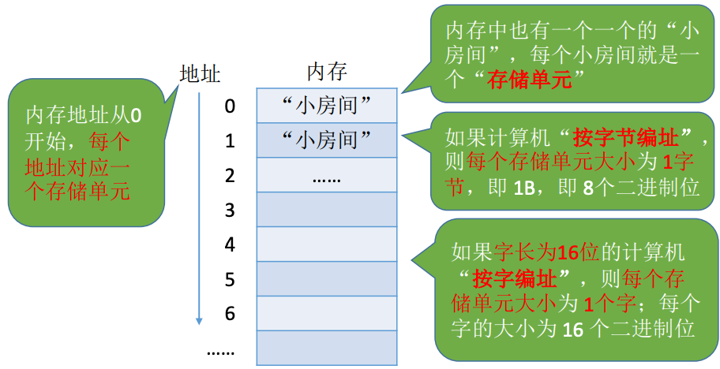

> 补充知识（对没有学过计组的同学）
>
> **1. 几个常用的数量单位**
> $$
> 2^{10}=1K \qquad (千)\\
> 2^{20}=1M \qquad (兆，百万)\\
> 2^{30}=1G \qquad (十亿，千兆)
> $$
> **2. 进程的运行原理**
>
> 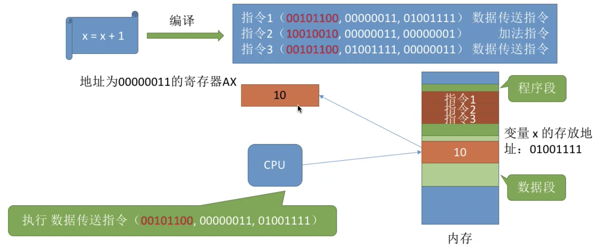
>
> 我们通过高级语言编写的代码，经过编译会变成一条条的执行，这些指令会被放在内存的程序段中，CPU会顺序执行程序段中的指令。
>
> 如上图所示的指令1，指令格式为[操作码，des(目标地址)，src(源地址)]，将[地址01001111]中的数据(也就是10)放到地址为[00000011]的寄存器AX中；剩下的就不逐步分析了。
>
> 通过上面的栗子可见，我们写的代码要翻译成CPU能识别的指令，这些指令会告诉CPU应该去内存哪个地址读/写数据，这个数据应该做什么样的处理。上面的栗子中，我们默认让**这个进程的相关内容从地址#0开始连续存放**，指令中的地址参数直接给出了变量x的实际存放地址(**物理地址**)。但实际在生成机器指令的时候并不知道该进程的数据会被放到什么位置，所以编译生成的指令一般是使用**逻辑地址(相对地址)**。

### 2. 逻辑地址和物理地址

举个栗子来解释一下逻辑地址和物理地址的区别：

宿舍四个人一起出去旅行，四个人的学号尾号分别是0、1、2、3；住酒店时酒店给安排了4个房号相连的房间；四个人按学号递增次序入住房间：比如0、1、2、3号同学分别入住了5、6、7、8号房间；四个人的编号0、1、2、3其实是一个“相对位置”，而各自入住的房间号是一个“绝对位置”；只要知道0号同学住的房号为N的房间，那么M号同学的房号一定是N+M；也就是说，只要知道各个同学的“相对位置”和“起始房号”，就一定可以算出所有同学的“绝对位置”。

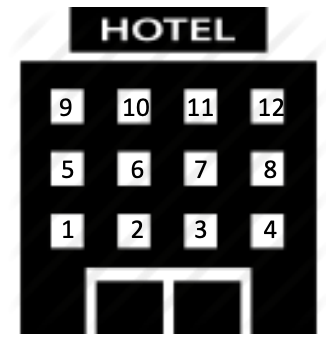

指令中的地址也可以采用这种思想。编译时产生的指令只关心“相对地址”，实际放入内存中时再想办法根据起始位置得到绝对位置。

> Eg：编译时只需确定变量x存放的相对地址是100(也就是说相对于进程在内存中的起始地址而言的地址)，CPU想要找到x在内存中的实际位置，只需要用进程的起始地址+100即可。

相对地址又称逻辑地址，绝对地址又称物理地址。

### 3. 从写程序到运行

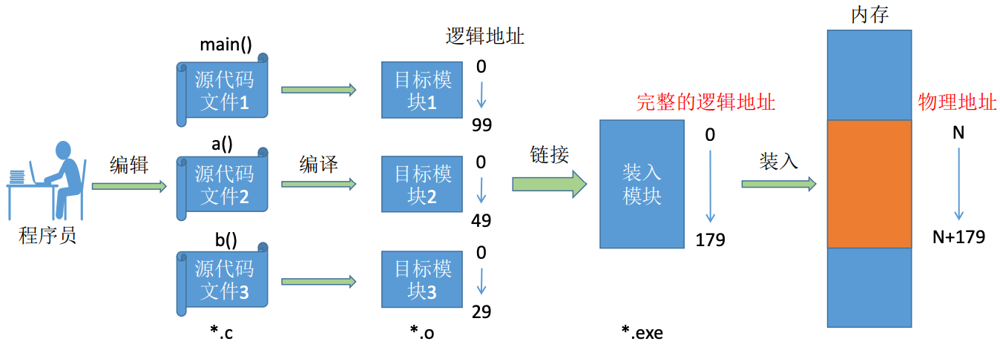

编译：由编译程序将用户源代码(如.c文件)编译成若干个模板模块(如.o文件)，就是把高级语言翻译成机器语言。

链接：由链接程序将编译后形成的一组目标模块以及所需的库函数链接在一起，形成一个完整的装入模块(如window的.exe文件)。

装入(装载)：由装入程序将装入模块装入内存运行。

所以从写代码到运行的过程为：程序员用高级语言编写代码，编译程序将高级语言编写的代码编翻译成机器语言(即指令)，再通过装入程序将指令装入到内存中交由CPU运行。

### 4. 装入的三种方式

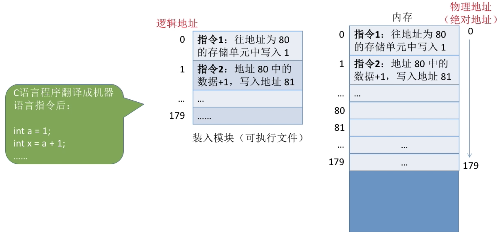

如上图所示，指令中使用的80是逻辑地址，如果装入模块可以从#0开始装入，那么逻辑地址是不需要改变，可以直接使用的。

假设装入模块不是从#0开始，而是从#100开始装入，如果不修改指令地址的话，就会读到错误的数据。因此我们需要对逻辑地址进行转换，转换为物理地址。

一般有三种不同的方式完成逻辑地址到物理地址的转换(也就是三种装入方式)：绝对装入、静态重定位装入、动态重定位装入。

#### 4.1 绝对装入

绝对装入：在编译时，如果知道程序将放到内存的哪个位置，编译程序将产生绝对地址的目标代码。装入程序按照装入模块中的地址，将程序和数据装入内存。

Eg：如果知道装入模块要从地址为100的地方开始放

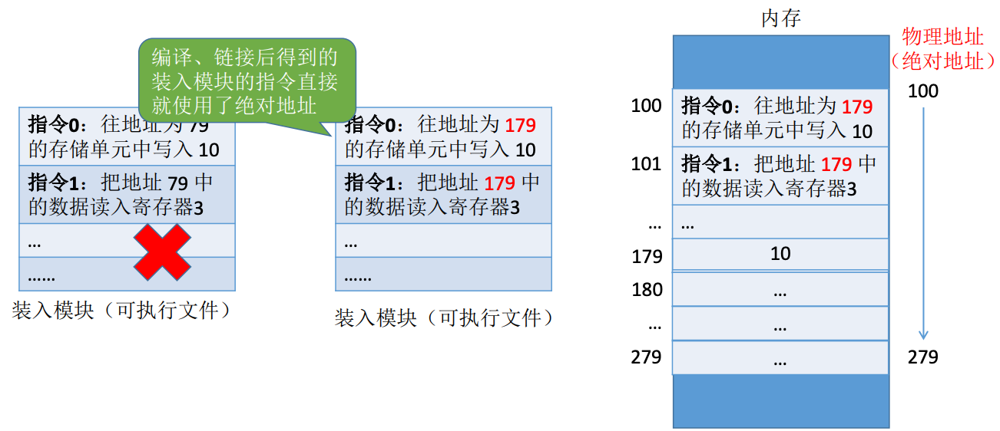

绝对装入**只适用于单道程序环境**。因为同一时刻内存中只有一个程序在运行，可以在程序运行之前就决定好程序放在什么位置。

程序中使用的绝对地址，可在编译或汇编时给出，也可以由程序员直接赋予。通常情况下都是编译或汇编时再转换为绝对地址。

#### 4.2 静态定位装入

静态重定位：又称可重定位装入。编译、链接后的装入模块的地址都是从0开始的，指令中使用的地址、数据存放的地址都是相对于起始地址而言的逻辑地址。可根据内存的当前情况，将装入模块装入到内存的适当位置。装入时对地址进行“重定位”，将逻辑地址变换为物理地址(地址变换是在装入时一次完成的)。

静态重定位的特点是在一个作业装入内存时，**必须分配其要求的全部内存空间**，如果没有足够的内存，就不能装入该作业。作业一旦进入内存后，**在运行期间就不能再移动**，也不能再申请内存空间。

#### 4.3 动态重定位装入

动态重定位：又称动态运行时装入。编译、链接后的装入模块的地址都是从0开始的。装入程序把装入模块装入内存后，并不会立即把逻辑地址转换为物理地址，而是把逻辑地址转换推迟到程序真正要执行时才进行。因此装入内存后所有的地址依然是逻辑地址。这种方式需要一个重定位寄存器的支持。

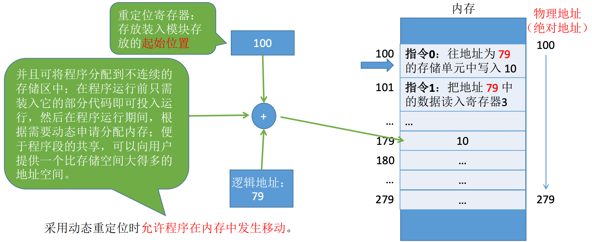

## 二、内存管理的基本概念

操作系统作为系统资源的管理者，当然也需要对内存进行管理，要管些啥呢？

### 1. 内存空间的分配与回收

操作系统要负责内存空间的分配与回收。

操作系统需要考虑如何记录哪些内存区域已经被分配出去了，哪些是空闲的；需要考虑进程运行结束之后，如何将进程占用的内存空间回收；需要考虑给进程分配哪些内存区域。

### 2. 内存空间的拓展

操作系统需要提供某种技术从逻辑上对内存空间进行扩充。

如游戏 GTA 的大小超过 60GB，按理来说这个游戏程序运行之前需要把 60GB 数据全部放入内存。然而，实际我的电脑内存才 4GB，但为什么这个游戏可以顺利运行呢？——虚拟技术(这个后续会提到)。

除了虚拟技术还有覆盖技术和交换技术(后面会说)。

### 3. 地址转换

操作系统需要提供地址转换功能，复杂讲程序的逻辑地址与物理地址的转换。

为了使编程更方便，程序员写程序时应该只需要关注指令、数据的逻辑地址。而逻辑地址到物理地址的转换(这个过程称为地址重定位，上面讲过了)应该由操作系统复杂，这样就保证了程序员写程序时不需要关注物理内存的实际情况。

### 4. 内存保护

操作系统需要提供内存保护功能，保证各进程在各自存储空间内运行，互不干扰。

内存保护可以采取2中方法：

方法一：在CPU中**设置一对上、下限寄存器**，存放进程的上、下限地址。进程的指令要访问某个地址时，CPU检查是否越界。

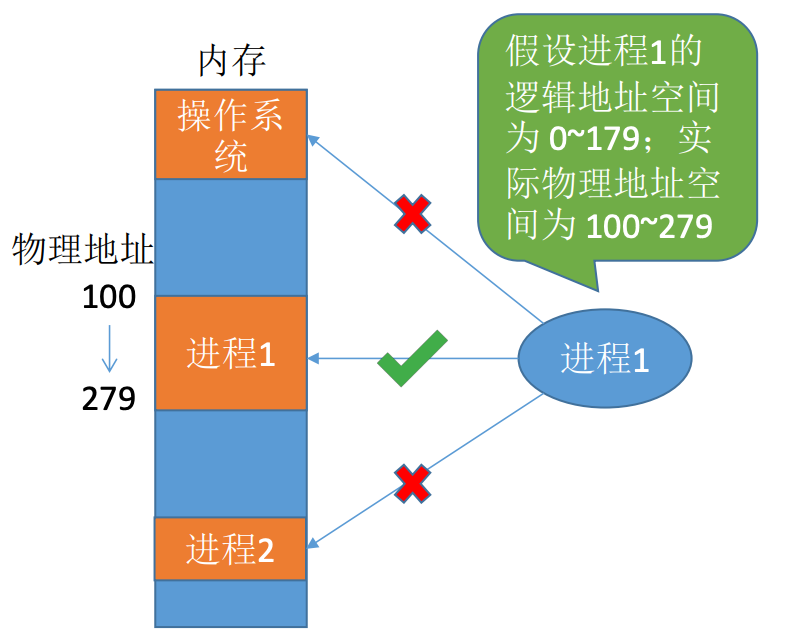

如上图所示，上限寄存器值为100，下限寄存器值为279。

方法二：采用**重定位寄存器**(又称**基址寄存器**)和**界地址寄存器**(又称限长寄存器)进行越界检查。重定位寄存器中存放的是进程的**起始物理地址**，界地址寄存器中存放的是进程的**最大逻辑地址**。

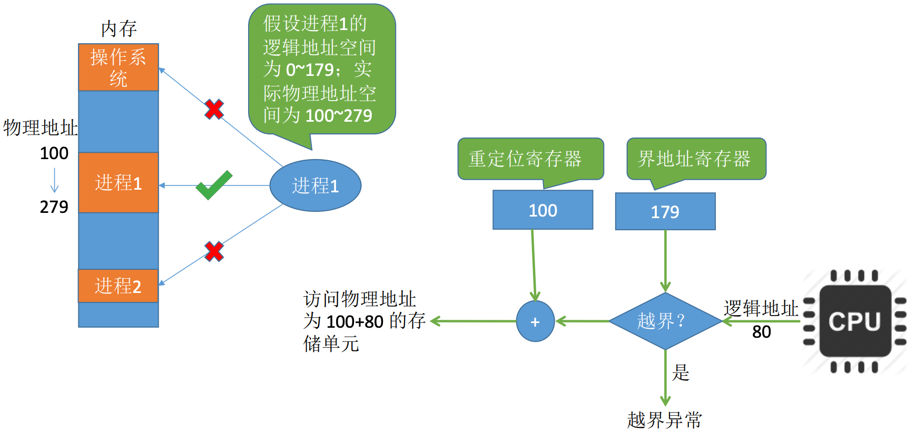

## 三、覆盖与交换

之前提到操作系统需要能对内存空间进行扩充，提到了覆盖技术和交换技术，现在我们详细讲讲。

### 1. 覆盖技术

人们通过引入覆盖技术来**解决“程序大小超过物理内存总和”的问题**。

覆盖技术的思想：将程序分成多个段(多个模块)，常用的段常驻内存，不常用的段在需要时调入内存。

内存中分为**一个“固定区”**和**若干个“覆盖区”**。需要常驻内存的段放在“**固定区**”中，**调入后就不再调出**，除非运行结束。不常用的段放在“**覆盖区**”，**需要用到时调入内存，用不到时调出内存**。

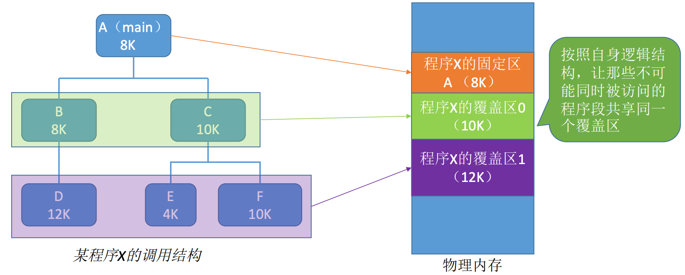

必须由程序声明覆盖结构，操作系统完成自动覆盖。缺点：对用户不透明，增加了用户编程负担。覆盖技术只用于早期的操作系统中。

### 2. 交换技术

交换(对换)技术的设计思想：内存紧张时，系统将内存中某些进程暂时**换出**到外存，把外存中某些已具备运行条件的进程**换入**到内存(进程在内存与磁盘间动态调度)。

 

#### 2.1 换出进程存放在哪里？

具有对换功能的操作系统中，通常把磁盘空间分为**文件区和对换区**两部分。

**文件区**主要用于存放文件，主要**追求存储空间的利用率**，因此对文件区的空间管理采用**离散分配方式**。

**对换区**空间只占磁盘空间的小部分，被换出的进程数据就存放在对换区，由于对换的速度直接应用到系统的整体速度，因此对换区空间的管理主要**追求换入换出速度**，因此通常对换区采用**连续分配方式**(后面文件管理会提到)，总之，**对换区的I/O速度比文件区快**。

#### 2.2 什么时候应该交换

交换通常在许多进程运行且内存吃紧时进程，而系统负荷降低就暂停。例如：在发现许多进程运行时经常发生缺页，就说明内存紧张，此时可以换出一些进程；如果缺页率明显下降，就可以暂停换出。

#### 2.3 应该换出哪些进程

可优先换出阻塞进程；可换出优先级低的进程；为了防止优先级低的进程在被调入内存后很快又被换出，有的系统还会考虑进程在内存的驻留时间。(注意：**PCB会常驻内存**，不会被换出外存)

## 四、连续分配管理方式

之前提到过，操作系统需要能对内存进行分配和回收，这一节先了解一下连续分配管理方式。

> 连续分配：指为用户进程分配的必须是一个连续的内存空间。

### 1. 单一连续分配

在单一连续分配方式中，内存被分为**系统区**和**用户区**。

系统区通常位于内存的低地址部分，用于存放操作系统相关数据；用户区用于存放用户进程相关数据。

内存中**只能有一道用户程序**，用户程序独占整个用户区空间。

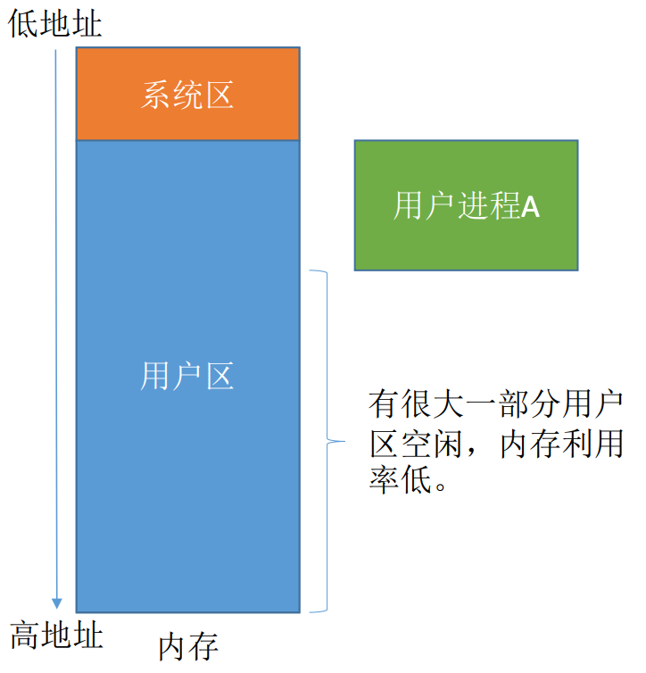

优点：实现简单；无外部碎片；可以采用覆盖技术进行扩充内存；不一定需要采取内存保护。

缺点：只能用于单用户、单任务的操作系统中；有内部碎片；存储器的利用率极低。

> **内部碎片**
>
> 分配给某进程的内存区域中，如果有些部分没用上，就是“内部碎片”。

### 2. 固定分区分配

为了能支持多道程序，且保证程序之间互不干扰，于是将整个用户空间划分为若干个固定大小的分区，在每个分区中只装入一道作业，这样就形成了最早的、最简单的一种可运行多道程序的内存管理方式。

固定区分分配又可根据分区大小分两种：

- 分区大小相等：缺乏灵活性，但是很适合用于一台计算机控制多个相同对象的场合。
- 分区大小不相等：增加了灵活性，可满足不同大小的进程需求。根据常在系统中运行的作业大小情况进行划分。

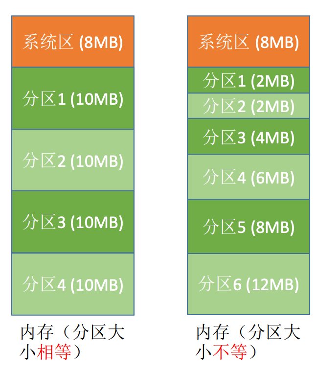

要实现固定分区分配，操作系统需要建立一个数据结构——**分区说明表**，来实现各个分区的分配与回收。每个表项对应一个分区，通常按分区大小排列。每个表项包括对应分区的**大小、起始地址、状态**(是否分配)。

当某用户程序要装入内存时，由操作系统内核程序根据用户程序大小检索该表，从中找到一个能满足大小的、未分配的分区，将之分配给该程序，然后修改状态为“已分配”。

优点：实现简单，无外部碎片。

缺点：

- 当用户程序太大时，可能所有的分区都不能满足需求，此时不得不采用覆盖技术来解决，但这又会降低性能。
- 会产生内部碎片，内存利用率低。

### 3. 动态分区分配

**动态分区分配**又称为**可变分区分配**。这种分配方式不会预先划分内存分区，而是在进程装入的时候，**根据进程的大小动态的建立分区**，并使分区的大小正好适合进程的需要。因此系统分区的大小和数量是可变的。

> 系统要用什么样的数据结构记录内存的使用情况？

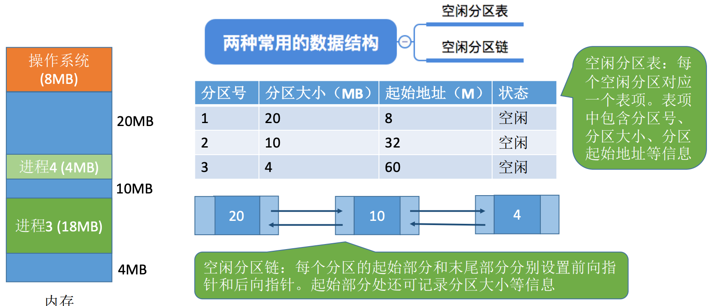

> 当有多个空闲分区都能满足需求时，应该选择哪个分区进行分配呢？

把一个新作业装入内存时，须按照一定的动态分区分配算法，从空闲分区表(或空闲分区链)中选出一个分区分配给该作业。由于分配算法对系统性能有很大的影响，因此这个内容我们放到后面讲...

> 如何进行分区的分配与回收操作？

如果系统采用的数据结构是“**空闲分区表**”：

#### 3.1 空闲分区表的分配

分配情况如下：

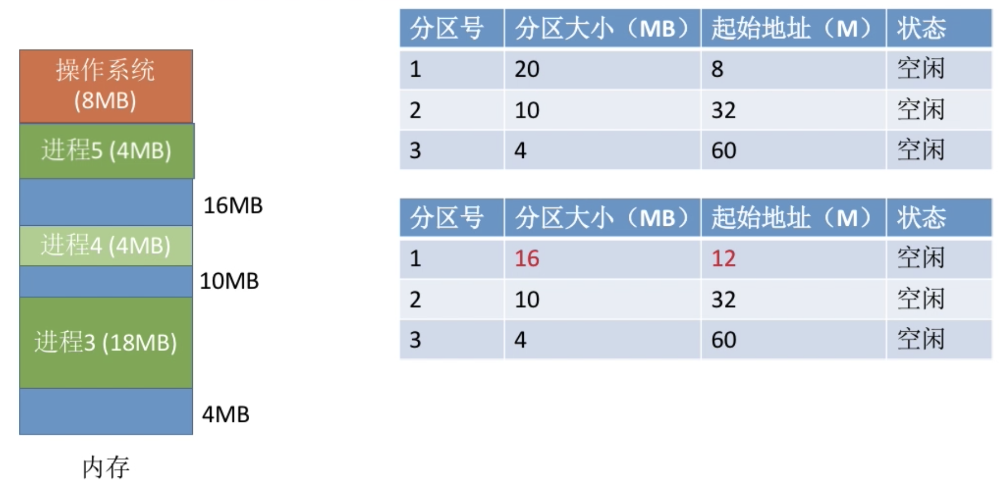

如上图所示，假设内存中一开始只有进程3和进程4，新来了进程5，需要为其分配内存4MB的内存空间。

假设采取了某种算法决定在分区1中分出4MB给进程5，那么就需要对空闲分区表进行一定的处理：分区号1的分区大小-4，起始地址+4。

假设采取了某种算法决定在分区3分出4MB给进程5，那么该分区已经被分配完了，需要将对应的表项删除。

采用空闲分区链的话，其过程也是差不多的，不过是修改节点中的内容和删除节点而已。

#### 3.2 空闲分区表的回收

回收情况如下：

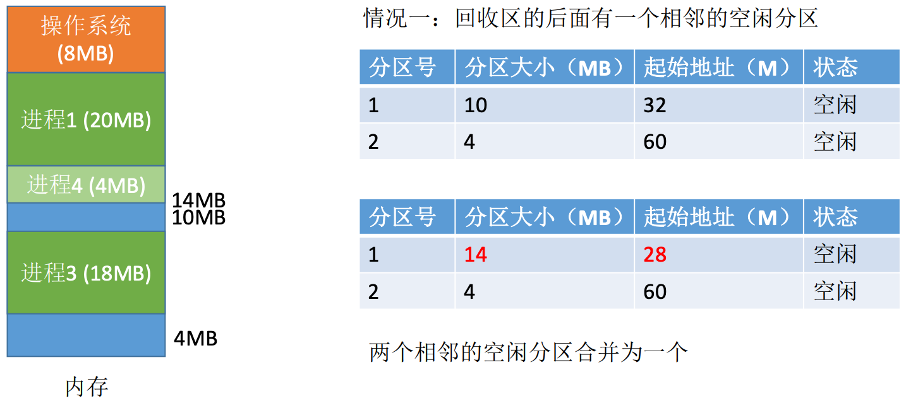

如上图所示，假设内存中进程4运行结束，#28~32内存空闲，此时存在两块空闲内存：#28~32和分区1，存在两个相邻的空闲分区时，要将两个空闲分区合并，因此将这4MB的内存合并到分区1。

除此之外还有几种情况，就不多解释了，直接上图：

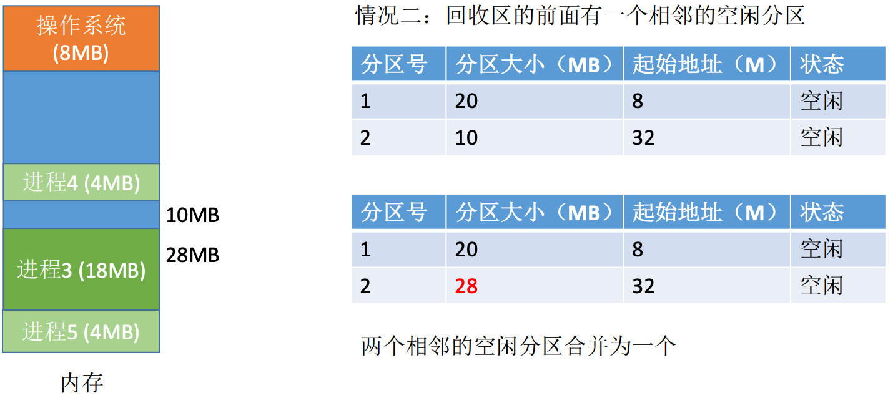

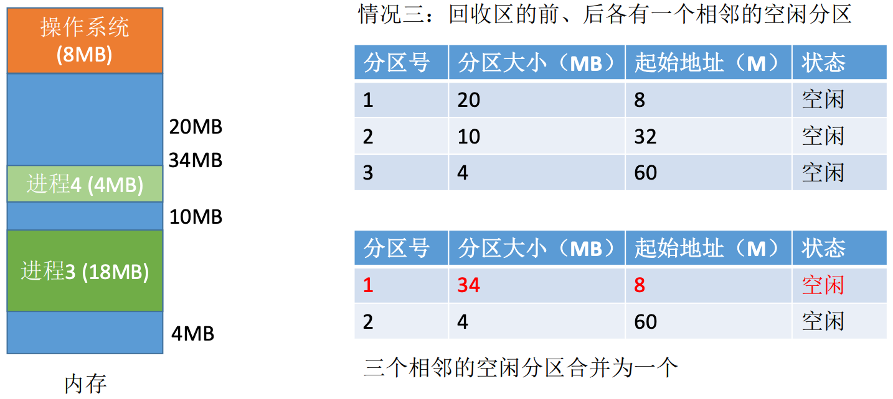

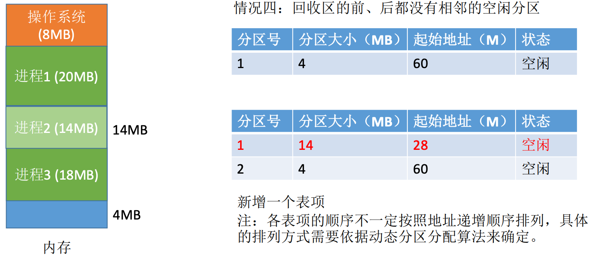

动态分区分配**没有内部碎片**，但是**有外部碎片**。如果内存中空闲空间的总和本来可以满足某进程的要求，但由于进需要的是一块连续的内存空间，因此这些碎片不能满足进程的需求。可以通过**紧凑(拼凑，compaction)**技术来解决外部碎片。

> 内部碎片：分配给某进仓单内存区域中，没有用上的部分。
>
> 外部碎片：内存中某些空闲分区由于太小而难以利用。

## 五、动态分区分配算法

动态分区分配算法要解决的问题是：在动态分区分配方式中，点哪个很多个空闲分区都能满足需求时，应该选择哪个分区进行分配。

### 1. 首次适应算法

算法思想：每次都从低地址开始查找，找到第一个能满足大小的空闲分区。

如何实现：**空闲分区以地址递增的次序排列**。每次分配内存时顺序查找**空闲分区链**(或**空闲分区表**)，找到大小能满足要求的第一个空闲分区。

### 2. 最佳适应算法

算法思想：由于动态分区分配是一种连续分配方式，为各进程分配的空间必须是连续的一整片区域。因此为了保证当“大进程”到来时能有连续的大片空间，可以尽可能多地留下大片空闲区，即优先使用更小的空闲区。

如何实现：空闲分区**按容量递增次序链接**。每次分配内存时按顺序查找空闲分区链，找到大小能满足要求的第一个空闲分区。

缺点：每次都选最小的分区进行分配，会留下越来越多的、细小的、难以利用的内存块，这种方法会**产生大量外部碎片**。

### 3. 最坏适应算法

又称**最大适应算法**。

算法思想：微流解决最佳适应算法的问题——留下太多外部碎片，可以在每次分配时优先使用最大的连续空闲空间，这样分配后剩下的空闲区就不会太小，更方便使用。

如何实现：空闲分区**按容量递减的次序链接**。每次分配内存时顺序查找空闲分区链，找到大小能满足要求的第一个空闲分区。

缺点：每次都选最大的分区进行分配，虽然可以让分配后留下的空闲区更大、更可用，但是这种方式会导致较大的连续空闲区被迅速用完。如果之后有“大进程”到达，就没有内存分区可用了。

### 4. 邻近适应算法

算法思想：首次适应算法 每次都从链头开始查找，这可能会导致低地址部分出现很多小的空闲分区，而每次分配查找时，都要经过这些分区，因此也增加了查找的开销。如果每次都从上次查找结束的位置开始检索，就能解决上述问题。

如何实现：空闲分区以**地址递增的顺序排列(可排成一个循环链表)**。每次分配内存时从上次查找结束的位置开始查找空闲分区链，，找到大小能满足要求的第一个空闲分区。

首次适应算法每次都要从头查找，每次都需要检索低地址的小分区，但是这种规则也决定了当低地址部分有更小的分区可以满足需求时，会更有可能用到低地址部分的小分区，也会更可能把高地址部分的大分区保留下来(最佳适应算法的优点)。

邻近适应算法的规则可能会导致物理低地址、高地址部分的空闲分区都有相同的概率被使用，也就导致了高地址部分的大分区更可能被使用，划分为小分区，最后导致无大分区可用(最坏适应算法缺点)。

综合来看，四种算法中，首次适应算法的效果反而更好。

### 5. 小结

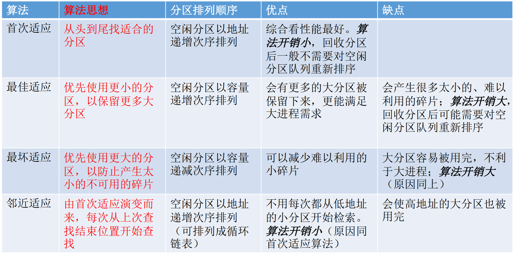

