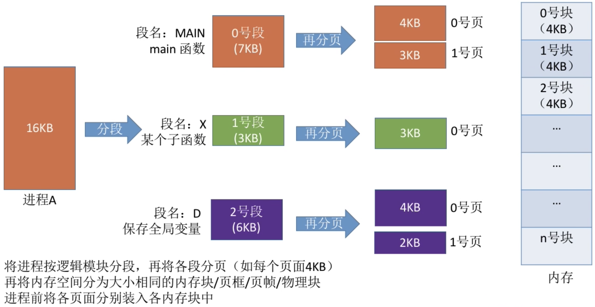

# 内存管理的概念-下

[TOC]

## 一、基本分页存储管理的概念

在此之前，我们先来了解一下连续分配和非连续分配的概念。

**连续分配**：为用户进程分配的必须是一个**连续的内存空间**。

**非连续分配**：为用户进程分配的可以是一些**分散的内存空间**。

### 1. 连续分配方式的缺点

我们回头思考一下，考虑支持多道程序的两种连续分配方式有哪些缺点。


1. 固定分区分配：缺乏灵活性，会产生大量的内部碎片，内存利用率很低。
2. 动态分区分配：会产生很多外部碎片，虽然可以用“紧凑”技术来处理，但是“紧凑”技术的时间代价很高。

产生这些问题的原因是连续分配方式要求给进程分配的内存空间必须是**一整片的连续的内存区域**，因此人们会想到：如果运行将一个进程分散地装入到许多不相邻的分区中，便可充分利用内存，而无需再进行“紧凑”。基于这一思想，产生了“非连续分配方式”，或者称为“离散分配方式”。

### 2. 把“固定分区分配”改造为“非连续分配”版本

假设进程A大小为23MB，但是每个分区大小只有10MB，如果进程只能占用1个分区，显然放不下。


解决思路：如果能允许进程占用多个分区，那么可以把进程拆分成10MB+10MB+3MB三个部分，再把这三个部分分表放到三个分区中，这些分区不要去连续，如下图所示：


进程A的最后一个部分是3MB，放入分区后会产生7MB的内部碎片，造成了很大的浪费，那么可以如何解决呢？

如果每个分区大小为2MB，那么进程A可以拆分成 11 × 2MB + 1MB 共12个部分，只有最后一个部分1MB占不满分区，会产生1MB的内部碎片。显然如果把分区大小设置的更小一些，内部碎片会更小，内存利用率会更高。

> **基本分页存储管理的思想**
>
> 把内存分为一个相等的小分区，再按照分区大小把进程拆分成一个小部分。

### 3. 分区存储管理的基本概念


将内存空间分为一个个**大小相等的分区**(比如每个分区4KB)，每个分区就是一个“**页框**”，或称“页帧”、“内存块”、“物理块”。每个页框都有一个编号，即“**页框号**”(或者“页帧号”、“内存块号”、“物理块号”)，页框号**从0开始**。

将用户进程的地址空间也分为**与页框大小相等**的一个个区域，称为“**页**”或者“**页面**”。每个页面也有一个编号，即“**页号**”，页号也是**从0开始**的。

> 注：进程的最后一个页面可能没有一个页框那么多，因此**页框不能太大**，否则**可能会产生过大的内部碎片**。

操作系统**以页框为单位为各个进程分配**内存空间。进程的每个页面分别放入一个页框中，也就是说，进程的**页面**与内存的**页框**有**一一对应**的关系。

各个页面不必连续存放，也不必按先后顺序，可以放到不相邻的各个页框中。

### 4. 如何实现地址的转换

将进程地址空间**分页**后，操作系统该如何实现逻辑地址到物理地址的转换呢？

我们先来回顾一下进程在内存中连续存放时，操作系统是如何实现逻辑地址到屋里地址转换的？当时我们可以采用动态重定位的方式进行转换：


程序中使用的依然是逻辑地址，在执行到程序的时候动态的翻译出物理地址，思想核心是：模块在内存中的“**起始地址**”+目标内存单元相对于起始地址的“**偏移量**”。

那能否将这种思想用到分页上呢？我们来看个栗子：


假设内存分配如上图所示，CPU执行指令1，需要访问逻辑地址为80的内存单元，如何转化为物理地址呢？

先来主管判断一下：逻辑地址为80的内存单元，应该在**1号页**，该页在内存中的**起始地址为450**，逻辑地址为80的内存单元相对于该页的起始地址而言，**“偏移量”应该是30**，因此**实际的物理地址** = 450 + 30 = 480。

我们来归纳一下获取物理地址的步骤：

1. 要算出逻辑地址对应的页号；
1. 要知道该页号对应在内存中的起始地址；
1. 要算出逻辑地址在页面内的“偏移量”；
1. 物理地址= 页面起始地址+页内偏移地址。

如何计算：

**页号** = 逻辑地址/页面长度(取除法的**整数**部分)

**页内偏移量** = 逻辑地址 % 页面长度(取除法的**余数**部分)

页面**在内存中的起始位置**：操作系统需要用某种数据结构记录进程各个页面的起始位置。

再代入一下上面的栗子：

页号 = 80 / 50 = 1，页内偏移量 = 80 % 50 = 30，1号页在内存中存放的起始位置：450，因此物理地址 = 450 + 30 = 480。

上面那是我们人工算，实际上计算机计算还会更加方便。为了方便计算机计算页号、页内偏移量，**页面大小**一般要为**2的整数幂**。


其中红色部分代码的就是页号，黑色部分代表的是页内偏移量。

> 如果学过计组，应该会更有感觉一点，这种结构就类似片选的概念。

结论：如果每个页面大小为(2^k)B，用二进制数表示逻辑地址，则**末尾的k位**即为**页内偏移量**，其余部分就是**页号**，分页存储管理的逻辑地址结构如下：


### 5. 页表

为了能知道进程的每个页面在内存中存放的位置，操作系统要**为每个进程建立一张页表**。


1. 一个进程对应一张页表。
2. 进程的每个页面对应一个页表项。
3. 每个**页表项**由“页号”何“块号”组成。
4. 页表记录进程**页面**和实际存放的**内存块**之间的**映射关系**。
5. 每个页表项长度是相同的，**页号是“隐含”的**。

我们来解释一下上面的第5点是什么意思：

Eg：假设某系统物理内存大小为4GB，页面大小为4KB，则每个页表项至少应该为多少字节？

4GB= (2^32)B，4KB = (2^12)B

因此4GB的内存总共会被划分为 (2^32) / (2^12) = (2^20) 个内存块，因此内存块号的范围应该是 0 ~ (2^20)-1。

因此至少要20个二进制位才能 表示这么多的内存块号，至少需要3个字节才够(每个字节8个二进制位，3个字节共24个二进制位)。


各页表项会**按顺序连续**地存放在内存中，如果该页表在内存中存放的起始地址为X，则M号页对应的页表项一定是存放在内存地址为(X + 3 × M)，因此页表中的“页号”是可以“隐含”的，也就是说页表中不需要存页号，不需要根据页号来查询块号，可以通过计算的方式来知道每个块号的起始地址，只需要知道页表存放的起始地址和页表项长度，即可找到各个页号对应的页表项存放的位置。

## 二、基本地址变换机构

所谓的基本地址变换机构，就是用于实现逻辑地址到物理地址转换的一组硬件机构。

基本地址变换机构可以借助进程的页表将逻辑地址转换为物理地址。

通常会在系统中设置一个**页表寄存器**(PTR)，存放页表在内存中的**起始地址F**和**页表长度M**。

进程未执行时，页面的起始地址和页表长度放在进程控制块PCB中，当进程被调度时，操作系统内核会把它们放到页表寄存器中。

设页面大小为L，逻辑地址A到物理地址E的变换过程如下：


1. 进程运行时，从PCB中获取页表起始地址F和页表长度M放入到页表寄存器。
2. 根据逻辑地址计算出页号、页内偏移量。
3. 判断页号是否越界。
4. 查询页表，找到页号对应的页表项，确定存放的内存块号。
5. 用内存块号和页内偏移量得到物理地址。
6. 通过物理地址访问目标存储单元。

我们再用文字的方式更加详细的描述一下上述过程(重复是必要的QvQ)：

1. 计算页号P和页内偏移量W。
2. 比较页号P和页表长度M，若P≥M，则产生越界中断，否则继续执行。(注意：页号是从0开始的，页表长度至少是1，因此**P=M也会越界**)
3. 页表中页号P对应的**页表项地址 = 页表起始地址F + 页号P × 页表项长度**，取出该页表项内容b，即内存块号。(注意区分**页表项长度、页表长度、页面大小**的区别。**页表长度**指的是这个页表中总共有几项页表，即总共有几个页；**页表项长度**指的是每个页表项占多大的存储空间；**页面大小**指的是一个页面占多大的存储空间)
4. 计算 E = b × L + W，用得到的物理地址E去访存。(如果内存块号、页面偏移量是用二进制表示的，那么把二者拼接起来就是最终的物理地址了)

我们再来看一个栗子：


1. 计算页号、页内偏移量：页号P = A/L = 2500/1024 = 2；页内偏移量W = A%L = 2500%1024  = 452

2. 根据题目条件可知，页号2没有越界，其存放内存块号8
3. 计算物理地址：E = b × L +W = 8 × 1024 + 425  = 8644

## 三、具有快表的地址变换机构

### 1. 局部性原理

我们先看一下下面这段伪代码：

```c
int i = 0;
int a[100];
while(i < 100){
  a[i] = i;
  i++;
}
```

假设这段代码在内存中存储情况如下：


那么这个程序执行时，会很频繁的访问10、23号内存块，因此我们引出时间局部性和空间局部性两个概念。

**时间局部性**：如果执行了程序中的某条指令，那么不久后这条指令很可能再次执行；如果某个数据被访问过，不久后该数据很可能再次被访问。(因为程序中存在大量循环)

**空间局部性**：一旦程序访问了某个内存单元，在不久之后，其附近的存储单元也很有可能被访问。(因为很多数据在内存中都是连续存放的)

上一节介绍的**基本地址变换机构**中，每次要访问一个逻辑地址，都需要**查询内存中的页表**。由于局部性原理，**可能连续很多次查到的都是同一个页表项**。既然如此，能否利用这个特性减少访问页表项的次数呢？

### 2. 什么是快表(TLB)

**快表**，又称**联想存储器(TLB)**，是一种**访问速度比内存快很多**的高速缓存处理器，用来存放当前访问的若干页表项，以加速地址变换的过程。与此对应，内存中的页表常称为**慢表**。

我们来看一个栗子：


假设某进程执行过程中要依次访问(0, 0)、(0, 4)、(0, 8)这几个逻辑地址，其访问过程如下：

1. 首先(0, 0)得到执行，逻辑地址被拆解为页号和页内偏移量；
2. 检查页号是否出现越界；
3. 若未越界，则查询快表(TLB)，此时为初次访问，快表为空，未命中；
4. 此时需要通过页号+页表始址计算出页号对应的页表项在内存中的位置；
5. 在查询到了页号对应的页表项后，会将页表项的内容复制到快表中；
6. 根据页表项中的内存块号和逻辑地址中的页内偏移地址，就能得到物理地址，就能访问目标页面了。
7. 接着(0, 4)得到执行，逻辑地址被拆解为页号和页内偏移量；
8. 检查页号是否出现越界；
9. 若未越界，则查询快表(TLB)，此时快表中有页号为0的内容；
10. 根据快表中的内存块号+逻辑地址中的页内偏移即可得到物理地址，就能访问目标页面了。
11. (0, 8)以此类推...

### 3. 引入快表后地址的变换过程

1. CPU给出逻辑地址，由某个硬件算得页号、页内偏移量，将页号与快表中的所有页号进行比较。
2. 如果找到匹配的页号，说明要访问的页表项在快表中有副本，则直接从中取出该页对应的内存块号，再将内存块好与页内偏移量拼接形成物理地址，最后，访问该物理地址对应的内存单元。因此若**快表命中**，则访问某个逻辑地址仅需**一次访存**即可。
3. 如果没有找到匹配的页号，则需要**访问内存中的页表**，找到对应页表项，得到页面存放的内存块号，再将内存块号与页内偏移量拼接形成物理地址，最后，访问该物理地址对应的内存单元。因此。若**快表未命中**，则访问某个逻辑地址需要**两次访存**(注意：**在找到页表项后，应同时将其存入快表**，以便后面可能再次访问。若快表已满，则必须按照一定的算法对旧的页表项进行替换，这个后续会说)

由于查询快表的速度比查询页表的速度快很多，因此只要快表命中，就可以节省很多时间。因为局部性原理，一般来说快表的命中率可以达到90%以上。

## 四、两级页表

### 1. 单级页表存在的问题


根据页号查询页表的方法 ：K号页对应的页表项存放位置=页表始址+K×4，要在**所有的页表项都连续存放**的基础上才能用这种方法找到页表项。另外，根据内存局部性原理可知，很多时候，**进程在一段时间内只需要访问某几个页面就可以正常运行了**，因此**没有必要让整个页表都常驻内存**。

因此我们可以发现两个问题：

1. 页表必须要连续存放，因此页表很大时，需要占用很多个连续的页框。
2. 没有必要让整个页表常驻内存，因为进程在一段时间内可能只需要访问某几个特定的页面。

### 2. 两级页表的原理、地址结构

我们先来解决问题1。可以思考一下，之前是如何解决进程在内存中必须连续存储的问题的：将进程地址空间分页，并为其建立一张页表，记录各页面的存放位置。同样的思路也可以用于解决”页表必须连续存放“的问题，把必须连续存放的页表再分页。

可以将长长的页表进行分组，使每个内存块刚好可以放入一个分组(比如上面的栗子中，页面大小4KB，每个页表项4B，每个页面可存放1K个页表项，因此每1K个连续的页表项为一组，每组刚好占一个内存块，再将各组离散地放到各个内存块中)。另外，要为离散分配的页表再建立一张页表，称为**页目录表**，或称**外层页表**，或称**顶层页表**。


### 3. 如何实现地址变换

我们直接看个栗子：


1. 按照地址结构将逻辑地址拆分成三部分。
2. 从PCB中读出页目录表始址，再根据一级页号查页目录表，找到下一级页表再内存中的存放位置。
3. 根据耳机也好查耳机页表，找到最终想访问的内存块号。
4. 结合页内偏移量得到物理地址。

上例中得到最终要访问的内存块号为4，该内存块的起始地址为4×4096=16384，页内偏移为4095，最终物理地址为16384+4095=20479。

### 4. 解决页表常驻问题

关于上面的问题2，页表太大常驻内存开销过大的问题，我们后续会讲到虚拟存储技术，这里先简单提一嘴：


### 5. 需要注意的几个细节


## 五、基本分段存储管理

基本分段存储管理与“分页”最大的区别就是离散分配时所分配地址空间的基本单位不同。

### 1. 分段

进程的地址空间：按照程序**自身的逻辑**关系**划分为若干个段**，每个段都有一个段名(在低级语言中，程序员使用段名来编程)，**每个段从0开始编址**。

内存分配规则：以段为单位进行分配，每个段在内存中占据连续的地址空间，但各个段之间可以不用相邻。


### 2. 段表

问题：程序分多个段，各段离散地装入内存，为了保证程序能正常运行，就修能从物理内存中找到各个逻辑段的存放位置。为此，需为每个进程建立一张段映射表，简称“**段表**”。


1. 每个段对应一个段表项，其中记录了该段在内存中的**起始位置**(又称“**段址**”)和**段长度**。
2. 各个段表项的长度是相同的。例如：某系统按字节寻址，采用分段存储管理，逻辑地址结构为段号16位，段内地址16位，因此用16位即可表示最大段长；物理内存大小为4GB，可以用 32位表示整个物理内存地址空间；因此，可以让每个段表项占16+32=48位，即6B。由于段表项长度相同，因此段号可以是隐含的，不占存储空间。若段表存放的起始地址为M，则K号段对应的段表存放的地址空间为M+K×6。

### 3. 地址变换


由上图的栗子，我们来看看是如何进行地址变换的：


### 4. 分段、分页管理的对比

**页**是**信息的物理单位**。分页的主要目的是为了实现离散分配，提高内存利用率。分页仅仅是系统管理上的需要，完全是系统行为，**对用户是不可见的**。

**段**是**信息的逻辑单位**。分段的主要目的是更好地满足用户需求。一个段通常包含着一组属于一个逻辑模块的信息。**分段对用户是可见的**，用户编程时需要显式地给出段名。

页的大小固定且由系统决定；段的长度却不固定，决定于用户编写的程序。

**分页**的用户进程**地址空间是一维**的，程序员只需给出一个记忆符即可表示一个地址。

**分段**的用户进程**地址空间是二维**的，程序员在标识一个地址时，既要给出段名，也要给出段内地址。


**分段**比分页**更容易实现信息的共享和保护**：


> 注意：不能被修改的代码称为纯代码或可重入代码(不属于临界资源)，这样的代码是可以共享的。可修改的代码是不能共享的，比如有一个代码段中有很多变量，各进程并发地同时访问可能造成数据不一致。

我们来看看为啥分页更难以实现信息的共享：


## 六、段页式管理方式

### 1. 分页、分段的优缺点分析

| 管理类型 | 优点                                   | 缺点                                                         |
| -------- | -------------------------------------- | ------------------------------------------------------------ |
| 分页管理 | 内存利用率高，不会产生外部碎片         | 不方便按照逻辑模块实现信息的共享和保护                       |
| 分段管理 | 很方便按照逻辑模块实现信息的共享和保护 | 如果段长过大，为其分配很大的连续空间回很不方便；另外，段式管理回产生外部碎片，虽然可以用“紧凑”来解决，但是需要付出较大的时间代价 |

### 2. 分段+分页=段页式管理



段页式管理的逻辑地址结构如下：


段号的位数决定了每个进程最多可以分几个段，页号位数决定了每个段最大有多少页，页内偏移量决定了页面大小、内存块大小是多少。

“分段”对用户是可见的，程序员编程时需要显式地给出段号、段内地址。而将各段“分页”对用户是不可见的。系统会根据段内地址自动划分页号和页内偏移量。因此**段页式**管理的**地址结构是二维的**。

### 3. 段表、页表


每个段对应一个段表项，每个段表项由段号、**页表长度**、**页表存放块号**(页表起始地址)组成。每个段表项长度相等，**段号是隐含的**。

每个页面对应一个页表项，每个页表项由页号、页面存放的内存块号组成。每个页表项长度相等，页号是隐含的。
