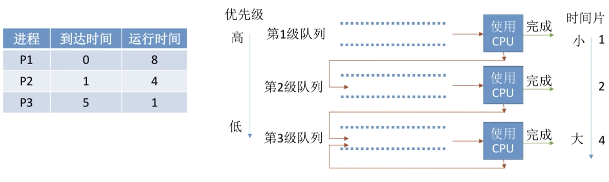

# 处理机的调度

[TOC]

## 一、处理机调度概念、层次

### 1. 调度的基本概念

当有一堆任务要处理，但由于资源有限，这些事情没法同时处理。这就需要确定某种规则来决定处理这些任务的顺序，这就是“调度”研究的问题。

在多道程序系统中，进程的数量往往是多于处理机的个数的，这样不可能同时并行地处理各个进程。处理机调度，就是从就绪队列中按照一定的算法选择一个进程并将处理机分配给它运行，以实现进程的并发执行。

### 2. 调度的三个层次

#### 2.1 高级调度

高级调度：又称作业调度，即按照一定的原则从外存上处于后备队列的作业中挑选一个 (或多个)作业，给他们分配内存等必要资源，并建立相应的进程(建立PCB)，以使它们**获得竞争处理机的权利**。

高级调度是辅存(外存)与内存之间的调度。每个作业只调入一次，调出一次。**作业调入时会建立相应的PCB，作业调出时才撤销PCB**。

高级调度主要是调入问题，因为只有调入的时机需要操作系统来确定，调出的时机必然是作业运行结束才调出。

#### 2.2 中级调度

引入虚拟存储技术后，可将暂时不能运行的进程调至外存等待(后面讲内存管理会细嗦)，等它重新具备了运行条件且内存又稍有空闲时，再重新调入内存。这么做的目的是为了**提高内存利用率和系统吞吐量**。

暂时调到外存等待的进程状态为挂起状态。值得注意的是，PCB并不会一起调到外存，而是会**常驻内存**，PCB中会记录进程数据在外存中的存放位置，进程状态等信息，操作系统通过内存中 的PCB来保持对各个进程的监控、管理，被挂起的PCB会被放到**挂起队列**中。

中级调度：又称内存调度，就是要决定将哪个处于挂起状态的进程重新调入内存。一个进程进程可能会被多次调出、调入内存，因此中级调度发生的**频率比高级调度要更高**。

> 进程的挂起态与七状态模型
>
> 暂时调到外存等待的进程状态为挂起状态，挂起态又可以进一步细分为就绪挂起、阻塞挂起两种状态。
>
> 

#### 2.3 低级调度

低级调度：又称进程调度，其主要任务是按照某种方法和策略从就绪队列中选取一个进程，将处理机分配给它。

进程调度是操作系统中**最基本的一种调度**，在一般操作系统中都必须配置进程调度。进程调度的**频率很高**，一般几十毫秒一次。

### 3. 三层调度的联系、对比

## 二、进程调度的时机、切换与过程、调度方式

### 1. 进程调度的时机

需要进行进程调度与切换的情况：

1. 当运行的进程**主动放弃**处理机
   - 进程正常终止
   - 运行过程中发生异常而终止
   - 进程主动请求阻塞(如等待I/O)
2. 当前运行的进程**被动放弃**处理机
   - 分给进程的时间片用完了
   - 有更紧急的事需要处理(如I/O中断)
   - 有更高优先级的进程进行就绪队列

不能进行进程切换的情况：

1. 在**处理中断的过程中**。中断处理过程复杂，与硬件密切相关，很难做到在中断处理过程中进行进程切换。
2. 进程在**操作系统内核临界区中，但进程在普通临界区中是可以进行调度、切换的。
3. 在**原子操作过程中**(原语)。原子操作不可中断，要一气呵成。

> 关于临界区
>
> 临界资源：一个时间段内只允许一个进程使用的资源，各个进程需要**互斥**地访问临界资源。
>
> 临界区：访问临界资源的那段代码。
>
> 内核临界区一般是用来访问某种内核数据结构的，比如进程的就绪队列。
>
> 内核临界区访问临界资源如果不尽快释放的话，极有可能影响到操作系统内核的其他管理工作，因此在访问内核临界区期间不能进行调度与切换；普通临界区访问的临界资源不会直接影响操作系统内核的管理工作，因此可以进行调度与切换。

### 2. 进程调度的方式

非剥夺调度方式：又称**非抢占式**，即只允许进程主动放弃处理机，在运行过程中即便有更紧迫的任务到达，当前进程依然继续使用处理机，直到该进程终止或主动要求进入阻塞状态。此方式实现简单，系统开销小，但无法及时处理紧急任务，适合早期的批处理系统。

剥夺调度方式：又称**抢占式**，即当一个进程正在处理机上执行时，如果有一个更重要或更紧迫的进程需要使用处理机，则立即暂停正在执行的进程，将处理机分配给更重要紧迫的那个进程。此实现方式可以优先处理更紧急的进程，也可实现让各进程按时间片轮流执行的功能(通过时钟中断)，适合分时操作系统、实时操作系统。

### 3. 进程的切换与过程

“狭义的进程调度”与“进程切换”的区别：

**狭义的进程调度**指的是**从就绪队列中选一个要运行的进程**。这个进程可以是刚刚被暂停执行的进程，也可以是另一个进程，后一种情况就需要进程切换。

**进程切换**是指一个进程让出处理机，由另一个进程占用处理机的过程。

**广义的进程调度**包含了选择一个进程和进程切换两个步骤。

进程切换过程主要完成了：

1. 对原来运行进程各种数据的保存；
2. 对心的进程各种数据的恢复(如程序计数器、程序状态字、各种寄存器等处理机现场信息，这些信息一般保存在进程控制块)。

注意：**进程切换是有代价的**，如果**过于频繁**的进行进程**调度、切换**，必然会使整个系统的**效率降低**，使系统大部分时间都花在进程切换上，而真正用于执行进程的时间减少。

## 三、调度算法 

### 1. 先来先服务(FCFS,First Come First Server)

算法思想：主要从“公平”的角度考虑。

算法规则：按照作业/进程到达的先后顺序进行服务。一般来讲，它是非抢占式的。不会出现饥饿。

> 饥饿
>
> 某进程/作业长期得不到服务

我们来看一个例子：

优点：公平、算法实现简单。

缺点：排在长作业/进程后面的短作业需要等待很长时间，带权周转时间很大，对短作业来说用户体验不好，即**对长作业有利，对短作业不利**。

### 2. 短作业优先(SJF,Short  Job First)

算法思想：追求最少的评价等待时间，最少的平均周转时间、最少的平均带权周转时间。

算法规则：最短的作业/进程优先得到服务(所谓的最短，是指要求服务时间最短)。一般来讲是非抢占式的，但也有抢占式版本——最短剩余时间优先算法(SRTN,Shortest Remaining Time Next)。可能会导致饥饿。

我们来看个例子：

上面的栗子是非抢占式的，我们再来看看抢占式的，也就是最短剩余时间优先算法(SRTN)：

优点：“最短的”平均等待时间、平均周转时间。

缺点：不公平，最短作业有利，对长作业不利，可能产生饥饿现象。另外，作业/进程的运行时间是由用户提供的，并不一定真实，不一定能做到正在的短作业优先。

### 3. 高响应比优先(HRRN, Highset Response Ratio Next)

算法思想：综合考虑作业/进程的等待时间和要求服务时间。

算法规则：在每次调度时计算各个作业/进程的**响应比**，选择**响应比最高的**作业/进程为其服务。一般是非抢占式的。不会导致线程饥饿。

> 响应比
> $$
> 响应比 = \frac{等待时间+要求服务时间}{要求服务时间}
> $$

我们来看个栗子：

优点：综合考虑了等待时间和运行时间(要求服务时间)；等待时间相同时，要求服务时间短的优先(SJF的优点)；要求服务时间相同时，等待时间长的优先(FCFS的优点)；对长作业来说，随着等待的时间越来越久，其响应比也会越来越大，从而避免了长作业饥饿问题。

### 3.5 小结1

这几种算法主要关系对用户的公平性、平均周转时间、平均等待时间等评价系统整体性能的指标，但是不关心“响应时间”，也不区分任务的紧急程度，因此对于用户来说，交互性很糟糕。因此这几种算法一般适合于早期的批处理系统，当然，FCFS算法也常常结合其他的算法使用。

### 4. 时间片轮转

算法思想：公平的、轮流地为各个进程服务，让每个进程在一定时间间隔内都可以得到响应。

算法规则：按照各进程到达就绪队列的顺序，轮流让各个进程执行一个时间片(如100ms)，若进程未在一个时间片内执行完，则剥夺处理机，将进程重新放入到就绪队列队尾重新排队，因此该算法属于**抢占式**算法(由时钟装置发出**时钟中断**来通知CPU时间片已到期)，且不会导致饥饿。

> 时间片轮转算法用于进程调度，因为只要作业放入内存建立了相应的进程后才能被分配处理机时间片

下面我们来看个栗子：

设时间片大小为2，小括号内为进程的剩余运行时间，**默认新到达的进程先进入就绪队列**：

| 时刻 | 就绪队列                      | 分析                                                         |
| ---- | ----------------------------- | ------------------------------------------------------------ |
| 0    | P1()                          | 只有P1到达就绪队列，让P1在处理机上运行一个时间片             |
| 2    | P2(4) -->P1(3)                | P2到达就绪队列，P1运行完一个时间片后被剥夺处理机，重新放入就绪队列队尾；此时P2在队头，因此给P2分配处理机 |
| 4    | P1(3)-->P3(1)--->P2(2)        | P3到达，先插入就绪队列队尾，P2运行完一个时间片，放入队尾；此时P1在队头，给P1分配处理机 |
| 5    | P3(1)-->P2(2)-->P4(6)         | P4到达，插入队尾；此时时间片还没有用完，暂不调度；P1处于运行状态，不在队列内 |
| 6    | P3(1)-->P2(2)-->P4(6)-->P1(1) | P1插入队尾，处理机分配给队头的P3                             |
| 7    | P2(2)-->P4(6)-->P1(1)         | P3时间片没有用完，但任务已结束，会主动放弃处理机，发生调度，处理机分配给队头的P2 |
|      | P4(6)-->P1(1)                 | P2时间片用完，任务也结束，发生调度，处理机分配给队头的P4     |
| 11   | P1(1)-->P4(4)                 | P4时间片用完，发生调度，处理机分配给队头的P4                 |
| 12   | P4(4)                         | P1任务结束，主动放弃处理机，发生调度，处理机分配给队头的P4   |
| 1    |                               | 队列为空，处理机继续分配给P4                                 |
| 16   |                               | 所有进程运行结束                                             |

如果时间片大小设置为5的话，运行结果如下(就不逐步分析了)：

可以发现，如果**时间片太大**，使得每个进程都可以在一个时间片内就完成，则时间片轮转调度算法**退化为先来先服务**调度算法，并且会**增大进程响应时间**，因此**时间片不能太大**。

另一方面，进程调度、切换是有时间代价的，因此如果**时间片太小**，会导致**进程切换过于频繁**，系统会花费大量的时间来处理进程切换，从而导致实际用于执行的时间比例会减少，可见**时间片也不能太小**。

优点：公平，响应快，适用于分时操作系统。

缺点：由于高频率的进程切换，有一定的开销，且不区分任务的紧急程度。

### 5. 优先级调度算法

算法思想：基于任务的紧急程度来决定处理顺序。

算法规则：每个作业/进程有各自的优先级，调度时优先选择优先级高的作业/进程。既可支持抢占式，也可支持非抢占式。

下面我们看个栗子，设使用**非抢占式**，优先数越大，优先级越高：

我们再看一个**抢占式**：

就绪队列未必只有一个，可以按照不同的优先级来组织；另外，也可以把优先级高的进程排在更靠近队头的位置。

根据优先级是否可以动态改变，可将优先级分为**静态优先级**和**动态优先级**两种：

- 静态优先级：创建进程时确定，之后一直不改变。
- 动态优先级：创建进程时有一个初始值，之后会根据情况动态地调整优先级。

那么如何合理地设置各类进程的优先级呢？通常情况下：

- 系统进程优先级**高于**用户进程。
- 前台进程优先级**高于**后台进程。
- 操作系统更**偏好I/O型进程(或称I/O繁忙型进程)**，因为I/O设备和CPU可以**并行**工作，如果优先让I/O繁忙型进程运行的话，则越有可能让I/O设备尽早地投入工作，则资源利用率、系统吞吐量都会得到提升。

> 注：与I/O型进程相对的是计算型进程(或称CPU繁忙型进程)。

如果采用的是动态优先级，什么时候应该调整？

可以从追求公平、提升资源利用率等角度考虑：

- 如果某进程在就绪队列中等待了很长时间，则可以适当提升其优先级。
- 如果某进程占用处理机运行了很长时间，则可以适当降低其优先级。
- 如果发现一个进程频繁的进行I/O操作，则可以适当提升其优先级。

优点：用优先级区分紧急程度、重要程度，适用于实时操作系统，可以灵活地调整对各种作业/进程的偏好程度。

缺点：若源源不断的有高优先级作业/进程到来，则可能导致饥饿。

### 6. 多级反馈队列调度算法

算法思想：对其他调度算法的折中权衡。

算法规则：

1. 设置多级就绪队列，各级队列优先级从高到低，时间片大小从小到大；
2. 新进程到达时先进入1级队列，按FCFS原则排队等待被分配时间片，若用完时间片任务还未结束，则进入下一级队列队尾排队，若此时已经是最下级的队列，则重新放回该队列的队尾；
3. 只有第k级队列为空时，才会为k+1级队头的进程分配时间片。

该算法只用于进程调度，且是抢占式算法。

我们来看个栗子：

| 时刻 | 1级队列 | 2级队列       | 3级队列 | 分析                                                         |
| ---- | ------- | ------------- | ------- | ------------------------------------------------------------ |
| 0    | P1(8)   |               |         | P1到达，分配到队列1，且队列1为空，分配P1使用处理机           |
| 1    | P2(4)   | P1(7)         |         | P1用完时间片，任务未结束，分配到队列2；P2到达队列1，且队列1为空，分配P2使用处理机 |
| 2    |         | P1(7)-->P2(3) |         | 队列1为空，队列2有进程，为队列2的队头进程P1分配处理机        |
|      |         | P2(3)         | P1(5)   | P1用完时间片，任务未结束，分配到队列3；队列1为空，为队列2队头的P2分配处理机 |
|      | P3(5)   | P2(2)         | P1(5)   | P5到达，分配到队列1，此时P2在使用处理机，被剥夺，P2重新放入队列2队尾，为P5分配处理机 |
|      |         | P2()          | P1()    | P5用完时间片且任务完成，退出队列，队列1为空，队列2有进程，为队列2的队头进程P2分配处理机 |
|      |         |               | P1(5)   | P2用完时间片且任务完成，退出队列，队列1、2为空，队列3有进程，为队列3的队头进程P1分配处理机 |
| 12   |         |               | P1(1)   | P1用完时间片，任务未结束，因队列3已是最下级队列，故继续放回队尾；再次取队列3队头进程P1分配处理机 |
| 13   |         |               |         | 所有进程执行完成                                             |

优点：对各类型进程相对公平(FCFS的优点)，每个新到达的进程都可以很快得到响应(RR的优点)，短进程只用较少的时间就可以完成(SPF的优点)，不必实现估计进程的运行时间(避免用户作假)，可灵活地调整对各类进程的偏好程度，比如CPU密集型进程、I/O密集型进程(拓展：可以将因I/O而阻塞的进程重新放入原队列，这样I/O密集型进程就可以保持较高优先级)。

### 6.5 小结2

