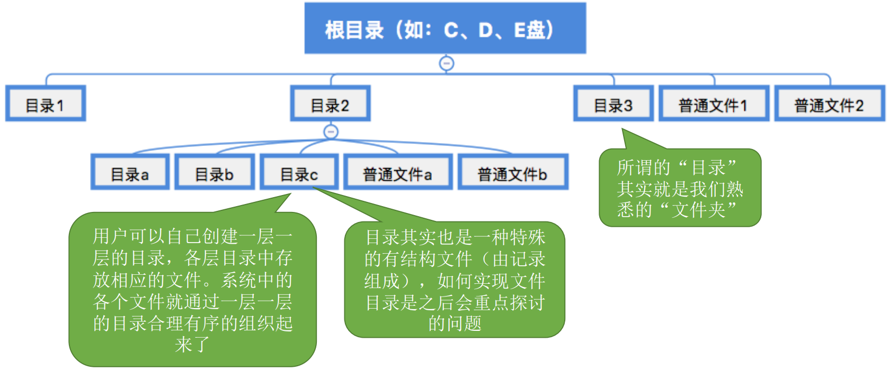

# 文件系统-上

[TOC]

## 一、初识文件管理

操作系统作为系统资源的管理者，需要提供文件管理的功能，那文件是什么呢？**文件**就是一组有意义的信息/数据集合。

这里先提出几个问题，作为文件管理的开端：

计算机中存放了各种各样的文件，一个文件有哪些属性？

**文件内部**的数据应该怎样组织起来？

**文件之间**又应用怎么组织起来？

从下网上看，操作系统应该提供哪些功能，才能方便用户、应用程序使用文件？

从上往下看，文件数据应该怎样存放在外存(磁盘)上？

### 1. 文件的属性

大家都应该用过windows操作系统(没用过你学个毛的操作系统)，可以随便找一个文件，右键查看属性，我们可以看到一个文件会有哪些属性，我这里就不截图演示了，懂的都懂...

我们可以从属性中看到，一个文件有：

1. **文件名**：由创建文件的用户决定文件名，主要是为了方便用户找到文件，**同一目录下不允许有重复的文件**。
2. **标识符**：一个系统内的各文件标识符唯一，对用户来说毫无可读性，因此标识符只是操作系统用于区分各个文件的一种内部名称。
3. **类型**：指明文件类型。
4. **位置**：文件存放的路径(让用户使用)、在外存中的地址(操作系统使用，对用户不可见)。
5. **大小**：指明文件大小。
6. **创建时间、上次修改时间**。
7. **文件所有者信息**。
8. **保护信息**：对文件进行保护的访问控制信息。

### 2. 文件内部的数据如何组织

文件内部可分为无结构文件和有结构文件：

### 3. 文件之间如何组织

### 4. 操作系统应该向上提供哪些功能

通过日常使用，我们可以得出应该提供：

1. 创建文件：create系统调用。
2. 读文件：将文件数据读入内存，才能让CPU处理。调用read系统调用。
3. 写文件：将更改过的文本数据写回外存。调用writer系统调用。
4. 删除文件：将文件数据从外存中删除。delete系统调用。
5. 打开文件：读/写文件之前，需要打开文件。open系统调用。
6. 关闭文件：读/写结束之后，需要关闭文件。close系统调用。

### 5. 从上往下看，文件应如何存放在外存

操作系统以“块”为单位为文件分配存储空间，因此即使一个文件大小只有10B，但它依然需要占用1KB的磁盘块。外存中的数据读入内存时同样以块为单位。

类似内存分为一个个“内存块”，外存会分为一个个“块/磁盘块/物理块”。每个磁盘块的大小是相等的，每块一般包含2的整数幂个地址。同样类似的是，文件的逻辑地址也可分为(逻辑块号，块内地址)，操作系统同样需要将逻辑地址转化为外存的物理地址(物理块号，块内地址)的形式。块内地址的位数取决于磁盘块的大小。

与内存一样，外存也是由一个个存储单元组成的，每个存储单元可以存储一定量的数据(如1B)。每个存储单元对应一个物理地址。

### 6. 从上往下看，文件应该如何存放在外存

这部分内容会在文件的物理结构小结详细讲。

## 二、文件的逻辑结构

所谓的“逻辑结构”，就是指在用户看来，文件内部的数据应该是如何组织起来的。而“物理结构”指的是在操作系统看来，文件的数据是如何存放在外存中的。

类似于数据结构的“逻辑结构”何“物理结构”。如“线性表”就是一种逻辑结构，在用户角度看来，线性表就是一组有先后关系的元素序列，如：a，b，c，d...。“线性表”这种逻辑结构可以用不同的物理结构实现，如：顺序表/链表；顺序表的各个元素在逻辑上相邻，物理上也相邻，而链表的各个元素在物理上可以是不相邻的。因此顺序表可以实现“随机访问”，而“链表”无法实现随机访问。

可见，算法的具体实现与逻辑结构、物理结构都有关(文件也一样，文件操作的具体实现与文件的逻辑结构、物理结构都有关)。

### 1. 无结构文件

按文件是否有结构分类，可以分为无结构文件、有结构文件两种。

无结构文件：文件内部的数据就是一些了二进制流或字符流组成。又称“流式文件”。如windows操作系统中的.txt文件。

无结构文件内部的数据其实就是一系列字符流，没有明显的结构特性，因此也不用探讨无结构文件的逻辑结构问题。

### 2. 有结构文件

有结构文件：由一组相似的记录组成，又称“记录式文件”。每条记录又若干个数据项组成。如：数据库表文件。一般来说，每条记录又一个数据项可作为**关键字**(作为识别不同记录的ID)。

根据各条记录的长度(占用的存储空间)是否相等，又可以分为**定长记录**和**变长记录**。

### 3. 有结构文件的逻辑结构

根据有结构文件中的各条记录在逻辑上如何组织，可以分为三类：顺序文件、索引文件、索引顺序文件。

#### 3.1 顺序文件

**顺序文件**：文件中的记录一个接一个地顺序排列(逻辑上)，记录可以是**定长**的或**可变长**的。各个记录在物理上可以**顺序存储**或**链式存储**。

现在，我们来思考两个问题，假设已知文件的起始地址(也就是第一个记录的存放位置)：

1. 能否快速找到第i个记录对应的地址？(即能否实现随机存取)
1. 能否快速找到某个关键字对应的记录存放位置？

下面给出答案：

- 链式存储：无论定长/可变长记录，都无法实现随机存取，每次只能从第一个记录开始依次往后查找
- 顺序存储
  - 可变长记录：无法实现随机存取，每次只能从第一个记录开始依次往后查找
  - 定长记录
    - 可实现随机存取。记录长度为L，则第i个记录存放的相对位置是i×L
    - 若采用串结构，无法快速找到某关键字对应的记录
    - 若采用顺序结构，可以快速找到某关键字对应的记录(如二分法查找)

结论：定长记录的顺序文件，若物理上采用顺序存储，则可以实现随机存取；若能保证记录的顺序结构，则可实现快速检索(即根据关键字快速找到对应记录)。

#### 3.2 索引文件

对于可变长记录文件，要找到第i个记录，必须先顺序的查找前i-1个记录，但是很多应用场景中又必须使用可变长记录，如何解决这个问题呢？

我们可以引入索引表来解决这个问题：

**索引表**本身是**定长记录的顺序文件**。因此可以快速找到第i个记录对应的索引项。

可将关键字作为索引号内容，若按关键字顺序排列，则还可以支持按照关键字二分查找。

每当要增加/删除一个记录时，需要对索引表进行修改。由于索引文件有很快的检索速度，因此**主要用于对信息处理的及时性要求较高的场合**。

另外，可以用不同的数据项建立多个索引表。如：学生信息表中，可用关键字“学号”建立一张索引表，也可以用“姓名”建立一张索引表，这样就可以根据“姓名”快速地检索文件了。

#### 3.3 索引顺序文件

索引文件也有它的缺点：每个记录对应一个索引项表，因此索引表可能会很大。比如：文件每个记录平均只占8B，而每个索引表项占32B，那么索引表都要比文件内容本身大4倍，这样对存储空间的利用率就太低了。

这时候就轮到索引顺序文件出场了：索引顺序文件是索引文件和顺序文件思想的结合；索引顺序文件中，同样会为文件建立一张索引表，但不同的是，并不是每个记录对应一个索引项表，而是**一组记录对应一个索引项表**。

上面的栗子中，学生记录按照学生姓名的开头字母进行分组。每个分组就是一个顺序文件，分组内的记录不需要按关键字排序。

#### 3.4 多级索引顺序文件

用索引表分组的策略确实可以让索引表“瘦身”，但是是否会出现不定长记录的顺序文件检索速度慢的问题呢？我们来分析一下检索效率。

若一个**顺序文件**有10000个记录，则根据关键字检索文件，只能从头开始顺序查找(这里指的并不是定长记录、顺序结构的顺序文件)，**平均须查找5000个记录**。

若采用**索引顺序文件**结构，可把10000个记录分为100组，组100个记录。则需要先顺序查找索引表找到分组(共100个分组，因此索引表长度为100，平均需要查50次)，找到分组后，再在分组中顺序查找记录(每个分组100个记录，因此评价需要查找50次)。可见，采用索引顺序文件结构后，**平均查找次数减少为50+50=100次**。

同理，若文件共有10^6个记录，则可分为1000个分钟，每个分组1000个记录。根据关键字检索一个记录平均要查找1000次，这个查找次数依然很多，如何解决呢？

这时候就要轮到多级索引顺序文件登场了：为了进一步提高检索效率，可以为顺序文件**建立多级索引表**。例如，对于一个含10^6个记录的文件，可先为该文件建立一张低级索引表，每100个记录为一组，故低级索引表中共有10000个表项(即10000个定长记录)，再把这10000个定长记录分组，每组100个，为其建立顶级索引表，故顶级索引表中总共有100个表项。

## 三、文件目录

目录，也就是windows系统中的文件夹，是我们非常熟悉的一个东西，这种目录结构对用户来说可以使得文件之间的组织结构清晰，便于查找，编程时也可以很方便的用文件路径找到一个文件。

那从操作系统的角度来看，这些目录结构应该是如何实现的？

### 1. 文件控制块

文件控制块(FCB)：一个FCB就是一个文件**目录项**，FCB的有序集合称为“文件目录”。FCB中包含了文件的**基本信息**(**文件名**、**物理地址**、逻辑结构、物理结构等)，存取控制信息(是否可读/写、禁止访问的用户名单等)，使用信息(如文件的建立时间、修改时间等)。**最重要，最基本的还是文件名、文件存放的物理地址**。

### 2. 目录结构——单级目录结构

早期操作系统并不支持多级目录，整个系统中只建立一张目录表，每个文件占一个目录项。

单级目录实现了“按名存取”，但是**不允许文件名重复**。

在创建一个文件时，需要先检查目录表中有没有重名文件，确定不重名之后才能允许建立文件，并将新文件对应的目录项插入目录表中。显然，单级目录结构不适用于多用户操作系统。

### 2. 目录结构——两级目录结构

早期的多用户操作系统，采用两级目录结构。分为主文件目录(MDF)和用户文件目录(UDF).

### 3. 目录结构——多级目录结构

多级目录结构，又称**树形目录结构**。用户(或用户进程)要访问某个文件时要用文件路径名标识文件，文件路径名是个字符串。各级目录之间用“/”隔开。**从根目录出发**的路径为**绝对路径**。

以上图举例，例如：自拍.jpg的绝对路径是“/照片2015-08/自拍.jpg”

系统根据绝对路径一层一层地找到下一级目录。刚开始从外存读入根目录的目录表，找到“照片”目录的存放位置后，从外存读入对应的目录表，再找到“2015-08”目录的存放位置，再从外存读入对应目录表，最后才找到文件“自拍.jpg”的存放位置，整个过程需要**3次读磁盘I/O操作**。

很多时候，用户会连续访问同一目录内的多个文件，显然，每次都从根目录开始查找是很低小的，因此可以设置一个“**当前目录**”。

例如，此时已经打开了“照片”的目录文件，也就是说，这张目录表已经调入内存，那么可以把它设置为“当前目录”。当用户要访问某个文件时，可以使用**从当前目录出发**的“**相对路径**”。

在Linux中，“.”表示当前目录，因此如果“照片”是当前目录，则“自拍.jpg”的相对路径为：“./2015-08/自拍.jpg”。从当前路径出发，只需要查询内存中的“照片”目录表，即可知道“2015-08”目录表的存放位置，从外存调入该目录，即可知道“自拍.jpg”存放的位置了。

可见，引入“**当前目录**”和“**相对路径**”后，磁盘的I/O次数减少了，这就提升了访问文件的效率。

### 4. 目录结构——无环图目录结构

树形目录结构可以很方便地对文件进行分类，层次结构清晰，也能更有效地进行文件的管理和保护。但是，树形结构不便于实现文件的共享。为此提出了“**无环图目录结构**”。

**可以用不同的文件名指向同一个文件**，甚至可以指向同一个目录(共享同一目录下的所有内容)。

需要为**每个共享节点设置一个共享计算器**，用于记录此时有多少个地方在共享该节点。用户提出删除节点请求时，只是删除该用户的FCB、并使**共享计算器减1**，并不会直接删除共享节点。**只有共享计数器减为0时，才会删除节点**。

注意：共享文件不同于复制文件。在**共享文件中，由于歌咏会指向的是同一个文件，因此只要其中一个用户修改了文件数据，那么所有用户都可以看到文件数据的变化**。

### 5. 索引节点(FCB的改进)

那么如何瘦身呢，可以考虑将除文件名外的描述信息都放到另外的一个地方，FCB中只存文件名和其他描述信息的指针，我们将存其他文件描述信息的地方叫**索引节点**。

这么做究竟有啥好处捏？

假设一个FCB是64B，磁盘块大小为1KB，则每个磁盘块只能存放16个FCB。若一个文件目录中共有640个目录项，则共需要占用640/16=40个磁盘块。因此按照文件名检索该目录，评价需要查询320个目录下，平均需要启动磁盘20次(每次磁盘I/O读入一块)。

若**使用索引节点机制**，文件名占14B，索引节点指针占2B，则每个磁盘块可存放64个目录项，那么按照文件名检索目录平均只需要读入320/64=5个磁盘块。显然这**将大大提升文件检索速度**。

当找到文件名对应的目录项时，才需要讲索引节点调入内存，索引节点中记录了文件的各种信息，包括文件在外存中的存放位置，根据“存放位置”即可找到文件。

存放在外存中的索引节点称为“**磁盘索引节点**”，当索引节点**放入内存后**称为“**内存索引节点**”。相比之下，**内存索引节点中需要增加一下信息**，比如文件是否被修改、此时有几个进程在访问该文件等。

