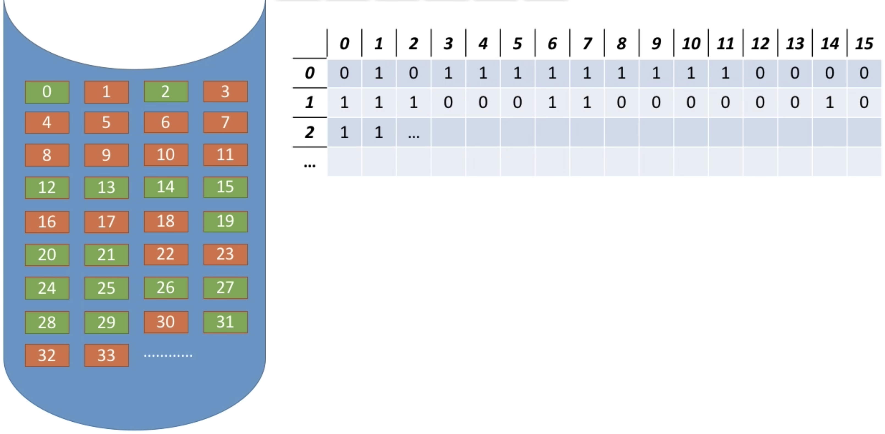

# 文件系统-下

[TOC]

## 一、文件存储空间管理

### 1. 存储空间的划分与初始化

安装windows操作系统的时候，一个必经的步骤是——为磁盘分区(C:盘、D:盘等)。

### 2. 存储空间管理——空闲表法

如上图所示，跟内存分配中的空闲表法非常相似，空闲盘块表记录了第一个空闲盘块号和空闲盘块数，适用于“连续分配方式”。

同样的，与内存管理中的动态分区分配很类似，为一个文件分配连续的存储空间，也可采用首次适应、最佳适应、最坏适应等算法来决定要为文件分配哪些区间。

回收磁盘块也类似：当回收某个存储器时，可能有4种情况：

1. 会收取的前后都没有相邻空闲区，此时要再空闲磁盘块表上新增一个表项。
2. 回收区的前后都是空闲区，此时要合并3个空闲区。
3. 回收区的前面是空闲区，要与前面的空闲区合并。
4. 回收区的后面是空闲区，要与后面的空闲区合并。

### 3. 存储空间管理——空闲链表法

空闲链表法又分为两种：

1. 空闲盘块链：以盘块为单位组成的一条空闲链。
2. 空闲盘区链：以盘区为单位组成的一条空闲链。

两种方法操作系统都保存着**链头和链尾指针**。

空闲盘块链如何**分配**：若某文件申请K个盘块，则从链头开始依次摘下K个盘块分配，并修改空闲链的链头指针。

空闲盘块链如何**回收**：回收的盘块一次挂到链尾，并修改空闲的链尾指针。

空闲磁盘块链**适用于离散分配的物理结构**，为文件**分配多个盘块时可能要重复多次操作**，因为分配多个磁盘块时要一次一次的从头开始检索，摘出一个个磁盘块。

空闲盘区链如何**分配**：若某文件申请K个盘块，则可采用首次适应、最佳适应等算法，从链头开始检索，按照算法规则找到一个大小符合要求的空闲盘区，分配给文件。若没有合适的连续空闲块，也可以将不同盘区的盘块同时分配给一个文件，注意分配后可能要修改响应的链指针、盘区大小等数据。

空闲盘区链如何**回收**：若回收区和某个空闲盘区相邻，则需要将回收区合并到空闲盘区中。若回收区没有和任何空闲区相邻，将回收区作为单独的一个空闲盘区挂到链尾。

空闲盘区链适**用于离散分配和连续分配**，为一个文件**分配多个盘块时效率更高**。因为可以一次摘出多个磁盘块，因此效率更高。

位示图：每个二进制位对应一个盘块。在本例中，“0”代表盘块空闲，“1”代表盘块已分配。位示图一般用连续的字来表示，如本例中一个字的字长是16位，字中每一位对应一个盘块。因此可以用(字号，位号)对应一个盘块号。

计算如下：

(字号, 位号) = (i ,j)的二进制位对应的盘块号**b = ni + j**；b号盘块对应的**字号i = b/n**，**位号j= b%n**。

如何**分配**：若文件需要K个块：

1. 顺序扫描位示图，找到K个相邻或不相邻的“0”。
2. 根据字号、位号算出对应的盘块号，将相应盘块分配给文件。
3. 将相应的位设置为“1”。

如何**回收**：

1. 根据回收的盘块号计算出对应的字号、位号。
2. 将相应的二进制位设为“0”。

位示图法**适用于连续分配和离散分配**。

### 4. 存储空间管理——成组链接法

空闲表法、空闲链表法不适用于大型文件系统，因为空闲表或空闲链表可能过大。unix系统中采用了成组链接法对磁盘空闲块进行管理。

**文件卷的目录区**中专门有一个磁盘块作为“**超级块**”，当系统启动时需要将**超级块读入内存**，并保证内存与外存中的超级块数据一致。

上面的图有错误，每个块中记录的是当前组的空闲盘块数而非下一组空现象磁盘块数，这个图可能不清晰，所以我们换一个：

超级块读入内存，超级块本身其实是个类似栈的数据结构，顶部N记录了本组有多少空闲块，s.free[i]记录的是空闲块的块号，其中s.free[0]记录了下一个超级块，只不过这个超级块在磁盘中而没有调入内存。到最后一个时，s.free[0] = -1表示没有下一组。

如何**分配**？

假如要分配1个空闲块：

1. 检查第一个分组的块数是否足够，1 < 100，因此是足够的。
2. 分配第一个分组中的1个空闲块，并修改相应的数据。

假如要分配3个内存块：

1. 检查第一个分组的块数是否足够，3 <= 3，因此是足够的。
2. 分配第一个分组中的3个空闲块。
3. 将下一个分组的超级块信息放入内存，成为新的内存超级块。

如何**回收**：

假设要回收1个磁盘块，且第1组没有满，则加到第一组的末尾。

假设要回收1个磁盘块，且第1组已满，则需要新增一个分组，并将内存中超级块的内容复制到新增分组的超级块种，再修改内存中超级块的信息：N修改为1，s.free[0]设置为新的分组。

## 二、文件的基本操作

### 1. 创建文件

进行create系统调用时，需要提供的几个主要参数：

1. 所需的外存大小(如1个盘块，即1KB)。
2. 文件存放的路径。
3. 文件名。

操作系统在处理create调用时，主要做了这几件事：

1. **在外存中找到文件所需的空间**(结合上面提到的空闲链表法、位示图法等找到空闲空间)。
2. 根据文件存放路径信息找到该项目对应的目录文件，在目录中**创建该文件对应的目录项**。目录项中包含了文件名、文件在外存中的存放位置等信息。

### 2. 删除文件

进行delete系统调用时，需要提供的几个主要参数：

1. 文件存放路径。
2. 文件名。

操作系统在处理delete调用时，主要做了这几件事：

1. 根据文件存放路径找到相应的目录文件，从目录中找到**文件名对应的目录项**。
2. 根据该目录项记录的文件在外存的存放位置、文件大小等信息，**回收文件占用的磁盘块**。
3. 从目录表中**删除文件对应的目录项**。

### 3. 打开文件

在很多操作系统中，在对文件进行操作之前，要求用户先使用open系统调用“打开文件”，需要提供的几个主要参数：

1. 文件存放路径。
2. 文件名。
3. 要对文件的操作类型(如r只读；rw读写等)。

操作系统在处理open调用时，主要做了这几件事：

1. 根据文件文件存放路径找到相应的目录文件，从目录中**找到文件名对应的目录项**，并检查该用户是否有指定的操作权限。
2. **将目录项复制到内存中的“打开文件表”中**，并将对应表目的编号返回给用户。**之后用户使用打开文件的编号来指明要操作的文件**。

> 打开文件表

打开文件表有两种，一种是系统的打开文件表，整个系统只有一张，表里面存储了编号、文件名、外存地址、打开计数器等内容。打开技术局记录了此时又多少个进程打开了此文件。系统的打开文件表可以方便实现某些文件管理的功能，比如文件在被使用时不能删除功能。

另一种是用户进程的打开文件表，这张表记录在用户进程中管理，表里记录了编号、文件名、读写指针(记录了该进程对文件的读/写操作进行到的位置)、访问权限、系统表索引号(即系统的打开文件表中的编号)。

### 4. 关闭文件

进程使用完文件后，要“关闭文件”，操作系统在处理close调用时，主要做了这几件事：

1. 将进程的打开文件表相应的表项删除。
2. 回收分配给该文件的内存空间。
3. 系统打开文件表的打开计数器减1，若计数器的值等于0，则删除对应的表项。

### 5. 读文件

进程使用read系统调用完成读操作。需要指明是哪个文件(在支持“打开文件”的操作系统中，只需要提供文件在打开文件表中的索引号即可)，还需要指明读入多少数据、指明读入数据要放在内存中的什么位置。

操作系统在处理read系统调用时，会从读指针指向的外存中，将用户指定大小的数据读入用户指定的内存区域中。

###  6. 写文件

进程使用write系统调研完成写操作，需要指明是哪个文件(在支持“打开文件”的操作系统中，只需要提供文件在打开文件表中的索引号即可)，还需要指明写出多少数据、指明写回外存的数据在内存中的什么位置。

操作系统在处理write系统调用时，会从用户指定的内存区域中，将指定大小的数据写回写指针指向的外存。

## 三、文件共享

操作系统为用户提供文件共享功能，可以让多个用户共享的适应同一个文件。

注意：多个用户共享同一个文件，意味着系统中只有1份文件数据，并且只要有某个用户修改了该文件的数据，其他用户也可以看到文件的数据变化。

如果是多个用户都“复制”了同一个文件，那么系统中会有多份文件数据，其中一个用户修改了自己的那份数据，对其他用户的文件数据并没有影响。

### 1. 基于索引节点的共享方式(硬链接)

通过之前的内容知道，[索引节点](文件系统-上.md#5-索引节点fcb的改进)，是一种文件目录瘦身策略：由于检索文件时只用到文件名，因此可以将除了文件名之外的其他信息放到索引节点中，这样目录项就只需要包含文件名、索引节点指针。

索引节点中设置一个链接计数变量count，用于表示链接到本索引节点上的用户目录项数。

如上图所示，若count=2，说明此时有2个用户目录项链接到该索引节点上，或者说有两个用户在共享此文件。

若某个用户决定“删除”文件，则只是要用户目录中与该文件对应的目录项删除，且索引节点的count值减1。

若count>0，说明还有别的用户要使用该文件，暂时不能把文件数据删除，否则会导致指针悬空。

若count=0时，操作系统复杂删除文件。

### 2. 基于符号链的共享方式(软链接)

## 四、文件保护

### 1. 口令保护

问文件设置一个“口令”(如：123)，用户请求访问该文件时必须提供“口令”。

口令一般存放在文件对应的FCB或索引节点中。用户访问文件前需要先输入“口令”，操作系统会将用户提供的口令与FCB中存储的口令进行对比，如果正确，则运行该用户访问文件。

优点：保存口令的空间开销不多，验证口令的时间开销也很小。

缺点：正确的“口令”存放在系统内部，不够安全。

### 2. 加密保护

使用某个“密码”对文件进行加密，在访问文件时需要提供正确的“密码”才能对文件进行正确的解密。

优点：保密性强，不需要在系统中存储“密码”。

缺点：编码/译码需要花费一定时间。

### 3. 访问控制

在每个文件的FCB(或索引节点)中增加一个**访问控制列表**，该表中记录了各个用户可以对该文件执行哪些操作。

这块就不展开讲了，懒~~~
