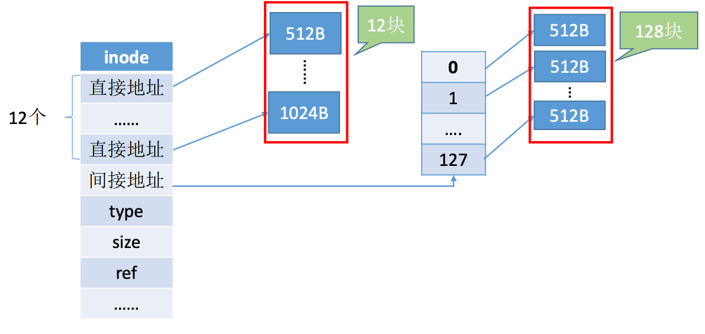

# 文件系统-中

[TOC]

本文主要探讨文件的物理结构。文件的物理结构，即文件数据应该怎样存放在外存中。

## 一、文件块、磁盘块

类似内存分页，磁盘中的存储单元也会被分为一个个“块/磁盘块/物理块”。很多操作系统中，**磁盘块的大小与内存块、页面的大小相同**。

内存与磁盘之间的数据交换(即磁盘I/O、读/写操作)都是以“块”为单位进行的，即每次读入一块，或每次写出一块。

在内存管理中，进程的逻辑地址空间被分为一个个页面，同样的，在外存管理中，为了方便对文件数据的管理，**文件的逻辑地址空间也被分为一个个的文件“块”**。于是文件的逻辑地址也可以表示为**(逻辑块号，块内地址)**的形式。

## 二、文件分配方式——连续分配

**连续分配**方式要求**每个文件在磁盘上占用一组连续块**。

用户通过逻辑地址来操作自己的文件，操作系统 如何实现逻辑地址到物理地址的映射？

(逻辑块号，块内地址)-->(物理块号，块内地址)只要转换块号就行了，块内地址保持不变。用户给出要访问的逻辑块号，操作系统找到该文件对应的目录项FCB，**物理块号=起始块号+逻辑块号**，可以直接算出逻辑块号对应的物理块号，因此**连续分配支持顺序访问和直接访问(即随机访问)**。当然，还需要检查用户提供的逻辑块号是否合法(逻辑块号>长度就不合法)。

**连续分配**方式要求**每个文件在磁盘上占用一组连续的块**。

读取某个磁盘块时，需要移动磁头。访问的两个磁盘块相隔越远，移动磁头所需的时间就越长。

结论：**连续分配的文件在顺序读/写时速度最快**！

如上图所示，若此时文件A需要拓展，需要再增加一个磁盘块(总共需要连续的4个磁盘块)，由于采用连续结构，因此文件A占用的磁盘块也必须算连续的，因此只能将文件A全部“迁移”到绿色区域。

结论：物理上采用**连续分配的文件不方便拓展**。

结论：物理上采用**连续分配，存储空间利用率低，会产生难以利用的磁盘碎片**。可以用**紧凑**来处理碎片，但是需要耗费很大的时间代价。

现在我们来总结一下连续分配的优缺点：

优点：支持顺序访问和直接访问(即随机访问)；连续分配的文件在顺序访问时速度最快。

缺点：不方便文件拓展；存储空间利用率低，会产生磁盘碎片。

## 三、文件分配方式——链接分配

**链接分配**才去离散分配的方式，可以为文件分配离散的磁盘块。分为**隐式链接**和**显式链接**两种。

### 1. 链接分配——隐式链接

那么如何实现文件的逻辑块号到物理块号的转变呢？

用户给出要访问的逻辑块号i，操作系统找到该文件对应的目录项(FCB)，从目录项中找到起始块号(即0块号)，将0号逻辑块读入内存，由此知道了1号逻辑块存放的物理块号，于是读入1号逻辑块号，再找到2号逻辑块的存放位置......以此类推。因此，读入i号逻辑块，总共需要i+1次磁盘I/O。

结论：采用**链式分配(隐式链接)**方式的文件，**只支持顺序访问，不支持随机访问**，查找效率低。另外，指向下一个盘块的指针也需要耗费少量的存储空间。

那么是否方便拓展文件呢？

若此时要拓展文件，则可以随便找一个空闲磁盘块，挂到文件的磁盘块链尾，并修改文件的FCB。

结论：采用**隐式链接的链接分配方式，很方便文件拓展**，另外，所有的空闲磁盘块都可以被利用，**不会有碎片问题，外存利用率高**。

现在我们来总结一下隐式链接的优缺点：

优点：很方便文件拓展，不会有碎片问题，外存利用率高。

缺点：只支持顺序访问，不支持随机访问，查找效率低，指向下一个盘块的指针也需要耗费少量的存储空间。

### 2. 链接分配——显式链接

把用于链接文件各物理块的指针显式地存放在一张表中，即文件分配表(FAT，File Allocation Table)。

假设某个新创建的文件“aaa”一次存放在磁盘块 2 --> 5  --> 0 --> 1；假设某个新创建的文件“bbb”一次存放在磁盘块 4 --> 23  --> 3；结果如下图所示：

**注意：一个磁盘仅设置一张FAT。开机时，将FAT读入内存，并常驻内存。**FAT的各个表项在物理上连续存储，且每一表项长度相同 ，因此“物理块号”字段可以是隐含的。

此时又出现了经典问题：那么要如何实现文件的逻辑块号到物理块号的转变呢？

用户给出要访问的逻辑块号i，操作系统找到该文件对应的目录项(FCB)，从目录项中找到起始块号，若i>0，则查询内存中的文件分配表FAT，往后找到i号逻辑块对应的物理块号。**逻辑块号转变程物理块号的过程不需要读磁盘操作**。

结论：采用**链式分配(显式链接)**方式的文件，**支持顺序访问，也支持随机访问(想访问i号逻辑块时，并不需要依次访问之前的0~i-1号逻辑块)**，由于块号转换的过程不需要访问磁盘，因此相比隐式链接来说，访问速度快很多。显然，显式链接也**不会产生外部碎片，也可以很方便地对文件进行拓展**。

### 3. 链接分配总结

**链接分配**采取离散分配的方式，可以为文件分配离散的磁盘块。分为**隐式链接**和**显示链接**两种。

**隐式链接**——除文件的最后一个盘块之外，每个盘块中都存有指向下一个盘块的指针。文件目录包括文件第一块的指针和最后一块的指针。

优点：很方便文件拓展，不会有碎片问题，外存利用率高。

缺点：只支持顺序访问，不支持随机访问，查找效率低，指向下一个盘块的指针也需要耗费少量的存储空间。

**显式链接**——把用于链接文件各物理块的指针显示的存放在一张表中，即**文件分配表(FAT)**。一个磁盘只会建立一张文件分配表。开机时文件分配表放入内存，并**常驻内存**。

优点：很方便文件拓展，不会有内存碎片问题，外存利用率高，并且支持随机访问。相比隐式链接来说，地址转换时不需要访问磁盘，因此文件的访问效率更高。

缺点：文件分配表需要占用一定的内存。

## 四、文件分配方式——索引分配

**索引分配**允许文件离散地分配在各个磁盘块中，系统会**为每个文件建立一张索引表**，索引表中**记录了文件的各个逻辑块对应的物理块**(索引表的功能类似于内存管理中的页表——建立逻辑页面到物理页面之间的映射关系)。索引表存放的磁盘块称为**索引块**。文件数据存放的磁盘块称为**数据块**。

如上图所示，假设某个新创建的文件“aaa”的数据依次存放在磁盘块2-->5-->13-->9，7号磁盘块作为“aaa”的索引块，索引块中保存了索引表的内容。

注：在显式链接的链式分配方式中，文件分配表FAT是一个磁盘对应一张，责任索引分配方式中，索引表是一个文件对应一张。

可以用固定的长度表示物理块号，因此索引表中的“逻辑块号”是可以隐含的。

经典问题来了：那么如何实现文件的逻辑块号到物理块号的转换呢？

用户给出要访问的逻辑块号i，操作系统找到文件对应的目录项(FCB)，从目录项中可知索引表存放的位置，将索引表从外存读入内存，并查找索引表即可知i号逻辑块在外存中的位置。

可见，**索引分配方式可以支持随机访问。文件拓展也很容易实现**(只需要给文件分配一个空闲块，并增加一个索引表项几块)，但是**索引表需要占用一定的存储空间**。

这时候又有了一个新的问题：若每个磁盘块1KB，一个索引表项4B，则一个磁盘块只能存放256个索引项，如果一个文件大小超过了256块，那么一个磁盘块是装不下文件的整张索引表的，要如何解决这个问题呢？

一般而言有3种解决方案：链接方案、多层索引、混合索引。我们一个个来说。

### 1. 链接方案

如果索引块太大，一个索引块装不下，那么可以将多个索引块链接起来存放。

若一个文件大小为256 × 256 KB = 65536KB = 64MB，该文件共有256 × 256个块，也就是256 × 256个索引项，也就需要256个索引块来存储，这些索引块用链接方案连起来。

若想要访问文件最后一个逻辑块，就必须找到最后一个索引块(第256个索引块)，而各个索引块之间是用指针链接起来的，因此必须先顺序地读入255个索引块。这显然是很低效的。

### 2. 多层索引

上面提到的链接方案，虽然能解决文件索引过大的问题，但查找效率低效，因此提出了多层索引。

通过建立多层索引(原理类似多级页表)，使第一层索引块只想第二层索引块，还可根据文件大小的要求再建立第三层、第四层索引块。

若某文件采用两层索引，则该文件的最大长度可以到256 × 256 × 1KB = 65536KB = 64MB。可根据逻辑块号算出应该查找索引表中的哪个表象。

如：要访问1026号逻辑块，则1026/256=4，10246%256=2，因此可以先将以及索引表调入内存，查询4号表项，将其对应的二级索引表调入内存，再查询耳机索引表的2号表项即可知道1026号逻辑块存放的磁盘块号了。访问目标数据库，需要3次磁盘I/O。

**采用K层索引结构，且顶级索引表未调入内存，则访问一个数据库只需要K+1次读磁盘操作**。

### 3. 混合索引

万物皆可缝合！多种索引分配方式的结合。例如：一个文件的顶级索引表中，既包含**直接地址索引**(直接指向数据块)，又包含**一级间接索引**(指向单层索引表)、还包含**两级间接索引**(指向两层索引表)。

累了，毁灭吧。

等等，还有个总结。。。

### 4. 索引分配总结

**索引分配**允许文件离散地分配在各个磁盘中，系统**会为每个文件建立一张索引表**，索引表中**记录了文件的各个逻辑块对应的物理块**(索引表的功能类似于内存管理中的页表——建立逻辑页面到物理页面之间的映射关系)。索引表存放的磁盘块称为**索引块**，文件数据存放的磁盘块称为**数据块**。

若文件太大，索引表项太多，可以采取以下几种方案解决：

1. **链接方案**：如果索引表太大，一个索引块装不下，那么可以将多个索引块链接起来存放。**缺点**：若文件很大，索引表很长，就需要将很多个索引块链起来，想要找到i号索引块，必须先依次读入0~i-1号索引块，这就导致磁盘I/O次数过多，查找效率低下。
2. **多层索引**：建立多层索引表(**原理类似于多级页表**)。使第一层索引块指向第二层的索引块，还可根据文件大小的要求再建立第三层、第四层索引块。采用K层索引结构，且**顶级索引表未调入内存**，则访问一个数据块只需要K+1次读取磁盘操作。缺点：即使是小文件，访问一个数控依然要K+1次读磁盘。
3. **混合索引**：多种索引方式的结合。例如：一个文件的顶级索引表中，既包含**直接地址索引**(直接指向数据块)，又包含**一级间接索引**(指向单层索引表)，还包含两级间接索引(指向两层索引表)。优点：对于小文件来说，访问一个数控所需的读磁盘数更少。

现在可以毁灭了。

再等等，还有一个大的回顾总结。。。

## 五、总结

好了，毁灭吧！
