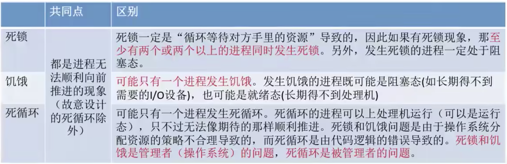

# 死锁

[TOC]

## 一、死锁的概念

### 1. 什么是死锁

其实前面的[哲学家问题](进程的同步与互斥经典问题.md#四哲学家进餐问题)就已经提到过死锁了，那么死锁究竟是啥呢？

有一首歌的歌词：我爱你，你爱他，他爱她，她爱我...这世界每个人都爱别人...

我们从资源占有的角度来分析，这段关系为啥看起来这么究竟：

1. 每个人都占有一个资源，同时又在等待另一个人手里的资源，发生“死锁”。
2. 在并发环境下，各进程因竞争资源而造成的一种**互相等待对方手里的资源，导致各进程都阻塞，都无法向前推进的现象**，就是“死锁”。发生死锁后无外力干涉，这些进程都将无法向前推进。

### 2. 死锁、饥饿、死循环的区别

死锁：各进程相互等待对方手里的资源，导致各进程都阻塞，无法向前推进的现象。

饥饿：由于长期得不到想要的资源，某进程无法向前推进的现象。比如：在短进程优先(SPF)算法中，若有源源不断的短进程到来，则长进程将一直得不到处理机，从而发生长进程“饥饿”。

死循环：某进程执行过程中一直跳不出来某个循环的现象。有时是因为程序逻辑BUG导致的，有时是程序员故意设计的。

### 3. 死锁产生的必要条件

产生死锁必须要同时满足以下四个条件，只要其中任一条件不成立，死锁就不会发生。

1. **互斥条件**：只有对必须互斥使用的资源争抢才会导致死锁。像内存、扬声器这样可以同时让多个进程使用的资源是不会导致死锁的(因进程不用阻塞等待这种资源)。
2. **不剥夺条件**：进程所获得的资源在未使用完之前，不能由其他进程强行夺走，只能主动释放。
3. **请求和保持条件**：进程已经保持了至少一个资源，但又提出了新的资源请求，而该资源又被其他进程占用，此时请求进程被阻塞，但又对自己已有的资源保持不放。
4. **循环等待条件**：存在一种进程资源的循环等待链，链中的每一个进程已获得的资源同时被下一个进程所请求。

**注意！发生死锁一定有循环等待，但是发生循环等待时未必死锁**(循环等待是死锁的必要不充分条件)。如果同类资源数大于1，则即使有循环等待，也未必发生死锁；但如果系统中每类资源都只有一个，那循环等待就是死锁的充分必要条件。

### 4. 什么时候会发生死锁

1. 对系统资源的竞争。各进程对不可剥夺的资源的竞争可能引起死锁，对可剥夺的资源(如CPU)的竞争是不会引起死锁的。
2. 进程推进顺序非法。请求和释放资源的顺序不当，也同样会导致死锁。例如并发执行的进程P1、P2分别申请占用了资源R1、R2，之后进程P1又紧接着申请资源R2，而进程P2又申请资源R1，二者会因为申请的资源被对方占有而阻塞，从而发生死锁。
3. 信号量使用不当也会造成死锁。如生产者消费者问题中，如果实现互斥的P操作在实现同步的P操作之前，就有可能导致死锁。(可以把互斥信号量、同步信号量也看做是一种抽象的系统资源)

总之，对不可剥夺资源的不合理分配，可能导致死锁。

### 5. 死锁的处理策略

1. 预防死锁。破坏死锁产生的四个必要条件中的一个或几个。
2. 避免死锁。用某种方法防止系统进入不安全状态，从而避免死锁。
3. 死锁的检测和解除。允许死锁的发生，不过操作系统会负责检测出死锁的发生，然后采取某种措施解除死锁。

接下来我们详细讲讲死锁的处理策略。

## 二、死锁的处理策略——预防死锁

前面提到，死锁的产生必同时满足四个必要条件，只要其中一个条件不满足死锁就不会发生，因此我们可以考虑破坏某个或多个条件来达到避免死锁的目的。

### 1. 破坏互斥条件

**互斥条件**：只有对必须互斥使用的资源的争抢才会导致死锁。

如果把只能互斥使用的资源改造为允许共享使用，则系统不会进入死锁状态。比如SPOOLing技术，它可以把独占设备在逻辑上改造成共享设备。

缺点：并不是所有的资源都可以改造成可共享使用的资源。并且为了系统安全，很多地方还必须保持这种互斥性，因此**很多时候都无法破坏互斥条件**。

### 2. 破坏不剥夺条件

**不剥夺条件**：进程所获得的资源在未被使用完之前，不能由其他进程强行夺走，只能主动释放。

破坏不剥夺条件：

方案一：当某个进程请求新的资源得不到满足时，它必须立即释放保持的所有资源，待以后需要时再重新申请。也就是说，即使某些资源尚未使用完，也需要主动释放，从而破坏了不可剥夺条件。

方案二：当某个 进程需要的资源被其他进程占用时，可以由操作系统协助，将想要的资源强行剥夺。这种方式一般需要考虑各进程的优先级(比如：剥夺调度方式，就是将处理机资源强行剥夺给优先级更高的进程使用)。

该策略的缺点：

1. 实现起来比较复杂。
2. 释放已获取的资源可能造成前一阶段工作的失效。因此这种方法一般只适用于易保存和恢复的资源，比如CPU。
3. 反复地申请和是否资源会增加系统开销，降低系统吞吐量。
4. 若采用方案一，意味着只要暂时得不到某个资源，之前获得的那些资源就都需要放弃，以后再重新申请，如果一直发生这样的情况，就会导致进程饥饿。

### 3. 破坏请求和保持条件

**请求和保持条件**：进程已经保持了至少一个资源，但又提出新的请求，但又提出了新的资源请求，而该资源又被其他进程占有，此时请求进程被阻塞，但又对自己已有的资源保持不放。

可以采用**静态分配方法**，即进程在运行前一次申请完它所需要的全部资源，在它的资源未满足前，不让它投入运行，一旦投入运行后，这些资源就一直归它所有，该进程就不会再请求别的任何资源了。

缺点：有些资源可能只需要用很短的时间，因此如果进程整个运行期间都一直保持着所有资源，就会造成资源的浪费，资源利用率极低。另外，该策略也可能导致某些进程饥饿。

### 4. 破坏循环等待条件

**循环等待条件**：存在一种进程资源的循环等待链，链中的每一个进程已获得的资源同时被下一个进程所请求。

可采用**顺序资源分配法**，即首先给系统中的资源编号，规定每个进程必须按编号递增的顺序请求资源，同类资源(即编号相同的资源)一次申请完。

原理分析：一个进程只有占有小编号的资源时，才有资格申请更大的编号资源，按此规则，已持有大编号资源的进程不可能逆向地回来申请小编号资源，从而就不会产生循环等待的现象。

缺点：

1. 不方便增加新的设备，因为可能需要重新分配所有的编号。
2. 进程实际使用资源的顺序可能和编号递增顺序不一致，会导致资源浪费。
3. 必须按规定次序申请资源，用户编程麻烦。

## 三、死锁处理策略——避免死锁

### 1. 什么是安全序列

现在你手里还有40亿，此时B还想借30亿，你敢借吗？假如答应了B的请求：

手里还剩10亿，如果BAT都提出再借20的请求，那么任何一个企业的需求都得不到满足，因此这个请求是**不安全**的，不能答应。

那如果A还想借20亿呢？同样我们来分析一下：

借给A20亿后，手里还有20亿，可以先把20亿全部借给T，等T把钱全部都还回来了，手里就有30+20=50亿，再把这些钱全部借给B，B还钱后总共有50+20=70亿，最后再借给A。因此可以认为这个请求是安全的，因为安装T-->B-->A，A-->T-->B的顺序给他们借钱是可行的。

好了，梦做完了，那么究竟什么是安全序列呢？

所谓**安全序列**，就是指如果系统安装这种序列分配资源，则每个进程都能顺利完成。只要能找出一个这样的安全序列，系统就是**安全状态**。当然，**安全序列可能有多个**。如果分配了资源之后，系统中找不到任何一个安全序列，系统就进入了**不安全状态**。这就意味着之后**可能**所有进程都无法顺利的执行下去。当然，如果有进程提前归还了一些资源，那**系统也有可能重新回到安全状态**，不过我们在分配资源之前总要考虑最坏的情况。

如果系统处于安全状态，就一定不会发生死锁，如果系统进入不安全状态，就可能发生死锁，即**处于不安全状态不一定发生死锁，但发生了死锁一定是在不安全状态**。因此可**在资源分配之前预先判断这次分配是否会导致系统进入不安全状态**，以此决定是否答应资源分配请求，这也是**银行家算法**的核心思想。

### 2. 银行家算法

核心思想：在进程提出资源申请时，先预判此次分配是否会导致系统进入不安全状态。如果会进入不安全状态，就暂时不答应这次请求，让该进程先阻塞等待。

> BAT的栗子中，只有一种类型的资源——钱，但是在计算机系统中会有多种资源，应该怎么把算法拓展为多种资源的情况呢？
>
> 可以把单维的数字拓展为多维的向量。比如：系统中有5个进程P0~P4，3种资源R0~R3，初始数量为(10,5,7)，则某一时刻情况可以表示如下：
>
> 

我们来看个栗子：

系统资源总数(10,5,7)，剩余可用资源(3,3,2)，此时系统是否处于安全状态？

是否处于安全状态，主要看是否能找出一个安全序列，可以依次检查剩余可用资源是否能满足各进程需求：

检查P0：(7,4,3) > (3,3,2)，不能满足需求，继续检查下一个；

检查P1：(1,2,2) < (3,3,2)，可以满足需求，说明如果优先把资源分配给P1，那P1是一定可以顺利执行结束的，等P1结束了就会归还资源，于是资源数就可以增加到(5,3,2)，因此我们可以先将P1加入到安全序列，当前安全序列为: {P1}；

再次从头依次检查剩余资源(5,3,2)能否满足其他进程需求；

检查P0：(7,4,3) > (5,3,2)，不能满足需求，继续检查下一个；

检查P2，依旧不能满足需求，继续检查下一个；

检查P3，(0,1,1) < (5,3,2)，可以满足需求，因此可以将资源再优先分配给P3，等P3执行完后可以收回资源，资源数可增加为(5,4,3)，可将P3添加到安全序列，此时安全序列为：{P1，P3}；

...剩下的以此类推，最终可以得到一个安全序列{P1，P3，P0，P2，P4}，说明此时系统处于**安全状态**，**暂不可能发生死锁**，若**不能找到任何一个安全队列**，则说明此时系统处于**不安全状态**，**有可能发生死锁**，该算法称为**安全性算法**。

经过上面，应该已经大致理解了安全性算法，我们来看看如何用代码进行实现：

假设系统中有n个进程，m种资源，每个进程在运行前先声明对各种资源的最大需求数，则可以用一个n*m的矩阵(可用二维数组实现)表示所有进程对各种资源的最大需求数，不妨称为最大需求矩阵Max，Max[i, j]=K 表示进程Pi最多需要K个资源R。

同理，系统可以用一个n*m的分配矩阵Allocation表示对所有进程的资源分配情况。

Max-Allocation=Need矩阵，表示各个进程最多还需要多少各类资源。

另外，还要用一个长度为m的一维数组Available表示当前系统中还有多少可用资源。

某进程Pi向系统申请资源，可以用一个长度为m的一维数组Request表示申请的各种资源量。

可用银行家算法预判本次分配是否会导致系统进入不安全状态：

1. 如果Request[j] ≤ Need[i, j] (0≤j≤m)便转向2；否则任务出错，因为它所需要的资源数量已经超过它所宣布的最大值。
2. 如果Request[j] ≤ Available[i, j] (0≤j≤m)便转向3；否则表示尚无足够资源，Pi必须等待。
3. 系统试探着把资源分配给进程Pi，并修改相应的数据(并非真的分配，修改数值只是为了做预判)：
   - Available = Available - Request
   - Allocation[i, j] = Allocation[i, j] + Request[j]
   - Need[i, j] = Need[i, j] - Request[j]
4. 操作系统执行安全性算法，检查此次资源分配后，系统是否处于安全状态，若安全才正式分配，否则恢复相应数据，让进程阻塞等待。

## 四、死锁的处理策略——检测和解除

如果系统中既不采取预防死锁的措施，也不采取避免死锁的措施，系统就很可能发生死锁。在这种情况下，系统应当提供两个算法：

1. 死锁检测算法：用于检测系统状态，以确定系统中是否发生死锁。
2. 死锁解除算法：当认定系统中已经发生了死锁，理由该算法可将系统从死锁状态中解脱出来。

### 1. 死锁的检测

为了能对系统是否已经发生了死锁进行检查，必须：

1. 用**某种数据结构**来保存资源的请求和分配情况。
2. 提供一种**算法**，理由上述信息来检测系统是否已经进入死锁状态。

如果系统中剩余的可用资源数足够满足进程的需求，那么这个进程暂时是不会阻塞的，可以顺利地执行下去。如果这个进程执行结束了把资源归还系统，就可能使某些正在等待资源的进程被激活，并顺利地执行下去。相应的，这些被激活的进程执行完了之后又会归还一下资源，这样又可能会激活另外一些阻塞的进程...

如果按上述过程分析，最终**能消除所有边**，就称这个图是**可完全简化的**。此时一定**没有发生死锁**(相当于能找到一个安全序列)。如果最终**不能消除所有边**，那么此时就是**发生了死锁**，**最终还连着边的那些进程就是处于死锁状态的进程**。

死锁检测算法：

1. 在资源分配图中，找出既不阻塞又不是孤独的进程Pi(即找出一条有向边与它相连，且该有向边对应资源的申请数量小于等于系统中已有空闲资源数量，如上图中，R1没有空闲资源，R2有一个空闲资源；若所有的连接该进程的边均满足上述条件，则这个进程能继续运行直至完成，然后是否它所占用的所有资源)，消去它所有的请求边和分配边，使之成为孤立的结点。在上图中P1是满足这一条街的进程结点，于是将P1的所有边消去。
2. 进程Pi所释放的资源，可以唤醒某些因等待这些资源而阻塞的进程，原来的阻塞进程可能变为非阻塞进程；在上图中，P2就满足这样的条件；根据1中的方法进行一系列简化后，若能消去图中的所有边，则称该图是**可完全简化的。

**死锁定理**：如果某时刻系统的资源分配图是**不可完全简化**的，那么此时系统**死锁**。

既然检测到了死锁，那就要想办法解除。

### 2. 死锁的解除

一旦检测出死锁的发生，就应该立即解除死锁。

要注意：并不是系统中所有的进程都是死锁状态，用死锁检测算法**化简资源分配图后，还连着边的那些进程就是死锁进程**。

解除死锁的主要方法有：

1. **资源剥夺法**：挂起(暂时放到外存上)某些死锁进程，并抢占它的资源，将这些资源分配给其他的死锁进程。但是应防止被挂起的进程长时间得不到资源而饥饿。
2. **撤销进程法**(或称**终止进程法**)：强制撤销部分、甚至全部死锁进程，并剥夺这些进程的资源。这种方式的优点是实现简单，但所付出的代价可能会很大，因为有些进程可能已经运行了很长时间，已经接近结束，一旦被终止可谓功亏一篑，以后还得重来。
3. **进程回退法**：让一个或多个死锁进程回退到足以避免死锁的地步。这就要求系统要记录进程的历史信息，设置还原点。

有了方法，就要决定“对谁动手”了：

1. 进程优先级；
2. 已执行多长时间；
3. 还要多久能完成；
4. 进程已经使用了多少资源；
5. 进程是交互式的还是批处理式的。

