# 虚拟内存管理

[TOC]

## 一、虚拟内存的基本概念

### 1. 传统存储管理方式的特征、缺点

所谓的传统存储管理方式，就是我们之前讲的那些连续分配、非连续分配方式管理，采用传统存储管理会有很多暂时用不到的数据长期占用内存，导致内存利用率不高。

我们先来看一下传统存储管理的特点以及问题：

**一次性**：**作业必须一次性全部装入内存后才能开始运行**。这回造成两个问题：

1. 作业很大时，不能全部装入内存，导致**大作业无法运行**；
1. 当大量作业要求运行时，由于内存无法容纳所有作业，因此只有少量作业能运行，导致**多道程序并发度下降**。

**驻留性**：一旦作业被装入内存，就**会一直驻留在内存中**，直到作业运行结束。事实上，在一个时间段内，只需要访问作业的一小部分数据即可正常运行，这导致了内存中会驻留大量的、暂时用不到的数据，浪费了宝贵的内存资源。

### 2. 局部性原理

上面提到的两个问题，都可以用虚拟存储技术解决问题，而虚拟技术的提出是基于著名的局部性原理的，我们再来回顾一下局部性原理。

**时间局部性**：如果执行了程序中的某条指令，那么不久后这条指令很有可能再次执行；如果某个数据被访问过，不久之后该数据很可能再次被访问(因为程序中存在大量循环)。

**空间局部性**：一旦程序访问了某个存储单元，在不久之后，其附近的存储单元也很有可能被访问(因为很多数据在内存中都是连续存放的，并且程序的指令也是顺序地在内存中存放的)。

那么我们该如何应用局部性原理呢？为此人们提出了高速缓存技术。

**高速缓存技术**的思想：将近期会频繁访问到的数据放到更高速的存储器中，暂时用不到的数据放在更低速的存储器中。

为什么会这样设计呢？主要是因为成本问题，高速存储器价格昂贵balabala...(这里就不多说了，相信你们都懂)。之前学过的快表机构就是将近期常访问的页表项副本放到更高速的联想寄存器中。

### 3. 虚拟内存的定义和特征

基于局部性原理，在程序装入时，可以将程序中**很快会用到的部分装入内存，暂时不用的部分留在外存**，就可以让程序开始执行。

在程序执行过程中，当所访问的**信息不在内存时**，由**操作系统复杂将所需信息从外存调入内存**，然后继续执行程序。

若内存空间不够，由**操作系统负责将内存中暂时用不到的信息换出到外存**。

在操作系统的管理下，在用户看来似乎有一个比实际内存大得多的内存，这就是**虚拟内存**。

> 这是操作系统虚拟性的一个体现，实际的物理内存没有变，只是在逻辑上进行了扩充。

易混淆知识点：

1. 虚拟内存的**最大容量**是由计算机的地址结构(CPU寻址范围)确定的。
2. 虚拟内存的**实际容量** = min(内存和外存容量之和，CPU寻址范围)。

虚拟内存有以下三个主要特征：

1. **多次性**：无需在作业运行时一次性全部装入内存，而是运行呗分成多次调入内存。
2. **兑换性**：在作业运行时无需一直常驻内存，而是运行在作业运行过程中，将作业换入、换出。
3. **虚拟性**：从逻辑上扩充了内存的容量，使用户看到的内存容量，远大于实际容量。

### 4. 如何实现虚拟内存技术

虚拟内存技术，允许一个作业分多次调入内存。如果采用连续分配方式，会不方便实现，因此虚拟内存的实现需要建立在**离散分配**的内存管理方式基础上。

传统的非连续分配存储管理有3种：基本分页存储管理、基本分段存储管理、基本段页式存储管理；虚拟内存的实现也有3种：请求分页存储管理、请求分段存储管理、请求段页式存储管理。

二者主要的区别：

1. 在程序执行过程中，当所**访问的信息不存在内存时，由操作系统负责将所需信息从外存调入内存**，然后继续执行程序；这就要求操作系统提供请求调页(或请求调段)功能。
2. 若内存空间不够，由操作系统负责将内存中暂时用不到的信息换出到外存；这就要求操作系统提供页面置换(或段置换)功能。

## 二、请求分页管理方式

上面分析了要实现虚拟内存技术操作系统需要提供哪些功能，下面我们来看看如何提高这些功能。

### 1. 页表机制

与基本分页管理相比，请求分页管理中，为了实现“请求调页”，操作系统需要知道每个页面是否已经调入内存；如果还没调入，那么也需要知道该页面在外存中存放的位置。

当内存空间不够时，要实现“页面置换”，操作系统需要通过某些指标来决定到底换出哪个页面。有的页面没有被修改过，就不用浪费时间写回到外存；由的页面修改过，就需要将外存中的旧数据覆盖，因此，操作系统也需要记录各个页面是否被修改的信息。

根据上面的需求，我们可以设计出页表结构：

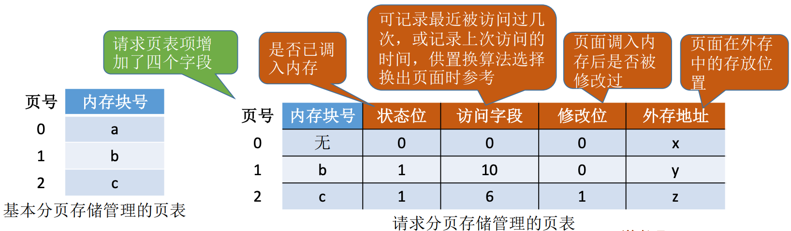

### 2. 缺页中断机构

在请求分页系统中，每当要访问的**页面不存在内存**时，便产生一个**缺页中**断，然后由操作系统的缺页**中断处理程序处理中断**。

此时**缺页的进程阻塞**，放入阻塞队列，调页**完成后再将其唤醒**，放回就绪队列。

如果内存中**有空闲块**，则为进程**分配一个空闲块**，将所缺页面装入该块，并修改页表中响应的页表项。

如果内存中**没有空闲块**，则**由页面置换算法选择一个页面淘汰**，若该页面在内存期间**被修改过**，则要将其**写回外存**。未修改过的页面不用写回外存。

**缺页中断**是因为当前执行的指令想要访问目标页面未调入内存而产生的，因此属于**内中断**。

**一条指令**在执行期间，**可能产生多次缺页中断**，如copy A to B，即将逻辑地址A中的数据复制到逻辑地址B，而A、B属于不同的页面，则有可能产生两次中断。

> 中断的分类
>
> 这里主要是给没了解过计组的同学准备的，简单讲讲中断的分类。
>
> 1. 内中断(内部异常)：信号来源是CPU**内部**。内中断又分为3种：
>    - 缺陷、陷入(trap)：有意而为之的异常，如系统调用。
>    - 故障(fault)：由错误条件引起的，可能被故障处理程序修复，如缺页中断。
>    - 终止(abort)：不可恢复的致命错误造成的结果，终止处理程序不再将控制返回给引发终止的应用程序，如整数除0。
> 2. 外中断：信号的来源是CPU**外部**。外中断又分为2种：
>    - I/O中断请求。
>    - 人工干预。

### 3. 地址变换机构

地址变换过程中，我们需要重点关注以下3个步骤：

1. 请求调页：查到页表项时进行判断，判断页面是否在内存中。
2. 页面置换：需要调入页面，但没有空闲内存块时进行。
3. 需要修改请求页表中新增的页表项。

地址变换过程如下：

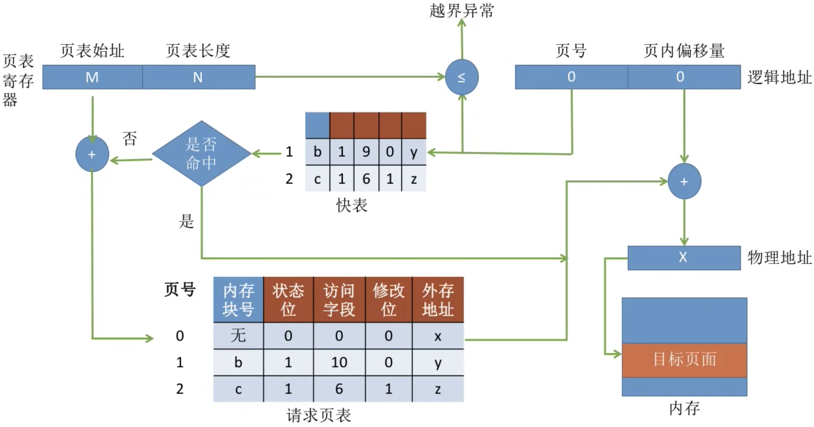

整个过程就不逐步分析了，跟基本分页管理流程差不多。

## 三、页面置换算法

上面有讲请求分页和基本分页的区别，其中一个是：若内存不够，由出操作系统复杂将内存中暂时用不到的信息换出到外存。具体要置换哪个页面，由页面置换算法决定。页面的换入、换出需要磁盘I/O，会有较大的开销，因此好的页面置换算法应该**追求更少的缺页率**。

### 1. 最佳置换算法(OPT)

最佳置换算法(OPT，optimal)：每次选择**淘汰的页面**将是**以后永不使用**，或者**在最长时间内不再被访问的页面**，这样可以保证最低的缺页率。

下面我们看个栗子：

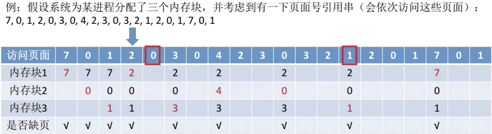

1. 访问到页面7，发现页面7没有分配内存块，且有空闲内存块，因此将内存块1分配给页面7。
2. 访问到页面0，发现页面0没有分配内存块，且有空闲内存块，因此将内存块2分配给页面7。
3. 访问到页面1，发现页面0没有分配内存块，且有空闲内存块，因此将内存块3分配给页面1。
4. 访问到页面2，发现页面2没有分配内存块，且没有空闲内存块，需要通过置换算法置换出一个空闲内存块，选择从页面0、1、7中淘汰一页。按最佳置换的规则，往后寻找，**最后一个出现的页号就是要淘汰的页面**。
5. 往后寻找得页面7是最久不访问的，因此淘汰页面7占用的内存块1，将内存块1的内容换出。
6. 为页面2分配内存块1。

顺着这个逻辑往下推，会得到整个过程**缺页中断**发生了9次，**页面置换**发生了6次。

> 注意：缺页时未必发生页面置换，若还有可用的空闲内存块，就不用进行页面置换。

最佳置换算法可以保证最低的缺页率，但实际上，只有在进程执行的过程中才能知道接下来会访问到的是哪个页面。操作系统无法提前预判页面访问序列。因此**最佳置换算法是无法实现的**。

### 2. 先进先出置换算法(FIFO)

先进先出置换算法(FIFO)：每次选择淘汰的页面是最早进入内存的页面。

实现方法：把调入内存的页面根据调入的先后顺序排成一个队列，需要换出页面时选择队头页即可。队列的长度取决于系统为进程分配了多少内存块。

下面我看个栗子：

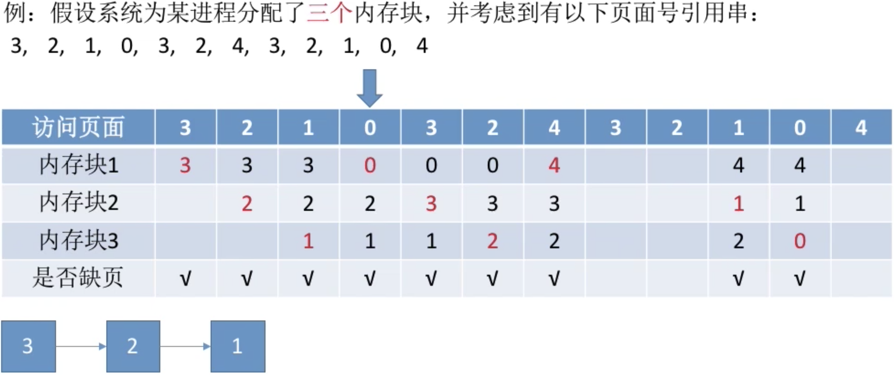

1. 访问到页面3，发现页面3没有分配内存块，且有空闲内存块，因此将内存块1分配给页面3，并将页面3放入到队尾。
1. 访问到页面2，发现页面2没有分配内存块，且有空闲内存块，因此将内存块2分配给页面3，并将页面3放入到队尾。
1. 访问到页面1，发现页面1没有分配内存块，且有空闲内存块，因此将内存块3分配给页面1，并将页面1放入到队尾。
1. 访问到页面0，发现页面0没有分配内存块，且没有空闲内存块，需要通过置换算法置换出一个空闲内存块，选择从页面1、2、3中淘汰一页。按先进先出置换的规则，将队头的页面3换出，空闲出内存块1。将内存块1分配给页面0。

顺着这个逻辑往下推，可得：分配3个内存块时，缺页9次。

如果我们把条件改一下，为进程分配4个内存块，情况如下：

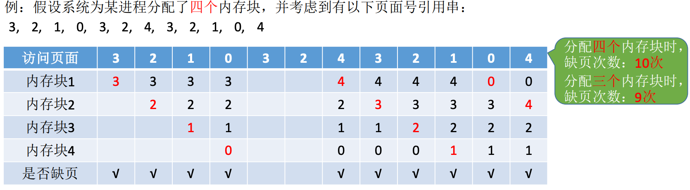

从结果可以看到，为进程分配更多内存块时，缺页次数不减反增了。这里就要引入一个新的概念：Belady异常。

**Belady异常**：当为进程分配的物理内存块数增大时，缺页次数不减反增的异常现象，出现的原因是较早调入的页往往是经常被访问的页。

**只有FIFO算法会产生Belady异常**。另外，FIFO算法虽然**实现简单**，但是该算法与进程实际运行时的规律不适应，因为先进入的页面也有可能最经常被访问，因此算法性能差。

### 3. 最近最近未使用置换算法(LRU)

最近最近未使用置换算法(LRU，least recently used)：每次**淘汰的页面是最近最久未使用的页面**。

实现方法：赋予每个页面对应的页表项中，用**访问字段记录该页面自上次被访问以来所经历的时间t**。当需要淘汰一个页面时，选择现有页面中t值最大的，即最近最久未使用的页面。

我们还是来看一个栗子：

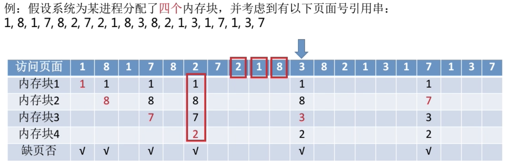

1. ...前面的内容就不分析了，直接跳到访问页面3。
2. 从访问页面3开始向前查找，查找页面1、8、7、2哪个是最后一个出现的页面，查找得页面7，因此将内存块3换出，分配给页面3。

该算法的视线需要专门的硬件支持，虽然算法**性能好**，但是**实现困难，开销大**。

### 4. 时钟置换算法(CLOCK)

时钟置换算法(CLOCK)：是一种性能和该校较均衡的算法，又称**最近未使用算法**(**NRU**，Not Recently Used)。

**简单的CLOCK算法**实现方法：为每个页面设置一个**访问位**，再将内存中的页面都通过链接指针链接**成一个循环队列**。当某页呗访问时，其访问位置为1。当需要淘汰一个页面时，只需检查页的访问位，如果是0，就选择换出该页，如果是1，则将它置为0，暂不换出，继续检查下一个页面，若第一轮扫描中所有的页面都是1，则讲这些页面的访问位依次置为0后，再进行第二轮扫描(第二轮扫描中一定会有访问位为0的页面，因此简单的CLOCK算法选择一个淘汰页面最多会经过两轮扫描)。

我们还是来看个栗子，算了，因为图比较难做，就自己理解吧，加油：

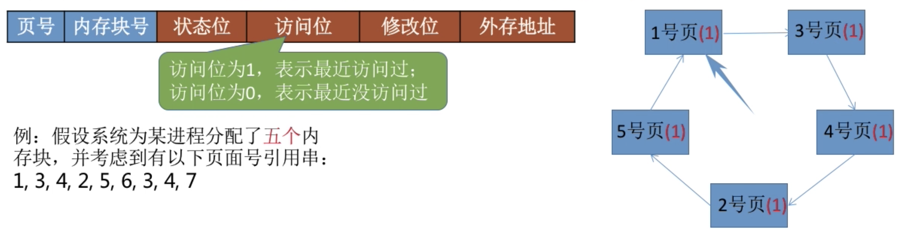

### 5. 改进型的时钟置换算法

**简单的时钟置换算法**仅考虑到一个页面最近是否被访问过。事实上，如果被淘汰的页面没有被修改过，就不需要执行I/O操作写回外存，**只有被淘汰的页面被修改过时，才需要写回外存**。

因此，除了考虑一个页面最近有没有被访问过之外，操作系统还应考虑页面有没有被修改过。**在其他条件都相同时，应优先淘汰没有修改过的页面**，避免I/O操作。这就是改进型的时钟置换算法的思想。

可以设置一个修改位，修改位=0表示页面没有被修改过；修改为=1表示修改过。为了方便讨论，用**(访问位, 修改位)**的形式表示各页面状态。如(1, 1)表示一个页面近期被访问过且被修改过。

**算法规则**：

1. 将所有可能被置换的页面排成一个循环队列。
2. 第一轮：从当前位置开始扫描到第一个(0, 0)的帧用于替换。本轮扫描不修改任何标志位。
3. 第二轮：若第一轮扫描失败，则重新扫描，查找第一个(0, 1)的帧用于替换。本轮所有扫描过的帧访问位设为0。
4. 第三轮：若第二轮扫描失败，则重新扫描，查找第一个(0, 0)的帧用于替换。本轮扫描不修改任何标志位。
5. 第四轮：若第三轮扫描失败，则重新扫描，查找第一个(0, 1)的帧用于替换。

由于第二轮已将所有帧的访问位设为0，因此经过第三轮、第四轮扫描一定会有一个帧被选中，因**此改进型CLOCK置换算法**选择一个淘汰页面**最多会进行四轮扫描**。

栗子还是自己脑补吧，hhhh。

我们可以换一个角度理解这个算法：

第一优先级：最近没访问，且没修改的页面。

第二优先级：最近没访问，但修改过的页面。

第三优先级：最近访问过，但没有修改的页面。

第四优先级：最近访问过，且修改过的页面。

### 6. 小结

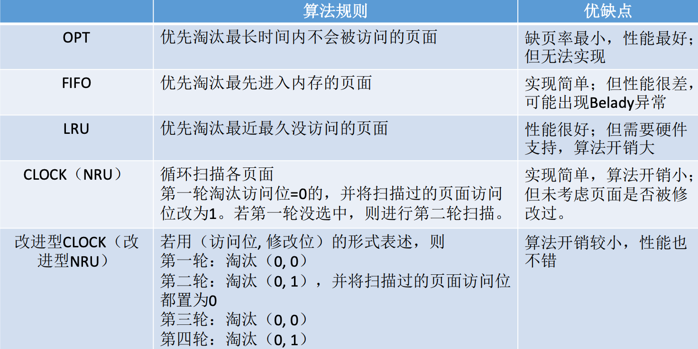

## 四、页面分配策略

### 1. 页面分配、置换策略

**驻留集**：指请求分页存储管理中给进程分配的物理块的集合。在采用了虚拟存储技术的系统中，驻留集大小一般小于进程的总大小。

若驻留集太小，会导致缺页频繁，小系统要花费大量的时间来处理缺页，实际用于进程推进的时间很少；驻留集太大，又会导致多道程序并发读下降，资源利用率降低。所以应该选择一个合适的驻留集大小。

根据驻留集大小是否可变产生了2种分配策略：

- **固定分配**：操作系统为每个进程分配一组固定数目的物理块，在进程运行期间不再改变，即**驻留集大小不变**。
- **可变分配**：先为每个进程分配一定数目的物理块，在进程运行期间，可根据情况做适当的增加或减少，即**驻留集大小可变**。

根据页面置换范围可分2种分配策略：

- **局部置换**：发生缺页时只能选进程自己的物理块进行置换。
- **全局置换**：可以将操作系统保留的空闲物理块分配给缺页进程，也可以讲别的进程持有的物理块置换到外存，再分配给缺页进程。

两种置换的主要区别是置换的物理块是不是只能是进程自己的。

因此我们可以得到下面这个组合：

我们下面一个个讲。

**固定分配局部置换**：系统为每个进程分配一定数量的物理块，在整个运行期间都不改变。若进程在运行中发生缺页，则只能从该进程在内存中的页面中选出一页换出，然后再调入需要的页面。这种策略的缺点是很难再刚开始就确定应该为每个进程分配多少个物理块才合理。采用这种策略的系统可以根据进程大小、优先级、或是根据程序员给出的参数来确定为一个进程分配的内存块数。

**可变分配全局置换**：刚开始会为每个进程分配一定数量的物理块。操作系统会保持一个空闲物理块队列；当某进程发生缺页时，从空闲物理块取出一块分配给该进程；若已无空闲物理块，则可选择一个**未锁定**的页面换出外存，再将该物理块分配给缺页的进程。采用这种策略时，**只要某进程发生缺页，都将获得新的物理块**，仅当空闲物理块用完时，系统才会选择一个未锁定的页面调出。被选择调出的页可能是系统中任何一个进程中的页，因此这个**被选中的进程拥有的物理块会减少，缺页率会增加**。

> 锁定的页
>
> 系统会锁定一些页面，这些页面中的内容不能置换出外存，如重要的内核数据可设为锁定。

**可变分配局部置换**：刚开始会为每个进程分配一定数量的物理块。当某进程发生缺页时，只允许从该进程自己的物理块中选出一个进行换出外存。如果进程在运行中频繁地缺页系统会为该进程多分配几个物理块，直至该进程缺页率趋势适当程度；反之，如果进程在运行中缺页率特别低，则可适当减少分配给该进程的物理块。

### 2. 何时调入页面

1. 预调页策略：根据局部性原理，一次调入若干个相邻的页面可能比一次调入一个页面更搞笑。但如果提前预调入的页面中大多数都没被访问过，则又是抵消的。因此可以预测不久之后可能访问到的页面，将它们预先调入内存，但目前预测成功率只有50%左右。故这种策略主要用于进程的首次调入，由程序员指出应该先调入哪些部分。

> 这里的局部性主要指空间局部性，即：如果当前访问了某个内存单元，在之后很可能会接着访问预期相邻的那些内存单元。

2. 请求调页策略：进程在运行期间发生缺页时才将所缺页面调入内存。由这种策略调入的页面一定会被访问到，但由于每次只能调入一页，而每次调页都要磁盘I/O从操作，因此I/O开销很大。

### 3. 从何处调入页面

1. 系统拥有足够的对换区空间：页面的调入、调出都是在内存与对换区之间进行，这样可以保证页面的调入、调出速度很快。在进程运行前，需将进程相关的数据从文件区复制到对换区。

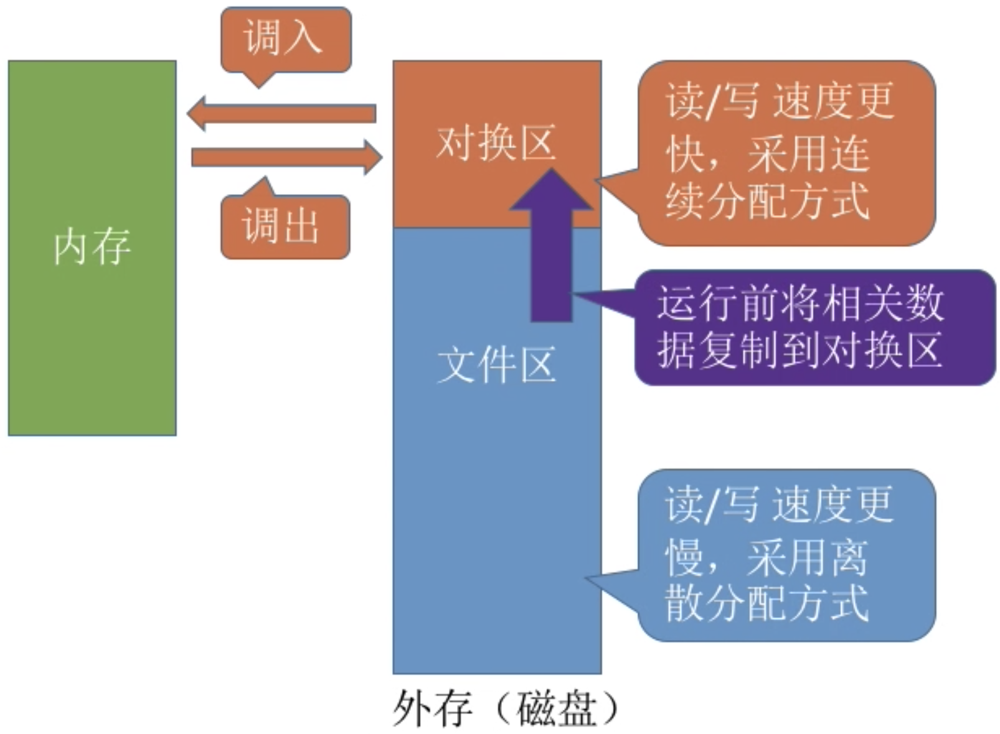

2. 系统缺少足够的对换区空间：凡是不会被修改的数据都直接从文件区调入，由于这些页面不会被修改，因此换出时不必写回磁盘，下次需要时再从文件区调入即可。对于可能被修改的部分，换出时需写回对换区，下次需要时再从对换区调入。

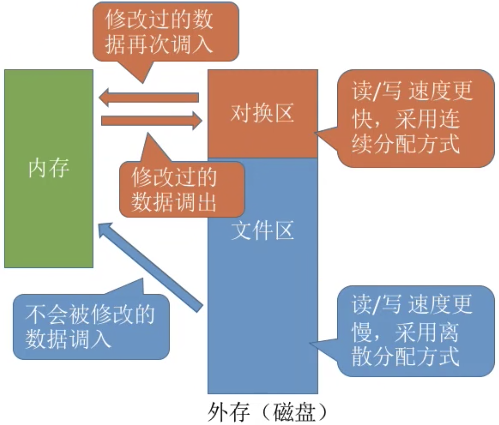

3. UNIX方式：运行之前进程有关的数据全部放在文件区，故未使用过的页面，都可从文件区调入。若被使用过的页面需要换出，则写回对换区，下次需要时从对换区调入。

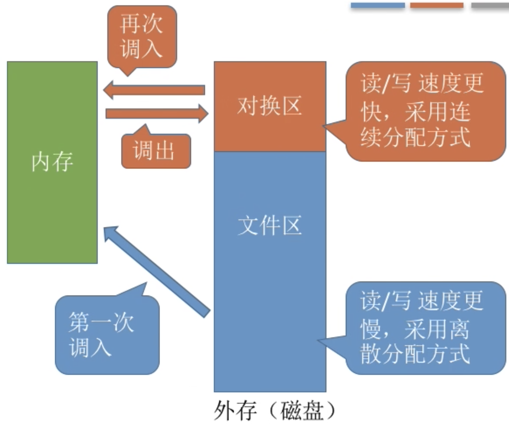

### 4. 抖动(颠簸)现象

所谓的抖动现象即刚刚换出的页面马上又要换入内存，刚刚换入的页面马上又要换出外出，这种频繁的页面调度行为称为抖动 ，或颠簸。产生这种现象的主要原因是进程频繁访问的页面数目高于可用的物理块数(**分配给进程的物理块不够**)。

为进程分配的物理块太少，会使进程发生抖动现象；为进程分配的物理块太多，又会降低系统整体的并发度，降低某些资源的利用率。

### 6. 工作集

为了研究应该为每个进程分配多少个物理块，人们提出了工作集的概念。

**驻留集**：指请求分页存储管理中给进程分配的内存块的集合。

**工作集**：指某段时间间隔里，进程实际访问页面的集合。

操作系统会根据“窗口尺寸”来算出工作集，例如：

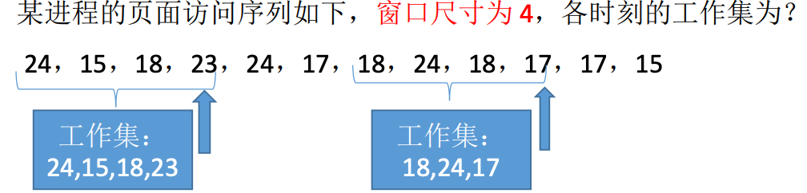

**工作集大小**可能小于窗口尺寸，实际应用中，操作系统可以统计进程的工作集大小，根据工作集大小给进程分配若干个内存块。如：窗口尺寸为5，经过一段时间的监测发现某进程的工作集最大为3，那么说明该进程有很好的局部性，可以给这个进程分配3个以上的内存块即可满足进程的运行需要。

一般来说，**驻留集大小不能小于工作集大小，否则进程运行过程中将频繁缺页**。

拓展：基于局部性原理可知，进程在一段时间内访问的页面与不久之后会访问的页面是有相关性的。因此，可以根据进程近期访问的页面集合(工作集)来设计一种页面置换算法——选择一个不在工作集中的页面进行淘汰。

