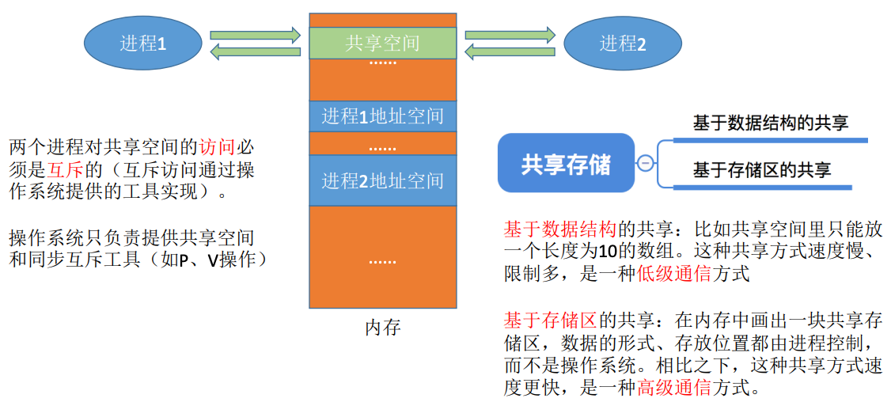

# 进程基础

<!-- START doctoc generated TOC please keep comment here to allow auto update -->
<!-- DON'T EDIT THIS SECTION, INSTEAD RE-RUN doctoc TO UPDATE -->

- [一、进程的基本概念](#%E4%B8%80%E8%BF%9B%E7%A8%8B%E7%9A%84%E5%9F%BA%E6%9C%AC%E6%A6%82%E5%BF%B5)
    - [1. 进程的特征](#1-%E8%BF%9B%E7%A8%8B%E7%9A%84%E7%89%B9%E5%BE%81)
    - [2. PCB](#2-pcb)
    - [3. 进程的组成](#3-%E8%BF%9B%E7%A8%8B%E7%9A%84%E7%BB%84%E6%88%90)
    - [4. 进程的特征](#4-%E8%BF%9B%E7%A8%8B%E7%9A%84%E7%89%B9%E5%BE%81)
    - [5. 进程的组织](#5-%E8%BF%9B%E7%A8%8B%E7%9A%84%E7%BB%84%E7%BB%87)
- [二、进程控制](#%E4%BA%8C%E8%BF%9B%E7%A8%8B%E6%8E%A7%E5%88%B6)
    - [1. 如何实现进程控制](#1-%E5%A6%82%E4%BD%95%E5%AE%9E%E7%8E%B0%E8%BF%9B%E7%A8%8B%E6%8E%A7%E5%88%B6)
    - [2. 如何实现原语的原子性](#2-%E5%A6%82%E4%BD%95%E5%AE%9E%E7%8E%B0%E5%8E%9F%E8%AF%AD%E7%9A%84%E5%8E%9F%E5%AD%90%E6%80%A7)
    - [3. 进程控制相关的原语](#3-%E8%BF%9B%E7%A8%8B%E6%8E%A7%E5%88%B6%E7%9B%B8%E5%85%B3%E7%9A%84%E5%8E%9F%E8%AF%AD)
- [三、进程通信](#%E4%B8%89%E8%BF%9B%E7%A8%8B%E9%80%9A%E4%BF%A1)
    - [1. 共享存储](#1-%E5%85%B1%E4%BA%AB%E5%AD%98%E5%82%A8)
    - [2. 管道通信](#2-%E7%AE%A1%E9%81%93%E9%80%9A%E4%BF%A1)
    - [3. 消息传递](#3-%E6%B6%88%E6%81%AF%E4%BC%A0%E9%80%92)
- [四、线程的概念和特点](#%E5%9B%9B%E7%BA%BF%E7%A8%8B%E7%9A%84%E6%A6%82%E5%BF%B5%E5%92%8C%E7%89%B9%E7%82%B9)
    - [1. 为什么要引入线程](#1-%E4%B8%BA%E4%BB%80%E4%B9%88%E8%A6%81%E5%BC%95%E5%85%A5%E7%BA%BF%E7%A8%8B)
    - [2. 线程的特性和优点](#2-%E7%BA%BF%E7%A8%8B%E7%9A%84%E7%89%B9%E6%80%A7%E5%92%8C%E4%BC%98%E7%82%B9)
    - [3. 什么是线程](#3-%E4%BB%80%E4%B9%88%E6%98%AF%E7%BA%BF%E7%A8%8B)
    - [4. 线程的实现方式](#4-%E7%BA%BF%E7%A8%8B%E7%9A%84%E5%AE%9E%E7%8E%B0%E6%96%B9%E5%BC%8F)
        - [4.1 用户级线程](#41-%E7%94%A8%E6%88%B7%E7%BA%A7%E7%BA%BF%E7%A8%8B)
        - [4.2 内核级线程](#42-%E5%86%85%E6%A0%B8%E7%BA%A7%E7%BA%BF%E7%A8%8B)
        - [4.3 组合实现线程](#43-%E7%BB%84%E5%90%88%E5%AE%9E%E7%8E%B0%E7%BA%BF%E7%A8%8B)
    - [5. 多线程模型](#5-%E5%A4%9A%E7%BA%BF%E7%A8%8B%E6%A8%A1%E5%9E%8B)
        - [5.1 多对一](#51-%E5%A4%9A%E5%AF%B9%E4%B8%80)
        - [5.2 一对一](#52-%E4%B8%80%E5%AF%B9%E4%B8%80)
        - [5.3 多对多](#53-%E5%A4%9A%E5%AF%B9%E5%A4%9A)

<!-- END doctoc generated TOC please keep comment here to allow auto update -->

[TOC]

## 一、进程的基本概念

### 1. 进程的特征

在认识进程之前，先来了解一下程序的定义：程序是**静态**的，就是放在磁盘里的可执行文件，就是一系列的指令集合。

进程：是**动态**的，是**程序**的一次执行过程，同一个程序多次执行会对应多个进程。

> 那么操作系统是如何区分各个进程的呢？

当进程被创建时，操作系统会为该进程分配一个**唯一的、不重复的**PID(进程ID)用于区分不同的进程。

操作系统作为进程的管理者，要记录：

1. 进程的PID、进程所属用户ID(UID)等基本的进程描述信息，可以让操作系统区分各个进程。
2. 进程分配了哪些资源(如分配内存数量、正在使用的 I/O设备、正在使用的文件等)，用于实现操作系统对资源的管理。
3. 还要记录进程的运行情况(如CPU使用时间、磁盘使用情况、网络流量使用情况等)，用于实现操作台对进程的控制、调度。

这些信息都被保存在一个数据结构PCB(Process Control Block)中，即进程控制块，操作系统需要对各个并发运行的进程进行管理，但凡管理时需要的信息，都会被放在PCB中。

### 2. PCB

PCB是进程存在的唯一标志，当进程被创建时，操作系统为其创建PCB，当进程结束时，会回收其PCB。

PCB中 记录的信息主要包括：

- 进程描述信息：进程标识符PID、用户标识符UID。
- 进程控制和管理信息：
    - CPU、磁盘、网络流量使用情况统计...
    - 当前进程状态：就绪态/阻塞态/运行态...
- 资源分配清单：
    - 正在使用哪些文件
    - 正在使用哪些内存区域
    - 正在使用哪些I/O设备
    - ...
- 处理机相关信息：如PSW(程序状态字)、PC等各种寄存器的值。

### 3. 进程的组成

在了解进程的组成之前，先来了解一下程序是如何运行的。

程序一般由高级语音(如C语言)编写，经由编译器“翻译”成机器能够识别的二进制机器指令，再将机器指令交由CPU解释执行，因此程序运行的过程其实就是CPU执行机器指令的过程。

从上图可以看出，进程实体/进程映像由**程序段**、**数据段**和**PCB**三部分组成，而**进程**是进程实体**运行过程**，是系统进行**资源分配**和**调度**的一个独立单位，PCB是进程存在的唯一标志。

### 4. 进程的特征

程序是静态的，进程是动态的，相比于程序，进程拥有以下特征：

1. 动态性：进程是程序执行的一次执行过程，是动态地产生、变化和消亡的，是进程最基本的特征。
2. 并发性：内存中有多个进程实体，各个进程可以并发执行(这里就不赘述并发和并行的区别了)。
3. 独立性：进程是能独立运行、独立获取资源、独立接受调度的基本单位。
4. 异步性：各进程按各自独立的、不可预知的速度向前推进，操作系统要提供“进程同步机制”来解决异步问题。
5. 结构性：每个进程都会配置一个PCB，结构上看，进程由程序段、数据段、PCB组成。

### 5. 进程的组织

在一个系统中 ，通常有数十个、数百乃至数千个PCB，为了能对它们加以有效的管理，应该用适当的方式把这些PCB组织起来。一般有两种方式：链式方式和索引方式。

链式方式：按照进程状态将PCB分为多个队列，操作系统持有指向各个队列的指针。

索引方式：根据进程的状态不同，建立几张索引表，操作系统持有指向各个索引表的指针。

## 二、进程控制

进程控制的主要功能是对系统中的所有进程实施有效的管理，它具有创建新进程、撤销已有进程、实现进程状态转换等功能。简单理解就是要实现进程状态转换。

### 1. 如何实现进程控制

一般使用“原语”实现。

原语是一种特殊的程序，它的执行具有原子性，也就是不可中断。

那为何进程控制要使用原语实现，要求“一气呵成”呢？

如果不能“一气呵成”的话，就有可能导致操作系统中的某些关键数据结构信息不一致的情况，这会影响操作系统进行别的管理工作。

下面我们看了栗子：

### 2. 如何实现原语的原子性

可以用”关中断指令“和“开中断”指令这两个特权指令实现原子性(这个在计组中有学过)。

CPU执行了关中断指令之后，就不再理性检查中断信号，直到执行开中断指令之后才会回复检查。这样关中断、开中断之间的这些指令序列就是不可被中断的，这就实现了原子性。

### 3. 进程控制相关的原语

进程控制会导致进程状态的转换，物理哪个进程控制原语，要做的无非三类事情：

1. 更新PCB中的信息。
    - 所有的进程控制原语一定都会修改进程状态标志；
    - 剥夺当前运行进程的CPU使用权必然需要保存其运行环境；
    - 某进程开始运行前必然要恢复其运行环境。
2. 将PCB插入合适的队列。
3. 分配/回收资源。

## 三、进程通信

进程通信，顾名思义，进程通信就是指进程之间的信息交换。进程是分配系统资源的单位，因此各进程拥有的内存地址空间相互独立。

为了保证安全，一个进程不能直接访问另一个进程的地址空间，但进程之间的信息交换又是必须实现的，为了保证进程间的安全通信，操作系统提供了一些方法。

### 1. 共享存储

### 2. 管道通信

1. 管道通信只能采用**半双工通信**，某一时间段内只能实现单向的传输。如果 要实现双向同时通信，则需要设置两个管道。
2. 各进程要**互斥**地访问管道。
3. 数据以字符流的形式走入管道，当管道**写满**时，**写进程**的write()系统调用将被**阻塞**，等待读进程将数据取走。
4. 如果**没写满，就不允许读**。如果**没读空，就不允许写**。
5. 数据一旦被读出，就从管道中抛弃，这就意味着读进程最多只能有一个，否则可能会有读错数据的情况。

### 3. 消息传递

进程间的数据交换以格式化的消息(Message)为单位。进程通过操作台提供 的“发送消息/接受消息”两个**原语**进行数据交换。

## 四、线程的概念和特点

### 1. 为什么要引入线程

如果要实现上述三个功能，需要操作系统开3个进程来完成。

进程是资源分配的基本单位，也是调度的基本单位，当切换线程时，需要保存/恢复进程运行环境，还需要切换内存地址空间(更新快表、更新缓存)开销很大。

如果引入了线程，情况就不一样了：

情况具体怎么不一样了，我们来看看线程的特性和优点。

### 2. 线程的特性和优点

从上面两个图可以看到，从属于同一进程的各个线程共享进程拥有的资源。

- 并发层面：

当切换进程时，需要保存/恢复进程运行环境，还需要切换内存地址空间(更新快表、更新缓存)
；同一个进程内的各个线程间并发，不需要切换进程运行环境和内存地址空间，开销更小。当然，这里指的是同进程间切换线程，属于不同进程的线程间切换，会导致进程切换，开销也很大！

- 通信层面：

进程间通信必须请求操作系统服务(CPU要切换到内核态)，开销大；同进程下的线程间通信，无需操作系统干预，开销更小。当然，这里指的是同进程的线程间通信。

- 调度层面：

引入线程前，进程既是资源分配的基本单位，也是调度的基本单位。引入线程后，进程是资源分配的基本单位，线程是调度的基本单位，线程几乎不拥有资源，只有极少量的资源(线程控制块TCB、寄存器信息、堆栈等)。线程也有运行态、就绪态、阻塞态。

在多CPU环境下，各个线程也可以分派到不同的CPU上 并行的执行。

### 3. 什么是线程

那么，究竟什么是线程？可以把线程理解为“轻量级进程”。线程是一个**基本的CPU执行单元**，也是**程序执行流的最小单位**。引入线程后，不仅是进程之间可以并发，进程内的各线程之间也可以并发，从而进一步提升了系统的并发度。

引入线程后，进程只作为除CPU之外的系统更自由的分配单元，线程则作为处理机的分配单元。

### 4. 线程的实现方式

#### 4.1 用户级线程

用户级线程由应用程序通过线程库实现。所有的**线程管理工作**都应**由应用程序负责**(包括线程切换)。

用户线程中，线程切换在用户态下即可完成，无需操作系统干预。

在用户看来，是有多个线程，但操作系统内核是感受不到有多个用户线程的存在的，即对用户不透明，对操作系统透明。

#### 4.2 内核级线程

内核级线程的管理工作由操作系统完成，线程调度、切换等工作都由内核负责，因此内核级线程的切换必须在内核态下进行。

#### 4.3 组合实现线程

在同时支持用户级线程和内核级线程的系统中，可以采用二者组合的方式：将n个用户级线程映射到m个内核级线程上(n >= m)。

操作系统只“看得见”内核级线程，因此只有**内核级线程才是处理机分配的单位**。

例如上面的模型中，该进程由2个内核线程和3个用户线程，在用户看来，有3个线程，但即使在一个4核处理机的机器上运行，也最多只能被分配到2个核，最多只有2个用户线程能并行执行，也就是一核有难，多核围观的原理。。。

### 5. 多线程模型

#### 5.1 多对一

多个用户级线程映射到一个内核级线程。每个用户进程只对应一个内核级线程。

优点：用户级线程在用户空间即可完成，不需要切到内核态，线程管理的系统开销小，效率高。

缺点：当一个用户级线程阻塞后，整个进程都会阻塞，并发度不高。多个线程不可在多核处理机上并行运行。

#### 5.2 一对一

一个用户级线程映射到一个内核级线程。每个用户进程有与用户级线程同数量的内核级线程。

优点：当一个线程阻塞后，其他线程还可以继续执行，并发能力强。多个线程可以在多核处理机上并行运行。

缺点：一个用户进程会占用多个内核级线程，线程切换由操作系统内核完成，需要切换到内核态，因此线程管理成本高，开销大。

#### 5.3 多对多

n个用户线程映射到m个内核级线程(n >= m)。每个用户进程对应m个内核级线程。

克服了多对一模型并发度不高的缺点，又克服了一对一模型中一个用户进程占用太多内核级线程，开销太大的缺点。

