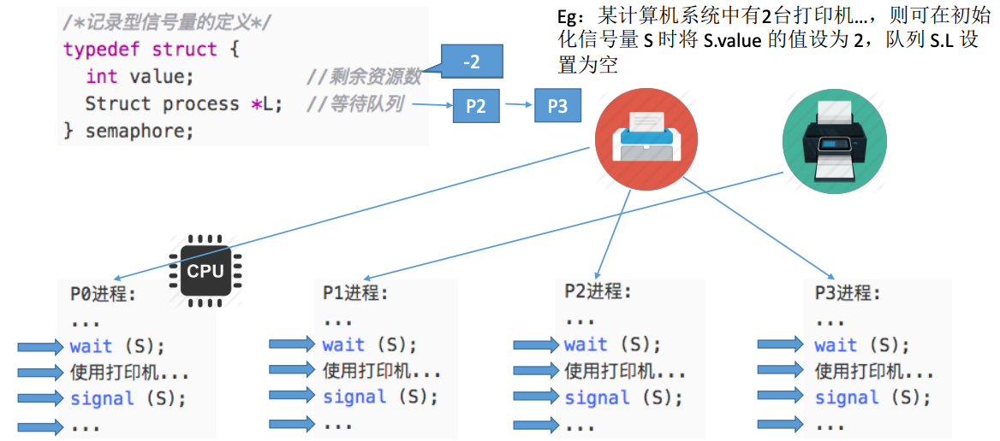
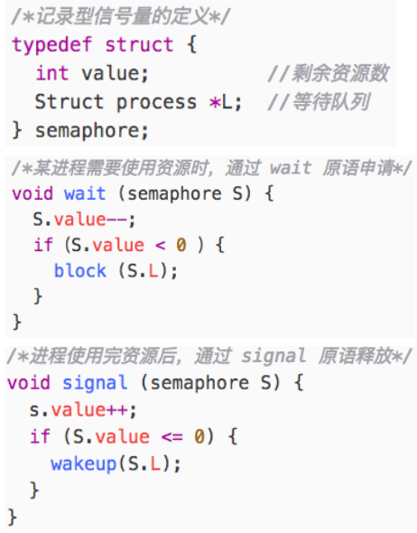

# 进程的同步与互斥

[TOC]

## 一、进程的同步与互斥

### 1. 进程同步

我们先回顾一下前面的知识点：进程具有**异步性**的特征，异步性是指：各并发执行的进程以各自独立的、不可预知的速度向前推进。

看个栗子：进程通信中管道通信：

读进程和写进程并发地运行，由于并发必然导致异步性，因此“写数据”和“读数据”两个操作执行的先后顺序是不确定的。而实际应用中，又必须按照“写数据-->读数据”的顺序来进行。如何解决这种**异步**的问题，就是**进程同步**所讨论的内容。

**同步**亦称**直接制约**关系，它是指为完成某种任务而建立的两个或多个进程，这些进程因为需要再某些位置上协调它们的工作次序而产生的制约关系。进程间的直接制约关系就是源于它们之间的相互合作。

### 2. 进程互斥

进程的并发需要共享的支持，各个并发执行的进程不可避免的需要共享一些系统资源(比如内存，又比如打印机、摄像头这样的I/O设备)。

资源共享有2种方式：

- 互斥共享：系统中的某些资源，虽然可以提供给多个进程使用，但一**个时间段内只允许一个进程访问该资源**。
- 同时共享：系统中的某些资源，允许**一个时间段内由多个进程“同时”对它们进行访问**。

我们把**一个时间段内只允许一个进程使用**的资源称为**临界资源**。许多物理设备都属于临界资源，此外还有许多变量、数据、内存缓冲区等都属于临界资源。

对临界资源的访问，必须**互斥**地进行。互斥亦称**间接制约关系**。**进程互斥**指当一个进程访问某临界资源时，其他想要访问该临界资源的进程必须等待，当正在访问临界资源的进程访问结束，释放该资源之后，其他进程才有机会去访问临界资源。

对临界资源的互斥访问，可以在逻辑上分为如下4个部分：

那如果一个进程暂时不能进入临界区，那么该进程是否应该一直占着处理机？该进程有没有可能一直进不去临界区？

为了实现对临界资源的互斥访问，同时保证系统整体性能，需要遵循以下原则：

1. 空闲让进：临界区空闲时，可以运行一个请求进入临界区的进程立即进入临界区。
2. 忙则等待：当已有进程进入临界区时，其他试图进入临界区的进程必须等待。
3. 有限等待：对请求访问的进程，应保证能在有限时间内进入临界区(保证不会饥饿)。
4. 让权等待：当进程不能进入临界区时，应立即释放处理机，防止进程忙等待。

## 二、进程互斥的软件实现

### 1. 单标志法

算法思想：两个进程在**访问完临界区后**会把使用临界区的权限转交给另一个进程，也就是说**每个进程进入临界区的权限只能被另一个进程赋予**。

turn的初值为0，即刚开始只允许0号进程进入临界区；

若P1先上处理器运行，则会一直卡在⑤，直到P1的时间片用完，发生调度，切换P0上处理机运行；

代码①不会卡住P0，P0可以正常访问临界区，在P0访问完临界区，P1依然会卡在⑤，只有P0执行③，将turn改为1，P1才能进入临界区。

因此，该算法可以实现“**同一时刻最多只允许一个进程访问临界区**”。

turn表示当前允许进入临界区的进程号，而只有当前允许进入临界区的进程在访问了临界区之后，才会修改turn的值，也就是说对于临界区的访问，一定是按P0-->P1-->P0--P1...这样轮流访问的，这种访问带来的问题是：如果此时允许进入临界区的进程是P0，而P0一直不访问临界区，那么虽然此时临界区空闲，但并不允许P1访问，故**单标志法**存在的主要问题是**违背“空闲让进”原则**。

### 2. 双标志先检查法

算法思想：设置一个布尔型数组flag[]，数组中各个元素用来**标记各进程想进入临界区的意愿**，比如“flag[0]=true”表示0号进程现在想要进入临界区。每个进程在进入临界区之前先检查当前有没有别的进程想进入临界区，如果没有，则把自身对应的标志设置为true，之后开始访问临界区。

若按照①⑤②⑥③⑦的顺序执行，P0和P1将同时访问临界区。因此**双标志先检查法**的主要问题是**违反“忙则等待”原则**，原因在于进入区的“检查”和“上锁”两个处理不是一气呵成的，“检查”后，“上锁”前可能发生进程切换。

### 3. 双标志后检查法

算法思想：双标志先检查法的改版，前一个算法的问题是先“检查”后“上锁”，但这两个操作又无法一气呵成，因此导致了两个进程同时进入临界区的问题，因此人们又想到先“上锁”后“检查”的方法来避免上述问题。

若按照①⑤②⑥的顺序执行，P0和P1将都无法访问临界区，因此**双标志后检查法**虽然解决了“忙则等待”的问题，但是又**违背了“空闲让进”和“有限等待”原则**，会因各进程都长期无法访问临界资源而产生“饥饿”现象。

### 4. Peterson算法

算法思想：双标志后检查法中，两个进程都争着想进入临界区，但是谁也不让谁，最后谁都无法进入临界区。人们又想到了一直方法，如果双方都争着想进入临界区，那可以让进程尝试“孔融让梨”，主动让对方先使用临界区。

其实根据代码，一步一步走就能屡清楚原理了，比如可以按照以下顺序分析：

- ①②③⑥⑦⑧...
- ①⑥②③...

**Peterson算法**用软件方法解决了进程互斥问题，**遵循了空闲让进、忙则等待、有限等待三个原则，但是依然未遵循让权等待原则**。

## 三、进程互斥的硬件实现

### 1. 中断屏蔽方法

利用“开/关中断指令”实现(与原语的实现思想相同，即在某进程开始访问临界区到结束访问为止都不允许被中断，也就是不能发生进程切换，因此也不可能发生两个同时访问临界区的情况)。

优点：简单、高效。

缺点：不适用于多处理机；只适用于操作系统内核进程，不适用于用户进程(因为开/关中断指令只能运行在内核态，这组指令如果能让用户随意使用会很危险)。

### 2. TestAndSet指令

简称TS~~(The Shy！)~~指令，也有地方称TestAndSetLock指令，或TSL指令。TSL指令是用**硬件实现**的，执行的过程中不允许被中断，只能一气呵成。

以下是用C语言描述的逻辑：

简单说一下流程：

- 若lock刚开始是false，则TSL返回的old值为false，while循环条件不满足，直接跳过循环，进入临界区；

- 若lock刚开始是true，则TSL返回的old值为true，while循环条件满足，会一直循环，直到当前访问临界区的进程在退出区进行“解锁”。

相比软件实现方法，TSL指令把“上锁”和“检查”操作用硬件的方式变成一气呵成的原子操作。

优点：实现简单，无需像软件实现方法那样严格检查是否会有逻辑漏洞；适用于多处理器环境。

缺点：不满足“让权等待”原则，暂时无法进入临界区的进程会占用CPU并循环执行TSL指令，从而导致“忙等”。

### 3. Swap指令

有的地方也叫Exchange指令，或简称XCHG指令。Swap指令是用**硬件实现**的，执行的过程不会被中断，只能一气呵成。

以下是用C语言描述的逻辑：

逻辑上看Swap和TSL并无太大区别，都是先记录下此时临界区是否已被上锁(记录在old变量上)，再将上锁标记置为true，最后检查old，如果old为false则说明之前没有别的进程对临界区上锁，则可跳出循环，进入临界区。

优缺点与TSL一样。

## 四、信号量机制

回顾之前讲的软硬件实现的进程互斥，都无法做到“让权等待”，1965年，荷兰学者Dijkstra提出了一种卓有成效的实现进程互斥、同步的方法——**信号量机制**。

### 1. 信号量机制

用户进程可以通过使用操作系统提供的**一对原语**来对**信号量**进行操作，从而很方便的实现了进程互斥、进程同步。

**信号量**其实就是一个变量(可以是一个整数，也可以是更复杂的记录型变量)，也可以用一个信号量来表示**系统中某种资源的数量**，比如：系统中只有一台打印机，就可以设置一个初始值为1的信号量。

**原语**是一种特殊的程序段，其执行只能一气呵成，**不可被中断**。原语是由**关中断/开中断指令实现**的。软件解决方案的主要问题是由“进入区的各种操作无法一气呵成”，因此如果能把进入区、退出区的操作都用原语实现，使这些操作能一气呵成就能避免问题。

**一对原语**：**wait(S)**原语和**signal(S)**原语，可以把原语理解为我们自己写的函数，函数名分别为wait何signal，括号里的**信号量S**其实就是函数调用时传的一个参数。

Wait、signal原语常简称为**P、V操作**(来着荷兰语proberen 和 verhogen)，因此常写作**P(S)、V(S)**。

### 2. 信号量机制——整型信号量

用一个**整数**作为信号量，用来表示**系统中某种资源的数量**。Eg：某计算机系统中有一台打印机...

### 3. 信号量机制——记录型信号量

整型信号量的缺陷是存在“忙等”问题，因此人们又提出了“记录型信号量”，即用记录型数据结构表示的信号量。

上面的栗子就自行理解吧OvO，下面我们来解释一下记录型信号量的工作原理：

下面用P(S)、V(S)来表示wait和signal。

**S.value的初值**表示系统中某种**资源的数目**。

对信号量S的**一次P操作**意味着进程**请求一个单位的该类资源**，因此需要S.value--，表示可分配资源数减1，当S.value<0时表示该类资源已经分配完毕，因此进程应**调用block原语进行自我阻塞**，主动放弃处理机，并插入该类资源的等待队列S.L中。可见该机制**遵循了“让权等待”原则**，不会出现“忙等”现象。

对信号量S的**一次V操作**意味着**释放一个单位的该类资源**，因此需要执行S.value++，表示资源数加1，若加1后仍是S.value <= 0，表示依然有进程在等待该类资源，因此应**调用wakeup**原语唤醒等待队列中的第一个进程。

## 五、信号量机制实现进程的互斥、同步与前驱关系

我们再回顾一下P、V操作：

P(S)：申请一个资源S，如果**资源不够就阻塞等待**。

V(S)：释放一个资源S，如果有进程在等待该资源，则**唤醒**一个进程。

### 1. 信号量机制实现进程互斥

1. 分析并发进程的关键活动，划定临界区(如：对临界资源打印机的访问就应该放在临界区)。
2. 设置**互斥信号量mutex**，**初值为1**。
3. 在进入区P(mutex)，**申请资源**。
4. 在退出区V(mutex)，**释放资源**。

注意：对不同临界资源需要设置不同的互斥信号量，P、V操作必须成对出现，缺少P就不能保证临界资源的互斥访问，缺少V会导致资源永不被释放，等待进程永不被唤醒。

### 2. 信号量机制实现进程同步

进程同步：要让各并发进程按要求有序地推进。

比如，P1、P2并发执行，由于存在异步性，因此二者交替推进的次序是不确定的。若要保证P2的“代码4”要基于P1的“代码1”和“代码2”的运行结果才能执行，那么我们就必须保证“代码4”一定在“代码2”之后才会执行。这就是进程同步问题，让本来异步并发的进程相互配合，有序推进。

用信号量实现进程同步 ：

1. 分析什么地方需要实现“同步关系”，即必须保证“**一前一后**”执行的两个操作。
2. 设置**同步信号量**S，**初始值为0**。
3. **在前操作之后执行V(S)**。
4. **在后操作之前执行P(S)**。

若先执行到V(S)操作，则S++后S=1，之后当执行到P(S)操作时，由于S=1，表示有资源可用，会执行S--，S的值变回0，P2进程不会执行block原语，而是继续往下执行代码4.

若先执行到P(S)操作，由于S=0，S--后S=-1，表示此时没有可用资源，因此P操作中会执行block原语，主动请求阻塞。之后当执行完代码2，继而执行V(S)操作，S++，使S变回0。由于此时所有进程在该信号量对应的阻塞队列中，因此会在V操作中执行wakeup原语，唤醒P2进程，这样P2就可以继续执行代码4了。

### 3. 信号量机制实现前驱关系

