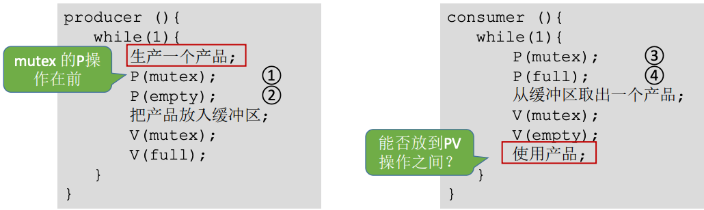

# 进程的同步与互斥经典问题

[TOC]

## 一、生产者消费者问题

### 1. 问题描述

系统中有一组生产者进程和一组消费者进程，生产者每次生产一个数据放入缓冲区，消费者每次从缓冲区中取出一个数据并使用。

生产者、消费者共享一个**初始为空、大小为n的缓冲区**。

只有**缓冲区没满**时，生产者才能把数据放入缓冲区，否则必须等待。

只有**缓冲区不为空**时，消费者才能从中取出数据，否则必须等待。

缓冲区是临界资源，个进程必须**互斥访问**。

### 2. 问题分析

根据题干我们来冷静分析一下：

> 生产者、消费者共享一个**初始为空、大小为n的缓冲区**。

设置一个信号量(mutex)，初始值即为资源的数量。

> 只有**缓冲区没满**时，生产者才能把数据放入缓冲区，否则必须等待。
>
> 只有**缓冲区不为空**时，消费者才能从中取出数据，否则必须等待。

设置初值为0的信号量(full)，实现“一前一后”。

> 缓冲区是临界资源，个进程必须**互斥访问**。

设置初值为1的互斥信号量(empty)。

>  生产者每次生产一个数据放入缓冲区，消费者每次从缓冲区中取出一个数据并使用

生产者每次要消耗(P)一个空闲缓冲区，并生成(V)一个数据；消费者每次要消耗(P)一个数据，并释放一个空闲缓冲区(V)。往缓冲区放入/取走数据需要互斥。

### 3. 如何实现

由上面的分析可得如下实现：

那么，能否改变相邻P、V操作的顺序呢？

若替换相邻P操作顺序：

若此时缓冲区已满，则empty=0，full=n；

生产者执行①使mutex=0，再执行②，由于已经没有空闲缓冲区，因此生产者被阻塞；

由于生产者阻塞，切换回消费者，消费者执行③，由于mutex=0，即生产者还未是否临界资源，因此消费者也被阻塞；

这就造成了生产者等待消费者是否缓冲区，消费者又等待生产者释放临界区资源的情况，生产者和消费者循环等待被对方唤醒，出现“死锁”。

同样的，若缓冲区中没有产品，即full=0，empty=n，按③④①的顺序执行就会发生死锁。

因此，**实现互斥的P操作一定要在实现同步的P操作之后**。而V操作不会导致进程阻塞，因此**两个V操作顺序可以换**。

## 二、多生产者多消费者问题

### 1. 问题描述

桌子上有一个盘子，每次只能向其中放入一个水果。爸爸专向盘子重放苹果，妈妈专向盘子放橘子，儿子专等着吃盘子中的橘子，女儿专等着吃盘子中的苹果。只有盘子空了，爸爸或妈妈才可向盘子中放一个水果。仅当盘子中有自己需要的水果时，儿子或女儿可以从盘子取出水果。

### 2. 问题分析

互斥关系(mutex=1)：对缓冲区(盘子)的访问要互斥地进行。

同步关系(一前一后)：

1. 爸爸将苹果放入盘子后，女儿才能取到苹果；
2. 妈妈将橘子放入盘子后，儿子才能取到橘子；
3. 只有盘子为空时，父亲或母亲才能放入水果；
4. 盘子为空这个时间可以由儿子或女儿触发，事件发生后才允许父母放水果。

### 3. 如何实现

实现伪代码应该算是清晰明了了，就不多做解释，但要提一个问题：**可不可以不要互斥信号量mutex**？

我们分析分析：刚开始，儿子、女儿进程即使上处理机运行也会被阻塞。如果刚开始是父亲进程先上处理机运行，则：父亲 P(plate)，可以访问盘子 --> 母亲 P(plate)，阻塞等待盘子 --> 父亲放入苹果 V(apple) --> 女儿进程被唤醒，其他进程即使运行也都会阻塞，暂时不可能访问临界资源（盘子）；女儿 P(apple)，访问盘子，V(plate) --> 等待盘子的母亲进程被唤醒，母亲进程访问盘子（其他进程暂时都无法进入临界区）……

从分析来看，即使不设置专门的互斥变了mutex，也不会出现多个进程同时访问盘子的现象。根本原因在于本题中的缓冲区大小为1，在任何时刻，apple、orange、plate三个同步信号量最多只有一个是1，因此在任何时刻，最多只有一个进程的P操作不会被阻塞，并顺利地进入临界区。

如果盘子容量为2的话，即plate=2，就可能出现两个进程同时访问缓冲区的情况，有可能导致两个进程写入缓冲区的数据相互覆盖。

## 三、读者写者问题

### 1. 问题描述

有读者和写者两组并发进程，共享一个文件，当两个或以上的读进程同时访问共享数据结构时不会产生副作用，但若某个写进程和其他进程(读或写进程)同时访问共享数据时，则可能导致数据不一致的错误。因此要求：

1. 允许多个读者可以同时对文件执行读操作；
2. 只允许一个写者往文件中写信息；
3. 任一写者在完成写操作之前不允许其他读者或写者工作；
4. 写者执行写操作前，应让已有的读者和写者全部退出。

### 2. 问题分析

首先分析涉及到的进程和它们之间的同步互斥关系：

- 两类进程：写进程、读进程
- 互斥关系：写写互斥、写读互斥、读读不互斥

因为写与任何类型的进程都互斥，因此需要设置一个互斥信号量rw，在写进程访问共享文件前后分表执行P、V操作；读进程与写进程互斥，因此读进程在访问共享文件前后液压对rw执行P、V操作。

但如果读所有读进程在访问共享文件之前都要执行P(rw)操作，那么会导致各个读进程之间也互斥，那要如何处理呢？其实**读者越写者问题的核心思想就是如何处理该问题**。

既然各个读进程需要同时访问，而读进程与写进程又必须互斥访问，那么我们可以让第一个访问文件的读进程执行P(rw)操作，让最后一个结束访问完文件的读进程V(rw)，可以设置一个整型变量count来记录当前有几个读进程在访问文件。

### 3. 如何实现

关于信号量mutex，可以思考一个问题：在没有mutex的情况下，两个读进程并发执行会出现什么情况？

有可能两个进程都进入了if(count==0)里面，造成第二个读进程阻塞，因此需要加一个信号量保证对count的访问是互斥的。

上面的实现其实已经满足了问题需求，但存在一个潜在问题：只要有读进程还在读，写进程就要一直阻塞等待，可能会造成“饿死”，因此这种算法读进程是最优先的。

为了解决写进程“饿死”的问题，我们可以多加一个信号量w，用于实现“写优先”。

这种算法的核心思想是：有写进程要写文件时，阻塞之后要访问文件的读进程，等待正在访问的读进程访问都结束后写进程再写文件。

具体的过程可以自行推导。

## 四、哲学家进餐问题

### 1. 问题描述

一张圆桌上坐着5名哲学家，每两个哲学家之间的桌子上摆一根筷子，桌子的中间是一道菜。哲学家们倾注毕生的精力用于思考和进餐，哲学家在思考时不影响他人，只有当哲学家饥饿时才视图拿起左右两根筷子(一根一根地拿起)。如果筷子已经在他人手上，则需等待。饥饿的哲学家只有同时拿起两根筷子才可以开始进餐，当进餐完毕后，放下筷子继续思考。

### 2. 问题分析

首先我们还是先来分析一下他们之间的关系：系统中有5个哲学家进程，5个哲学家与左右边筷子的访问与相邻哲学家互斥。

这个问题中只有互斥关系，但与之前的问题不同的是，每个进程要同时持有2个临界资源时才能开始执行任务。**如何避免临界资源分配不当造成的死锁现象，是哲学家问题的精髓**。

信号量的设置：定义互斥信号量数组chopstick[5]={1,1,1,1,1}用于实现5个筷子的互斥访问。并对哲学家按0~4进行编号，哲学家i左边的筷子编号为i，右边的筷子编号为(i+1)%5。

按照一般思路，可以让每个哲学家吃饭前依次拿起左、右两支筷子，但如果5个哲学家并发地拿起了自己左手边的筷子，那么每位哲学家循环等待右边的人放下筷子(阻塞)，就会发生死锁。因此，这种方式是不可行的。那要如何实现呢？

### 3. 如何实现

其实解决死锁的方式有很多，比如：

1. 可以对哲学家进程施加一些限制条件，比如最多允许4个哲学家同时进餐，这样可以保证至少有一个哲学家是可以拿到左右两只筷子的。
2. 要求奇数号的哲学家先拿到左边的筷子，然后再拿右边的筷子，而偶数号的哲学家刚好相反。用这种方法可以保证如果相邻的两个奇偶号哲学家都想吃饭，那么只会有其中一个可以拿起第一只筷子，另一个会直接阻塞，这就避免了占有一支后再等待另一只的情况。
3. 当仅有一个哲学家两只筷子都可以用时才允许他抓起来。

具体的代码分析这里就不做了，懒，可以自行分析。
