# Nginx扩展-clojure基础

<!-- START doctoc generated TOC please keep comment here to allow auto update -->
<!-- DON'T EDIT THIS SECTION, INSTEAD RE-RUN doctoc TO UPDATE -->

- [一、nginx-clojure简介](#%E4%B8%80nginx-clojure%E7%AE%80%E4%BB%8B)
- [二、HelloWorld](#%E4%BA%8Chelloworld)
    - [1. 环境信息](#1-%E7%8E%AF%E5%A2%83%E4%BF%A1%E6%81%AF)
    - [2. 下载集成了nginx-clojure模块的nginx包](#2-%E4%B8%8B%E8%BD%BD%E9%9B%86%E6%88%90%E4%BA%86nginx-clojure%E6%A8%A1%E5%9D%97%E7%9A%84nginx%E5%8C%85)
    - [3. 解压nginx包](#3-%E8%A7%A3%E5%8E%8Bnginx%E5%8C%85)
    - [4. 编码，开发java版handler](#4-%E7%BC%96%E7%A0%81%E5%BC%80%E5%8F%91java%E7%89%88handler)
    - [5. 编译，生成jar](#5-%E7%BC%96%E8%AF%91%E7%94%9F%E6%88%90jar)
    - [6. jar放入nginx的jars目录](#6-jar%E6%94%BE%E5%85%A5nginx%E7%9A%84jars%E7%9B%AE%E5%BD%95)
    - [7. 修改nginx的配置](#7-%E4%BF%AE%E6%94%B9nginx%E7%9A%84%E9%85%8D%E7%BD%AE)
    - [8. 启动nginx](#8-%E5%90%AF%E5%8A%A8nginx)
    - [9. 验证](#9-%E9%AA%8C%E8%AF%81)
- [三、基础配置项](#%E4%B8%89%E5%9F%BA%E7%A1%80%E9%85%8D%E7%BD%AE%E9%A1%B9)
    - [1. java进程数量](#1-java%E8%BF%9B%E7%A8%8B%E6%95%B0%E9%87%8F)
    - [2. 配置项：jvm_path](#2-%E9%85%8D%E7%BD%AE%E9%A1%B9jvm_path)
    - [3. 配置项：jvm_classpath](#3-%E9%85%8D%E7%BD%AE%E9%A1%B9jvm_classpath)
    - [4. 配置项：jvm_var](#4-%E9%85%8D%E7%BD%AE%E9%A1%B9jvm_var)
    - [5. 配置项：jvm_options](#5-%E9%85%8D%E7%BD%AE%E9%A1%B9jvm_options)
    - [6. 配置项：jvm_handler_type](#6-%E9%85%8D%E7%BD%AE%E9%A1%B9jvm_handler_type)

<!-- END doctoc generated TOC please keep comment here to allow auto update -->

[TOC]

## 一、nginx-clojure简介

- nginx-clojure是个第三方Nginx模块，官方的介绍是Nginx module for embedding Clojure / Java / Groovy programs, typically those Ring
  based handlers
- nginx-clojure模块支持嵌入式Clojure(闭包)、Java、Groovy等基于Ring的处理器（handler），那什么是Ring呢？
- Ring 在 Clojure 中是一个构建 Web 应用的底层接口和库. 它和 Ruby 的 Rack, Python 里面的WSGI 或者 Java Servlet 规范相似
- 从java开发者角度来看，就是开发NginxJavaRingHandler的实现类，然后该类可以在nginx-clojure模块中被运行
-
nginx-clojure的最新版本是v0.5.3，官网地址是：[nginx-clojure.github.io](https://link.juejin.cn?target=https%3A%2F%2Fnginx-clojure.github.io)
- 对nginx-clojure的介绍就到这里吧，接下来实战为主

## 二、HelloWorld

今天的实战步骤如下图所示：

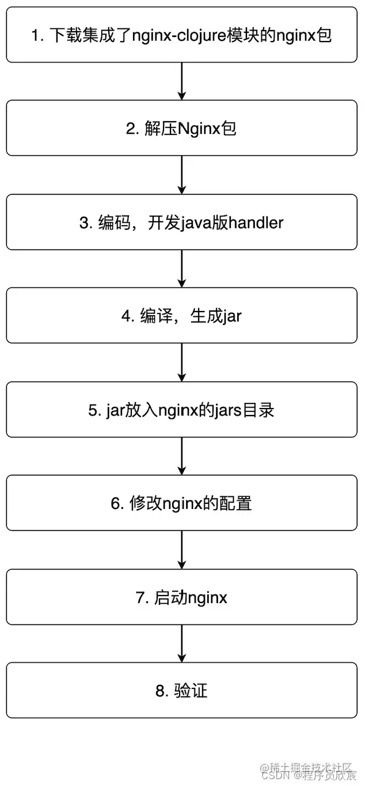

### 1. 环境信息

1. 操作系统：CentOS-7.4
2. JDK：1.8.0_22
3. Maven：3.6.3

### 2. 下载集成了nginx-clojure模块的nginx包

- 咱们要做的第一件事是下载一个特别的nginx，之所以说它特别，是因为它已集成了nginx-clojure模块，开箱即用
- 下载地址：https://sourceforge.net/projects/nginx-clojure/files/

### 3. 解压nginx包

- 下载完毕后，解压，得到名为nginx-clojure-0.5.3的文件夹，里面的内容如下：

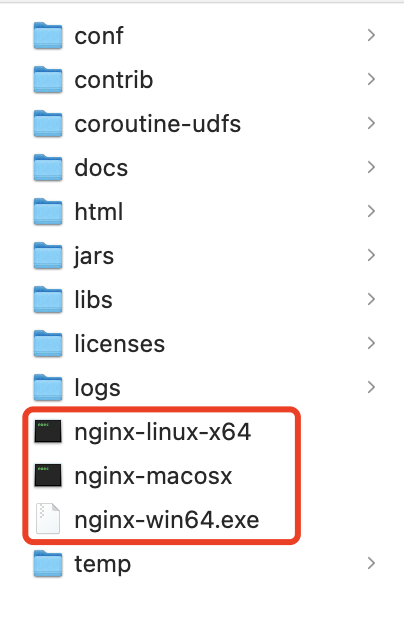

- 接下来根据您的操作系统对可执行文件做重命名，我这边是linux(不要在意我的截图)
  ，所以把nginx-linux-64重命名为nginx，如果是macOS，把nginx-macosx重命名为nginx，如果是windows，就把nginx-win64.exe重命名为nginx.exe
- 上述重命名操作是nginx-clojure官方推荐的，统一可执行文件名，这样运行文档中的命令就统一了
- 执行命令./nginx -v，控制台响应如下，可见nginx版本是1.18.0：

```shell
./nginx -v
nginx version: nginx/1.18.0
```

### 4. 编码，开发java版handler

- 接下来开始写代码，先新建一个maven工程（我这里名叫nginx-clojure-demo），pom.xml中需要配置repository节点，以及唯一的依赖nginx-clojure，如下所示：

```xml

<repositories>
    <repository>
        <id>clojars.org</id>
        <url>http://clojars.org/repo</url>
    </repository>
</repositories>

<dependencies>
<dependency>
    <groupId>nginx-clojure</groupId>
    <artifactId>nginx-clojure</artifactId>
    <version>0.5.3</version>
</dependency>
</dependencies>
```

- 然后新增文件HelloHandler.java，如下所示，代码非常简单，实现NginxJavaRingHandler接口，invoke方法返回的数组中只有三个元素：返回码、响应header的键值对集合、响应body内容：

```java
import nginx.clojure.java.ArrayMap;
import nginx.clojure.java.NginxJavaRingHandler;

import java.io.IOException;
import java.time.LocalDateTime;
import java.util.Map;

import static nginx.clojure.MiniConstants.CONTENT_TYPE;
import static nginx.clojure.MiniConstants.NGX_HTTP_OK;

/**
 * @description: 测试处理器
 * @date: 2022/4/27 16:46
 **/
public class HelloHandler implements NginxJavaRingHandler {

    @Override
    public Object[] invoke(Map<String, Object> map) throws IOException {
        return new Object[]{
                // http status 200
                NGX_HTTP_OK,
                // headers map
                ArrayMap.create(CONTENT_TYPE, "text/plain"),
                // response body can be string, File or Array/Collection of them
                "Hello, Nginx clojure! " + LocalDateTime.now()
        };
    }

}
```

### 5. 编译，生成jar

在pom.xml所在目录执行命令:

```shell
mvn clean package -U
```

会在target目录下生成jar包

### 6. jar放入nginx的jars目录

将前面生成的nginx-clojure-demo-1.0-SNAPSHOT.jar文件放入下图红框的jars文件夹内：

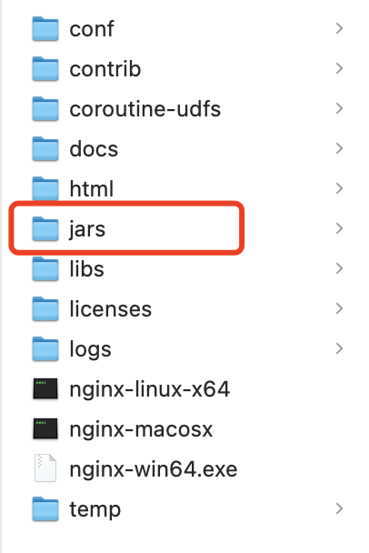

### 7. 修改nginx的配置

打开nginx-clojure-0.5.3/conf/nginx.conf文件，在server配置中增加一个location配置，内容如下，指定了handler类型，以及对应的java类：

```
location /java {
         content_handler_type 'java';
         content_handler_name 'com.collect.nginx.HelloHandler';
}
```

其他配置我们都不修改

### 8. 启动nginx

- 启动命令很简单，在nginx-clojure-0.5.3目录下执行./nginx
- 如果启动失败了，请打开nginx-clojure-0.5.2/logs/error.log查看问题，例如我这里遇到过端口占用导致启动失败：

### 9. 验证

-
打开postman验证服务是否正常，请求地址是[http://127.0.0.1:8080/java](https://link.juejin.cn/?target=http%3A%2F%2F127.0.0.1%3A8080%2Fjava)
- 响应如下图所示，符合预期，返回的就是咱们定制的HelloHandler的内容

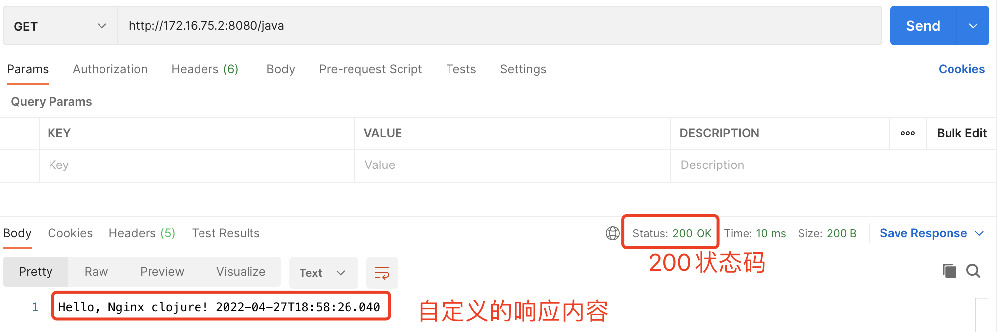

> 因为我的Nginx是安装在虚拟机的，所以请求地址不是本机

至此，nginx-clojure的helloworld就完成了

## 三、基础配置项

### 1. java进程数量

- 当nginx运行起来后，究竟有多少个java进程？这个应该是最需要弄清楚的问题，举个简单例子，当你的java代码在处理请求的时候，如果把一些信息放在内存中，想留给下一次请求使用，此时可能会让你失望了，因为处理下一个请求的进程可能是另一个
- 熟悉nginx的读者对配置项worker_processes应该不陌生，这是工作进程数的配置，而nginx-clojure的java进程数量就**等于**worker_processes的值
- 接下来实际验证一下，看看当前环境的nginx配置，如下图，worker_processes等于1：

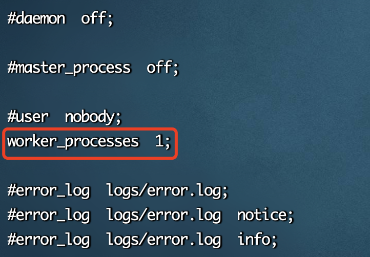

- 此时执行jps命令，如下图，只有一个进程64017(自行忽略我的nacos)：

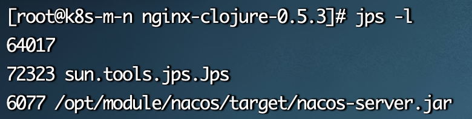

- 现在将worker_processes改为10，执行`nginx -s reload`重新加载配置，然后用jps查看，如下图，此时已经有了10个java进程：

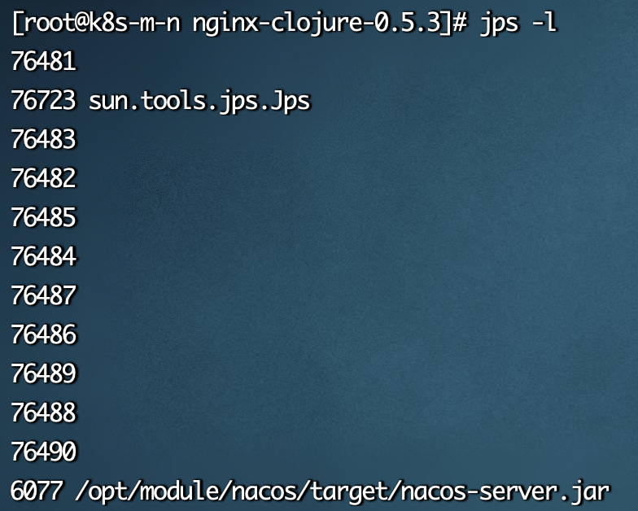

### 2. 配置项：jvm_path

`jvm_path`是个`http`配置项，一般情况下，咱们可以设置为auto，如果你的环境有多个jvm，也可以指定其中的一个，具体设置方法如下（是参考设置，要根据自己环境的情况调整）

1. windows：C:/Program Files/Java/jdk1.7.0_25/jre/bin/server/jvm.dll
2. macosx：/Library/Java/JavaVirtualMachines/jdk1.7.0_55.jdk/Contents/Home/jre/lib/server/libjvm.dylib
3. ubuntu：/usr/lib/jvm/java-7-oracle/jre/lib/amd64/server/libjvm.so
4. centos：/usr/java/jdk1.6.0_45/jre/lib/amd64/server/libjvm.so

### 3. 配置项：jvm_classpath

`jvm_classpath`是个`http`配置项，指定了java进程的classpath，咱们来看看nginx-clojure官方安装包的内部结构，如下图红框，有libs和jars两个目录，里面都有jar文件：

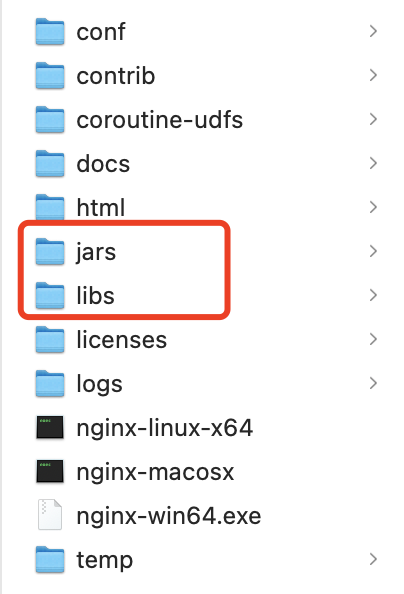

再看nginx-clojure官方安装包中的配置文件，如下图红框，与前面的两个文件夹对应，也就是说这两个文件夹内的所有jar都能被java进程加载：

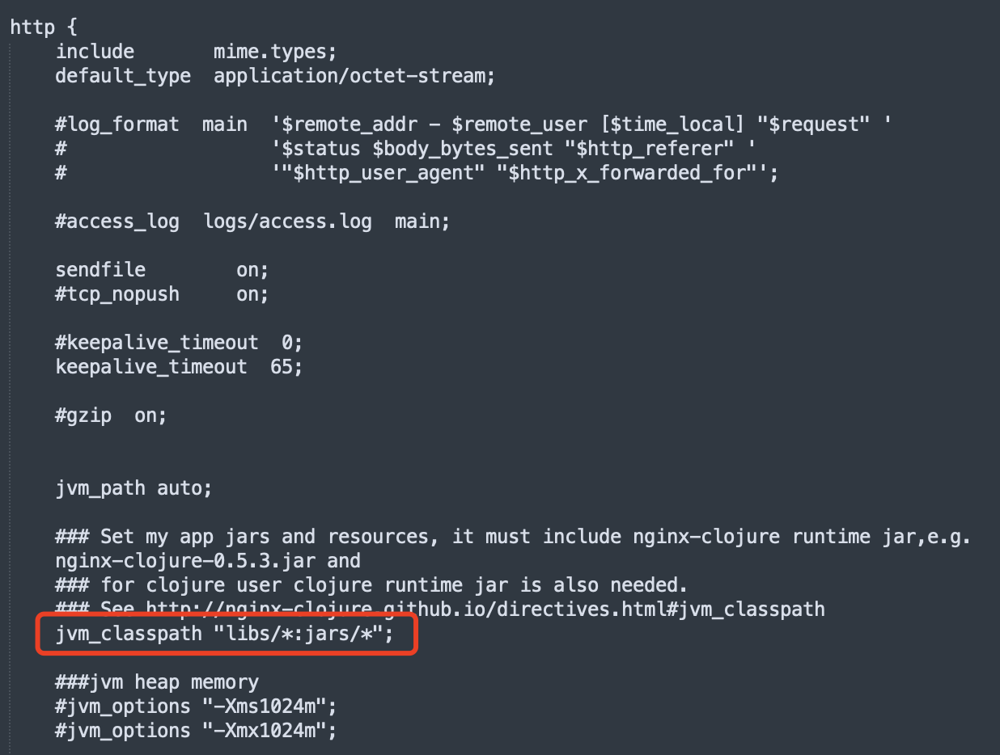

### 4. 配置项：jvm_var

- `jvm_var`是个`http`配置项，用来在配置中定义一个变量，可以个其他变量使用
- 假设我的jvm_classpath值原本是"/usr/local/nginx/libs/*:/usr/local/nginx/jars/"，可以用jvm_var做改造，将成下面这样，而jvm_classpath的真实值保持不变：

```shell
jvm_var nginxHome '/usr/local/nginx';
jvm_classpath "#{nginxHome}/libs/*:#{nginxHome}/jars/*";
```

- 咱们在写脚本和配置的时候经常会用到变量，jvm_var正好派上用场

### 5. 配置项：jvm_options

- `jvm_optionsoptions`是个`http`配置项，options参数是启动jvm最常用的参数了，这里的jvm_options承担的也是这个角色，不用多说，来看几个实际配置，聪明的您肯定秒懂：

```shell
# 启动堆内存
jvm_options -Xms250m;

# 最大堆内存
jvm_options -Xmx1024m;

# 线程栈大小
jvm_options -Xss128k;

# 系统变量，代码中可以获取改变量的值
jvm_options -Djava.awt.headless=true;
```

### 6. 配置项：jvm_handler_type

- jvm_handler_type是个http配置项，至于它的作用，咱们先来看一个location配置，如下图红框，需要有一个content_handler_type配置项指定类型：

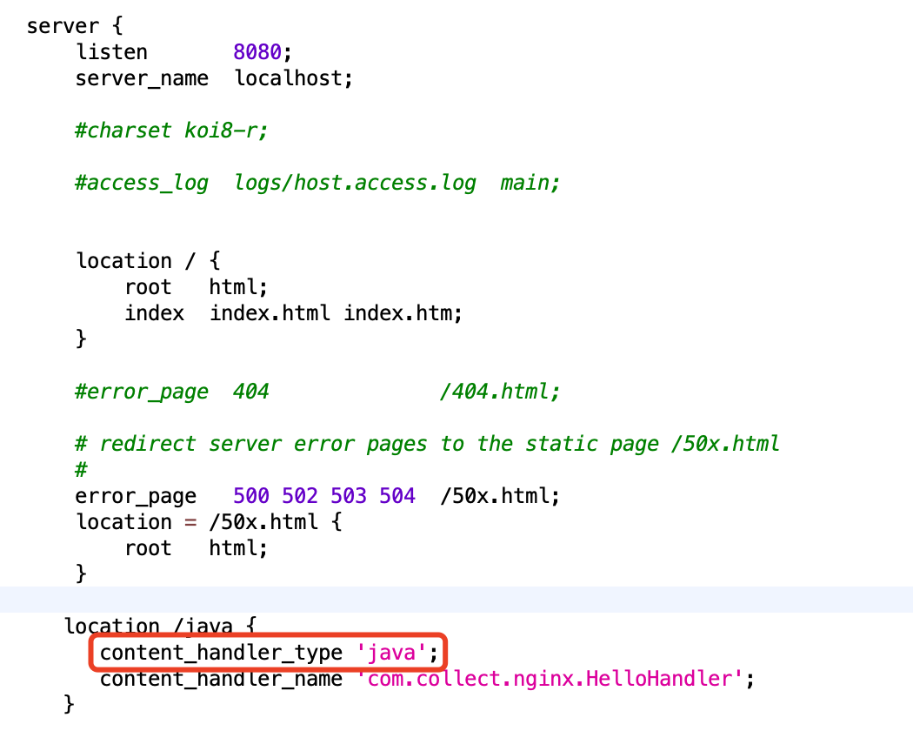

如果有多个location，而且都是java类型，岂不是每个location中都要写一个content_handler_type了？这时候，可以在http配置中增加jvm_handler_type配置项，指定location中的默认content_handler_type值，这样location中的content_handler_type就可以不写了，如下图：

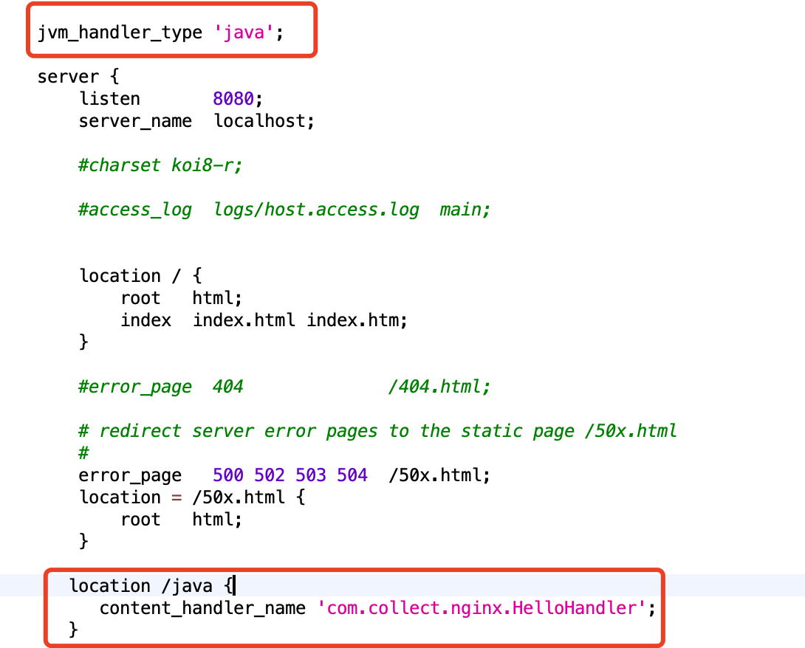