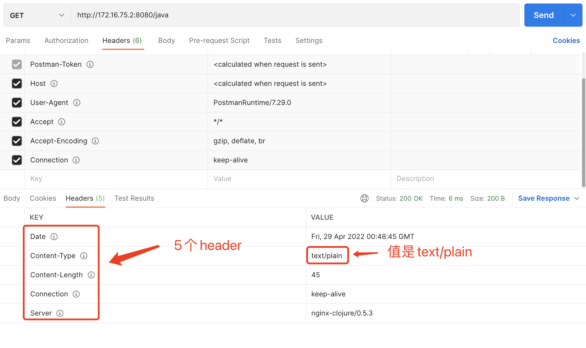
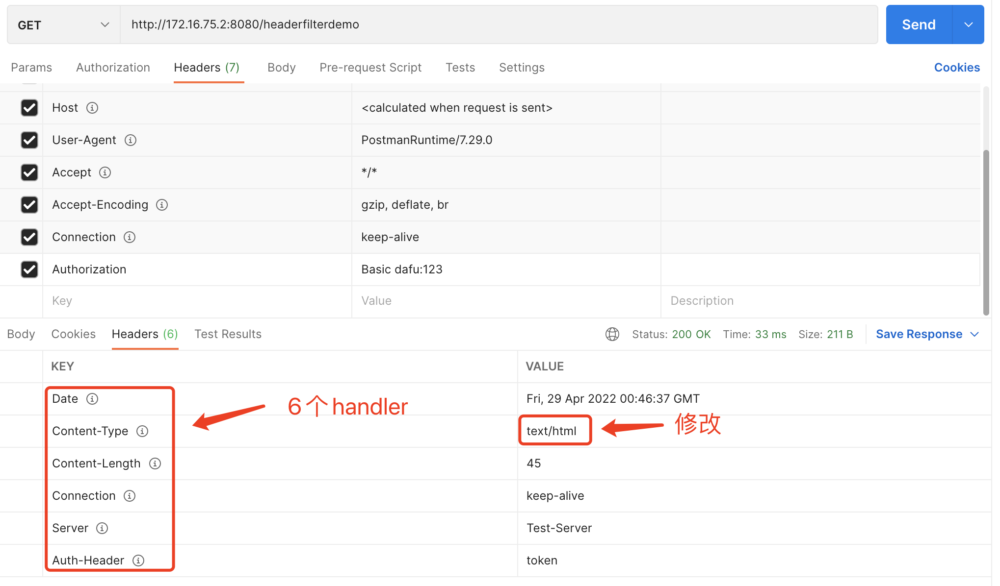
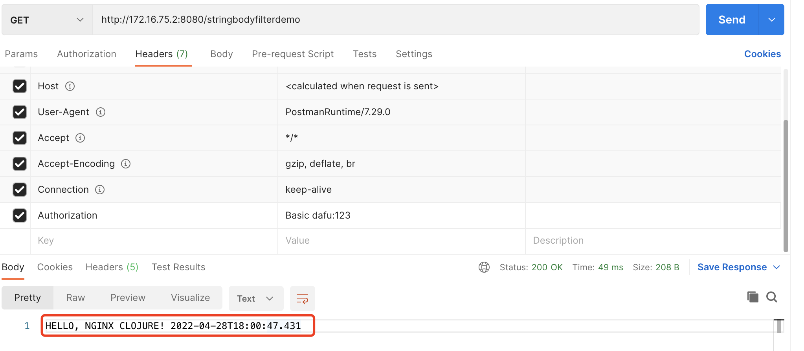
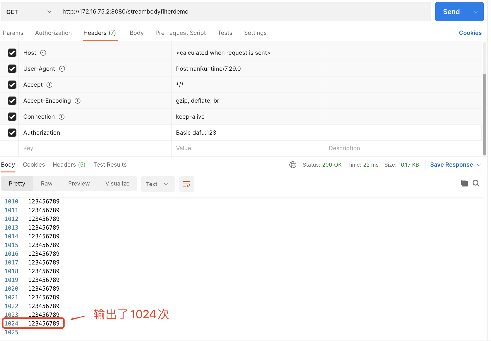

# Nginx扩展-两大filter

<!-- START doctoc generated TOC please keep comment here to allow auto update -->
<!-- DON'T EDIT THIS SECTION, INSTEAD RE-RUN doctoc TO UPDATE -->

- [一、Nginx Header Filter](#%E4%B8%80nginx-header-filter)
- [二、Nginx Body Filter](#%E4%BA%8Cnginx-body-filter)
    - [1. StringFacedJavaBodyFilter](#1-stringfacedjavabodyfilter)
    - [2. NginxJavaBodyFilter](#2-nginxjavabodyfilter)

<!-- END doctoc generated TOC please keep comment here to allow auto update -->

[TOC]

## 一、Nginx Header Filter

header filter顾名思义，是用于header处理的过滤器，它具有如下特点：

1. header filter是location级别的配置，可以开发一个header filter，然后配置在不同的location中使用
2. header filter必须实现NginxJavaHeaderFilter接口，功能代码写在doFilter方法中
3.
doFilter方法如果返回PHASE_DONE，nginx-clojure框架会继续执行其他的filter和handler，如果返回的不是PHASE_DONE，nginx-clojure框架就会把当前filter当做普通的content
handler来对待，将doFilter的返回值立即返回给客户端
4. 官方建议用header filter来动态处理response的header（增加、删除、修改header项）

先来请求一下最开始写的helloworld，看看结果：



接下来新增一个location，配置如下，content handler还是HelloHandler.java，增加了header_filter_type和header_filter_name：

```nginx
location /headerfilterdemo {
  content_handler_type 'java';
  content_handler_name 'com.collect.nginx.HelloHandler';

  # header filter的类型是java
  header_filter_type 'java';
  # header
  header_filter_name 'com.collect.nginx.RemoveAndAddMoreHeaders';
}
```

执行header filter功能的类是RemoveAndAddMoreHeaders.java，如下所示，修改了Content-Type，还增加了两个header项Xfeep-Header和Server：

```java
import nginx.clojure.java.Constants;
import nginx.clojure.java.NginxJavaHeaderFilter;

import java.util.Map;

/**
 * @description: 请求头过滤器
 * @date: 2022/4/28 17:02
 **/
public class RemoveAndAddMoreHeaders implements NginxJavaHeaderFilter {
    @Override
    public Object[] doFilter(int status, Map<String, Object> request, Map<String, Object> responseHeaders) {
        // 先删再加，相当于修改了Content-Type的值
        responseHeaders.remove("Content-Type");
        responseHeaders.put("Content-Type", "text/html");

        // 增加两个header
        responseHeaders.put("Auth-Header", "token");
        responseHeaders.put("Server", "Test-Server");

        // 返回PHASE_DONE表示告知nginx-clojure框架，当前filter正常，可以继续执行其他的filter和handler
        return Constants.PHASE_DONE;
    }
}
```

用postman请求/headerfilterdemo，并将响应的header与/java做对比，如下图，可见先删再加、添加都正常，另外，由于Server配置项本来就存在，所以filter中的put操作的结果就是修改了配置项的值：



到这里header filter就介绍完了，接下来要看的是body filter，顾名思义，这是用于处理响应body的过滤器，与header filter不同的是，由于响应body有不同的类型，因此body
filter也不能一概而论，需要分场景开发和使用

## 二、Nginx Body Filter

### 1. StringFacedJavaBodyFilter

Body Filter的作用很明确：修改原响应body的值，然后返回给客户端

如果响应的body是字符串，那么body filter相对简单一些，以下几个规则要注意：

1. 继承抽象类StringFacedJavaBodyFilter，
2. 处理一次web请求的时候，doFilter方法可能被调用多次，有个名为isLast的入参，作用是标记当前调用是不是最后一次（true表示最后一次）
3. doFilter方法的返回值与之前的NginxJavaRingHandler.invoke方法类似，是个一维数组，只有三个元素：status, headers,
   filtered_chunk，一旦status值不为空，nginx-clojure框架会用这次doFilter的返回值作为最后一次调用，返回给客户端
4. 结合2和3的特性，我们在编码时要注意了：假设一次web请求，doFilter会被调用10次（每次body入参的值都是整个response
   body的一部分），那么前9次的isLast都等于false，第10次的isLast等于true，假设第1次调用doFilter方法的时候返回的status不为空，就会导致后面9次的doFilter都不再被调用了！

接下来的实战再次用到之前的HelloHandler.java作为content handler，因为它返回的body是字符串

先增加一个location配置，body_filter_type和body_filter_name是body filter的配置项：

```nginx
# body filter的demo，response body是字符串类型
location /stringbodyfilterdemo {
  content_handler_type 'java';
  content_handler_name 'com.collect.nginx.HelloHandler';

  # body filter的类型是java
  body_filter_type 'java';
  # body filter的类
  body_filter_name 'com.collect.nginx.StringFacedUppercaseBodyFilter';
}
```

StringFacedUppercaseBodyFilter.java源码如下（请重点阅读注释），可见该filter的功能是将原始body改为大写，并且，代码中检查了isLast的值，isLast等于false的时候，status的值保持为null，这样才能确保doFilter的调用不会提前结束，如此才能返回完整的body：

```java
import nginx.clojure.java.StringFacedJavaBodyFilter;

import java.io.IOException;
import java.util.Map;

/**
 * @description: 请求响应过滤器 string
 * @date: 2022/4/28 17:11
 **/
public class StringFacedUppercaseBodyFilter extends StringFacedJavaBodyFilter {
    @Override
    protected Object[] doFilter(Map<String, Object> request, String body, boolean isLast) throws IOException {
        if (isLast) {
            // isLast等于true，表示当前web请求过程中最后一次调用doFilter方法，
            // body是完整response body的最后一部分，
            // 此时返回的status应该不为空，这样nginx-clojure框架就会完成body filter的执行流程，将status和聚合后的body返回给客户端
            return new Object[]{200, null, body.toUpperCase()};
        } else {
            // isLast等于false，表示当前web请求过程中，doFilter方法还会被继续调用，当前调用只是多次中的一次而已，
            // body是完整response body的其中一部分，
            // 此时返回的status应该为空，这样nginx-clojure框架就继续body filter的执行流程，继续调用doFilter
            return new Object[]{null, null, body.toUpperCase()};
        }
    }
}
```

编译，构建，部署之后，用postman访问/stringbodyfilterdemo，得到的响应如下，可见body的内容已经全部大写了，符合预期：



### 2. NginxJavaBodyFilter

当响应body是二进制流的时候，如果想对响应body做读写操作，nginx-clojure的建议是在body filter中执行，这种body filter是专门用在二进制流body的场景下，有以下特点：

1. 实现接口NginxJavaBodyFilter（注意区别：字符串body的filter是继承抽象类StringFacedJavaBodyFilter），
2. 处理一次web请求的时候，doFilter方法可能被调用多次，有个名为isLast的入参，作用是标记当前调用是不是最后一次（true表示最后一次）
3. doFilter方法的返回值与之前的NginxJavaRingHandler.invoke方法类似，是个一维数组，只有三个元素：status, headers,
   filtered_chunk，一旦status值不为空，nginx-clojure框架会用这次doFilter的返回值作为最后一次调用，返回给客户端
4. 结合2和3的特性，我们在编码时要注意了：假设一次web请求，doFilter会被调用10次（每次body入参的值都是整个response
   body的一部分），那么前9次的isLast都等于false，第10次的isLast等于true，假设第1次调用doFilter方法的时候返回的status不为空，就会导致后面9次的doFilter都不再被调用了！
5. doFilter方法有个入参名为bodyChunk，这表示真实响应body的一部分(假设一次web请求有十次doFilter调用，可以将每次doFilter的bodyChunk认为是完整响应body的十分之一)
   ，这里有个重点注意的地方：bodyChunk只在当前doFilter执行过程中有效，**不要将bodyChunk保存下来用于其他地方（例如放入body filter的成员变量中）**
6. 继续看doFilter方法的返回值，刚刚提到返回值是一维数组，只有三个元素：status, headers, filtered_chunk，对于status和headers，如果之前已经设置好了（例如content
   handler或者header filter中），那么此时返回的status和headers值就会被忽略掉（也就是说，其实nginx-clojure框架只判断status是否为空，用于结束body
   filter的处理流程，至于status的具体值是多少并不关心）
7. 再看doFilter方法的返回值的第三个元素filtered_chunk，它可以是以下四种类型之一：

- File, viz. java.io.File
- String
- InputStream
- Array/Iterable, e.g. Array/List/Set of above types

首先是开发一个返回二进制流的web接口，为了简单省事儿，直接用nginx-clojure的另一个能力来实现：clojure类型的服务，在nginx.conf中添加以下内容即可，代码虽然不是java但也能勉强看懂（能看懂就行，毕竟不是重点），就是持续写入1024行字符串，每行的内容都是'123456789'
：

```groovy
location / largebody {
    content_handler_type 'clojure';
    content_handler_code '
    ( do
    (use \ '[nginx.clojure.core])
    (fn[req]
            {
                : status 200
                : headers {}
                : body(
                for
                [i(range 1024)] "123456789\n" )
            })
    ) ';
}
```

接下来是重点面向二进制流的body filter，StreamFacedBodyFilter.java，用来处理二进制流的body filter，可见这是非常简单的逻辑，可以按照实际需要去使用这个InputStream：

```java
import nginx.clojure.NginxChainWrappedInputStream;
import nginx.clojure.NginxClojureRT;
import nginx.clojure.java.NginxJavaBodyFilter;

import java.io.IOException;
import java.io.InputStream;
import java.util.Map;

/**
 * @description: 请求响应过滤器 stream
 * @date: 2022/4/28 17:18
 **/
public class StreamFacedBodyFilter implements NginxJavaBodyFilter {

    @Override
    public Object[] doFilter(Map<String, Object> request, InputStream bodyChunk, boolean isLast) throws IOException {
        // 这里仅将二进制文件长度打印到日志，您可以按照业务实际情况自行修改
        NginxClojureRT.log.info("isLast [%s], total [%s]", String.valueOf(isLast), String.valueOf(bodyChunk.available()));

        // NginxChainWrappedInputStream的成员变量index记录的读取的位置，本次用完后要重置位置，因为doFilter之外的代码中可能也会读取bodyChunk
        ((NginxChainWrappedInputStream) bodyChunk).rewind();

        if (isLast) {
            // isLast等于true，表示当前web请求过程中最后一次调用doFilter方法，
            // body是完整response body的最后一部分，
            // 此时返回的status应该不为空，这样nginx-clojure框架就会完成body filter的执行流程，将status和聚合后的body返回给客户端
            return new Object[]{200, null, bodyChunk};
        } else {
            // isLast等于false，表示当前web请求过程中，doFilter方法还会被继续调用，当前调用只是多次中的一次而已，
            // body是完整response body的其中一部分，
            // 此时返回的status应该为空，这样nginx-clojure框架就继续body filter的执行流程，继续调用doFilter
            return new Object[]{null, null, bodyChunk};
        }
    }
}
```

还要在nginx.conf上做好配置，让StreamFacedBodyFilter处理/largebody返回的body，如下所示，新增一个接口/streambodyfilterdemo，该接口会直接透传到/largebody，而且会用StreamFacedBodyFilter处理响应body：

```nginx
location /streambodyfilterdemo {
  # body filter的类型是java
  body_filter_type java;
  body_filter_name 'com.collect.nginx.StreamFacedBodyFilter';
  proxy_http_version 1.1;
  proxy_buffering off;
  proxy_pass http://localhost:8080/largebody;
}
```

写完后，编译出jar文件，复制到jars目录下，重启nginx

在postman上访问/streambodyfilterdemo，响应如下，符合预期：



再检查文件nginx-clojure-0.5.3/logs/error.log，见到了StreamFacedBodyFilter的日志，证明body
filter确实已经生效，另外还可以看出一次请求中，StreamFacedBodyFilter对象的doFilter方法会被neginx-clojure多次调用：

```
2022-04-28 18:11:22[info][52634][main]isLast [false], total [3929]
2022-04-28 18:11:22[info][52634][main]isLast [false], total [4096]
2022-04-28 18:11:22[info][52634][main]isLast [false], total [2215]
2022-04-28 18:11:22[info][52634][main]isLast [true], total [0]
```

