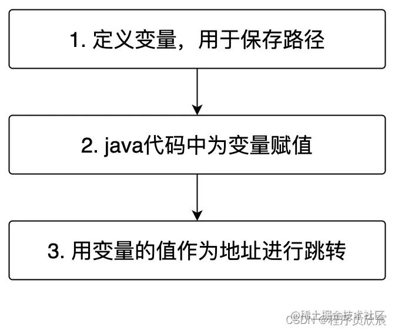
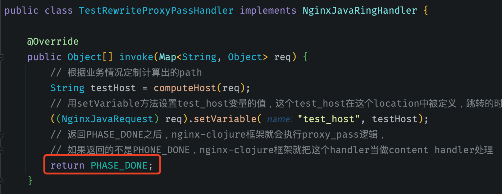
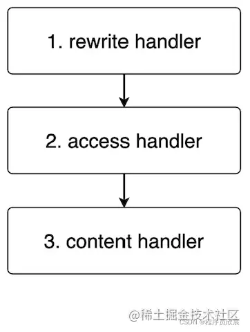

# Nginx扩展-五大handler

<!-- START doctoc generated TOC please keep comment here to allow auto update -->
<!-- DON'T EDIT THIS SECTION, INSTEAD RE-RUN doctoc TO UPDATE -->

- [一、Initialization Handler（初始化）](#%E4%B8%80initialization-handler%E5%88%9D%E5%A7%8B%E5%8C%96)
- [二、Content Ring Handler（location对应的业务处理）](#%E4%BA%8Ccontent-ring-handlerlocation%E5%AF%B9%E5%BA%94%E7%9A%84%E4%B8%9A%E5%8A%A1%E5%A4%84%E7%90%86)
- [三、Nginx Rewrite Handler（地址重定向）](#%E4%B8%89nginx-rewrite-handler%E5%9C%B0%E5%9D%80%E9%87%8D%E5%AE%9A%E5%90%91)
- [四、Nginx Access Handler（鉴权）](#%E5%9B%9Bnginx-access-handler%E9%89%B4%E6%9D%83)
- [五、Nginx Log Handler（日志输出）](#%E4%BA%94nginx-log-handler%E6%97%A5%E5%BF%97%E8%BE%93%E5%87%BA)

<!-- END doctoc generated TOC please keep comment here to allow auto update -->

[TOC]

## 一、Initialization Handler（初始化）

Initialization Handler，顾名思义，是用于执行初始化逻辑的handler，它在nginx配置中是http级别的，有以下几个特性：

1. 每个worker都是独立的进程，启动的时候都会调用一次Initialization Handler
2. Initialization Handler也是NginxJavaRingHandler接口的实现类，其invoke方法会被调用，所以初始化逻辑代码应该写在invoke方法中

接下来写代码试试，新增TestInitHandler.java，代码如下：

```java
import nginx.clojure.NginxClojureRT;
import nginx.clojure.java.NginxJavaRingHandler;

import java.io.IOException;
import java.util.Map;

/**
 * @description: 初始化处理器
 * @date: 2022/4/27 17:20
 **/
public class TestInitHandler implements NginxJavaRingHandler {
    @Override
    public Object[] invoke(Map<String, Object> map) throws IOException {
        // 可以根据实际需求执行初始化操作，这里作为演示，只打印日志
        NginxClojureRT.log.info("TestInitHandler.invoke executed");
        return new Object[0];
    }
}
```

用命令`mvn clean package -U`，生成名为`nginx-clojure-demo-1.0-SNAPSHOT.jar`的文件，将其放入nginx的**jars**目录下

再在`nginx.conf`的`http`配置中增加以下两行配置：

```
jvm_handler_type 'java';
jvm_init_handler_name 'com.collect.nginx.TestInitHandler'; 
```

重启nginx，打开logs/error.log文件，发现里面新增一行日志，这就是初始化日志：

```
2022-04-27 20:22:50[info][24737][main]TestInitHandler.invoke executed
```

如果之前部署的location还在，可以用postman发请求试试，应该可以正常响应，表示nginx的worker已经正常工作

## 二、Content Ring Handler（location对应的业务处理）

content handler是最常用的handler，这是个location配置，定义了nginx收到某个请求后应该如何处理，前面的文章中已经用到了

现在咱们再写一个content handler，与之前不同的是新增了配置项content_handler_property，该配置项可以添加自定义配置，整个location如下所示：

```
location /contentdemo {
	content_handler_type 'java';
  # 第一个自定义属性
  content_handler_property foo.name 'foo.value';
  # 第二个自定义属性
  content_handler_property bar.name 'bar.value';
  # 逻辑处理类
  content_handler_name 'com.collect.nginx.TestContentHandler';
} 
```

从上面的配置可见，通过content_handler_property增加了两个配置项，名字分别是foo.name和bar.name

再来看TestContentHandler类的源码，重点是实现了Configurable接口，然后在config方法被调用的时候，入参map中保存的就是content_handler_property配置的key和value了，在invoke方法中可以直接使用：

```java
import nginx.clojure.Configurable;
import nginx.clojure.java.ArrayMap;
import nginx.clojure.java.NginxJavaRingHandler;

import java.io.IOException;
import java.time.LocalDateTime;
import java.util.Map;

import static nginx.clojure.MiniConstants.CONTENT_TYPE;
import static nginx.clojure.MiniConstants.NGX_HTTP_OK;

/**
 * @description: 内容处理器
 * @date: 2022/4/27 17:21
 **/
public class TestContentHandler implements NginxJavaRingHandler, Configurable {

    private Map<String, String> config;

    /**
     * location中配置的content_handler_property属性会通过此方法传给当前类
     *
     * @param map map
     */
    @Override
    public void config(Map<String, String> map) {
        this.config = map;
    }

    @Override
    public Object[] invoke(Map<String, Object> map) throws IOException {
        String body = "From TestContentHandler, "
                + LocalDateTime.now()
                + ", foo : "
                + config.get("foo.name")
                + ", bar : "
                + config.get("bar.name");

        return new Object[]{
                // http status 200
                NGX_HTTP_OK,
                // headers map
                ArrayMap.create(CONTENT_TYPE, "text/plain"),
                body
        };
    }

}
```

编译、配置、重启nginx，再用postman访问/contentdemo，响应如下，可见符合预期，content_handler_property配置的值可以在invoke方法中使用：

```
From TestContentHandler, 2022-04-27T23:18:27.802, foo : foo.value, bar : bar.value
```

## 三、Nginx Rewrite Handler（地址重定向）

- rewrite handler顾名思义，就是咱们常在nginx上配置的rewrite功能，在nginx-clojure中又略有不同，为了方便记忆，这里将整个rewrite分为三段处理：



一个完整的rewrite handler，这些内容都是写在`server`配置内的：

```
# 1. 定义变量，用于保存路径
set $test_host "";
location /testproxy {
  rewrite_handler_type 'java';
  # 2. java代码中为变量赋值
  rewrite_handler_name 'com.collect.nginx.TestRewriteProxyPassHandler';
  # 3. 用变量的值作为地址进行跳转
  proxy_pass $test_host;
} 
```

- 对应的TestContentHandler.java如下：

```java
import nginx.clojure.NginxClojureRT;
import nginx.clojure.java.NginxJavaRequest;
import nginx.clojure.java.NginxJavaRingHandler;

import java.util.Map;

import static nginx.clojure.java.Constants.PHASE_DONE;

/**
 * @description: 重定向处理器
 * @date: 2022/4/27 17:23
 **/
public class TestRewriteProxyPassHandler implements NginxJavaRingHandler {

    @Override
    public Object[] invoke(Map<String, Object> req) {
        // 根据业务情况定制计算出的path
        String testHost = computeHost(req);
        // 用setVariable方法设置test_host变量的值，这个test_host在这个location中被定义，跳转的时候就用这个值作为path
        ((NginxJavaRequest) req).setVariable("test_host", testHost);
        // 返回PHASE_DONE之后，nginx-clojure框架就会执行proxy_pass逻辑，
        // 如果返回的不是PHONE_DONE，nginx-clojure框架就把这个handler当做content handler处理
        return PHASE_DONE;
    }

    /**
     * 这里写入业务逻辑，根据实际情况确定返回的path
     *
     * @param req req
     * @return host
     */
    private String computeHost(Map<String, Object> req) {
        // 确认是http还是https
        String scheme = (String) req.get("scheme");
        // 确认端口号
        String serverPort = (String) req.get("server-port");

        // /contentdemo是nginx.conf中配置的一个location，您可以根据自己的业务情况来决定返回值
        String testHost = scheme + "://127.0.0.1:" + serverPort + "/contentdemo";
        NginxClojureRT.log.info("pass address [" + testHost + "]");

        return testHost;
    }
}
```

编译构建运行起来，用postman访问/myproxy，效果如下图，从返回结果可见请求被成功转发到/contentdemo：

```
From TestContentHandler, 2022-04-27T23:25:39.490, foo : foo.value, bar : bar.value
```

此刻，你可能想到了：既然rewrite handler的逻辑代码可以自己用java写，那意味着可以按照自己的业务需求随意定制，那岂不是自己可以在nginx上写一个负载均衡的功能出来了？没错，官方也是这么说的。

如果环境中有注册中心，例如eureka或者nacos，还可以取得后台服务列表，这样，不光是负载均衡，各种转发调度逻辑都可以在nginx上开发出来了

还有一点要注意的，下图是刚才写的TestRewriteProxyPassHandler.java的源码，注意红框位置，是invoke方法的返回值，如果返回的不是PHASE_DONE，nginx-clojure框架就不再执行后面poss_proxy操作，而是把此handler当做普通的content
handler来处理了：



## 四、Nginx Access Handler（鉴权）

access handler的定位，是用于执行鉴权相关的逻辑

其实看过了前面的rewrite handler，应该会想到：rewrite handler既可以重定向，也可以直接返回code和body，那岂不是直接用来做鉴权？鉴权不通过就在rewrite handler上返回401
（Unauthorized）或者403 （Forbidden）

从技术实现的角度来看，说得没错，access handler来自nginx-clojure对功能和职责的划分，官方建议将鉴权的工作都交给access handler来做

正常情况下，一次请求被前面几种handler执行的顺序如下：



写一个access handler的配置和代码验证试试，为了省事儿，就在前面rewrite handler的基础上改动吧

首先是配置，如下所示，在刚才的rewrite
handler的配置中，增加了access_handler_type和access_handler_name，这就意味着该location的请求，先由MyRewriteProxyPassHandler处理，再交给BasicAuthHandler处理，如果鉴权通过，才会交给proxy_pass处理：

```
# 1. 定义变量，用于保存路径
set $test_host "";
location /testproxy {
  # 指定access handler的类型是java
  access_handler_type 'java';
  # 指定access handler的执行类类
  access_handler_name 'com.collect.nginx.BasicAuthHandler';

  rewrite_handler_type 'java';
  # 2. java代码中为变量赋值
  rewrite_handler_name 'com.collect.nginx.TestRewriteProxyPassHandler';
  # 3. 用变量的值作为地址进行跳转
  proxy_pass $test_host;
}
```

BasicAuthHandler.java的内容如下，已添加详细注释，就不多赘述了：

```java
import nginx.clojure.java.ArrayMap;
import nginx.clojure.java.NginxJavaRingHandler;

import java.util.Map;

import static nginx.clojure.MiniConstants.HEADERS;
import static nginx.clojure.java.Constants.PHASE_DONE;

/**
 * @description: 鉴权处理器
 * @date: 2022/4/28 14:33
 **/
public class BasicAuthHandler implements NginxJavaRingHandler {

    @Override
    public Object[] invoke(Map<String, Object> request) {
        // 从header中获取Authorization字段
        String auth = (String) ((Map<?, ?>) request.get(HEADERS)).get("Authorization");

        // 如果header中没有Authorization，就返回401错误，并带上body
        if (auth == null) {
            return new Object[]{401, ArrayMap.create("www-authenticate", "Basic realm=\"Secure Area\""),
                    "<HTML><BODY><H1>401 Unauthorized.</H1></BODY></HTML>"};
        }

        // Authorization 应该是 : Basic dafu:123，所以这里先将"Basic "去掉，然后再用":"分割
        String[] up = auth.substring("Basic ".length()).split(":");

        // 只是为了演示，所以账号和密码的检查逻辑在代码中是写死的，
        // 如果账号等于"dafu"，并且密码等于"123"，就返回PHASE_DONE，这样nginx-clojure就会继续执行后面的content handler
        if (up[0].equals("dafu") && up[1].equals("123")) {
            return PHASE_DONE;
        }

        // 如果账号密码校验不过，就返回401，body内容是提示账号密码不过
        return new Object[]{401, ArrayMap.create("www-authenticate", "Basic realm=\"Secure Area\""),
                "<HTML><BODY><H1>401 Unauthorized BAD USER & PASSWORD.</H1></BODY></HTML>"};
    }
}
```

测试内容就省略了，可以自行测试

## 五、Nginx Log Handler（日志输出）

最后一个handler是作为辅助作用的日志输出，尽管在其他handler中，我们可以直接调用NginxClojureRT.log方法将日志输出到error.log文件中，但还是可以猜出官方定义Log Handler的用意：

1. 明确划分各个handler的职责
2. 让日志与业务功能解耦合，让Log Handler做纯粹的日志输出工作
3. 日志模块偏向于组件化，各个location可以按照需求选择用或者不用，而且还可以设计成多个location复用

另外Log Handler也有属于自己的特性：

1. 依旧是NginxJavaRingHandler接口的实现，invoke方法被执行的时机是request被销毁前
2. 有专用的配置属性log_handler_property
3. invoke方法的返回值**无意义，会被nginx-clojure忽略**

接下来通过实例学习log handler，找到前面的content
handler的demo，给它加上日志输出试试，将配置文件修改如下，可见增加了log_handler_name用于指定日志输出的执行类，另外还有两个log_handler_property配置项作为自定义属性传入：

```
location /contentdemo {
  content_handler_type 'java';
  # 第一个自定义属性
  content_handler_property foo.name 'foo.value';
  # 第二个自定义属性
  content_handler_property bar.name 'bar.value';
  # 逻辑处理类
  content_handler_name 'com.collect.nginx.TestContentHandler';

  # log handler类型是java
  log_handler_type java;
  # log handler的执行类
  log_handler_name 'com.collect.nginx.TestLogHandler';
  # 自定义属性，在TestLogHandler中作为是否打印User Agent的开关
  log_handler_property log.user.agent on;
  # 自定义属性，在TestLogHandler中作为日志目录
  log_handler_property log.file.path logs/contentdemo.log;
} 
```

- 对应的TestLogHandler.java，有几处要注意的地方稍后会提到：

```java
import nginx.clojure.Configurable;
import nginx.clojure.NginxClojureRT;
import nginx.clojure.java.NginxJavaRequest;
import nginx.clojure.java.NginxJavaRingHandler;

import java.io.File;
import java.io.FileOutputStream;
import java.io.IOException;
import java.util.Map;

/**
 * @description: 日志处理器
 * @date: 2022/4/28 14:40
 **/
public class TestLogHandler implements NginxJavaRingHandler, Configurable {

    /**
     * 是否将User Agent打印在日志中
     */
    private boolean logUserAgent;

    /**
     * 日志文件路径
     */
    private String filePath;

    @Override
    public Object[] invoke(Map<String, Object> request) throws IOException {
        File file = new File(filePath);
        NginxJavaRequest r = (NginxJavaRequest) request;
        try (FileOutputStream out = new FileOutputStream(file, true)) {
            String msg = String.format("%s - %s [%s] \"%s\" %s \"%s\" %s %s\n",
                    r.getVariable("remote_addr"),
                    r.getVariable("remote_user", "x"),
                    r.getVariable("time_local"),
                    r.getVariable("request"),
                    r.getVariable("status"),
                    r.getVariable("body_bytes_sent"),
                    r.getVariable("http_referer", "x"),
                    logUserAgent ? r.getVariable("http_user_agent") : "-");
            out.write(msg.getBytes("utf8"));
        }
        return new Object[0];
    }

    @Override
    public void config(Map<String, String> properties) {
        logUserAgent = "on".equalsIgnoreCase(properties.get("log.user.agent"));
        filePath = properties.get("log.file.path");
        NginxClojureRT.log.info("TestLogHandler, logUserAgent [" + logUserAgent + "], filePath [" + filePath + "]");
    }
}
```

上述代码中，有下面几处地方要注意：

1. 以上代码来自官方demo，我这里做了点小的改动(主要是文件路径改为外部参数传入)
2. 整体功能是取出请求和响应的一些参数，打印在日志文件中
3. logUserAgent参数控制了user agent是否打印，这个比较实用，可以通过配置来做一些开关控制
4. 这个demo**不要用于生产环境**，从代码可以看出，每一次请求都做了一次io操作，这是存在性能隐患的，官方的demo只是展示log handler的作用而已，看看就好

编译构建部署运行，请求后去logs目录下查看，发现新增了contentdemo.log文件，内容如下，postman自带的header参数已经被成功获取并打印在日志中了：

```
172.16.75.1 - x [27/Apr/2022:23:51:24 -0700] "GET /contentdemo HTTP/1.1" 200 "82" x PostmanRuntime/7.29.0
```

> 这里可能会出现目录权限不足的情况，权限目录不足则需要给logs目录添加权限

至此，五大handler咱们已经全部实战体验过了，对nginx-clojure的主要能力已经熟悉。