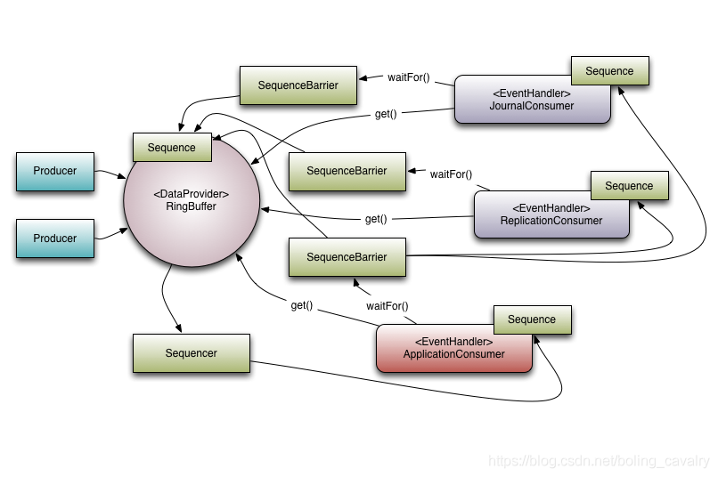

# disruptor-Disruptor类分析
[TOC]

## 零、开篇

通过前文的实战，咱们对Disruptor有了初步认识，借助com.lmax.disruptor.dsl.Disruptor类可以轻松完成以下操作：

1. 环形队列初始化
2. 指定事件消费者

3. 启动消费者线程

接下来要面对两个问题：

1. 深入了解Disruptor类是如何完成上述操作的；
2. 对Disruptor类有了足够了解时，尝试不用Disruptor，自己动手操作环形队列，实现消息的生产和消费，这样做的目的是加深对Disruptor内部的认识，做到知其所以然；

接下来咱们先解决第一个问题吧，结合Disruptor对象的源码来看看上述三个操作到底做了什么。

## 一、环形队列初始化

环形队列初始化发生在实例化Disruptor对象的时候，即Disruptor的构造方法：

```java
public Disruptor(final EventFactory<T> eventFactory, final int ringBufferSize, final ThreadFactory threadFactory)
{
  this(RingBuffer.createMultiProducer(eventFactory, ringBufferSize), new BasicExecutor(threadFactory));
}
```

RingBuffer.createMultiProducer方法内部实例化了RingBuffer：

```java
public static <E> RingBuffer<E> createMultiProducer(
  EventFactory<E> factory,
  int bufferSize,
  WaitStrategy waitStrategy)
{
  MultiProducerSequencer sequencer = new MultiProducerSequencer(bufferSize, waitStrategy);

  return new RingBuffer<E>(factory, sequencer);
}
```

- 记下第一个重要知识点：创建RingBuffer对象。

## 二、指定事件消费者

在前文中，下面这行代码指定了事件由StringEventHandler消费：

```java
disruptor.handleEventsWith(new StringEventHandler(eventCountPrinter));
```

查看handleEventsWith方法的内部：

```java
@SafeVarargs
public final EventHandlerGroup<T> handleEventsWith(final EventHandler<? super T>... handlers)
{
  return createEventProcessors(new Sequence[0], handlers);
}
```

展开createEventProcessors方法，如下图，请重点关注创建SequenceBarrier和BatchEventProcessor等操作：

```java
EventHandlerGroup<T> createEventProcessors(
  final Sequence[] barrierSequences,
  final EventHandler<? super T>[] eventHandlers)
{
  checkNotStarted();

  // 创建SequenceBarrier
  final Sequence[] processorSequences = new Sequence[eventHandlers.length];
  final SequenceBarrier barrier = ringBuffer.newBarrier(barrierSequences);

  for (int i = 0, eventHandlersLength = eventHandlers.length; i < eventHandlersLength; i++)
  {
    final EventHandler<? super T> eventHandler = eventHandlers[i];

    // 创建BatchEventProcessor
    final BatchEventProcessor<T> batchEventProcessor =
      new BatchEventProcessor<>(ringBuffer, barrier, eventHandler);

    if (exceptionHandler != null)
    {
      // 绑定异常处理类
      batchEventProcessor.setExceptionHandler(exceptionHandler);
    }

    consumerRepository.add(batchEventProcessor, eventHandler, barrier);
    processorSequences[i] = batchEventProcessor.getSequence();
  }

  // 需要重点关注
  updateGatingSequencesForNextInChain(barrierSequences, processorSequences);

  return new EventHandlerGroup<>(this, consumerRepository, processorSequences);
}
```

updateGatingSequencesForNextInChain方法如下，ringBuffer.addGatingSequences需要重点关注：

```java
private void updateGatingSequencesForNextInChain(final Sequence[] barrierSequences, final Sequence[] processorSequences)
{
  if (processorSequences.length > 0)
  {
    // 这里将消费者的 Sequences 传给了 RingBuffer
    // 这样才能做好消费者和和生产者的数据协调
    ringBuffer.addGatingSequences(processorSequences);
    for (final Sequence barrierSequence : barrierSequences)
    {
      ringBuffer.removeGatingSequence(barrierSequence);
    }
    consumerRepository.unMarkEventProcessorsAsEndOfChain(barrierSequences);
  }
}
```

小结一下，disruptor.handleEventsWith方法涉及到四个重要知识点：

1. 创建SequenceBarrier对象，用于接收ringBuffer中的可消费事件
2. 创建BatchEventProcessor，负责消费事件
3. 绑定BatchEventProcessor对象的异常处理类
4. 调用ringBuffer.addGatingSequences，将消费者的Sequence传给ringBuffer

## 三、启动消费者线程

前文已通过日志确定了消费事件的逻辑是在一个独立的线程中执行的，启动消费者线程的代码如下：

```java
disruptor.start();
```

展开start方法，如下可见，关键代码是consumerInfo.start(executor)：

```java
public RingBuffer<T> start()
{
  checkOnlyStartedOnce();
  for (final ConsumerInfo consumerInfo : consumerRepository)
  {
    consumerInfo.start(executor);
  }

  return ringBuffer;
}
```

ConsumerInfo是接口，对应的实现类有EventProcessorInfo和WorkerPoolInfo两种，这里应该是哪种呢？既然来源是consumerRepository，这就要看当初是怎么存入consumerRepository的，前面在分析createEventProcessors方法时，consumerRepository.add被忽略了，现在需要进去看看；进去后一目了然，可见ConsumerInfo的实现是EventProcessorInfo：

```java
public void add(
  final EventProcessor eventprocessor,
  final EventHandler<? super T> handler,
  final SequenceBarrier barrier)
{
  // 这里可以看到，consumerInfo 的实现类是 EventProcessorInfo
  final EventProcessorInfo<T> consumerInfo = new EventProcessorInfo<>(eventprocessor, handler, barrier);
  eventProcessorInfoByEventHandler.put(handler, consumerInfo);
  eventProcessorInfoBySequence.put(eventprocessor.getSequence(), consumerInfo);
  consumerInfos.add(consumerInfo);
}
```

所以，回到前面对consumerInfo.start(executor)方法的分析，这里要看的就是EventProcessorInfo的start方法了，如下，非常简单，就是启动一个线程执行eventprocessor（这个eventprocessor是BatchEventProcessor对象）：

```java
private final EventProcessor eventprocessor;

@Override
public void start(final Executor executor)
{
  executor.execute(eventprocessor);
}
```

小结一下，disruptor.start方法涉及到一个重要知识点：

**启动独立线程，用来执行消费事件的业务逻辑**

## 四、消费事件的逻辑

为了理解消息处理逻辑，还要重点关注BatchEventProcessor.processEvents方法，如下图所示，其实也很简单，就是不停的从环形队列取出可用的事件，然后再更新自己的Sequence，相当于标记已经消费到哪里了：

```java
private void processEvents()
{
  T event = null;
  // 找到取事件的位置
  long nextSequence = sequence.get() + 1L;

  while (true)
  {
    try
    {
      // 等待该位置的事件可消费
      final long availableSequence = sequenceBarrier.waitFor(nextSequence);
      if (batchStartAware != null)
      {
        batchStartAware.onBatchStart(availableSequence - nextSequence + 1);
      }

      while (nextSequence <= availableSequence)
      {
        // 取出事件
        event = dataProvider.get(nextSequence);
        // 消费事件
        eventHandler.onEvent(event, nextSequence, nextSequence == availableSequence);
        nextSequence++;
      }

      // 更新位置，下次从新的位置开始
      sequence.set(availableSequence);
    }
    catch (final TimeoutException e)
    {
      notifyTimeout(sequence.get());
    }
    catch (final AlertException ex)
    {
      if (running.get() != RUNNING)
      {
        break;
      }
    }
    catch (final Throwable ex)
    {
      handleEventException(ex, nextSequence, event);
      sequence.set(nextSequence);
      nextSequence++;
    }
  }
}
```

## 五、总结

最后总结Disruptor类的重要功能：

1. 创建环形队列（RingBuffer对象）
2. 创建SequenceBarrier对象，用于接收ringBuffer中的可消费事件
3. 创建BatchEventProcessor，负责消费事件
4. 绑定BatchEventProcessor对象的异常处理类
5. 调用ringBuffer.addGatingSequences，将消费者的Sequence传给ringBuffer
6. 启动独立线程，用来执行消费事件的业务逻辑

### 理解官方流程图

此时再看官方流程图，应该很快就能理解此图表达的意思：每个消费者都有自己的Sequence，通过此Sequence取得自己在环形队列中消费的位置，再通过SequenceBarrier来等待可用事件的出现，等到事件出现了就用get方法取出具体的事件，给EventHandler来处理：


