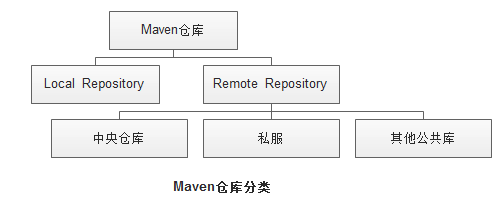
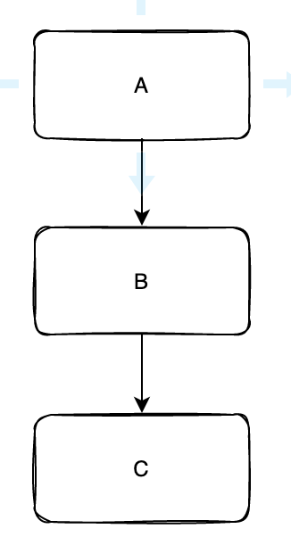
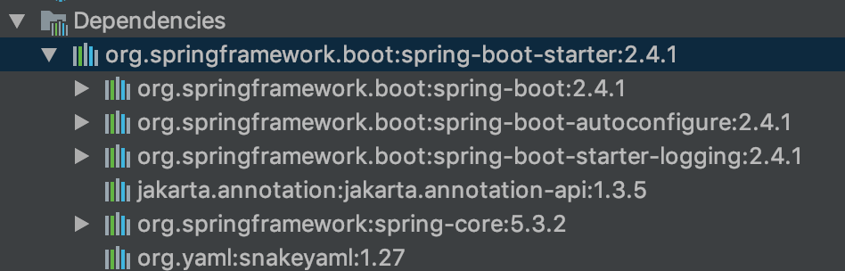
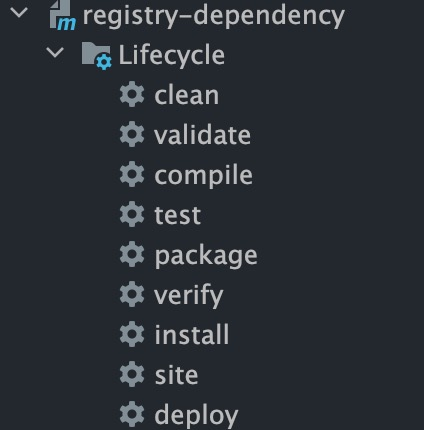
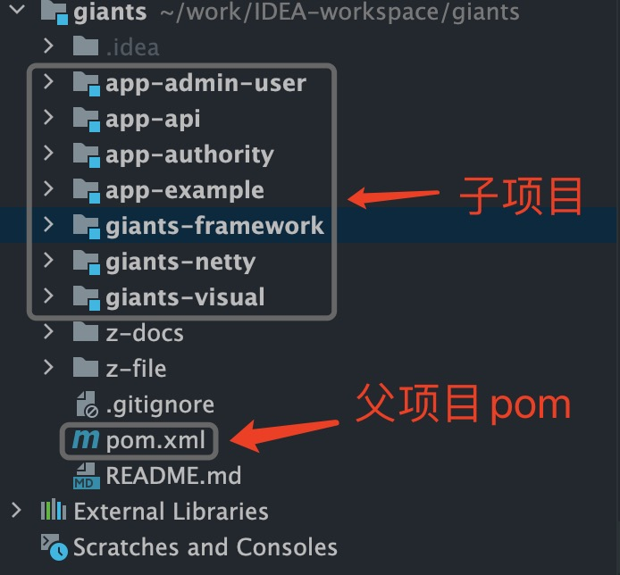

# Maven的核心概念和最佳实践

<!-- START doctoc generated TOC please keep comment here to allow auto update -->
<!-- DON'T EDIT THIS SECTION, INSTEAD RE-RUN doctoc TO UPDATE -->

- [一、开篇](#%E4%B8%80%E5%BC%80%E7%AF%87)
- [二、仓库](#%E4%BA%8C%E4%BB%93%E5%BA%93)
- [三、工程结构](#%E4%B8%89%E5%B7%A5%E7%A8%8B%E7%BB%93%E6%9E%84)
- [四、Maven POM](#%E5%9B%9Bmaven-pom)
- [五、构建生命周期](#%E4%BA%94%E6%9E%84%E5%BB%BA%E7%94%9F%E5%91%BD%E5%91%A8%E6%9C%9F)
- [六、工程实践](#%E5%85%AD%E5%B7%A5%E7%A8%8B%E5%AE%9E%E8%B7%B5)

<!-- END doctoc generated TOC please keep comment here to allow auto update -->

## 一、开篇

Maven 是项目管理和构建工具。

说完是不是还是不知道Maven 做什么的？项目管理和构建听着比较虚，

举个栗子，有一个电商项目中，分为订单、商品、商家、用户和营销模块，订单模块需要用到用户模块的代码，比如查询用户信息的接口，那是不是需要用户模块的同学把代码拷贝一份给订单模块呢？这么做会有很多问题，第一是用户模块同学写的代码可能有bug，需要修复，另外模块的功能一直在迭代，比如原来接口里面只有按照userId查询，增加了姓名查询、手机号查询，**写完需要重新拷贝代码，效率很低**，聪明的工程师们想到一个方法，把这些代码集中存储管理，用包+版本的方式，这个集中存储的地方叫仓库，大家都以仓库的为准，变更通过版本号来维护，为了防止每个小改动都需要修改版本，也是把线下用的测试版本和线上生产环境的区分开，分为Snapshot包和Release包。

总的来说，Maven 可以很方便的管理项目的结构和依赖关系。

## 二、仓库

在Maven 中，很重要的一个概念是仓库（Repository）。



远程仓库又包括私服和中央仓库。私服很好理解，很多公司自己会在局域网内搭建一个自己公司私有的仓库地址。

这里有个概念要区分一下，很多人会把私服和镜像（mirror）弄混，镜像（mirror）是中央仓库的复制品，原因也很简单，中央仓库在国外，你访问中央仓库的速度慢，镜像的服务器在国内，相当于弄了个缓存。

如果大家下载了maven，可以在maven 配置文件里面看下maven仓库的配置。maven配置一般放在用户目录.m2 文件夹下，setting.xml。

我们打开 settings.xml 看下：

```xml
<?xml version="1.0" encoding="UTF-8"?>
<settings xmlns="http://maven.apache.org/SETTINGS/1.0.0"
          xmlns:xsi="http://www.w3.org/2001/XMLSchema-instance"
          xsi:schemaLocation="http://maven.apache.org/SETTINGS/1.0.0 http://maven.apache.org/xsd/settings-1.0.0.xsd">

  <localRepository>/${user.home}/.m2/repository</localRepository>
  <interactiveMode>true</interactiveMode>

  <!--服务端的一些设置。一些设置如用户名密码不应该和项目的pom.xml放在一起。密码等认证信息应该存在于settings.xml文件中。 -->
  <servers>
    <server>
      <!--这是server的id（注意不是用户登陆的id），该id与distributionManagement中repository元素的id相匹配。 -->
      <id>server001</id>
      <!--鉴权用户名-->
      <username>my_login</username>
      <!--鉴权密码-->
      <password>my_password</password>
      <!--鉴权时使用的私钥位置 -->
      <privateKey>${usr.home}/.ssh/id_dsa</privateKey>
      <!--鉴权时使用的私钥密码。 -->
      <passphrase>some_passphrase</passphrase>
    </server>
  </servers>
 <mirrors>
   <mirror>
        <!-- 镜像的唯一标识符-->
        <id>aliyunmaven</id>
        <!-- 被镜像的服务器的id -->
        <mirrorOf>central</mirrorOf>
        <name>阿里云公共仓库</name>
        <url>https://maven.aliyun.com/repository/public</url>
    </mirror>
  </mirrors>
  <profiles>
    <profile>
     <!-- profile的唯一标识 -->
     <id>aliyun</id>
     <!-- 让当前profile 生效的条件（激活当前profile） -->
      <activation>
        <!-- 默认激活状态为false -->
        <activeByDefault>false</activeByDefault>
         <!-- jdk为1.8时激活 -->
        <jdk>1.8</jdk>
      </activation>
     <!-- 远程仓库列表 -->
     <repositories>
      <repository>
        <id>aliyun</id>
        <name>aliyun</name>
        <url>http://maven.aliyun.com/nexus/content/groups/public/</url>
        <layout>default</layout>
      </repository>
     </repositories>
   </profile>
  </profiles>
  <activeProfiles>
    <activeProfile>aliyun</activeProfile>
  </activeProfiles>
</settings>
```

我们一项项解释：

- localRepository ：我们从远程仓库拉取的 maven 包在本地存放的仓库地址；

- interactiveMode：表示maven是否需要和用户交互以获得输入。我们在命令行用过`mvn archetype:generate` 就知道这个参数的作用，会提示你输入groupId、artificialId，是否同意生成项目工程等。如果maven需要和用户交互以获得输入，则设置成true，反之则应为false。默认为true。

- servers ：有些仓库的访问需要用户名密码做身份认证，比如公司自己的仓库。一般 repositories 和 distributionManagement 都会在项目里面的pom.xml 定义，但是用户名密码不适合直接明文放在项目的pom中，而且有的密码是每个人私有的，所以更适合在maven settings.xml里面配置；

- mirrors：mirror这个单词是镜像的意思，这里是配置远程仓库的镜像，前面提到过，中央仓库可能访问量比较大，访问比较慢，所以可以用镜像来缓存远程仓库的压力。
  
  我上面配置的 mirror是国内阿里云对中央仓库的镜像，mirrorOf 的值是central，代表是中央仓库的镜像；

- profiles: 环境参数来调整构建配置的列表。
  
  settings.xml 中的profile元素是pom.xml中profile元素的裁剪版本。它只包含了5部分

- id ：profile的唯一标识

- activation ：让当前profile 生效的条件（激活当前profile）

- repositories ：如果当前profile是激活状态，这里面定义的远程仓库列表就会作为当前pom的远程仓库，maven就会用这组远程仓库来构建项目；这里可以看到用的是阿里云的远程仓库。

- pluginRepositories ：插件的远程仓库列表；在Maven中有两种类型的仓库，一种是存储工件的仓库，另一种就是存储plugin插件的仓库。这里就可以指定plugin的仓库。

- properties ：profile生效之后，跟着生效的属性值，以键值对形式存放在maven上下文, 这些值可以在pom.xml中的任何地方使用标记${X}来使用。
  
  例如：获取maven 上下文properties属性值有以下5种形式。
  
  ```xml
  <!-- 
    1. env.X: 在一个变量前加上"env."的前缀，会返回一个shell环境变量。例如,"env.PATH"指代了$path环境变量（在Windows上是%PATH%）。 
    2. project.x：指代了POM中对应的元素值。例如: <project><version>1.0</version></project>通过${project.version}获得version的值。 
    3. settings.x: 指代了settings.xml中对应元素的值。例如：<settings><offline>false</offline></settings>通过 ${settings.offline}获得offline的值。 
    4. Java System Properties: 所有可通过java.lang.System.getProperties()访问的属性都能在POM中使用该形式访问，例如 ${java.home}。 
    5. x: 在<properties/>元素中，或者外部文件中设置，以${someVar}的形式使用。 
   --> 
  <properties> 
      <user.install>${user.home}/our-project</user.install> 
  </properties>
  ```
  
  如上图所示，可以在pom中通过 ${user.home} 获取属性值。
  
  我们在工程项目的maven 配置的时候经常会用到这个功能，在父maven包的pom文件中管理所有的包版本，通过${XX.version}引用版本值，这个后面会讲到。

- activeProfiles ：手动激活的profile 列表。例如上面配置的就是激活aliyun 的profile。

那如果按照我们上面settings.xml 文件的配置，我们打包的时候maven 是如果查找包的呢?

maven 首先会先从本地仓库，也就是你自己电脑上查找包，如果没有，会从激活的profile的仓库查询，如果还没有找到，才会去中央仓库，如果你配置了中央仓库的镜像（mirror），这个时候就会被拦截，直接从镜像的仓库查找包。这个就是maven自动拉取包的流程。

小结：仓库分为本地仓库和远程仓库，本地仓库相当于按需拉取的包缓存，远程仓库分为中央仓库（central）和私服，私服一般是公司、学校或者其他团体为了加速包访问搭建的局域网的访问仓库，另外有些比较大的IT厂商，例如阿里云会搭建中央仓库的镜像，我们如果配置了中央仓库的镜像，那访问中央仓库的请求都会被重定向到镜像仓库。maven 仓库的自定义在 settings.xml 文件（分为系统目录和用户目录，一般建议用用户目录的），profile 可以设置不同的激活条件，配置对应的仓库。

下面介绍项目内的maven。

## 三、工程结构

Maven 基于约定大于配置的原则，定义了一个标准的目录结构。如下所示：

| 目录                                 | 目的                                          |
| ---------------------------------- | ------------------------------------------- |
| ${basedir}                         | 存放pom.xml和所有的子目录                            |
| ${basedir}/src/main/java           | 项目的java源代码                                  |
| ${basedir}/src/main/resources      | 项目的资源，比如说property文件，springmvc.xml           |
| ${basedir}/src/test/java           | 项目的测试类，比如说Junit代码                           |
| ${basedir}/src/test/resources      | 测试用的资源                                      |
| ${basedir}/src/main/webapp/WEB-INF | web应用文件目录，web项目的信息，比如存放web.xml、本地图片、jsp视图页面 |
| ${basedir}/target                  | 打包输出目录                                      |
| ${basedir}/target/classes          | 编译输出目录                                      |
| ${basedir}/target/test-classes     | 测试编译输出目录                                    |
| Test.java                          | Maven只会自动运行符合该命名规则的测试类                      |
| ~/.m2/repository                   | Maven默认的本地仓库目录位置                            |

我们标准的工程结构如下图所示：

```
project
├── pom.xml
├── src
│   ├── main
│   │   ├── java
│   │   └── resources
│   └── test
│       ├── java
│       └── resources
└── target
```

project 就是 `${basedir}` 目录。剩下的对照表格看非常清楚。

还记得我们之前说的 properties 属性吗，basedir就是 maven 项目中默认的properties。

## 四、Maven POM

POM( Project Object Model，项目对象模型 ) 是 Maven 工程的基本工作单元，是一个XML文件，包含了项目的基本信息，用于描述项目如何构建，声明项目依赖，等等。

在创建 POM 之前，我们首先需要描述项目组 (groupId), 项目的唯一ID。

```xml
<?xml version="1.0" encoding="UTF-8"?>
<project xmlns="http://maven.apache.org/POM/4.0.0"
         xmlns:xsi="http://www.w3.org/2001/XMLSchema-instance"
         xsi:schemaLocation="http://maven.apache.org/POM/4.0.0 http://maven.apache.org/xsd/maven-4.0.0.xsd">
    <!-- 模型版本 --> 
    <modelVersion>4.0.0</modelVersion>
    <!-- 公司或者组织的唯一标志，并且配置时生成的路径也是由此生成， 如com.angela.alpha.alpha-shoppingmall，maven会将该项目打成的jar包放本地路径：/com/angela/alpha/alpha-shoppingmall -->
    <groupId>com.collect</groupId>
    <!-- 项目的唯一ID，一个groupId下面可能多个项目，就是靠artifactId来区分的 -->
    <artifactId>code</artifactId>
    <!-- 版本号 -->
    <version>1.0-SNAPSHOT</version>
</project>
```

所有 POM 文件都需要 project 元素和三个必需字段：groupId，artifactId，version。

| 节点           | 描述                                                                                                                           |
| ------------ | ---------------------------------------------------------------------------------------------------------------------------- |
| project      | 工程的根标签。                                                                                                                      |
| modelVersion | 模型版本需要设置为 4.0。                                                                                                               |
| groupId      | 这是工程组的标识。它在一个组织或者项目中通常是唯一的。例如：蚂蚁sofa 工程的groupId: com.alipay.sofa                                                             |
| artifactId   | 这是工程的标识。它通常是工程的名称。例如，消费者银行。groupId 和 artifactId 一起定义了 artifact 在仓库中的位置。蚂蚁sofa 工程的artifactId: sofaboot-dependencies           |
| version      | 这是工程的版本号。在 artifact 的仓库中，它用来区分不同的版本。例如：`com.alipay.sofa:sofaboot-dependencies:1.0 com.alipay.sofa:sofaboot-dependencies:1.1` |

依赖管理：



A 依赖B，B依赖C，A相当于也依赖到了C。

举个栗子：



## 五、构建生命周期



我截了一张IDEA Maven Lifecycle的图

- 清理clean：将编译得到的旧文件class字节码文件删除；

- 编译compile：将java源程序编译成class字节码文件，编译resource资源文件；

- 测试test：自动运行测试用例

- 报告report：测试程序执行的结果

- 打包package：动态Web工程打War包，java工程打jar包

- 安装install：将打包得到的文件复制到“仓库”中的指定位置，比如我们多模块构建的时候使用install 将包安装到本地仓库；

- 部署deploy：将包部署到指定仓库，或者配置应用部署的运行目录；

这些Lifecycle实际都是通过插件的形式来完成的，maven其实大功能都是通过插件来完成的。

## 六、工程实践

我们现在来实践一个项目，我在之前文章介绍过，现在一般稍大一点的项目，都是采用多模块管理，如果引入了领域概念，一般分层还有领域层，那这样一个项目我们应该怎么设置maven 包结构呢。例如：



首先我们会在父项目中定义这些这个项目包含的模块

```xml
    <modules>
        <module>giants-framework</module>
        <module>app-admin-user</module>
        <module>app-api</module>
        <module>giants-visual</module>
        <module>app-example</module>
        <module>giants-netty</module>
        <module>app-authority</module>
    </modules>
```

接着是dependencyManagement, 这个在多模块项目里面非常重要。

dependencyManagement里配置并不会实际引入，只是为了版本管理。

整个项目用到的依赖包的版本都应该在父项目pom的dependencyManagement 这里来管理，这样版本不会乱，管理也集中。

```xml
    <properties>
        <!--    springboot cloud版本    -->
        <spring-boot.version>2.5.9</spring-boot.version>
        <spring-cloud.version>2020.0.4</spring-cloud.version>
        <spring-cloud-alibaba.version>2021.1</spring-cloud-alibaba.version>
        <spring-boot-admin.version>2.5.5</spring-boot-admin.version>
        <!--修改springboot版本时，建议此spring版本统一修改，避免冲突-->
        <spring.version>5.3.15</spring.version>
    </properties>
    
    <dependencyManagement>
        <dependencies>
            <!-- spring boot 依赖 -->
            <dependency>
                <groupId>org.springframework.boot</groupId>
                <artifactId>spring-boot-dependencies</artifactId>
                <version>${spring-boot.version}</version>
                <type>pom</type>
                <scope>import</scope>
            </dependency>
            <!-- spring cloud 依赖 -->
            <dependency>
                <groupId>org.springframework.cloud</groupId>
                <artifactId>spring-cloud-dependencies</artifactId>
                <version>${spring-cloud.version}</version>
                <type>pom</type>
                <scope>import</scope>
            </dependency>
            <!-- spring cloud alibaba 依赖 -->
            <dependency>
                <groupId>com.alibaba.cloud</groupId>
                <artifactId>spring-cloud-alibaba-dependencies</artifactId>
                <version>${spring-cloud-alibaba.version}</version>
                <type>pom</type>
                <scope>import</scope>
            </dependency>
        </dependencies>
    </dependencyManagement>
```

一般可以直接在 properties 里面把第三方包的版本定义好，比如Spring boot和 Spring cloud的版本。

另外大家注意到 `spring-boot-dependencies` 这个包我们 type 使用的是pom，也就是我们不真实需要引入 `spring-boot-dependencies`，这个包里面包含的jar 基本涵盖了Spring 全家桶，已经Spring 和其他匹配的第三方中间件，pom的意思是我们只需要maven 包版本信息，这样有什么好处，比如你引入一个第三方包，担心用的版本和Spring 的版本不兼容，不用担心，Spring早就替你想好了，当你引入 spring-boot-dependencies ，他里面基本涵盖了市面上常用的组件，相对于的版本也都给你定义好了。

另外一个属性是scope，也很重要。我们看下scope 的可选值：

| scope取值      | 有效范围（compile, runtime, test） | 依赖传递 | 例子          |
| ------------ | ---------------------------- | ---- | ----------- |
| **compile**  | all                          | 是    | spring-core |
| **provided** | compile, test                | 否    | servlet-api |
| **runtime**  | runtime, test                | 是    | JDBC驱动      |
| **test**     | test                         | 否    | JUnit       |
| **system**   | compile, test                | 是    |             |

重点：默认不配置都是compile属性。

**compile** ：默认值，compile表示被依赖项目需要参与当前项目的编译，当然后续的测试，运行周期也参与其中，是一个比较强的依赖。打包的时候通常需要包含进去。

**provided** ：在编译、测试时有效，但是在运行时无效。例如：servlet-api，运行项目时，Tomcat这种运行容器已经提供，就不需要Maven重复地引入一遍了。

**runtime** ：在运行、测试时有效，但是在编译代码时无效。例如：JDBC驱动实现，项目代码编译只需要JDK提供的JDBC接口，只有在测试或运行项目时才需要实现上述接口的具体JDBC驱动。

**test** ：只在测试时有效，例如：JUnit。

**system** ：在编译、测试时有效，但是在运行时无效。和provided的区别是，使用system范围的依赖时必须通过systemPath元素显式地指定依赖文件的路径。由于此类依赖不是通过Maven仓库解析的，而且往往与本机系统绑定，可能造成构建的不可移植，因此应该谨慎使用。

scope的依赖传递 A–>B–>C。当前项目为A，A依赖于B，B依赖于C。知道B在A项目中的scope，那么怎么知道C在A中的scope呢？答案是：当C是test或者provided时，C直接被丢弃，A不依赖C；否则A依赖C，C的scope继承于B的scope。

```xml
  <dependency>
    <groupId>org.springframework.boot</groupId>
    <artifactId>spring-boot-starter-test</artifactId>
    <scope>test</scope>
    <exclusions>
      <exclusion>
        <groupId>org.junit.vintage</groupId>
        <artifactId>junit-vintage-engine</artifactId>
      </exclusion>
    </exclusions>
  </dependency>
```

另外我们经常会看到 exclusion，这个在解决包冲突的时候很有效。

先说包冲突的原因，比如

- A -> B -> C，A依赖B、B依赖C

- A -> D ->C,  A依赖D，D依赖C

但是B和D 引入的C 的版本不一致，编译的时候会报错，这个时候要确定报错的代码使用的哪个版本，常规原则是用新版本，因为大部分时候第三方包升级会考虑兼容，不会直接把原来的版本给覆盖，但是也有特殊情况，这个就得具体 case 具体分析了。

我们可以借助Maven Helper插件中的Dependency Analyzer分析冲突的jar包。