# Redis为什么这么快

<!-- START doctoc generated TOC please keep comment here to allow auto update -->
<!-- DON'T EDIT THIS SECTION, INSTEAD RE-RUN doctoc TO UPDATE -->

- [零、开篇](#%E9%9B%B6%E5%BC%80%E7%AF%87)
- [一、基于内存实现](#%E4%B8%80%E5%9F%BA%E4%BA%8E%E5%86%85%E5%AD%98%E5%AE%9E%E7%8E%B0)
- [二、高效的数据结构](#%E4%BA%8C%E9%AB%98%E6%95%88%E7%9A%84%E6%95%B0%E6%8D%AE%E7%BB%93%E6%9E%84)
    - [1. SDS 简单动态字符串优势](#1-sds-%E7%AE%80%E5%8D%95%E5%8A%A8%E6%80%81%E5%AD%97%E7%AC%A6%E4%B8%B2%E4%BC%98%E5%8A%BF)
    - [2. zipList 压缩列表](#2-ziplist-%E5%8E%8B%E7%BC%A9%E5%88%97%E8%A1%A8)
    - [3. quicklist](#3-quicklist)
    - [4. skipList 跳跃表](#4-skiplist-%E8%B7%B3%E8%B7%83%E8%A1%A8)
    - [5. 整数数组（intset）](#5-%E6%95%B4%E6%95%B0%E6%95%B0%E7%BB%84intset)
- [三、单线程模型](#%E4%B8%89%E5%8D%95%E7%BA%BF%E7%A8%8B%E6%A8%A1%E5%9E%8B)
- [四、I/O 多路复用模型](#%E5%9B%9Bio-%E5%A4%9A%E8%B7%AF%E5%A4%8D%E7%94%A8%E6%A8%A1%E5%9E%8B)
- [五、Redis 全局 hash 字典](#%E4%BA%94redis-%E5%85%A8%E5%B1%80-hash-%E5%AD%97%E5%85%B8)
- [六、Hash 冲突怎么办？](#%E5%85%ADhash-%E5%86%B2%E7%AA%81%E6%80%8E%E4%B9%88%E5%8A%9E)
- [七、Redis 如何实现持久化？宕机后如何恢复数据？](#%E4%B8%83redis-%E5%A6%82%E4%BD%95%E5%AE%9E%E7%8E%B0%E6%8C%81%E4%B9%85%E5%8C%96%E5%AE%95%E6%9C%BA%E5%90%8E%E5%A6%82%E4%BD%95%E6%81%A2%E5%A4%8D%E6%95%B0%E6%8D%AE)
- [八、Redis 主从架构数据同步](#%E5%85%ABredis-%E4%B8%BB%E4%BB%8E%E6%9E%B6%E6%9E%84%E6%95%B0%E6%8D%AE%E5%90%8C%E6%AD%A5)
- [九、哨兵原理连环问](#%E4%B9%9D%E5%93%A8%E5%85%B5%E5%8E%9F%E7%90%86%E8%BF%9E%E7%8E%AF%E9%97%AE)
- [十、Cluster 集群连环炮](#%E5%8D%81cluster-%E9%9B%86%E7%BE%A4%E8%BF%9E%E7%8E%AF%E7%82%AE)

<!-- END doctoc generated TOC please keep comment here to allow auto update -->

[TOC]

## 零、开篇

很多人只知道是 K/V NoSQl 内存数据库，单线程……这都是没有全面理解 Redis 导致无法继续深问下去。

这个问题是基础摸底，我们可以从 Redis 不同数据类型底层的数据结构实现、完全基于内存、IO 多路复用网络模型、线程模型、渐进式 rehash…...

## 一、基于内存实现

Redis 是基于内存的数据库，跟磁盘数据库相比，完全吊打磁盘的速度。

不论读写操作都是在内存上完成的，我们分别对比下内存操作与磁盘操作的差异。

**磁盘调用**

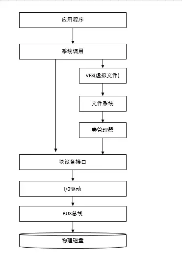

**内存操作**

内存直接由 CPU 控制，也就是 CPU 内部集成的内存控制器，所以说内存是直接与 CPU 对接，享受与 CPU 通信的最优带宽。

最后以一张图量化系统的各种延时时间（部分数据引用 Brendan Gregg）

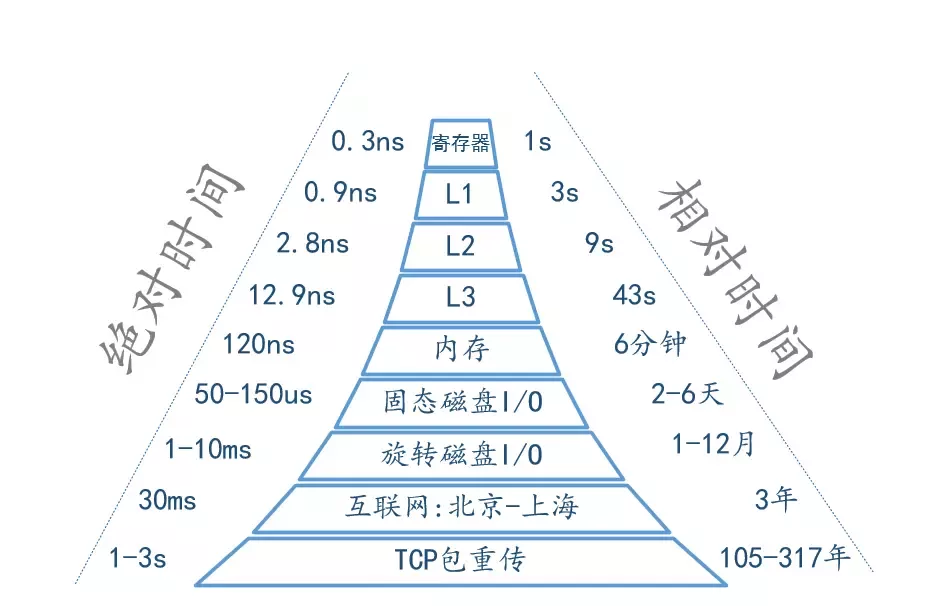

## 二、高效的数据结构

学习 MySQL 的时候我知道为了提高检索速度使用了 B+ Tree 数据结构，所以 Redis 速度快应该也跟数据结构有关。

Redis 一共有 5 种数据类型，`String、List、Hash、Set、SortedSet`。

不同的数据类型底层使用了一种或者多种数据结构来支撑，目的就是为了追求更快的速度。

> 我们可以分别说明每种数据类型底层的数据结构优点，很多人只知道数据类型，而说出底层数据结构就能让人眼前一亮。

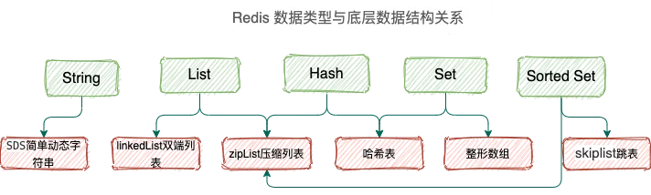

### 1. SDS 简单动态字符串优势

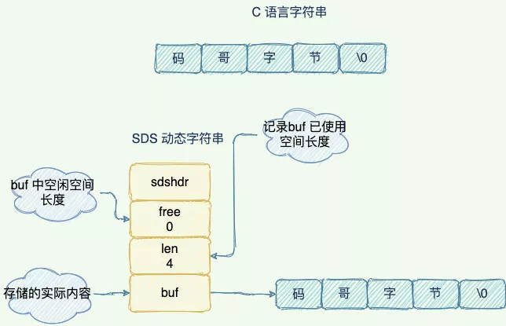

1. SDS 中 len 保存着字符串的长度，O(1) 时间复杂度查询字符串长度信息。
2. 空间预分配：SDS 被修改后，程序不仅会为 SDS 分配所需要的必须空间，还会分配额外的未使用空间。
3. 惰性空间释放：当对 SDS 进行缩短操作时，程序并不会回收多余的内存空间，而是使用 free 字段将这些字节数量记录下来不释放，后面如果需要 append 操作，则直接使用 free 中未使用的空间，减少了内存的分配。

### 2. zipList 压缩列表

压缩列表是 List 、hash、 sorted Set 三种数据类型底层实现之一。

当一个列表只有少量数据的时候，并且每个列表项要么就是小整数值，要么就是长度比较短的字符串，那么 Redis 就会使用压缩列表来做列表键的底层实现。


这样内存紧凑，节约内存。

### 3. quicklist

后续版本对列表数据结构进行了改造，使用 quicklist 代替了 ziplist 和 linkedlist。

**quicklist 是 ziplist 和 linkedlist 的混合体，它将 linkedlist 按段切分，每一段使用 ziplist 来紧凑存储，多个 ziplist 之间使用双向指针串接起来。**

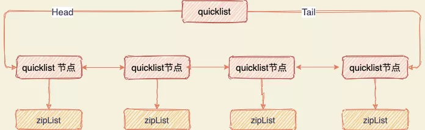

### 4. skipList 跳跃表

sorted set 类型的排序功能便是通过「跳跃列表」数据结构来实现。

跳跃表（skiplist）是一种有序数据结构，它通过在每个节点中维持多个指向其他节点的指针，从而达到快速访问节点的目的。

跳表在链表的基础上，增加了多层级索引，通过索引位置的几个跳转，实现数据的快速定位，如下图所示：

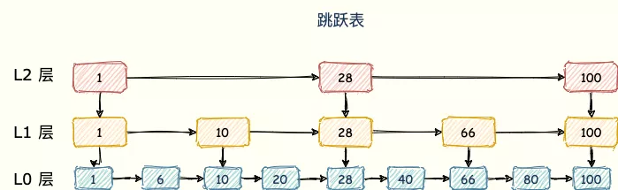

### 5. 整数数组（intset）

当一个集合只包含整数值元素，并且这个集合的元素数量不多时，Redis 就会使用整数集合作为集合键的底层实现，节省内存。

## 三、单线程模型

> 我们需要注意的是，Redis 的单线程指的是 **Redis 的网络 IO （6.x 版本后网络 IO 使用多线程）以及键值对指令读写是由一个线程来执行的。** 对于 Redis 的持久化、集群数据同步、异步删除等都是其他线程执行。

千万别说 Redis 就只有一个线程。

**单线程指的是 Redis 键值对读写指令的执行是单线程。**

先说官方答案，让人觉得足够严谨，而不是人云亦云去背诵一些博客。

**官方答案：因为 Redis 是基于内存的操作，CPU 不是 Redis 的瓶颈，Redis 的瓶颈最有可能是机器内存的大小或者网络带宽**。既然单线程容易实现，而且 CPU 不会成为瓶颈，那就顺理成章地采用单线程的方案了。原文地址：https://redis.io/topics/faq。

> 为啥不用多线程执行充分利用 CPU 呢？

在运行每个任务之前，CPU 需要知道任务在何处加载并开始运行。也就是说，系统需要帮助它预先设置 CPU 寄存器和程序计数器，这称为 CPU 上下文。

**切换上下文时，我们需要完成一系列工作，这是非常消耗资源的操作。**

引入多线程开发，就需要使用同步原语来保护共享资源的并发读写，增加代码复杂度和调试难度。

> 单线程有什么好处？

1. 不会因为线程创建导致的性能消耗；
2. 避免上下文切换引起的 CPU 消耗，没有多线程切换的开销；
3. 避免了线程之间的竞争问题，比如添加锁、释放锁、死锁等，不需要考虑各种锁问题。
4. 代码更清晰，处理逻辑简单。

## 四、I/O 多路复用模型

Redis 采用 I/O 多路复用技术，并发处理连接。采用了 epoll + 自己实现的简单的事件框架。

epoll 中的读、写、关闭、连接都转化成了事件，然后利用 epoll 的多路复用特性，绝不在 IO 上浪费一点时间。

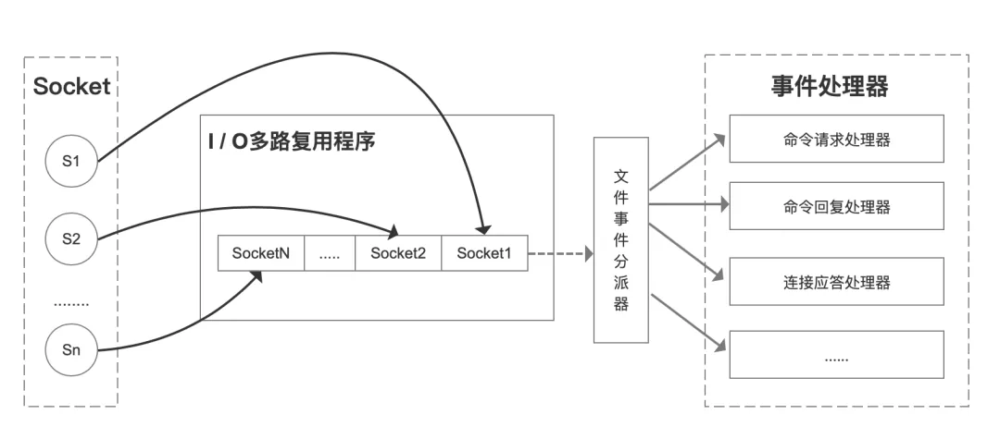

Redis 线程不会阻塞在某一个特定的监听或已连接套接字上，也就是说，不会阻塞在某一个特定的客户端请求处理上。正因为此，Redis 可以同时和多个客户端连接并处理请求，从而提升并发性。

## 五、Redis 全局 hash 字典

Redis 整体就是一个哈希表来保存所有的键值对，无论数据类型是 5 种的任意一种。哈希表，本质就是一个数组，每个元素被叫做哈希桶，不管什么数据类型，每个桶里面的 entry 保存着实际具体值的指针。

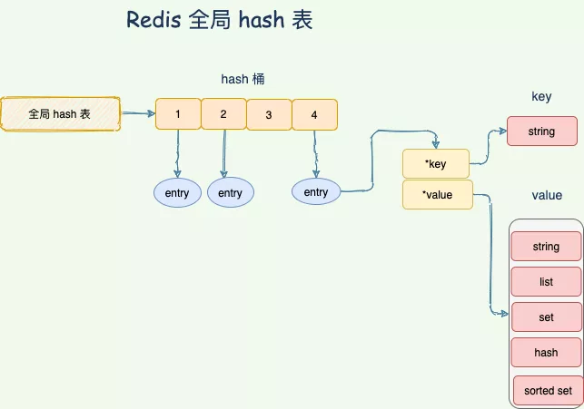

而哈希表的时间复杂度是 O(1)，只需要计算每个键的哈希值，便知道对应的哈希桶位置，定位桶里面的 entry 找到对应数据，这个也是 Redis 快的原因之一。

Redis 使用对象（redisObject）来表示数据库中的键值，当我们在 Redis 中创建一个键值对时，至少创建两个对象，一个对象是用做键值对的键对象，另一个是键值对的值对象。

也就是每个 entry 保存着 「键值对」的 redisObject 对象，通过 redisObject 的指针找到对应数据。

```c
typedef struct redisObject{
    //类型
   unsigned type:4;
   //编码
   unsigned encoding:4;
   //指向底层数据结构的指针
   void *ptr;
    //...
 }robj;
```

## 六、Hash 冲突怎么办？

Redis 通过**链式哈希**解决冲突：**也就是同一个 桶里面的元素使用链表保存**。但是当链表过长就会导致查找性能变差可能，所以 Redis 为了追求快，使用了两个全局哈希表。用于 rehash 操作，增加现有的哈希桶数量，减少哈希冲突。

开始默认使用 「hash 表 1 」保存键值对数据，「hash 表 2」 此刻没有分配空间。当数据越来越多触发 rehash 操作，则执行以下操作：

1. 给 「hash 表 2 」分配更大的空间；
2. 将 「hash 表 1 」的数据重新映射拷贝到 「hash 表 2」 中；
3. 释放 「hash 表 1」 的空间。

**值得注意的是，将 hash 表 1 的数据重新映射到 hash 表 2 的过程中并不是一次性的，这样会造成 Redis 阻塞，无法提供服务。**

而是采用了**渐进式 rehash**，每次处理客户端请求的时候，先从「 hash 表 1」 中第一个索引开始，将这个位置的 所有数据拷贝到 「hash 表 2」 中，就这样将 rehash 分散到多次请求过程中，避免耗时阻塞。

## 七、Redis 如何实现持久化？宕机后如何恢复数据？

Redis 的数据持久化使用了「RDB 数据快照」的方式来实现宕机快速恢复。但是 过于频繁的执行全量数据快照，有两个严重性能开销：

1. 频繁生成 RDB 文件写入磁盘，磁盘压力过大。会出现上一个 RDB 还未执行完，下一个又开始生成，陷入死循环。
2. fork 出 bgsave 子进程会阻塞主线程，主线程的内存越大，阻塞时间越长。

所以 Redis 还设计了 AOF 写后日志记录对内存进行修改的指令记录。

> 面试官：什么是 RDB 内存快照？

在 Redis 执行「写」指令过程中，内存数据会一直变化。所谓的内存快照，指的就是 Redis 内存中的数据在某一刻的状态数据。

好比时间定格在某一刻，当我们拍照的，通过照片就能把某一刻的瞬间画面完全记录下来。

Redis 跟这个类似，就是把某一刻的数据以文件的形式拍下来，写到磁盘上。这个快照文件叫做 **RDB 文件，RDB 就是 Redis DataBase 的缩写。**

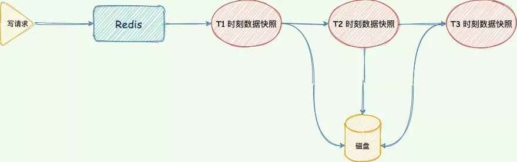

在做数据恢复时，直接将 RDB 文件读入内存完成恢复。

> 面试官：在生成 RDB 期间，Redis 可以同时处理写请求么？

可以的，Redis 使用操作系统的多进程**写时复制技术 COW(Copy On Write)** 来实现快照持久化，保证数据一致性。

Redis 在持久化时会调用 glibc 的函数`fork`产生一个子进程，快照持久化完全交给子进程来处理，父进程继续处理客户端请求。

当主线程执行写指令修改数据的时候，这个数据就会复制一份副本， `bgsave` 子进程读取这个副本数据写到 RDB 文件。

这既保证了快照的完整性，也允许主线程同时对数据进行修改，避免了对正常业务的影响。

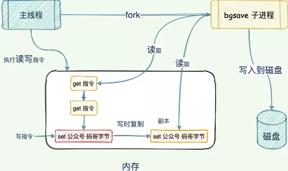

> 面试官：那 AOF 又是什么？

AOF 日志记录了自 Redis 实例创建以来所有的修改性指令序列，那么就可以通过对一个空的 Redis 实例顺序执行所有的指令，也就是「重放」，来恢复 Redis 当前实例的内存数据结构的状态。

Redis 提供的 AOF 配置项`appendfsync`写回策略直接决定 AOF 持久化功能的效率和安全性。

- **always**：同步写回，写指令执行完毕立马将 `aof_buf`缓冲区中的内容刷写到 AOF 文件。
- **everysec**：每秒写回，写指令执行完，日志只会写到 AOF 文件缓冲区，每隔一秒就把缓冲区内容同步到磁盘。
- **no：** 操作系统控制，写执行执行完毕，把日志写到 AOF 文件内存缓冲区，由操作系统决定何时刷写到磁盘。

没有两全其美的策略，我们需要在性能和可靠性上做一个取舍。

> 面试官：既然 RDB 有两个性能问题，那为何不用 AOF 即可。

AOF 写前日志，记录的是每个「写」指令操作。不会像 RDB 全量快照导致性能损耗，但是执行速度没有 RDB 快，同时日志文件过大也会造成性能问题。

所以，Redis 设计了一个杀手锏「AOF 重写机制」，Redis 提供了 `bgrewriteaof`指令用于对 AOF 日志进行瘦身。

其原理就是开辟一个子进程对内存进行遍历转换成一系列 Redis 的操作指令，序列化到一个新的 AOF 日志文件中。序列化完毕后再将操作期间发生的增量 AOF 日志追加到这个新的 AOF 日志文件中，追加完毕后就立即替代旧的 AOF 日志文件了，瘦身工作就完成了。

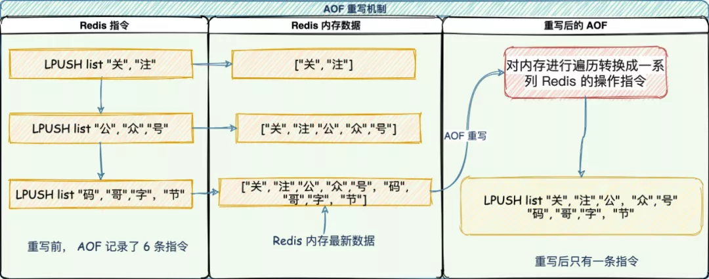

> 面试官：如何实现数据尽可能少丢失又能兼顾性能呢？

重启 Redis 时，我们很少使用 rdb 来恢复内存状态，因为会丢失大量数据。我们通常使用 AOF 日志重放，但是重放 AOF 日志性能相对 rdb 来说要慢很多，这样在 Redis 实例很大的情况下，启动需要花费很长的时间。

Redis 4.0 为了解决这个问题，带来了一个新的持久化选项——**混合持久化**。将 rdb 文件的内容和增量的 AOF 日志文件存在一起。这里的 AOF 日志不再是全量的日志，而是**自持久化开始到持久化结束的这段时间发生的增量 AOF 日志**，通常这部分 AOF 日志很小。

于是**在 Redis 重启的时候，可以先加载 rdb 的内容，然后再重放增量 AOF 日志就可以完全替代之前的 AOF 全量文件重放，重启效率因此大幅得到提升**。

## 八、Redis 主从架构数据同步

Redis 提供了主从模式，通过主从复制，将数据冗余一份复制到其他 Redis 服务器。

> 面试官：主从之间数据如何保证一致性？

为了保证副本数据的一致性，主从架构采用了读写分离的方式。

- 读操作：主、从库都可以执行；
- 写操作：主库先执行，之后将写操作同步到从库；

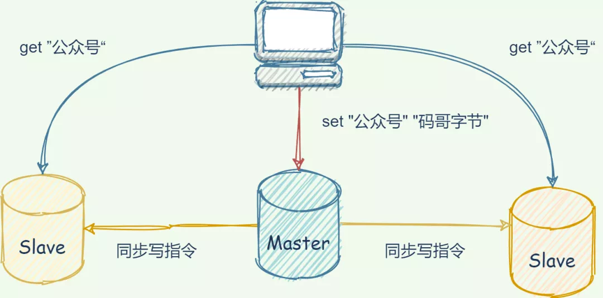

> 面试官：主从复制还有其他作用么？

1. 故障恢复：当主节点宕机，其他节点依然可以提供服务；
2. 负载均衡：Master 节点提供写服务，Slave 节点提供读服务，分担压力；
3. 高可用基石：是哨兵和 cluster 实施的基础，是高可用的基石。

> 面试官：主从复制如何实现的？

同步分为三种情况：

1. 第一次主从库全量复制；
2. 主从正常运行期间的同步；
3. 主从库间网络断开重连同步。

> 面试官：第一次同步怎么实现？

**主从库第一次复制过程大体可以分为 3 个阶段：连接建立阶段（即准备阶段）、主库同步数据到从库阶段、发送同步期间新写命令到从库阶段**；

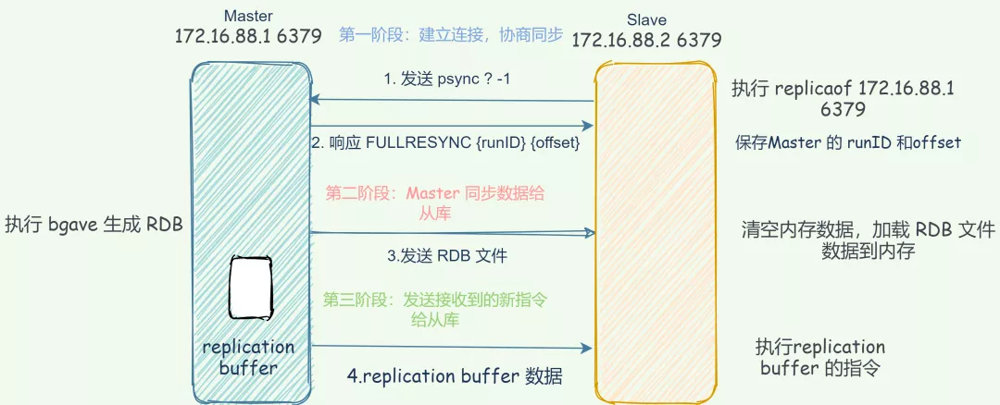

1. 建立连接：**从库会和主库建立连接，从库执行 replicaof 并发送 psync 命令并告诉主库即将进行同步，主库确认回复后，主从库间就开始同步了**。
2. 主库同步数据给从库：master 执行 `bgsave`命令生成 RDB 文件，并将文件发送给从库，同时**主库**为每一个 slave 开辟一块 replication buffer 缓冲区记录从生成 RDB 文件开始收到的所有写命令。从库保存 RDB 并清空数据库再加载 RDB 数据到内存中。
3. 发送 RDB 之后接收到的新写命令到从库：在生成 RDB 文件之后的写操作并没有记录到刚刚的 RDB 文件中，为了保证主从库数据的一致性，所以主库会在内存中使用一个叫 replication buffer 记录 RDB 文件生成后的所有写操作，并将里面的数据发送到 slave。

> 面试官：主从库间的网络断了咋办？断开后要重新全量复制么？

在 Redis 2.8 之前，如果主从库在命令传播时出现了网络闪断，那么，从库就会和主库重新进行一次全量复制，开销非常大。

从 Redis 2.8 开始，网络断了之后，主从库会采用增量复制的方式继续同步。

增量复制：**用于网络中断等情况后的复制，只将中断期间主节点执行的写命令发送给从节点，与全量复制相比更加高效**。

断开重连增量复制的实现奥秘就是 `repl_backlog_buffer` 缓冲区，不管在什么时候 master 都会将写指令操作记录在 `repl_backlog_buffer` 中，因为内存有限， `repl_backlog_buffer` 是一个定长的环形数组，**如果数组内容满了，就会从头开始覆盖前面的内容**。

master 使用 `master_repl_offset`记录自己写到的位置偏移量，slave 则使用 `slave_repl_offset`记录已经读取到的偏移量。

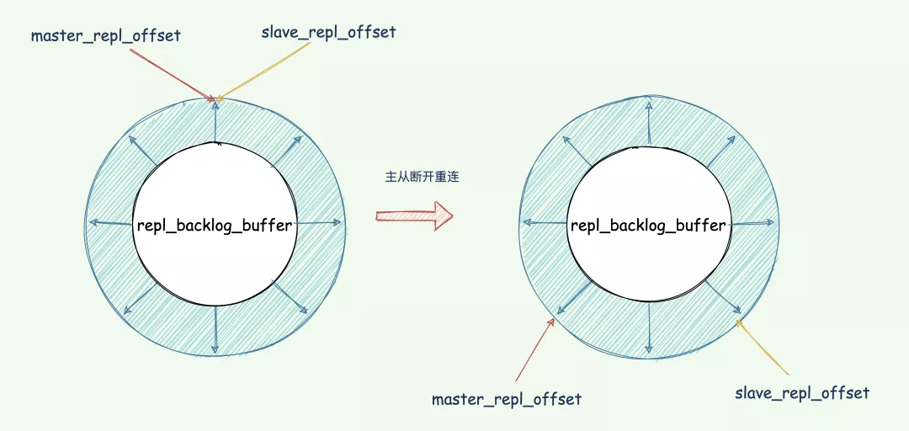

当主从断开重连后，slave 会先发送 psync 命令给 master，同时将自己的 `runID`，`slave_repl_offset`发送给 master。

master 只需要把 `master_repl_offset`与 `slave_repl_offset`之间的命令同步给从库即可。

增量复制执行流程如下图：

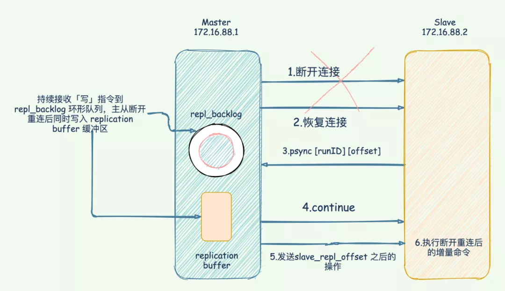

> 面试官：那完成全量同步后，正常运行过程中如何同步数据呢？

当主从库完成了全量复制，它们之间就会一直维护一个网络连接，主库会通过这个连接将后续陆续收到的命令操作再同步给从库，这个过程也称为基于长连接的命令传播，使用长连接的目的就是避免频繁建立连接导致的开销。

## 九、哨兵原理连环问

> 面试官：可以呀，知道这么多，你知道 哨兵集群原理么？

哨兵是 Redis 的一种运行模式，它专注于**对 Redis 实例（主节点、从节点）运行状态的监控，并能够在主节点发生故障时通过一系列的机制实现选主及主从切换，实现故障转移，确保整个 Redis 系统的可用性**。

他的架构图如下：

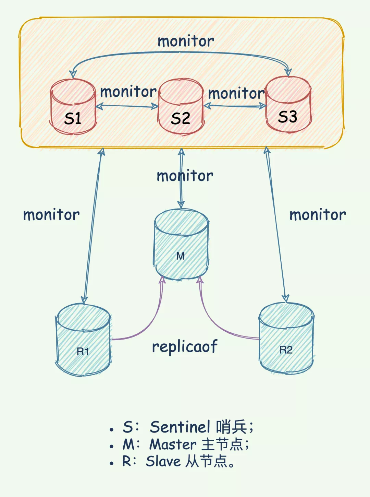

Redis 哨兵具备的能力有如下几个：

- **监控**：持续监控 master 、slave 是否处于预期工作状态。
- **自动切换主库**：当 Master 运行故障，哨兵启动自动故障恢复流程：从 slave 中选择一台作为新 master。
- **通知**：让 slave 执行 replicaof ，与新的 master 同步；并且通知客户端与新 master 建立连接。

> 面试官：哨兵之间是如何知道彼此的？

哨兵与 master 建立通信，利用 master 提供发布/订阅机制发布自己的信息，比如身高体重、是否单身、IP、端口……

master 有一个 `__sentinel__:hello` 的专用通道，用于哨兵之间发布和订阅消息。**这就好比是 `__sentinel__:hello` 微信群，哨兵利用 master 建立的微信群发布自己的消息，同时关注其他哨兵发布的消息**。

> 面试官：哨兵之间虽然建立连接了，但是还需要和 slave 建立连接，不然没法监控他们呀，如何知道 slave 并监控他们的？

关键还是利用 master 来实现，哨兵向 master 发送 `INFO` 命令， master 掌门自然是知道自己门下所有的 salve 小弟的。所以 master 接收到命令后，便将 slave 列表告诉哨兵。

哨兵根据 master 响应的 slave 名单信息与每一个 salve 建立连接，并且根据这个连接持续监控哨兵。

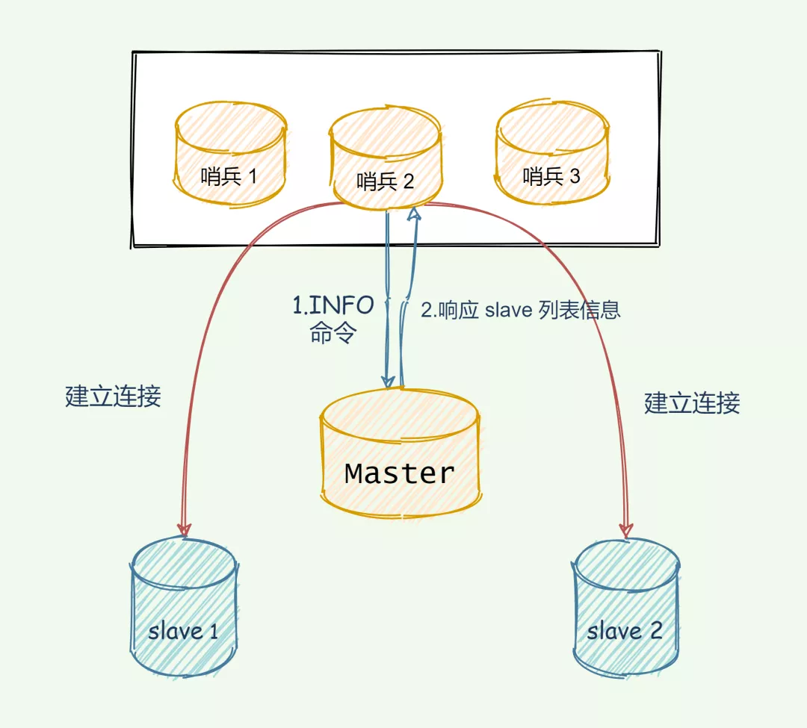

## 十、Cluster 集群连环炮

> 面试官：除了哨兵以外，还有其他的高可用手段么？

有 Cluster 集群实现高可用，哨兵集群监控的 Redis 集群是主从架构，无法横向拓展。**使用 Redis Cluster 集群，主要解决了大数据量存储导致的各种慢问题，同时也便于横向拓展。**

**在面向百万、千万级别的用户规模时，横向扩展的 Redis 切片集群会是一个非常好的选择。**

> 面试官：什么是 Cluster 集群？

Redis 集群是一种分布式数据库方案，集群通过分片（sharding）来进行数据管理（「分治思想」的一种实践），并提供复制和故障转移功能。

将数据划分为 16384 的 slots，每个节点负责一部分槽位。槽位的信息存储于每个节点中。

它是去中心化的，如图所示，该集群由三个 Redis 节点组成，每个节点负责整个集群的一部分数据，每个节点负责的数据多少可能不一样。

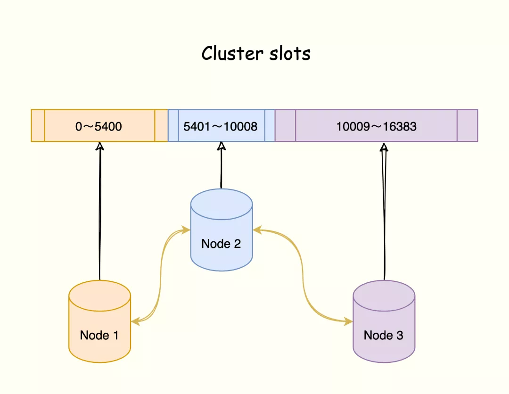

三个节点相互连接组成一个对等的集群，它们之间通过 `Gossip`协议相互交互集群信息，最后每个节点都保存着其他节点的 slots 分配情况。

> 面试官：哈希槽又是如何映射到 Redis 实例上呢？

1. 根据键值对的 key，使用 CRC16 算法，计算出一个 16 bit 的值；
2. 将 16 bit 的值对 16384 执行取模，得到 0 ～ 16383 的数表示 key 对应的哈希槽。
3. 根据该槽信息定位到对应的实例。

键值对数据、哈希槽、Redis 实例之间的映射关系如下：

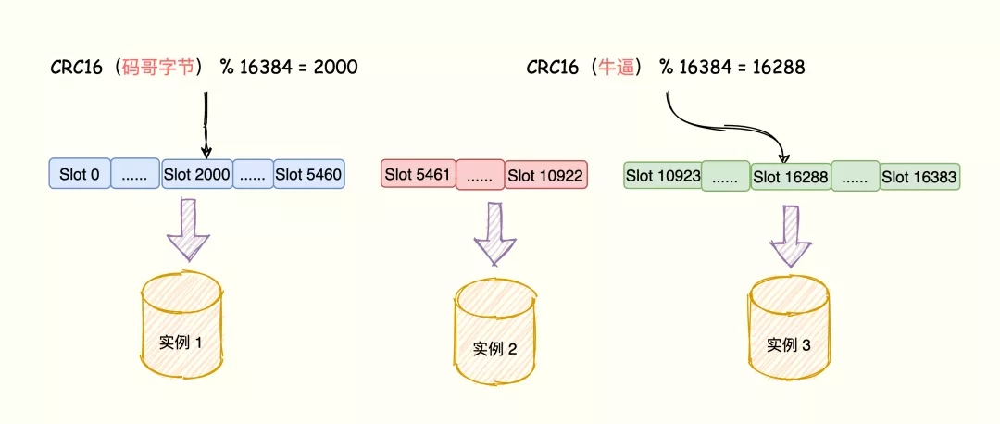

> 面试官：Cluster 如何实现故障转移？

Redis 集群节点采用 `Gossip` 协议来广播自己的状态以及自己对整个集群认知的改变。比如一个节点发现某个节点失联了 (PFail)，它会将这条信息向整个集群广播，其它节点也就可以收到这点失联信息。

如果一个节点收到了某个节点失联的数量 (PFail Count) 已经达到了集群的大多数，就可以标记该节点为确定下线状态 (Fail)，然后向整个集群广播，强迫其它节点也接收该节点已经下线的事实，并立即对该失联节点进行主从切换。

> 面试官：客户端又怎么确定访问的数据分布在哪个实例上呢？

Redis 实例会将自己的哈希槽信息通过 Gossip 协议发送给集群中其他的实例，实现了哈希槽分配信息的扩散。

这样，集群中的每个实例都有所有哈希槽与实例之间的映射关系信息。

当客户端连接任何一个实例，实例就将哈希槽与实例的映射关系响应给客户端，客户端就会将哈希槽与实例映射信息缓存在本地。

当客户端请求时，会计算出键所对应的哈希槽，再通过本地缓存的哈希槽实例映射信息定位到数据所在实例上，再将请求发送给对应的实例。

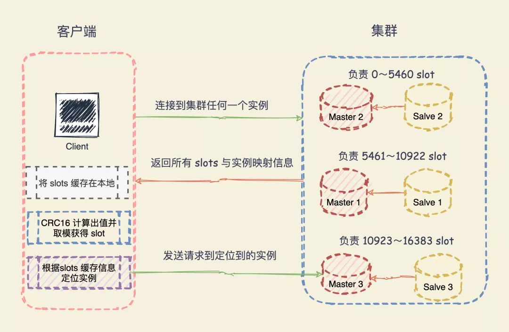

> 面试官：什么是 Redis 重定向机制？

哈希槽与实例之间的映射关系由于新增实例或者负载均衡重新分配导致改变了，**客户端将请求发送到实例上，这个实例没有相应的数据，该 Redis 实例会告诉客户端将请求发送到其他的实例上**。

Redis 通过 MOVED 错误和 ASK 错误告诉客户端。

**MOVED**

**MOVED** 错误（负载均衡，数据已经迁移到其他实例上）：当客户端将一个键值对操作请求发送给某个实例，而这个键所在的槽并非由自己负责的时候，该实例会返回一个 MOVED 错误指引转向正在负责该槽的节点。

同时，**客户端还会更新本地缓存，将该 slot 与 Redis 实例对应关系更新正确**。

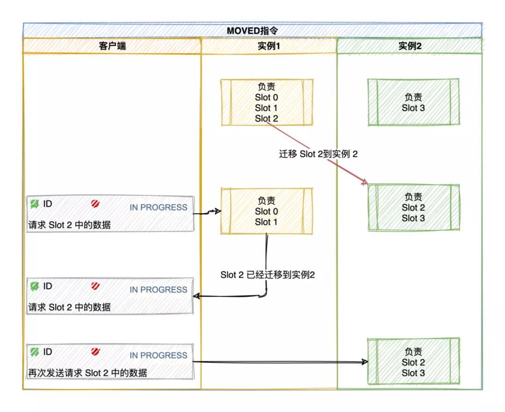

**ASK**

如果某个 slot 的数据比较多，部分迁移到新实例，还有一部分没有迁移。

如果请求的 key 在当前节点找到就直接执行命令，否则时候就需要 ASK 错误响应了。

槽部分迁移未完成的情况下，如果需要访问的 key 所在 Slot 正在从 实例 1 迁移到 实例 2（如果 key 已经不在实例 1），实例 1 会返回客户端一条 ASK 报错信息：**客户端请求的 key 所在的哈希槽正在迁移到实例 2 上，你先给实例 2 发送一个 ASKING 命令，接着发发送操作命令**。

比如客户端请求定位到 key = 「公众号:码哥字节」的槽 16330 在实例 172.17.18.1 上，节点 1 如果找得到就直接执行命令，否则响应 ASK 错误信息，并指引客户端转向正在迁移的目标节点 172.17.18.2。

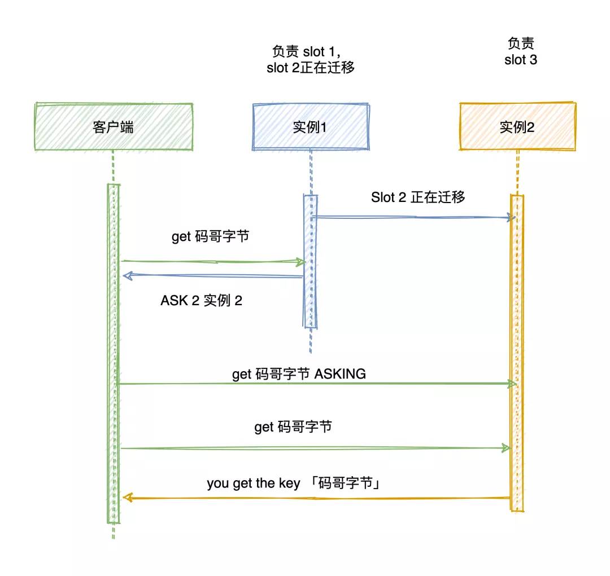

注意：**ASK 错误指令并不会更新客户端缓存的哈希槽分配信息**。

