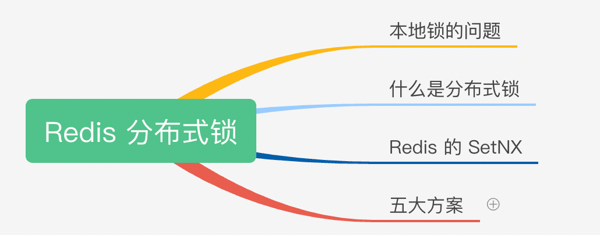
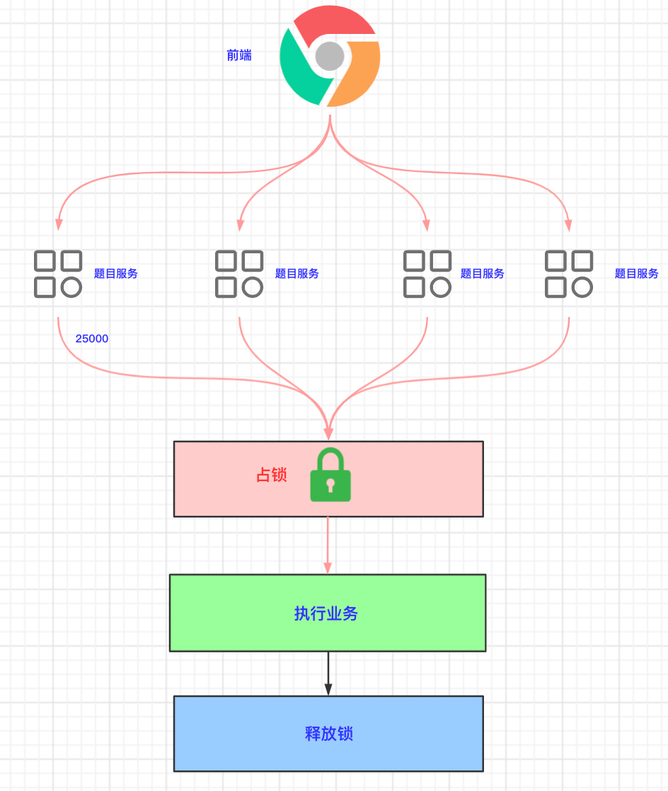
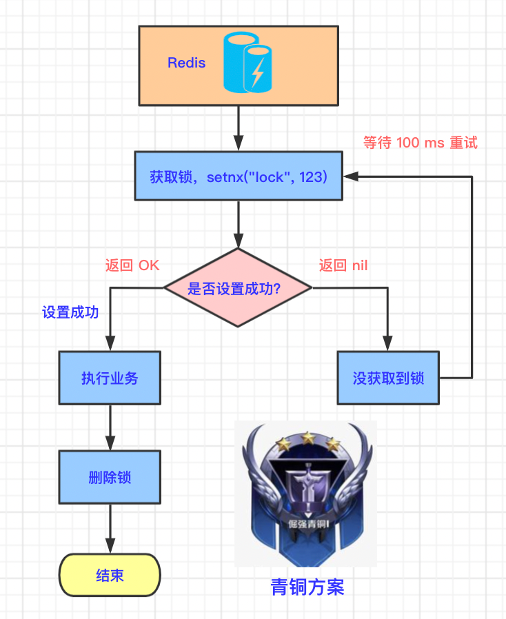
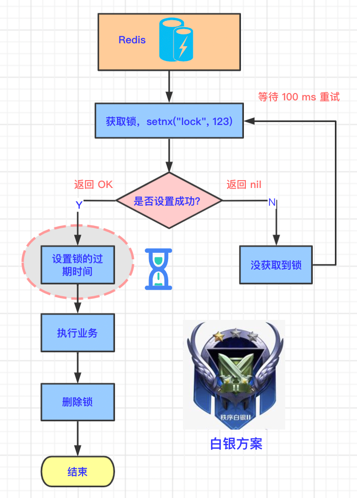
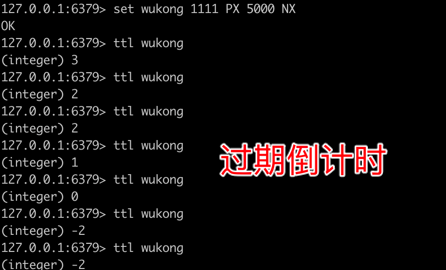
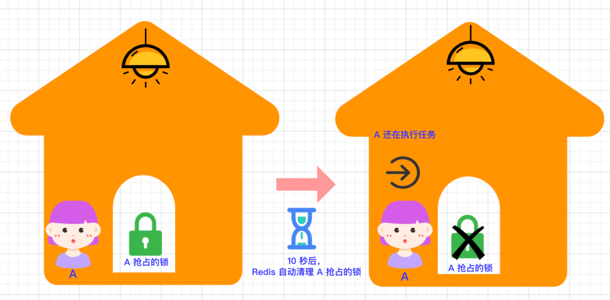
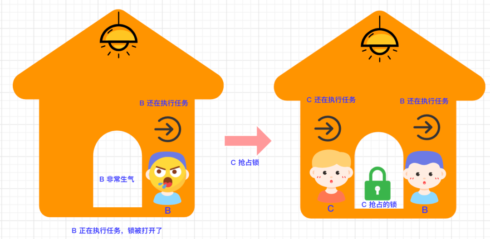
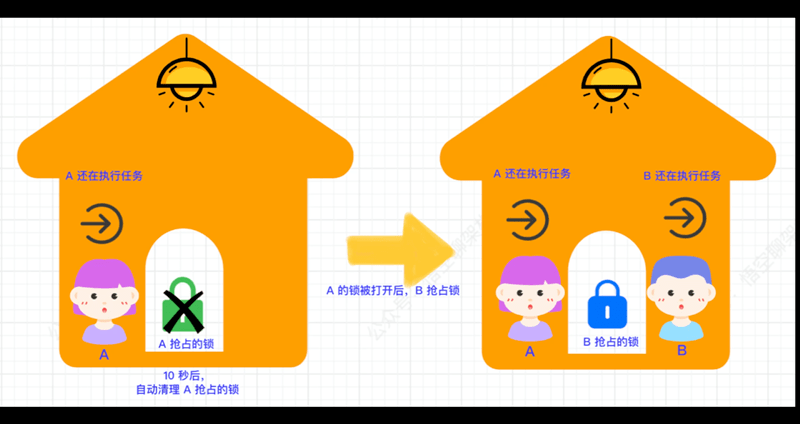
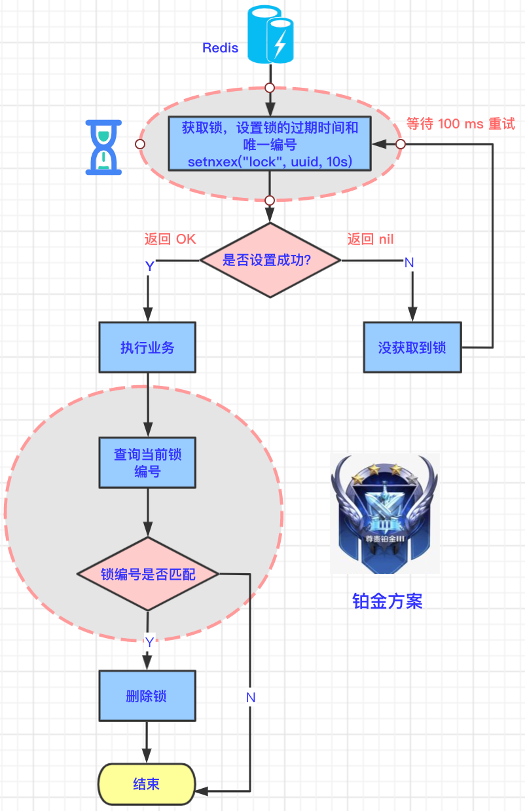
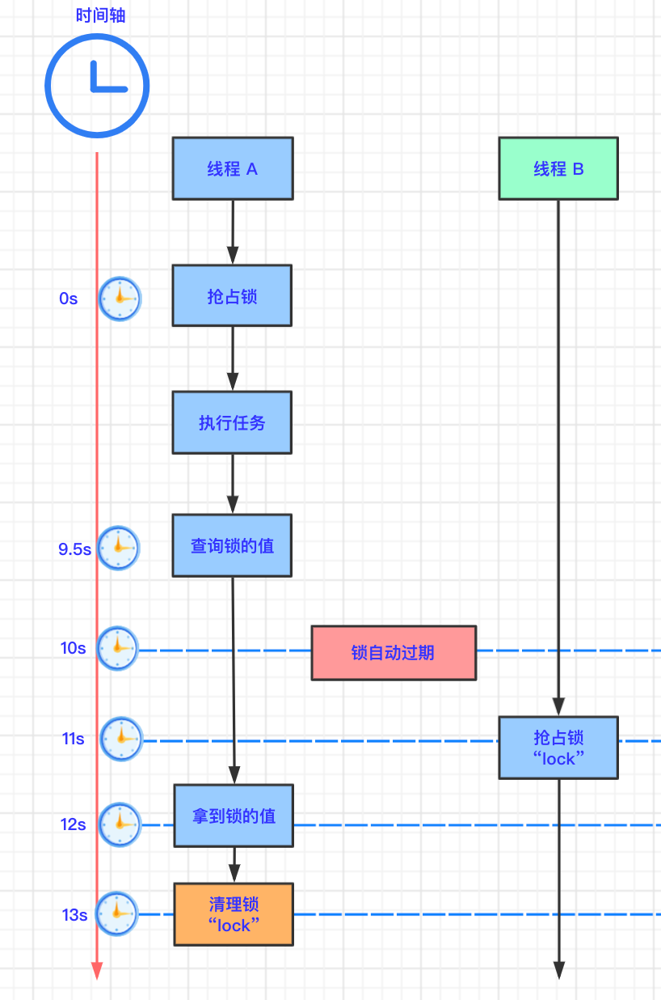

# Redis分布式锁五种方案

<!-- START doctoc generated TOC please keep comment here to allow auto update -->
<!-- DON'T EDIT THIS SECTION, INSTEAD RE-RUN doctoc TO UPDATE -->

- [零、开篇](#%E9%9B%B6%E5%BC%80%E7%AF%87)
- [一、本地锁的问题](#%E4%B8%80%E6%9C%AC%E5%9C%B0%E9%94%81%E7%9A%84%E9%97%AE%E9%A2%98)
- [二、什么是分布式锁](#%E4%BA%8C%E4%BB%80%E4%B9%88%E6%98%AF%E5%88%86%E5%B8%83%E5%BC%8F%E9%94%81)
- [三、Redis 的 SETNX](#%E4%B8%89redis-%E7%9A%84-setnx)
- [四、青铜方案](#%E5%9B%9B%E9%9D%92%E9%93%9C%E6%96%B9%E6%A1%88)
    - [1. 青铜原理](#1-%E9%9D%92%E9%93%9C%E5%8E%9F%E7%90%86)
    - [2. 青铜方案的缺陷](#2-%E9%9D%92%E9%93%9C%E6%96%B9%E6%A1%88%E7%9A%84%E7%BC%BA%E9%99%B7)
- [五、白银方案](#%E4%BA%94%E7%99%BD%E9%93%B6%E6%96%B9%E6%A1%88)
    - [1. 生活中的例子](#1-%E7%94%9F%E6%B4%BB%E4%B8%AD%E7%9A%84%E4%BE%8B%E5%AD%90)
    - [2. 技术原理图](#2-%E6%8A%80%E6%9C%AF%E5%8E%9F%E7%90%86%E5%9B%BE)
    - [3. 示例代码](#3-%E7%A4%BA%E4%BE%8B%E4%BB%A3%E7%A0%81)
    - [4. 白银方案的缺陷](#4-%E7%99%BD%E9%93%B6%E6%96%B9%E6%A1%88%E7%9A%84%E7%BC%BA%E9%99%B7)
- [六、黄金方案](#%E5%85%AD%E9%BB%84%E9%87%91%E6%96%B9%E6%A1%88)
    - [1. 原子指令](#1-%E5%8E%9F%E5%AD%90%E6%8C%87%E4%BB%A4)
    - [2. 技术原理图](#2-%E6%8A%80%E6%9C%AF%E5%8E%9F%E7%90%86%E5%9B%BE-1)
    - [3. 示例代码](#3-%E7%A4%BA%E4%BE%8B%E4%BB%A3%E7%A0%81-1)
    - [4. 黄金方案的缺陷](#4-%E9%BB%84%E9%87%91%E6%96%B9%E6%A1%88%E7%9A%84%E7%BC%BA%E9%99%B7)
- [七、铂金方案](#%E4%B8%83%E9%93%82%E9%87%91%E6%96%B9%E6%A1%88)
    - [1. 生活中的例子](#1-%E7%94%9F%E6%B4%BB%E4%B8%AD%E7%9A%84%E4%BE%8B%E5%AD%90-1)
    - [2. 技术原理图](#2-%E6%8A%80%E6%9C%AF%E5%8E%9F%E7%90%86%E5%9B%BE-2)
    - [3. 代码示例](#3-%E4%BB%A3%E7%A0%81%E7%A4%BA%E4%BE%8B)
    - [4. 铂金方案的缺陷](#4-%E9%93%82%E9%87%91%E6%96%B9%E6%A1%88%E7%9A%84%E7%BC%BA%E9%99%B7)
- [八、钻石方案](#%E5%85%AB%E9%92%BB%E7%9F%B3%E6%96%B9%E6%A1%88)
    - [1. 技术原理图](#1-%E6%8A%80%E6%9C%AF%E5%8E%9F%E7%90%86%E5%9B%BE)
    - [2. 代码示例](#2-%E4%BB%A3%E7%A0%81%E7%A4%BA%E4%BE%8B)
- [九、总结](#%E4%B9%9D%E6%80%BB%E7%BB%93)

<!-- END doctoc generated TOC please keep comment here to allow auto update -->

[TOC]

## 零、开篇

本篇主要内容如下：



## 一、本地锁的问题

首先我们来回顾下本地锁的问题：

目前题目微服务被拆分成了四个微服务。前端请求进来时，会被转发到不同的微服务。假如前端接收了 10 W 个请求，每个微服务接收 2.5 W 个请求，假如缓存失效了，每个微服务在访问数据库时加锁，通过锁（`synchronzied` 或 `lock`）来锁住自己的线程资源，从而防止`缓存击穿`。

这是一种`本地加锁`的方式，在`分布式`情况下会带来数据不一致的问题：比如服务 A 获取数据后，更新缓存 key =100，服务 B 不受服务 A 的锁限制，并发去更新缓存 key = 99，最后的结果可能是 99 或 100，但这是一种未知的状态，**与期望结果不一致**。流程图如下所示：


## 二、什么是分布式锁

基于上面本地锁的问题，我们需要一种支持**分布式集群环境**下的锁：查询 DB 时，只有一个线程能访问，其他线程都需要等待第一个线程释放锁资源后，才能继续执行。

**生活中的案例**：可以把锁看成房门外的一把`锁`，所有并发线程比作`人`，他们都想进入房间，房间内只能有一个人进入。当有人进入后，将门反锁，其他人必须等待，直到进去的人出来。


我们来看下分布式锁的基本原理，如下图所示：



我们来分析下上图的分布式锁：

- 1.前端将 10W 的高并发请求转发给四个题目微服务。
- 2.每个微服务处理 2.5 W 个请求。
- 3.每个处理请求的线程在执行业务之前，需要先抢占锁。可以理解为“占坑”。
- 4.获取到锁的线程在执行完业务后，释放锁。可以理解为“释放坑位”。
- 5.未获取到的线程需要等待锁释放。
- 6.释放锁后，其他线程抢占锁。
- 7.重复执行步骤 4、5、6。

大白话解释：所有请求的线程都去同一个地方`“占坑”`，如果有坑位，就执行业务逻辑，没有坑位，就需要其他线程释放“坑位”。这个坑位是所有线程可见的，可以把这个坑位放到 Redis 缓存或者数据库，这篇讲的就是如何用 Redis 做`“分布式坑位”`。

## 三、Redis 的 SETNX

Redis 作为一个公共可访问的地方，正好可以作为“占坑”的地方。

用 Redis 实现分布式锁的几种方案，我们都是用 SETNX 命令（设置 key 等于某 value）。只是高阶方案传的参数个数不一样，以及考虑了异常情况。

我们来看下这个命令，`SETNX`是`set If not exist`的简写。意思就是当 key 不存在时，设置 key 的值，存在时，什么都不做。

在 Redis 命令行中是这样执行的：

```
set <key> <value> NX
```

我们可以进到 redis 容器中来试下 `SETNX` 命令。

先进入容器：

```
docker exec -it <容器 id> redis-cli
```

然后执行 SETNX 命令：将 `wukong` 这个 key 对应的 value 设置成 `1111`。

```
set wukong 1111 NX
```

返回 `OK`，表示设置成功。重复执行该命令，返回 `nil`表示设置失败。

## 四、青铜方案

我们先用 Redis 的 SETNX 命令来实现最简单的分布式锁。

### 1. 青铜原理

我们来看下流程图：



- 多个并发线程都去 Redis 中申请锁，也就是执行 setnx 命令，假设线程 A 执行成功，说明当前线程 A 获得了。
- 其他线程执行 setnx 命令都会是失败的，所以需要等待线程 A 释放锁。
- 线程 A 执行完自己的业务后，删除锁。
- 其他线程继续抢占锁，也就是执行 setnx 命令。因为线程 A 已经删除了锁，所以又有其他线程可以抢占到锁了。

代码示例如下，Java 中 setnx 命令对应的代码为 `setIfAbsent`。

setIfAbsent 方法的第一个参数代表 key，第二个参数代表值。

```java
// 1.先抢占锁
Boolean lock = redisTemplate.opsForValue().setIfAbsent("lock", "123");
if(lock) {
  // 2.抢占成功，执行业务
  List<TypeEntity> typeEntityListFromDb = getDataFromDB();
  // 3.解锁
  redisTemplate.delete("lock");
  return typeEntityListFromDb;
} else {
  // 4.休眠一段时间
  sleep(100);
  // 5.抢占失败，等待锁释放
  return getTypeEntityListByRedisDistributedLock();
}
```

一个小问题：那为什么需要休眠一段时间？

因为该程序存在递归调用，可能会导致栈空间溢出。

### 2. 青铜方案的缺陷

青铜之所以叫青铜，是因为它是最初级的，肯定会带来很多问题。

**设想一种家庭场景**：晚上小空一个人开锁进入了房间，打开了电灯💡，然后突然`断电`了，小空想开门出去，但是找不到门锁位置，那小明就进不去了，外面的人也进不来。


从技术的角度看：setnx 占锁成功，业务代码出现异常或者服务器宕机，没有执行删除锁的逻辑，就造成了`死锁`。

**那如何规避这个风险呢？**

设置锁的`自动过期时间`，过一段时间后，自动删除锁，这样其他线程就能获取到锁了。

## 五、白银方案

### 1. 生活中的例子

上面提到的青铜方案会有死锁问题，那我们就用上面的规避风险的方案来设计下，也就是我们的白银方案。


还是生活中的例子：小空开锁成功后，给这款智能锁设置了一个`沙漏倒计时⏳`，沙漏完后，门锁自动打开。即使房间突然断电，过一段时间后，锁会自动打开，其他人就可以进来了。

### 2. 技术原理图

和青铜方案不同的地方在于，在占锁成功后，设置锁的过期时间，这两步是分步执行的。如下图所示：



### 3. 示例代码

清理 redis key 的代码如下

```java
// 在 10s 以后，自动清理 lock
redisTemplate.expire("lock", 10, TimeUnit.SECONDS);
```

完整代码如下：

```java
// 1.先抢占锁
Boolean lock = redisTemplate.opsForValue().setIfAbsent("lock", "123");
if(lock) {
    // 2.在 10s 以后，自动清理 lock
    redisTemplate.expire("lock", 10, TimeUnit.SECONDS);
    // 3.抢占成功，执行业务
    List<TypeEntity> typeEntityListFromDb = getDataFromDB();
    // 4.解锁
    redisTemplate.delete("lock");
    return typeEntityListFromDb;
}
```

### 4. 白银方案的缺陷

白银方案看似解决了线程异常或服务器宕机造成的锁未释放的问题，但还是存在其他问题：

因为占锁和设置过期时间是分两步执行的，所以如果在这两步之间发生了异常，则锁的过期时间根本就没有设置成功。

所以和青铜方案有一样的问题：**锁永远不能过期**。

## 六、黄金方案

### 1. 原子指令

上面的白银方案中，占锁和设置锁过期时间是分步两步执行的，这个时候，我们可以联想到什么：事务的原子性（Atom）。

**原子性**：多条命令要么都成功执行，要么都不执行。

将两步放在一步中执行：占锁+设置锁过期时间。

Redis 正好支持这种操作：

```
# 设置某个 key 的值并设置多少毫秒或秒 过期。
set <key> <value> PX <多少毫秒> NX
或
set <key> <value> EX <多少秒> NX
```

然后可以通过如下命令查看 key 的变化

```
ttl <key>
```

下面演示下如何设置 key 并设置过期时间。注意：执行命令之前需要先删除 key，可以通过客户端或命令删除。

```
# 设置 key=wukong，value=1111，过期时间=5000ms
set wukong 1111 PX 5000 NX
# 查看 key 的状态
ttl wukong
```

执行结果如下图所示：每运行一次 ttl 命令，就可以看到 wukong 的过期时间就会减少。最后会变为 -2（已过期）。



### 2. 技术原理图

黄金方案和白银方案的不同之处：获取锁的时候，也需要设置锁的过期时间，这是一个原子操作，要么都成功执行，要么都不执行。如下图所示：


### 3. 示例代码

设置 `lock` 的值等于 `123`，过期时间为 10 秒。如果 `10` 秒 以后，lock 还存在，则清理 lock。

```
setIfAbsent("lock", "123", 10, TimeUnit.SECONDS);
```

### 4. 黄金方案的缺陷

我们还是举生活中的例子来看下黄金方案的缺陷。

**用户 A 抢占锁**



- 用户 A 先抢占到了锁，并设置了这个锁 10 秒以后自动开锁，锁的编号为 `123`。
- 10 秒以后，A 还在执行任务，此时锁被自动打开了。

**用户 B 抢占锁**


- 用户 B 看到房间的锁打开了，于是抢占到了锁，设置锁的编号为 `123`，并设置了过期时间 `10 秒`。
- 因房间内只允许一个用户执行任务，所以用户 A 和 用户 B 执行任务`产生了冲突`。
- 用户 A 在 `15 s` 后，完成了任务，此时 用户 B 还在执行任务。
- 用户 A 主动打开了编号为 `123`的锁。
- 用户 B 还在执行任务，发现锁已经被打开了。
- 用户 B 非常生气：**我还没执行完任务呢，锁怎么开了？**

**用户 C 抢占锁**



- 用户 B 的锁被 A 主动打开后，A 离开房间，B 还在执行任务。
- 用户 C 抢占到锁，C 开始执行任务。
- 因房间内只允许一个用户执行任务，所以用户 B 和 用户 C 执行任务产生了冲突。

从上面的案例中我们可以知道，因为用户 A 处理任务所需要的时间**大于**锁自动清理（开锁）的时间，所以在自动开锁后，又有其他用户抢占到了锁。当用户 A 完成任务后，会把其他用户抢占到的锁给主动打开。

**这里为什么会打开别人的锁？**因为锁的编号都叫做 `“123”`，用户 A 只认锁编号，看见编号为 `“123”`的锁就开，结果把用户 B 的锁打开了，此时用户 B 还未执行完任务，当然生气了。

## 七、铂金方案

### 1. 生活中的例子

上面的黄金方案的缺陷也很好解决，给每个锁设置**不同的编号**不就好了～

如下图所示，B 抢占的锁是蓝色的，和 A 抢占到绿色锁不一样。这样就不会被 A 打开了。

做了个动图，方便理解：



### 2. 技术原理图

与黄金方案的不同之处：

- 设置锁的过期时间时，还需要设置唯一编号。
- 主动删除锁的时候，需要判断锁的编号是否和设置的一致，如果一致，则认为是自己设置的锁，可以进行主动删除。



### 3. 代码示例

```java
// 1.生成唯一 id
String uuid = UUID.randomUUID().toString();
// 2. 抢占锁
Boolean lock = redisTemplate.opsForValue().setIfAbsent("lock", uuid, 10, TimeUnit.SECONDS);
if(lock) {
    System.out.println("抢占成功：" + uuid);
    // 3.抢占成功，执行业务
    List<TypeEntity> typeEntityListFromDb = getDataFromDB();
    // 4.获取当前锁的值
    String lockValue = redisTemplate.opsForValue().get("lock");
    // 5.如果锁的值和设置的值相等，则清理自己的锁
    if(uuid.equals(lockValue)) {
        System.out.println("清理锁：" + lockValue);
        redisTemplate.delete("lock");
    }
    return typeEntityListFromDb;
} else {
    System.out.println("抢占失败，等待锁释放");
    // 4.休眠一段时间
    sleep(100);
    // 5.抢占失败，等待锁释放
    return getTypeEntityListByRedisDistributedLock();
}
```

- 生成随机唯一 id，给锁加上唯一值。
- 抢占锁，并设置过期时间为 10 s，且锁具有随机唯一 id。
- 抢占成功，执行业务。
- 执行完业务后，获取当前锁的值。
- 如果锁的值和设置的值相等，则清理自己的锁。

### 4. 铂金方案的缺陷

上面的方案看似很完美，但还是存在问题：第 4 步和第 5 步并不是原子性的。



- 时刻：0s。线程 A 抢占到了锁。
- 时刻：9.5s。线程 A 向 Redis 查询当前 key 的值。
- 时刻：10s。锁自动过期。
- 时刻：11s。线程 B 抢占到锁。
- 时刻：12s。线程 A 在查询途中耗时长，终于拿多锁的值。
- 时刻：13s。线程 A 还是拿自己设置的锁的值和返回的值进行比较，值是相等的，清理锁，但是这个锁其实是线程 B 抢占的锁。

那如何规避这个风险呢？钻石方案登场。

## 八、钻石方案

上面的线程 A 查询锁和删除锁的逻辑不是`原子性`的，所以将查询锁和删除锁这两步作为原子指令操作就可以了。

### 1. 技术原理图

如下图所示，红色圈出来的部分是钻石方案的不同之处。用脚本进行删除，达到原子操作。


### 2. 代码示例

那如何用脚本进行删除呢？

我们先来看一下这段 Redis 专属脚本：

```lua
if redis.call("get",KEYS[1]) == ARGV[1]
then
    return redis.call("del",KEYS[1])
else
    return 0
end
```

这段脚本和铂金方案的获取key，删除key的方式很像。先获取 KEYS[1] 的 value，判断 KEYS[1] 的 value 是否和 ARGV[1] 的值相等，如果相等，则删除 KEYS[1]。

那么这段脚本怎么在 Java 项目中执行呢？

分两步：先定义脚本；用 redisTemplate.execute 方法执行脚本。

```java
// 脚本解锁
String script = "if redis.call('get',KEYS[1]) == ARGV[1] then return redis.call('del',KEYS[1]) else return 0 end";
redisTemplate.execute(new DefaultRedisScript<Long>(script, Long.class), Arrays.asList("lock"), uuid);
```

上面的代码中，KEYS[1] 对应`“lock”`，ARGV[1] 对应 `“uuid”`，含义就是如果 lock 的 value 等于 uuid 则删除 lock。

而这段 Redis 脚本是由 Redis 内嵌的 Lua 环境执行的，所以又称作 Lua 脚本。

**那钻石方案是不是就完美了呢？有没有更好的方案呢？**

下篇，我们再来介绍另外一种分布式锁的王者方案：Redisson。

## 九、总结

本篇通过本地锁的问题引申出分布式锁的问题。然后介绍了五种分布式锁的方案，由浅入深讲解了不同方案的改进之处。

从上面几种方案的不断演进的过程中，知道了系统中哪些地方可能存在异常情况，以及该如何更好地进行处理。

举一反三，这种不断演进的思维模式也可以运用到其他技术中。

下面总结下上面五种方案的缺陷和改进之处。

**青铜方案**：

- 缺陷：业务代码出现异常或者服务器宕机，没有执行主动删除锁的逻辑，就造成了死锁。
- 改进：设置锁的自动过期时间，过一段时间后，自动删除锁，这样其他线程就能获取到锁了。

**白银方案**：

- 缺陷：占锁和设置锁过期时间是分步两步执行的，不是原子操作。
- 改进：占锁和设置锁过期时间保证原子操作。

**黄金方案**：

- 缺陷：主动删除锁时，因锁的值都是相同的，将其他客户端占用的锁删除了。
- 改进：每次占用的锁，随机设为较大的值，主动删除锁时，比较锁的值和自己设置的值是否相等。

**铂金方案**：

- 缺陷：获取锁、比较锁的值、删除锁，这三步是非原子性的。中途又可能锁自动过期了，又被其他客户端抢占了锁，导致删锁时把其他客户端占用的锁删了。
- 改进：使用 Lua 脚本进行获取锁、比较锁、删除锁的原子操作。

**钻石方案**：

- 缺陷：非专业的分布式锁方案。
- 改进：Redission 分布式锁。

**王者方案**，下篇见～

