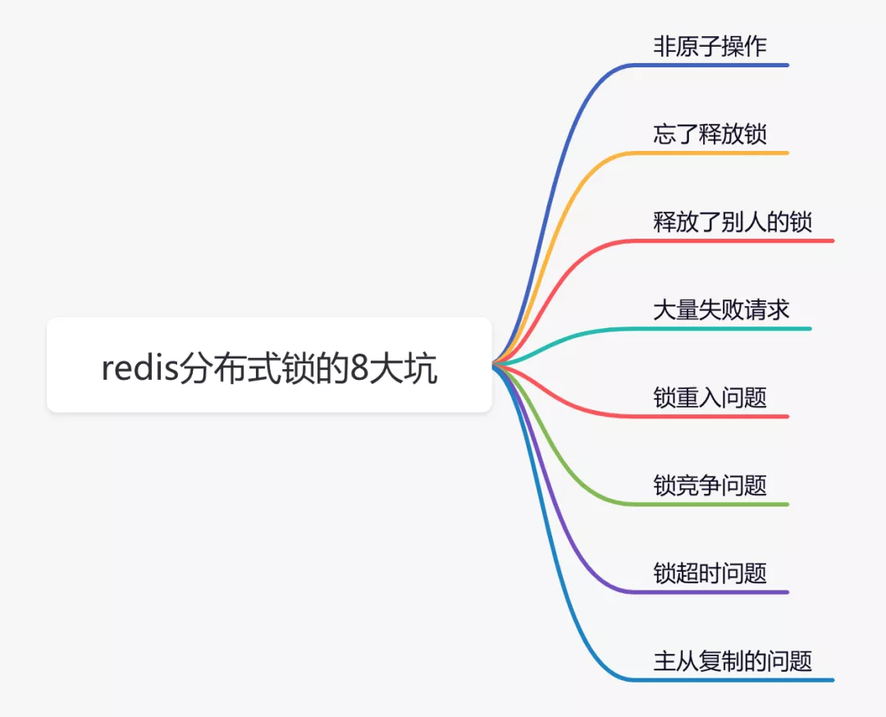
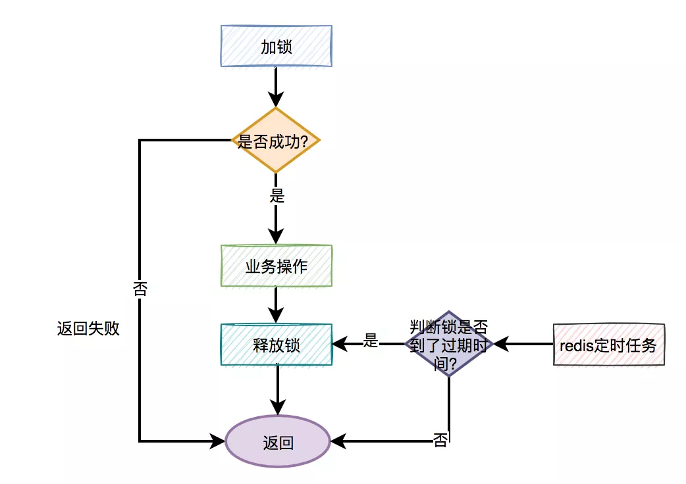
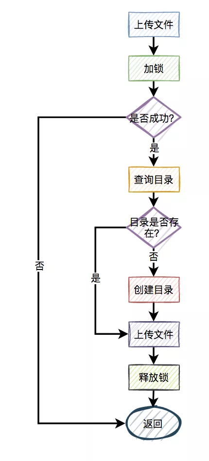

# Redis分布式锁的8大坑

## 零、开篇

在分布式系统中，由于redis分布式锁相对于更简单和高效，成为了分布式锁的首先，被我们用到了很多实际业务场景当中。

但不是说用了redis分布式锁，就可以高枕无忧了，如果没有用好或者用对，也会引来一些意想不到的问题。

今天我们就一起聊聊redis分布式锁的一些坑，给有需要的朋友一个参考。



## 一、非原子操作

使用redis的分布式锁，我们首先想到的可能是`setNx`命令。

```java
if (jedis.setnx(lockKey, val) == 1) { 
   jedis.expire(lockKey, timeout); 
}
```

容易，三下五除二，我们就可以把代码写好。

这段代码确实可以加锁成功，但你有没有发现什么问题？

`加锁操作`和后面的`设置超时时间`是分开的，并`非原子操作`。

假如加锁成功，但是设置超时时间失败了，该lockKey就变成永不失效。假如在高并发场景中，有大量的lockKey加锁成功了，但不会失效，有可能直接导致redis内存空间不足。

那么，有没有保证原子性的加锁命令呢？

答案是：有，请看下面。

## 二、忘了释放锁

上面说到使用`setNx`命令加锁操作和设置超时时间是分开的，并非原子操作。

而在redis中还有`set`命令，该命令可以指定多个参数。

```java
String result = jedis.set(lockKey, requestId, "NX", "PX", expireTime); 
if ("OK".equals(result)) { 
    return true; 
} 
return false;
```

其中：

- `lockKey`：锁的标识

- `requestId`：请求id

- `NX`：只在键不存在时，才对键进行设置操作。

- `PX`：设置键的过期时间为 millisecond 毫秒。

- `expireTime`：过期时间

`set`命令是原子操作，加锁和设置超时时间，一个命令就能轻松搞定。

nice

使用`set`命令加锁，表面上看起来没有问题。但如果仔细想想，加锁之后，每次都要达到了超时时间才释放锁，会不会有点不合理？加锁后，如果不及时释放锁，会有很多问题。

分布式锁更合理的用法是：

1. 手动加锁

2. 业务操作

3. 手动释放锁

4. 如果手动释放锁失败了，则达到超时时间，redis会自动释放锁。

大致流程图如下：



那么问题来了，如何释放锁呢？

伪代码如下：

```java
try{
  String result = jedis.set(lockKey, requestId, "NX", "PX", expireTime);
  if ("OK".equals(result)) {
      return true;
  }
  return false;
} finally {
    unlock(lockKey);
}  
```

需要捕获业务代码的异常，然后在`finally`中释放锁。换句话说就是：无论代码执行成功或失败了，都需要释放锁。

此时，有些朋友可能会问：假如刚好在释放锁的时候，系统被重启了，或者网络断线了，或者机房断点了，不也会导致释放锁失败？

这是一个好问题，因为这种小概率问题确实存在。

但还记得前面我们给锁设置过超时时间吗？即使出现异常情况造成释放锁失败，但到了我们设定的超时时间，锁还是会被redis自动释放。

但只在finally中释放锁，就够了吗？

## 三、释放了别人的锁

做人要厚道，先回答上面的问题：只在finally中释放锁，当然是不够的，因为释放锁的姿势，还是不对。

哪里不对？

答：在多线程场景中，可能会出现释放了别人的锁的情况。

有些朋友可能会反驳：假设在多线程场景中，线程A获取到了锁，但如果线程A没有释放锁，此时，线程B是获取不到锁的，何来释放了别人锁之说？

答：假如线程A和线程B，都使用lockKey加锁。线程A加锁成功了，但是由于业务功能耗时时间很长，超过了设置的超时时间。这时候，redis会自动释放lockKey锁。此时，线程B就能给lockKey加锁成功了，接下来执行它的业务操作。恰好这个时候，线程A执行完了业务功能，接下来，在finally方法中释放了锁lockKey。这不就出问题了，线程B的锁，被线程A释放了。

我想这个时候，线程B肯定哭晕在厕所里，并且嘴里还振振有词。

那么，如何解决这个问题呢？

不知道你们注意到没？在使用`set`命令加锁时，除了使用lockKey锁标识，还多设置了一个参数：`requestId`，为什么要需要记录requestId呢？

答：requestId是在释放锁的时候用的。

伪代码如下：

```java
if (jedis.get(lockKey).equals(requestId)) { 
    jedis.del(lockKey); 
    return true; 
} 
return false;
```

在释放锁的时候，先获取到该锁的值（之前设置值就是requestId），然后判断跟之前设置的值是否相同，如果相同才允许删除锁，返回成功。如果不同，则直接返回失败。

> 换句话说就是：自己只能释放自己加的锁，不允许释放别人加的锁。

这里为什么要用requestId，用userId不行吗？

答：如果用userId的话，对于请求来说并不唯一，多个不同的请求，可能使用同一个userId。而requestId是全局唯一的，不存在加锁和释放锁乱掉的情况。

此外，使用lua脚本，也能解决释放了别人的锁的问题：

```lua
if redis.call('get', KEYS[1]) == ARGV[1] then  
 return redis.call('del', KEYS[1])  
else  
  return 0  
end
```

lua脚本能保证查询锁是否存在和删除锁是原子操作，用它来释放锁效果更好一些。

说到lua脚本，其实加锁操作也建议使用lua脚本：

```lua
if (redis.call('exists', KEYS[1]) == 0) then 
    redis.call('hset', KEYS[1], ARGV[2], 1);  
    redis.call('pexpire', KEYS[1], ARGV[1]);  
 return nil;  
end 
if (redis.call('hexists', KEYS[1], ARGV[2]) == 1) 
   redis.call('hincrby', KEYS[1], ARGV[2], 1);  
   redis.call('pexpire', KEYS[1], ARGV[1]);  
  return nil;  
end;  
return redis.call('pttl', KEYS[1]);
```

这是redisson框架的加锁代码，写的不错，大家可以借鉴一下。

有趣，下面还有哪些好玩的东西？

## 四、大量失败请求

上面的加锁方法看起来好像没有问题，但如果你仔细想想，如果有1万的请求同时去竞争那把锁，可能只有一个请求是成功的，其余的9999个请求都会失败。

在秒杀场景下，会有什么问题？

答：每1万个请求，有1个成功。再1万个请求，有1个成功。如此下去，直到库存不足。这就变成均匀分布的秒杀了，跟我们想象中的不一样。

如何解决这个问题呢？

此外，还有一种场景：

比如，有两个线程同时上传文件到sftp，上传文件前先要创建目录。假设两个线程需要创建的目录名都是当天的日期，比如：20210920，如果不做任何控制，直接并发的创建目录，第二个线程必然会失败。

这时候有些朋友可能会说：这还不容易，加一个redis分布式锁就能解决问题了，此外再判断一下，如果目录已经存在就不创建，只有目录不存在才需要创建。

伪代码如下：

```java
try {
  String result = jedis.set(lockKey, requestId, "NX", "PX", expireTime);
  if ("OK".equals(result)) {
    if(!exists(path)) {
       mkdir(path);
    }
    return true;
  }
} finally{
    unlock(lockKey,requestId);
}  
return false;
```

一切看似美好，但经不起仔细推敲。

来自灵魂的一问：第二个请求如果加锁失败了，接下来，是返回失败，还是返回成功呢？

主要流程图如下：



显然第二个请求，肯定是不能返回失败的，如果返回失败了，这个问题还是没有被解决。如果文件还没有上传成功，直接返回成功会有更大的问题。头疼，到底该如何解决呢？

答：使用`自旋锁`。

```java
try {
  Long start = System.currentTimeMillis();
  while(true) {
     String result = jedis.set(lockKey, requestId, "NX", "PX", expireTime);
     if ("OK".equals(result)) {
        if(!exists(path)) {
           mkdir(path);
        }
        return true;
     }
     
     long time = System.currentTimeMillis() - start;
      if (time>=timeout) {
          return false;
      }
      try {
          Thread.sleep(50);
      } catch (InterruptedException e) {
          e.printStackTrace();
      }
  }
} finally{
    unlock(lockKey,requestId);
}  
return false;

```

在规定的时间，比如500毫秒内，自旋不断尝试加锁（说白了，就是在死循环中，不断尝试加锁），如果成功则直接返回。如果失败，则休眠50毫秒，再发起新一轮的尝试。如果到了超时时间，还未加锁成功，则直接返回失败。

好吧，学到一招了，还有吗？

## 五、锁重入问题

我们都知道redis分布式锁是互斥的。假如我们对某个key加锁了，如果该key对应的锁还没失效，再用相同key去加锁，大概率会失败。

没错，大部分场景是没问题的。

为什么说是大部分场景呢？

因为还有这样的场景：

假设在某个请求中，需要获取一颗满足条件的菜单树或者分类树。我们以菜单为例，这就需要在接口中从根节点开始，递归遍历出所有满足条件的子节点，然后组装成一颗菜单树。

需要注意的是菜单不是一成不变的，在后台系统中运营同学可以动态添加、修改和删除菜单。为了保证在并发的情况下，每次都可能获取最新的数据，这里可以加redis分布式锁。

加redis分布式锁的思路是对的。但接下来问题来了，在递归方法中递归遍历多次，每次都是加的同一把锁。递归第一层当然是可以加锁成功的，但递归第二层、第三层...第N层，不就会加锁失败了？

递归方法中加锁的伪代码如下：

```java
private int expireTime = 1000;

public void fun(int level,String lockKey,String requestId){
  try{
     String result = jedis.set(lockKey, requestId, "NX", "PX", expireTime);
     if ("OK".equals(result)) {
        if(level<=10){
           this.fun(++level,lockKey,requestId);
        } else {
           return;
        }
     }
     return;
  } finally {
     unlock(lockKey,requestId);
  }
}
```

如果你直接这么用，看起来好像没有问题。但最终执行程序之后发现，等待你的结果只有一个：`出现异常`。

因为从根节点开始，第一层递归加锁成功，还没释放锁，就直接进入第二层递归。因为锁名为lockKey，并且值为requestId的锁已经存在，所以第二层递归大概率会加锁失败，然后返回到第一层。第一层接下来正常释放锁，然后整个递归方法直接返回了。

这下子，大家知道出现什么问题了吧？

没错，递归方法其实只执行了第一层递归就返回了，其他层递归由于加锁失败，根本没法执行。

那么这个问题该如何解决呢？

答：使用`可重入锁`。

我们以redisson框架为例，它的内部实现了可重入锁的功能。

古时候有句话说得好：为人不识陈近南，便称英雄也枉然。

我说：分布式锁不识redisson，便称好锁也枉然。哈哈哈，只是自娱自乐一下。

由此可见，redisson在redis分布式锁中的江湖地位很高。

伪代码如下：

```java
private int expireTime = 1000;

public void run(String lockKey) {
  RLock lock = redisson.getLock(lockKey);
  this.fun(lock,1);
}

public void fun(RLock lock,int level){
  try{
      lock.lock(5, TimeUnit.SECONDS);
      if(level<=10){
         this.fun(lock,++level);
      } else {
         return;
      }
  } finally {
     lock.unlock();
  }
}
```

上面的代码也许并不完美，这里只是给了一个大致的思路，如果大家有这方面需求的话，以上代码仅供参考。

接下来，聊聊redisson可重入锁的实现原理。

加锁主要是通过以下脚本实现的：

```lua
if (redis.call('exists', KEYS[1]) == 0) 
then  
   redis.call('hset', KEYS[1], ARGV[2], 1);        
   redis.call('pexpire', KEYS[1], ARGV[1]); 
   return nil; 
end;
if (redis.call('hexists', KEYS[1], ARGV[2]) == 1) 
then  
  redis.call('hincrby', KEYS[1], ARGV[2], 1); 
  redis.call('pexpire', KEYS[1], ARGV[1]); 
  return nil; 
end;
return redis.call('pttl', KEYS[1]);
```

其中：

- KEYS[1]：锁名

- ARGV[1]：过期时间

- ARGV[2]：uuid + ":" + threadId，可认为是requestId
1. 先判断如果锁名不存在，则加锁。

2. 接下来，判断如果锁名和requestId值都存在，则使用hincrby命令给该锁名和requestId值计数，每次都加1。注意一下，这里就是重入锁的关键，锁重入一次值就加1。

3. 如果锁名存在，但值不是requestId，则返回过期时间。

释放锁主要是通过以下脚本实现的：

```lua
if (redis.call('hexists', KEYS[1], ARGV[3]) == 0) 
then 
  return nil
end
local counter = redis.call('hincrby', KEYS[1], ARGV[3], -1);
if (counter > 0) 
then 
    redis.call('pexpire', KEYS[1], ARGV[2]); 
    return 0; 
 else 
   redis.call('del', KEYS[1]); 
   redis.call('publish', KEYS[2], ARGV[1]); 
   return 1; 
end; 
return nil
```

1. 先判断如果锁名和requestId值不存在，则直接返回。

2. 如果锁名和requestId值存在，则重入锁减1。

3. 如果减1后，重入锁的value值还大于0，说明还有引用，则重试设置过期时间。

4. 如果减1后，重入锁的value值还等于0，则可以删除锁，然后发消息通知等待线程抢锁。

> 再次强调一下，如果你们系统可以容忍数据暂时不一致，有些场景不加锁也行，我在这里只是举个例子，本节内容并不适用于所有场景。