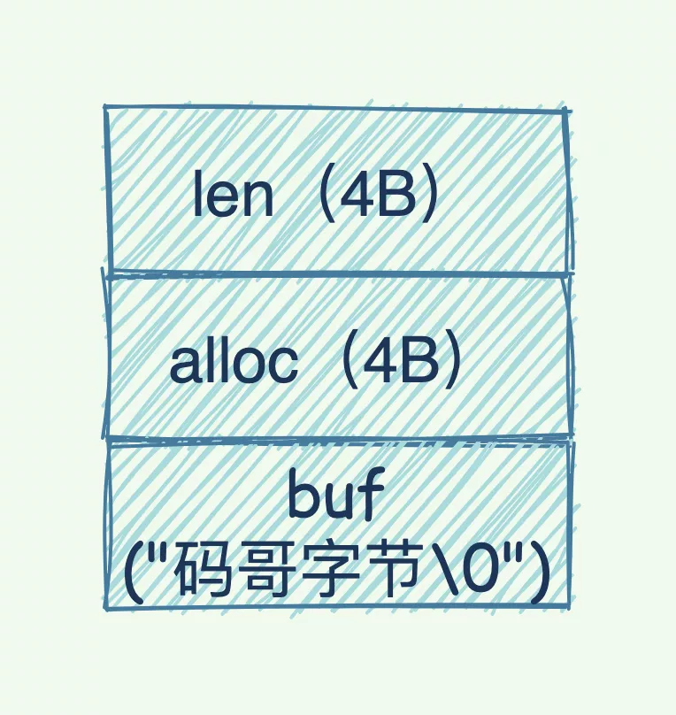
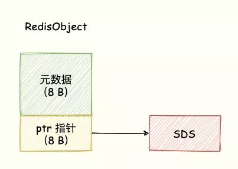
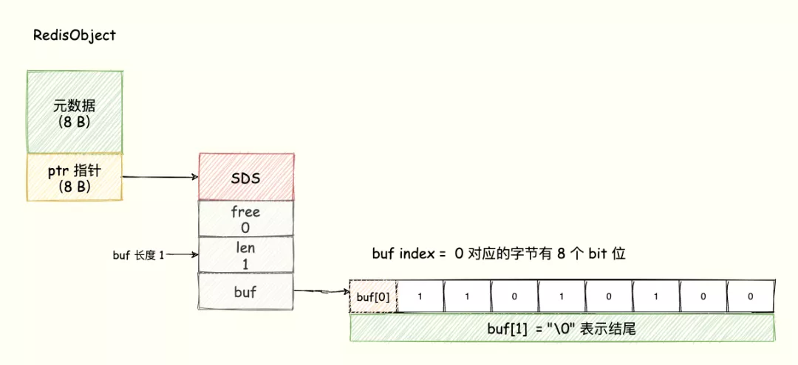
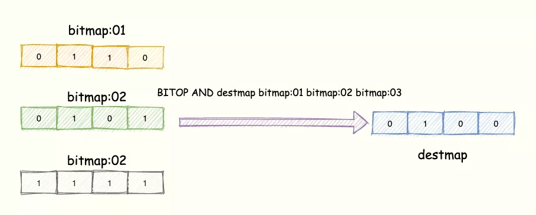

# Redis实战-Bitmap实现统计

<!-- START doctoc generated TOC please keep comment here to allow auto update -->
<!-- DON'T EDIT THIS SECTION, INSTEAD RE-RUN doctoc TO UPDATE -->

- [零、开篇](#%E9%9B%B6%E5%BC%80%E7%AF%87)
- [一、二值状态统计](#%E4%B8%80%E4%BA%8C%E5%80%BC%E7%8A%B6%E6%80%81%E7%BB%9F%E8%AE%A1)
- [二、判断用户登陆态](#%E4%BA%8C%E5%88%A4%E6%96%AD%E7%94%A8%E6%88%B7%E7%99%BB%E9%99%86%E6%80%81)
- [三、用户每个月的签到情况](#%E4%B8%89%E7%94%A8%E6%88%B7%E6%AF%8F%E4%B8%AA%E6%9C%88%E7%9A%84%E7%AD%BE%E5%88%B0%E6%83%85%E5%86%B5)
- [四、连续签到用户总数](#%E5%9B%9B%E8%BF%9E%E7%BB%AD%E7%AD%BE%E5%88%B0%E7%94%A8%E6%88%B7%E6%80%BB%E6%95%B0)
- [五、小结](#%E4%BA%94%E5%B0%8F%E7%BB%93)

<!-- END doctoc generated TOC please keep comment here to allow auto update -->

[TOC]

## 零、开篇

在移动应用的业务场景中，我们需要保存这样的信息：一个 key 关联了一个数据集合。

常见的场景如下：

- 给一个 userId ，判断用户登陆状态；
- 显示用户某个月的签到次数和首次签到时间；
- 两亿用户最近 7 天的签到情况，统计 7 天内连续签到的用户总数；

通常情况下，我们面临的用户数量以及访问量都是巨大的，比如百万、千万级别的用户数量，或者千万级别、甚至亿级别的访问信息。

所以，我们必须要选择能够非常高效地统计大量数据（例如亿级）的集合类型。

**如何选择合适的数据集合，我们首先要了解常用的统计模式，并运用合理的数据类型来解决实际问题。**

四种统计类型：

1. 二值状态统计；
2. 聚合统计；
3. 排序统计；
4. 基数统计。

本文将由**二值状态统计类型**作为实战篇系列的开篇，文中将用到 String、Set、Zset、List、hash 以外的拓展数据类型 `Bitmap` 来实现。

## 一、二值状态统计

> 什么是二值状态统计呀？

也就是集合中的元素的值只有 0 和 1 两种，在签到打卡和用户是否登陆的场景中，只需记录`签到(1)`或 `未签到(0)`，`已登录(1)`或`未登陆(0)`。

假如我们在判断用户是否登陆的场景中使用 Redis 的 String 类型实现（**key -> userId，value -> 0 表示下线，1 - 登陆**），假如存储 100 万个用户的登陆状态，如果以字符串的形式存储，就需要存储
100 万个字符串了，内存开销太大。

> 为什么 String 类型内存开销大？

String 类型除了记录实际数据以外，还需要额外的内存记录数据长度、空间使用等信息。

当保存的数据包含字符串，String 类型就使用简单动态字符串（SDS）结构体来保存，如下图所示：



- **len**：占 4 个字节，表示 buf 的已用长度。
- **alloc**：占 4 个字节，表示 buf 实际分配的长度，通常 > len。
- **buf**：字节数组，保存实际的数据，Redis 自动在数组最后加上一个 “\0”，额外占用一个字节的开销。

所以，在 SDS 中除了 buf 保存实际的数据， len 与 alloc 就是额外的开销。

另外，还有一个 **RedisObject 结构的开销**，因为 Redis 的数据类型有很多，而且，不同数据类型都有些相同的元数据要记录（比如最后一次访问的时间、被引用的次数等）。

所以，Redis 会用一个 RedisObject 结构体来统一记录这些元数据，同时指向实际数据。



对于二值状态场景，我们就可以利用 Bitmap 来实现。比如登陆状态我们用一个 bit 位表示，一亿个用户也只占用 一亿 个 bit 位内存 ≈ （100000000 / 8/ 1024/1024）12 MB。

```
大概的空间占用计算公式是：($offset/8/1024/1024) MB
```

> 什么是 Bitmap 呢？

Bitmap 的底层数据结构用的是 String 类型的 SDS 数据结构来保存位数组，Redis 把每个字节数组的 8 个 bit 位利用起来，每个 bit 位 表示一个元素的二值状态（不是 0 就是 1）。

可以将 Bitmap 看成是一个 bit 为单位的数组，数组的每个单元只能存储 0 或者 1，数组的下标在 Bitmap 中叫做 offset 偏移量。

为了直观展示，我们可以理解成 buf 数组的每个字节用一行表示，每一行有 8 个 bit 位，8 个格子分别表示这个字节中的 8 个 bit 位，如下图所示：



## 二、判断用户登陆态

> 怎么用 Bitmap 来判断海量用户中某个用户是否在线呢？

Bitmap 提供了 `GETBIT、SETBIT` 操作，通过一个偏移值 offset 对 bit 数组的 offset 位置的 bit 位进行读写操作，需要注意的是 offset 从 0 开始。

只需要一个 key = login_status 表示存储用户登陆状态集合数据， 将**用户 ID 作为 offset**，在线就设置为 1，下线设置 0。通过 `GETBIT`判断对应的用户是否在线。50000 万 用户只需要 6 MB
的空间。

**SETBIT 命令**

```
SETBIT <key> <offset> <value>
```

设置或者清空 key 的 value 在 offset 处的 bit 值（只能是 0 或者 1）。

**GETBIT 命令**

```
GETBIT <key> <offset>
```

获取 key 的 value 在 offset 处的 bit 位的值，当 key 不存在时，返回 0。

假如我们要判断 ID = 10086 的用户的登陆情况：

第一步，执行以下指令，表示用户已登录。

```
SETBIT login_status 10086 1
```

第二步，检查该用户是否登陆，返回值 1 表示已登录。

```
GETBIT login_status 10086
```

第三步，登出，将 offset 对应的 value 设置成 0。

```
SETBIT login_status 10086 0
```

## 三、用户每个月的签到情况

在签到统计中，每个用户每天的签到用 1 个 bit 位表示，一年的签到只需要 365 个 bit 位。一个月最多只有 31 天，只需要 31 个 bit 位即可。

> 比如统计编号 89757 的用户在 2021 年 5 月份的打卡情况要如何进行？

**解：一个用户一个月一个key**

key 可以设计成 `uid:sign:{userId}:{yyyyMM}`，月份的每一天的值 - 1 可以作为 offset（因为 offset 从 0 开始，所以 `offset = 日期 - 1`）。

第一步，执行下面指令表示记录用户在 2021 年 5 月 16 号打卡。

```
SETBIT uid:sign:89757:202105 15 1
```

第二步，判断编号 89757 用户在 2021 年 5 月 16 号是否打卡。

```
GETBIT uid:sign:89757:202105 15
```

第三步，统计该用户在 5 月份的打卡次数，使用 `BITCOUNT` 指令。该指令用于统计给定的 bit 数组中，值 = 1 的 bit 位的数量。

```
BITCOUNT uid:sign:89757:202105
```

这样我们就可以实现用户每个月的打卡情况了，是不是很赞。

> 如何统计这个月首次打卡时间呢？

Redis 提供了 `BITPOS key bitValue [start] [end]`指令，返回数据表示 Bitmap 中第一个值为 `bitValue` 的 offset 位置。

在默认情况下， 命令将检测整个位图， 用户可以通过可选的 `start` 参数和 `end` 参数指定要检测的范围。

所以我们可以通过执行以下指令来获取 userID = 89757 在 2021 年 5 月份**首次打卡**日期：

```
BITPOS uid:sign:89757:202105 1
```

需要注意的是，我们需要将返回的 value + 1 ，因为 offset 从 0 开始。

## 四、连续签到用户总数

> 在记录了一个亿的用户连续 7 天的打卡数据，如何统计出这连续 7 天连续打卡用户总数呢？

我们把每天的日期作为 Bitmap 的 key，userId 作为 offset，若是打卡则将 offset 位置的 bit 设置成 1。

key 对应的集合的每个 bit 位的数据则是一个用户在该日期的打卡记录。

一共有 7 个这样的 Bitmap，如果我们能对这 7 个 Bitmap 的对应的 bit 位做 『与』运算。

同样的 UserID offset 都是一样的，当一个 userID 在 7 个 Bitmap 对应对应的 offset 位置的 bit = 1 就说明该用户 7 天连续打卡。

结果保存到一个新 Bitmap 中，我们再通过 `BITCOUNT` 统计 bit = 1 的个数便得到了连续打卡 7 天的用户总数了。

Redis 提供了 `BITOP operation destkey key [key ...]`这个指令用于对一个或者多个 键 = key 的 Bitmap 进行位元操作。

`opration` 可以是 `and`、`OR`、`NOT`、`XOR`。当 BITOP 处理不同长度的字符串时，较短的那个字符串所缺少的部分会被看作 `0` 。空的 `key` 也被看作是包含 `0` 的字符串序列。

便于理解，如下图所示：



3 个 Bitmap，对应的 bit 位做「与」操作，结果保存到新的 Bitmap 中。

操作指令表示将 三个 bitmap 进行 AND 操作，并将结果保存到 destmap 中。接着对 destmap 执行 BITCOUNT 统计。

```
// 与操作
BITOP AND destmap bitmap:01 bitmap:02 bitmap:03
// 统计 bit 位 =  1 的个数
BITCOUNT destmap
```

简单计算下 一个一亿个位的 Bitmap占用的内存开销，大约占 12 MB 的内存（10^8/8/1024/1024），7 天的 Bitmap 的内存开销约为 84 MB。同时我们最好给 Bitmap 设置过期时间，让 Redis
删除过期的打卡数据，节省内存。

## 五、小结

思路才是最重要，当我们遇到的统计场景只需要统计数据的二值状态，比如用户是否存在、 ip 是否是黑名单、以及签到打卡统计等场景就可以考虑使用 Bitmap。

只需要一个 bit 位就能表示 0 和 1。在统计海量数据的时候将大大减少内存占用。

