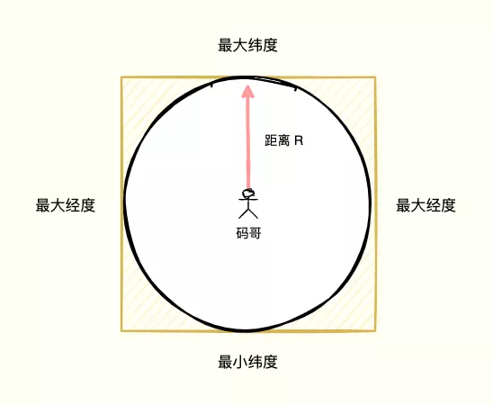
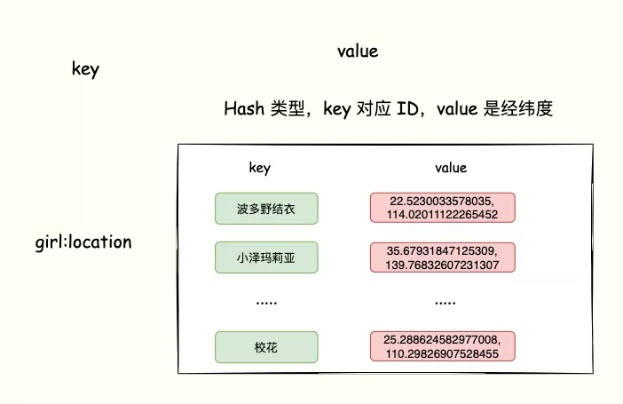
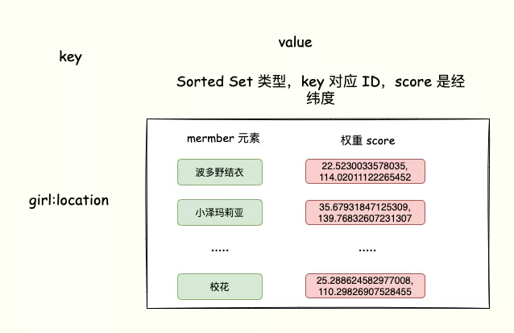
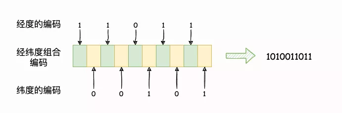

# Redis实战-Geo数据类型实现附近的人

[TOC]

## 零、什么是面向 LBS 应用

经纬度是经度与纬度的合称组成一个**坐标系统**。又称为地理坐标系统，它是一种利用三度空间的球面来定义地球上的空间的球面坐标系统，能够标示地球上的**任何一个位置**（小数点后7位，精度可以到1厘米）。

经度的范围在 (-180, 180]，纬度的范围 在(-90, 90]，纬度正负以赤道为界，北正南负，经度正负以本初子午线 (英国格林尼治天文台) 为界，东正西负。

`附近的人` 也就是常说的 `LBS` (Location Based Services，基于位置服务)，它围绕用户当前地理位置数据而展开的服务，为用户提供精准的邂逅服务。

`附近的人`核心思想如下：

1. 以 “我” 为中心，搜索附近的 Ta；
2. 以 “我” 当前的地理位置为准，计算出别人和 “我” 之间的距离；
3. 按 “我” 与别人距离的远近排序，筛选出离我最近的用户。

## 一、MySQL 实现

> 计算「附近的人」，通过一个坐标计算这个坐标附近的其他数据，按照距离排序，如何下手呢？

以用户为中心，给定一个 1000 米作为半径画圆，那么圆形区域内的用户就是我们想要邂逅的「附近的人」。

将经纬度存储到 `MySQL`：

```sql
CREATE TABLE `nearby_user` (
  `id` int(11) NOT NULL AUTO_INCREMENT,
  `name` varchar(255) DEFAULT NULL COMMENT '名称',
  `longitude` double DEFAULT NULL COMMENT '经度',
  `latitude` double DEFAULT NULL COMMENT '纬度',
  `create_time` datetime DEFAULT NULL ON UPDATE CURRENT_TIMESTAMP COMMENT '创建时间',
  PRIMARY KEY (`id`)
) ENGINE=InnoDB DEFAULT CHARSET=utf8mb4;
```

> 可是总不能遍历所有的「女神」经纬度与自己的经纬度数据计算在根据距离排序，这个计算量也太大了。

我们可以通过区域来过滤出有限「女神」坐标数据，再对矩形区域内的数据进行全量距离计算再排序，这样计算量明显降低。

> 如何划分矩形区域呢？

在圆形外套上一个正方形，根据用户经、纬度的最大最小值（经、纬度 + 距离），作为筛选条件过滤数据，就很容易将正方形内的「女神」信息搜索出来。



> 多出来的一些区域咋办？

多出来的这部分区域内的用户，到圆点的距离一定比圆的半径要大，那么我们就计算用户中心点与正方形内所有用户的距离，**筛选出所有距离小于等于半径的用户**，圆形区域内的所用户即符合要求的`附近的人`。

为了满足高性能的矩形区域算法，数据表需要在经纬度坐标加上复合索引 `(longitude, latitude)`，这样可以最大优化查询性能。

**但是数据库查询性能毕竟有限，如果「附近的人」查询请求非常多，在高并发场合，这可能并不是一个很好的方案。**

## 二、Redis实现

### 1. 尝试 Redis Hash 未果

我们一起分析下 LBS 数据的特点：

1. 每个「女神」都有一个 ID 编号，每个ID 对应着经纬度信息。
2. 「宅男」登陆 `app`获取「心动女生」的时候，`app`根据「宅男」的经纬度查找附近的「女神」。
3. 获取到位置符合的「女神」ID 列表后，再从数据库获取 ID 对应的「女神」信息返回用户。

> 数据特点就是一个女神（用户）对应着一组经纬度，让我想到了 Redis 的 Hash 结构。也就是一个 key（女神 ID） 对应着 一个 value（经纬度）。



`Hash`看起来好像可以实现，但是 LBS 应用除了记录经纬度以外，还需要对 Hash 集合中的数据进行范围查询，根据经纬度换算成距离排序。

**而 Hash 集合的数据是无序的，显然不可取**。

### 2. Sorted Set 初见端倪

> Sorted Set 类型是是否合适呢？因为它可以排序。

`Sorted Set` 类型也是一个 `key`对应一个 `value`，`key元素内容，而`value `就是该元素的权重分数。

`Sorted Set`可以根据元素的权重分数对元素排序，这样看起来就满足我们的需求了。

比如，Sorted Set 的元素是「女神ID」，元素对应的权重 score 是经纬度信息。



> 问题来了，Sorted Set 元素的权重值是一个浮点数，经纬度是经度、纬度两个值，咋办呢？能不能将经纬度转换成一个浮点数呢？

思路对了，为了实现对经纬度比较，Redis 采用业界广泛使用的 GeoHash 编码，分别对经度和纬度编码，最后再把经纬度各自的编码组合成一个最终编码。

这样就实现了将经纬度转换成一个值，而 **Redis 的 GEO 类型的底层数据结构用的就是 `Sorted Set`来实现**。

我们来看下 `GeoHash` 如何将经纬度编码的。

## 三、Redis GEO 实现

### 1. GEOHash 编码

**GEOHash 编码简介**

`GeoHash`算法将二维的经纬度数据映射到一维的整数，这样所有的元素都将在挂载到一条线上，距离靠近的二维坐标映射到一维后的点之间距离也会很接近。

当我们想要计算「附近的人时」，首先将目标位置映射到这条线上，然后在这个一维的线上获取附近的点就行了。

**GEOHash 编码计算**

GeoHash 编码会把一个经度值编码成一个 N 位的二进制值，我们来对经度范围[-180,180]做 N 次的二分区操作，其中 N 可以自定义。

在进行第一次二分区时，经度范围[-180,180]会被分成两个子区间：[-180,0) 和[0,180]（我称之为左、右分区）。

此时，我们可以查看一下要编码的经度值落在了左分区还是右分区。如**果是落在左分区，我们就用 0 表示；如果落在右分区，就用 1 表示**。

这样一来，**每做完一次二分区，我们就可以得到 1 位编码值（不是0 就是 1）。**

再对经度值所属的分区再做一次二分区，同时再次查看经度值落在了二分区后的左分区还是右分区，按照刚才的规则再做 1 位编码。当做完 N 次的二分区后，经度值就可以用一个 N bit 的数来表示了。

**所有的地图元素坐标都将放置于唯一的方格中。方格越小，坐标越精确。然后对这些方格进行整数编码，越是靠近的方格编码越是接近。**

编码之后，每个地图元素的坐标都将变成一个整数，通过这个整数可以还原出元素的坐标，整数越长，还原出来的坐标值的损失程度就越小。对于「附近的人」这个功能而言，损失的一点精确度可以忽略不计。

比如对经度值等于 `169.99` 进行 4 位编码（N = 4，做 4 次分区）,把经度区间[-180,180]分成了左分区[-180,0) 和右分区[0,180]。

1. 169.99 属于右分区，使用 `1` 表示第一次分区编码；
2. 再将 169.99 经过第一次划分所属的 [0, 180] 区间继续分成 [0, 90) 和 [90, 180]，169.99 依然在右区间，编码 ‘1’。
3. 将[90, 180] 分为[90, 135) 和 [135, 180]，这次落在左分区，编码 ‘0’。

如此，最后我们就得到一个 4 位的编码。

而纬度的编码思路跟经度也是一样的，不再赘述。

**合并经纬度编码**

假如计算的经纬度编码分别是 `11011 `和`00101`，目标编码第 0 位则从经度第 0 位的值 1 作为目标值，目标编码的第 1 位则从纬度第 0 位值 0 作为目标值，以此类推：



就这样，经纬度（35.679，114.020）就可以使用 `1010011011` 表示，而这个值就可以作为 `SortedSet` 的权重值实现排序。

### 2. 实现

> GEO 类型是将经纬度的经过 GeoHash 编码的合并值作为 Sorted Set 元素的 score 权重，Redis 的 GEO 有哪些指令呢？

我们需要把登陆 app 的女生 ID 和对应的经纬度存到 Sorted Set 里面。

更多 GEO 类型指令可参考：https://redis.io/commands#geo

**GEOADD**

Redis 提供了 `GEOADD key longitude latitude member` 命令，将一组经纬度信息和对应的「女神 ID」记录到 GEO 类型的集合中，如下：一次记录多个用户（苍井空、波多野结衣）的经纬度信息。

```
GEOADD girl:localtion 13.361389 38.115556 "苍井空" 15.087269 37.502669 "波多野结衣"
```

**GEORADIUS**

> 我登陆了 app，获取自己的经纬度信息，如何查找以这个经纬度为中心的一定范围内的其他用用户呢？

`Redis GEO`类型提供了 `GEORADIUS`指令：会根据输入的经纬度位置，查找以这个经纬度为中心的一定范围内的其他元素。

假设自己的经纬度是（15.087269 37.502669），需要获取附近 10 km 的「女神」并返回给 LBS 应用：

```
GEORADIUS girl:locations 15.087269 37.502669 km ASC COUNT 10
```

`ASC`可以实现让「女神」信息按照这个距离自己的经纬度由近到远排序。

`COUNT`选项表示指定返回的「女神」数量，防止附近太多「女神」，节省带宽资源。

如果觉得自己需要更多女神，那么可以无限制，但是需要注意身体，多吃鸡蛋补一补。

> 用户下线后，如删除下线的「女神」经纬度呢？

这个问题问得好，`GEO` 类型是基于 `Sorted Set` 实现的，所以可以借用 `ZREM` 命令实现对地理位置信息的删除。

比如删除「苍井空」的位置信息：

```
ZREM girl:localtion "苍井空"
```

## 四、小结

**GEO 本身并没有设计新的底层数据结构，而是直接使用了 Sorted Set 集合类型。**

**GEO 类型使用 GeoHash 编码方法实现了经纬度到 Sorted Set 中元素权重分数的转换，这其中的两个关键机制就是对二维地图做区间划分，以及对区间进行编码。**

一组经纬度落在某个区间后，就用区间的编码值来表示，并把编码值作为 Sorted Set 元素的权重分数。

在一个地图应用中，车的数据、餐馆的数据、人的数据可能会有百万千万条，如果使用 Redis 的 Geo 数据结构，它们将全部放在一个 zset 集合中。

在 Redis 的集群环境中，集合可能会从一个节点迁移到另一个节点，如果单个 key 的数据过大，会对集群的迁移工作造成较大的影响，在集群环境中单个 key 对应的数据量不宜超过 1M，否则会导致集群迁移出现卡顿现象，影响线上服务的正常运行。

所以，这里建议 Geo 的数据使用单独的 Redis 集群实例部署。

**如果数据量过亿甚至更大，就需要对 Geo 数据进行拆分，按国家拆分、按省拆分，按市拆分，在人口特大城市甚至可以按区拆分。**

这样就可以显著降低单个 zset 集合的大小。

