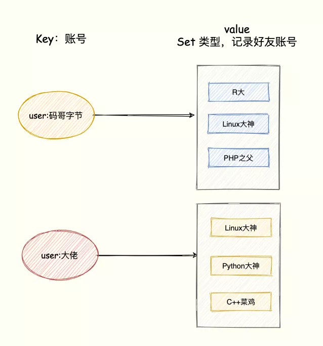
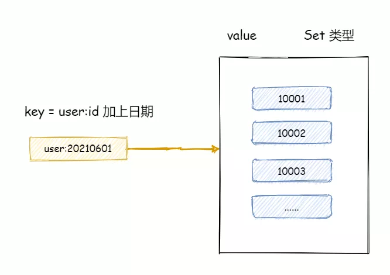

# Redis实战-巧用数据类型实现亿级数据统计

[TOC]

## 零、开篇

在移动应用的业务场景中，我们需要保存这样的信息：一个 key 关联了一个数据集合，同时还要对集合中的数据进行统计排序。

常见的场景如下：

- 统计网站的对访客（Unique Visitor，UV）量
- 最新评论列表
- 根据播放量音乐榜单

通常情况下，我们面临的用户数量以及访问量都是巨大的，比如百万、千万级别的用户数量，或者千万级别、甚至亿级别的访问信息。

所以，我们必须要选择能够非常高效地统计大量数据（例如亿级）的集合类型。

**如何选择合适的数据集合，我们首先要了解常用的统计模式，并运用合理的数据来解决实际问题。**

四种统计类型：

1. 二值状态统计；
2. 聚合统计；
3. 排序统计；
4. 基数统计。

本文将用到 String、Set、Zset、List、hash 以外的拓展数据类型 `Bitmap`、`HyperLogLog`来实现。

文章涉及到的指令可以通过在线 Redis 客户端运行调试，地址：https://try.redis.io/，超方便的说。

## 一、基数统计

> 基数统计：统计一个集合中不重复元素的个数，常见于计算独立用户数（UV）。

实现基数统计最直接的方法，就是采用集合（[Set](http://mp.weixin.qq.com/s?__biz=MzU3NDkwMjAyOQ==&mid=2247485665&idx=1&sn=3cf8e45aaa071fa26975bca34b8878e4&chksm=fd2a1283ca5d9b95889dbc3ec5949f784f6b8e6b469e49675731a8a544321fc4633058e27c41&scene=21#wechat_redirect)）这种数据结构，当一个元素从未出现过时，便在集合中增加一个元素；如果出现过，那么集合仍保持不变。

当页面访问量巨大，就需要一个超大的 Set 集合来统计，将会浪费大量空间。

另外，这样的数据也不需要很精确，到底有没有更好的方案呢？

这个问题问得好，Redis 提供了 `HyperLogLog` 数据结构就是用来解决种种场景的统计问题。

`HyperLogLog` 是一种不精确的去重基数方案，它的统计规则是基于概率实现的，标准误差 0.81%，这样的精度足以满足 UV 统计需求了。

关于 HyperLogLog 的原理过于复杂，如果想要了解的请移步：

- https://www.zhihu.com/question/53416615
- https://en.wikipedia.org/wiki/HyperLogLog

下面介绍几个网站UV的实现。

### 1. 通过 Set 实现

一个用户一天内多次访问一个网站只能算作一次，所以很容易就想到通过 Redis 的 Set 集合来实现。

用户编号 89757 访问 「Redis 为什么这么快 」时，我们将这个信息放到 Set 中。

```
SADD Redis为什么这么快:uv 89757
```

当用户编号 89757 多次访问「Redis 为什么这么快」页面，Set 的去重功能能保证不会重复记录同一个用户 ID。

通过 `SCARD` 命令，统计「Redis 为什么这么快」页面 UV。指令返回一个集合的元素个数（也就是用户 ID）。

```
SCARD Redis为什么这么快:uv
```

### 2. 通过 Hash 实现

> 还可以利用 Hash 类型实现，将用户 ID 作为 Hash 集合的 key，访问页面则执行 HSET 命令将 value 设置成 1。

即使用户重复访问，重复执行命令，也只会把这个 userId 的值设置成 “1"。

最后，利用 `HLEN` 命令统计 Hash 集合中的元素个数就是 UV。

如下：

```
HSET redis集群:uv userId:89757 1
// 统计 UV
HLEN redis集群
```

### 3. HyperLogLog 王者方案

> Set 虽好，如果文章非常火爆达到千万级别，一个 Set 就保存了千万个用户的 ID，页面多了消耗的内存也太大了。同理，Hash数据类型也是如此。咋办呢？

利用  Redis 提供的 `HyperLogLog` 高级数据结构（不要只知道 Redis 的五种基础数据类型了）。这是一种用于基数统计的数据集合类型，即使数据量很大，计算基数需要的空间也是固定的。

每个 `HyperLogLog` 最多只需要花费 12KB 内存就可以计算 2 的 64 次方个元素的基数。

Redis 对 `HyperLogLog` 的存储进行了优化，在计数比较小的时候，存储空间采用系数矩阵，占用空间很小。

只有在计数很大，稀疏矩阵占用的空间超过了阈值才会转变成稠密矩阵，占用 12KB 空间。

**PFADD**

将访问页面的每个用户 ID 添加到 `HyperLogLog` 中。

```
PFADD Redis主从同步原理:uv userID1 userID 2 useID3
```

**PFCOUNT**

利用 `PFCOUNT` 获取 「[Redis主从同步原理](http://mp.weixin.qq.com/s?__biz=MzU3NDkwMjAyOQ==&mid=2247486453&idx=1&sn=8c073df56600ac992c8a5a742b255703&chksm=fd2a1197ca5d98812d23e4b9a7494ddc4c2daf7d78c270b77d083b3935ef48e0874f729270d8&scene=21#wechat_redirect)」页面的 UV值。

```
PFCOUNT Redis主从同步原理:uv
```

**PFMERGE 使用场景**

`HyperLogLog` 除了上面的 `PFADD` 和 `PFCOIUNT` 外，还提供了 `PFMERGE` ，将多个 `HyperLogLog` 合并在一起形成一个新的 `HyperLogLog` 值。

**语法**

```
PFMERGE destkey sourcekey [sourcekey ...]
```

**使用场景**

比如在网站中我们有两个内容差不多的页面，运营说需要这两个页面的数据进行合并。

其中页面的 UV 访问量也需要合并，那这个时候 `PFMERGE` 就可以派上用场了，也就是**同样的用户访问这两个页面则只算做一次**。

如下所示：Redis、MySQL 两个 Bitmap 集合分别保存了两个页面用户访问数据。

```
PFADD Redis数据 user1 user2 user3
PFADD MySQL数据 user1 user2 user4
PFMERGE 数据库 Redis数据 MySQL数据
PFCOUNT 数据库 // 返回值 = 4
```

将多个 HyperLogLog 合并（merge）为一个 HyperLogLog ， 合并后的 HyperLogLog 的基数接近于所有输入 HyperLogLog 的可见集合（observed set）的**并集**。

user1、user2 都访问了 Redis 和 MySQL，只算访问了一次。

## 二、排序统计

Redis 的 4 个集合类型中（List、Set、Hash、Sorted Set），List 和 Sorted Set 就是有序的。

- List：按照元素插入 List 的顺序排序，使用场景通常可以作为 消息队列、最新列表、排行榜；
- Sorted Set：根据元素的 score 权重排序，我们可以自己决定每个元素的权重值。使用场景（排行榜，比如按照播放量、点赞数）。

### 1. 最新评论列表

> 我可以利用 List 插入的顺序排序实现评论列表

比如微信公众号的后台回复列表（不要杠，举例子），每一公众号对应一个 List，这个 List 保存该公众号的所有的用户评论。

每当一个用户评论，则利用 `LPUSH key value [value ...]` 插入到 List 队头。

```
LPUSH 码哥字节 1 2 3 4 5 6
```

接着再用 `LRANGE key star stop` 获取列表指定区间内的元素。

```
> LRANGE 码哥字节 0 4
1) "6"
2) "5"
3) "4"
4) "3"
5) "2"
```

**注意，并不是所有最新列表都能用 List 实现，对于因为对于频繁更新的列表，list类型的分页可能导致列表元素重复或漏掉。**

比如当前评论列表 `List =｛A, B, C, D｝`，左边表示最新的评论，D 是最早的评论。

```
LPUSH 码哥字节 D C B A
```

展示第一页最新 2 个评论，获取到 A、B：

```
LRANGE 码哥字节 0 1
1) "A"
2) "B"
```

按照我们想要的逻辑来说，第二页可通过 `LRANGE 码哥字节 2 3` 获取 C，D。

如果在展示第二页之前，产生新评论 E，评论 E 通过 `LPUSH 码哥字节 E` 插入到 List 队头，List = ｛E, A, B, C, D ｝。

现在执行 `LRANGE 码哥字节 2 3` 获取第二页评论发现， B 又出现了。

```
LRANGE 码哥字节 2 3
1) "B"
2) "C"
```

出现这种情况的原因在于 List 是利用元素所在的位置排序，一旦有新元素插入，`List = ｛E，A，B，C，D｝`。

原先的数据在 List 的位置都往后移动一位，导致读取都旧元素。


### 2. 排行榜

> 对于最新列表的场景，List 和 Sorted Set 都能实现，为啥还用 List 呢？直接使用 Sorted Set 不是更好，它还能设置 score 权重排序更加灵活。

原因是 Sorted Set 类型占用的内存容量是 List 类型的数倍之多，对于列表数量不多的情况，可以用 Sorted Set 类型来实现。

比如要一周音乐榜单，我们需要实时更新播放量，并且需要分页展示。

除此以外，排序是根据播放量来决定的，这个时候 List 就无法满足了。

我们可以将音乐 ID 保存到 Sorted Set 集合中，`score` 设置成每首歌的播放量，该音乐每播放一次则设置 score = score +1。

**ZADD**

比如我们将《青花瓷》和《花田错》播放量添加到 musicTop 集合中：

```
ZADD musicTop 100000000 青花瓷 8999999 花田错
```

**ZINCRBY**

《青花瓷》每播放一次就通过 `ZINCRBY`指令将 score + 1。

```
> ZINCRBY musicTop 1 青花瓷
100000001
```

**ZRANGEBYSCORE**

最后我们需要获取 musicTop **前十**播放量音乐榜单，目前最大播放量是 N ，可通过如下指令获取：

```
ZRANGEBYSCORE musicTop N-9 N WITHSCORES
```

> 可是这个 N 我们怎么获取呀？

**ZREVRANGE**

可通过 `ZREVRANGE key start stop [WITHSCORES]`指令。

其中元素的排序按 `score` 值递减(从大到小)来排列。

具有相同 `score` 值的成员按字典序的逆序(reverse lexicographical order)排列。

```
> ZREVRANGE musicTop 0 0 WITHSCORES
1) "青花瓷"
2) 100000000
```

### 3. 小结

只有不需要分页（比如每次都只取列表的前 5 个元素）或者更新频率低（比如每天凌晨统计更新一次）的列表才适合用 List 类型实现。

对于需要分页并且会频繁更新的列表，需用使用有序集合 Sorted Set 类型实现。

另外，需要通过时间范围查找的最新列表，List 类型也实现不了，需要通过有序集合 Sorted Set 类型实现，如以成交时间范围作为条件来查询的订单列表。


即使集合中的元素频繁更新，Sorted Set 也能通过 `ZRANGEBYSCORE`命令准确地获取到按序排列的数据。

**在面对需要展示最新列表、排行榜等场景时，如果数据更新频繁或者需要分页显示，建议优先考虑使用 Sorted Set。**

## 三、聚合统计

指的就是统计多个集合元素的聚合结果，比如说：

- 统计多个元素的共有数据（交集）；
- 统计两个集合其中的一个独有元素（差集统计）；
- 统计多个集合的所有元素（并集统计）。

> 什么样的场景会用到交集、差集、并集呢？

Redis 的 Set 类型支持集合内的增删改查，底层使用了 Hash 数据结构，无论是 add、remove 都是 O(1) 时间复杂度。

并且支持多个集合间的交集、并集、差集操作，利用这些集合操作，解决上边提到的统计问题。

### 1. 交集-共同好友

比如 QQ 中的共同好友正是聚合统计中的交集。我们将账号作为 Key，该账号的好友作为 Set 集合的 value。

模拟两个用户的好友集合：

```
SADD user:码哥字节 R大 Linux大神 PHP之父
SADD user:大佬 Linux大神 Python大神 C++菜鸡
```



统计两个用户的共同好友只需要两个 Set 集合的交集，如下命令：

```
SINTERSTORE user:共同好友 user:码哥字节 user:大佬
```

命令的执行后，「user:码哥字节」、「user:大佬」两个集合的交集数据存储到 「user:共同好友这」个集合中。

### 2. 差集-每日新增好友数

比如，统计某个 App 每日新增注册用户量，只需要对近两天的总注册用户量集合取差集即可。

比如，2021-06-01 的总注册用户量存放在 `key = user:20210601` set 集合中，2021-06-02 的总用户量存放在 `key = user:20210602` 的集合中。



如下指令，执行差集计算并将结果存放到 `user:new` 集合中。

```
SDIFFSTORE  user:new  user:20210602 user:20210601
```

执行完毕，此时的 user:new 集合将是 2021/06/02 日新增用户量。

除此之外，QQ 上有个可能认识的人功能，也可以使用差集实现，就是把你朋友的好友集合减去你们共同的好友即是可能认识的人。

### 3. 并集-总共新增好友

还是差集的例子，统计 2021/06/01 和 2021/06/02 两天总共新增的用户量，只需要对两个集合执行并集。

```
SUNIONSTORE  userid:new user:20210602 user:20210601
```

此时新的集合 userid:new 则是两日新增的好友。

### 4. 小结

Set 的差集、并集和交集的计算复杂度较高，在数据量较大的情况下，如果直接执行这些计算，会导致 Redis 实例阻塞。

所以，可以专门部署一个集群用于统计，让它专门负责聚合计算，或者是把数据读取到客户端，在客户端来完成聚合统计，这样就可以规避由于阻塞导致其他服务无法响应。

