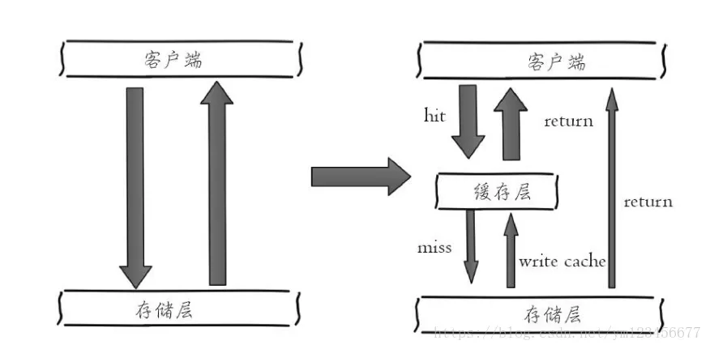
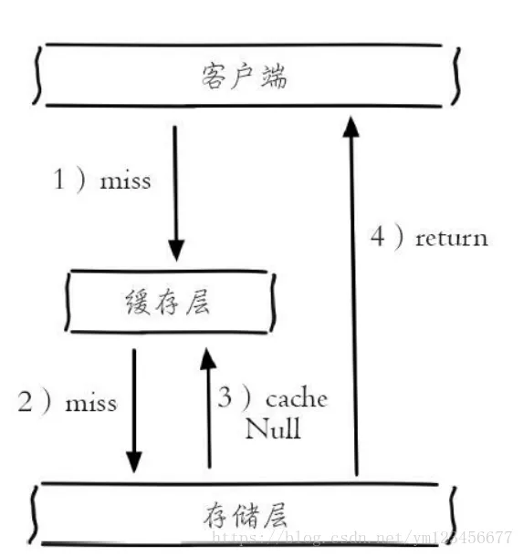
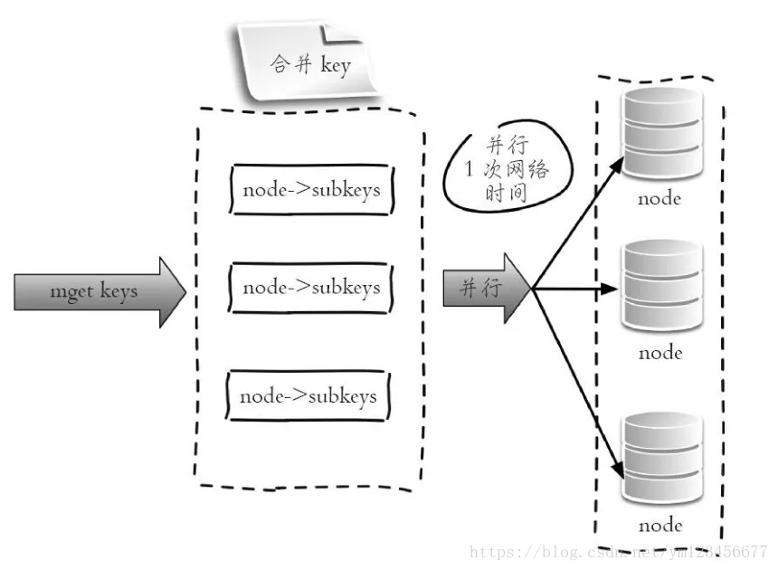
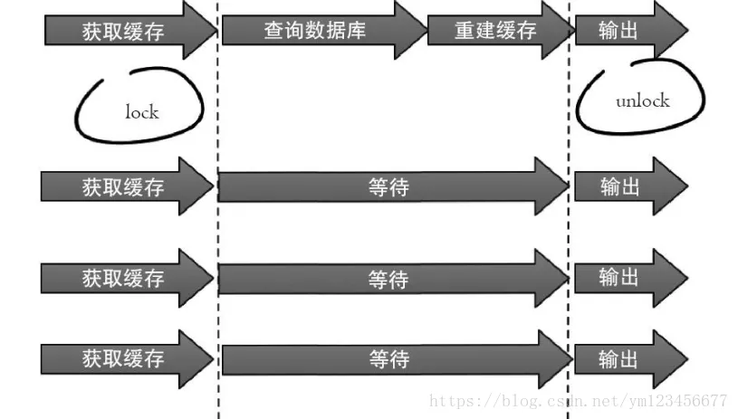
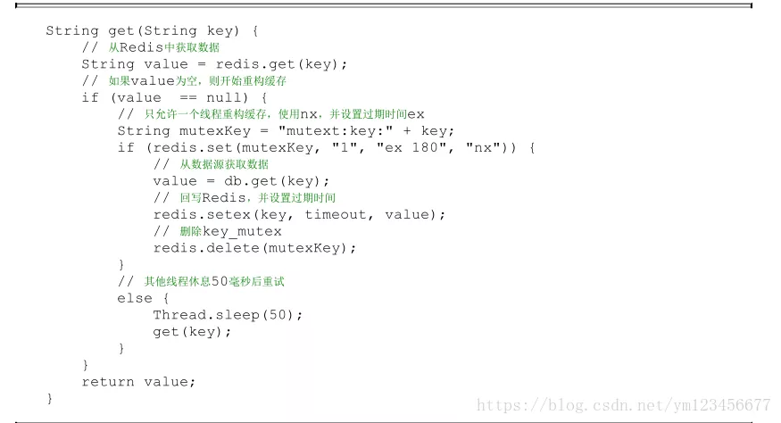
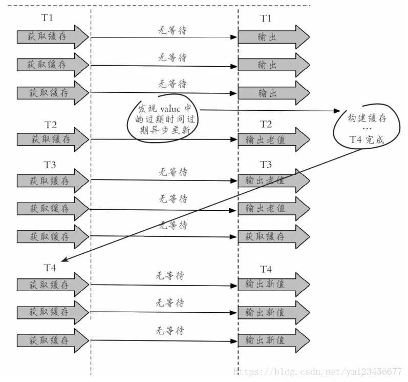

# Redis缓存使用技巧和设计方案

<!-- START doctoc generated TOC please keep comment here to allow auto update -->
<!-- DON'T EDIT THIS SECTION, INSTEAD RE-RUN doctoc TO UPDATE -->

- [零、开篇](#%E9%9B%B6%E5%BC%80%E7%AF%87)
- [一、缓存的收益和成本分析](#%E4%B8%80%E7%BC%93%E5%AD%98%E7%9A%84%E6%94%B6%E7%9B%8A%E5%92%8C%E6%88%90%E6%9C%AC%E5%88%86%E6%9E%90)
- [二、缓存更新策略](#%E4%BA%8C%E7%BC%93%E5%AD%98%E6%9B%B4%E6%96%B0%E7%AD%96%E7%95%A5)
- [三、缓存粒度控制](#%E4%B8%89%E7%BC%93%E5%AD%98%E7%B2%92%E5%BA%A6%E6%8E%A7%E5%88%B6)
- [四、穿透优化](#%E5%9B%9B%E7%A9%BF%E9%80%8F%E4%BC%98%E5%8C%96)
- [五、无底洞优化](#%E4%BA%94%E6%97%A0%E5%BA%95%E6%B4%9E%E4%BC%98%E5%8C%96)
- [六、雪崩优化](#%E5%85%AD%E9%9B%AA%E5%B4%A9%E4%BC%98%E5%8C%96)
- [七、热点key重建优化](#%E4%B8%83%E7%83%AD%E7%82%B9key%E9%87%8D%E5%BB%BA%E4%BC%98%E5%8C%96)

<!-- END doctoc generated TOC please keep comment here to allow auto update -->

[TOC]

## 零、开篇

缓存能够有效地加速应用的读写速度，同时也可以降低后端负载，对日常应用的开发至关重要。下面会介绍缓存使用技巧和设计方案，包含如下内容：缓存的收益和成本分析、缓存更新策略的选择和使用场景、缓存粒度控制方法、穿透问题优化、无底洞问题优化、雪崩问题优化、热点key重建优化。

## 一、缓存的收益和成本分析

下图左侧为客户端直接调用存储层的架构，右侧为比较典型的缓存层+存储层架构。

下面分析一下缓存加入后带来的收益和成本。

**收益：**

①加速读写：因为缓存通常都是全内存的，而存储层通常读写性能不够强悍（例如MySQL），通过缓存的使用可以有效地加速读写，优化用户体验。

②降低后端负载：帮助后端减少访问量和复杂计算（例如很复杂的SQL语句），在很大程度降低了后端的负载。

**成本：**

①数据不一致性：缓存层和存储层的数据存在着一定时间窗口的不一致性，时间窗口跟更新策略有关。

②代码维护成本：加入缓存后，需要同时处理缓存层和存储层的逻辑，增大了开发者维护代码的成本。

③运维成本：以Redis Cluster为例，加入后无形中增加了运维成本。

**缓存的使用场景基本包含如下两种：**

①开销大的复杂计算：以MySQL为例子，一些复杂的操作或者计算（例如大量联表操作、一些分组计算），如果不加缓存，不但无法满足高并发量，同时也会给MySQL带来巨大的负担。

②加速请求响应：即使查询单条后端数据足够快（例如`select*from table where id=`），那么依然可以使用缓存，以Redis为例子，每秒可以完成数万次读写，并且提供的批量操作可以优化整个IO链的响应时间。

## 二、缓存更新策略

缓存中的数据会和数据源中的真实数据有一段时间窗口的不一致，需要利用某些策略进行更新，下面会介绍几种主要的缓存更新策略。

**①LRU/LFU/FIFO算法剔除**：剔除算法通常用于缓存使用量超过了预设的最大值时候，如何对现有的数据进行剔除。例如Redis使用maxmemory-policy这个配置作为内存最大值后对于数据的剔除策略。

**②超时剔除**
：通过给缓存数据设置过期时间，让其在过期时间后自动删除，例如Redis提供的expire命令。如果业务可以容忍一段时间内，缓存层数据和存储层数据不一致，那么可以为其设置过期时间。在数据过期后，再从真实数据源获取数据，重新放到缓存并设置过期时间。例如一个视频的描述信息，可以容忍几分钟内数据不一致，但是涉及交易方面的业务，后果可想而知。

**③主动更新**：应用方对于数据的一致性要求高，需要在真实数据更新后，立即更新缓存数据。例如可以利用消息系统或者其他方式通知缓存更新。

三种常见更新策略的对比：

有两个建议：

①低一致性业务建议配置最大内存和淘汰策略的方式使用。

②高一致性业务可以结合使用超时剔除和主动更新，这样即使主动更新出了问题，也能保证数据过期时间后删除脏数据。

## 三、缓存粒度控制

缓存粒度问题是一个容易被忽视的问题，如果使用不当，可能会造成很多无用空间的浪费，网络带宽的浪费，代码通用性较差等情况，需要综合数据通用性、空间占用比、代码维护性三点进行取舍。

缓存比较常用的选型，缓存层选用Redis，存储层选用MySQL。

## 四、穿透优化

缓存穿透是指查询一个根本不存在的数据，缓存层和存储层都不会命中，通常出于容错的考虑，如果从存储层查不到数据则不写入缓存层。

通常可以在程序中分别统计总调用数、缓存层命中数、存储层命中数，如果发现大量存储层空命中，可能就是出现了缓存穿透问题。造成缓存穿透的基本原因有两个。第一，自身业务代码或者数据出现问题，第二，一些恶意攻击、爬虫等造成大量空命中。下面我们来看一下如何解决缓存穿透问题。

**①缓存空对象**：如图下所示，当第2步存储层不命中后，仍然将空对象保留到缓存层中，之后再访问这个数据将会从缓存中获取，这样就保护了后端数据源。

缓存空对象会有两个问题：第一，空值做了缓存，意味着缓存层中存了更多的键，需要更多的内存空间（如果是攻击，问题更严重），比较有效的方法是针对这类数据设置一个较短的过期时间，让其自动剔除。第二，缓存层和存储层的数据会有一段时间窗口的不一致，可能会对业务有一定影响。例如过期时间设置为5分钟，如果此时存储层添加了这个数据，那此段时间就会出现缓存层和存储层数据的不一致，此时可以利用消息系统或者其他方式清除掉缓存层中的空对象。

**②布隆过滤器拦截**

如下图所示，在访问缓存层和存储层之前，将存在的key用布隆过滤器提前保存起来，做第一层拦截。例如：一个推荐系统有4亿个用户id，每个小时算法工程师会根据每个用户之前历史行为计算出推荐数据放到存储层中，但是最新的用户由于没有历史行为，就会发生缓存穿透的行为，为此可以将所有推荐数据的用户做成布隆过滤器。如果布隆过滤器认为该用户id不存在，那么就不会访问存储层，在一定程度保护了存储层。

缓存空对象和布隆过滤器方案对比

另：布隆过滤器简单说明：

如果想判断一个元素是不是在一个集合里，一般想到的是将集合中所有元素保存起来，然后通过比较确定。链表、树、散列表（又叫哈希表，Hash
table）等等数据结构都是这种思路。但是随着集合中元素的增加，我们需要的存储空间越来越大。同时检索速度也越来越慢。

Bloom Filter 是一种空间效率很高的随机数据结构，Bloom filter 可以看做是对 bit-map 的扩展, 它的原理是：

当一个元素被加入集合时，通过 K 个 Hash 函数将这个元素映射成一个位阵列（Bit array）中的 K 个点，把它们置为 1。检索时，我们只要看看这些点是不是都是 1 就（大约）知道集合中有没有它了：

如果这些点有任何一个 0，则被检索元素一定不在；如果都是 1，则被检索元素很可能在。

## 五、无底洞优化

为了满足业务需要可能会添加大量新的缓存节点，但是发现性能不但没有好转反而下降了。用一句通俗的话解释就是，更多的节点不代表更高的性能，所谓“无底洞”就是说投入越多不一定产出越多。但是分布式又是不可以避免的，因为访问量和数据量越来越大，一个节点根本抗不住，所以如何高效地在分布式缓存中批量操作是一个难点。

**无底洞问题分析：**

①客户端一次批量操作会涉及多次网络操作，也就意味着批量操作会随着节点的增多，耗时会不断增大。

②网络连接数变多，对节点的性能也有一定影响。

如何在分布式条件下优化批量操作？我们来看一下常见的IO优化思路：

- 命令本身的优化，例如优化SQL语句等。
- 减少网络通信次数。
- 降低接入成本，例如客户端使用长连/连接池、NIO等。

这里我们假设命令、客户端连接已经为最优，重点讨论减少网络操作次数。下面我们将结合Redis Cluster的一些特性对四种分布式的批量操作方式进行说明。

**①串行命令**：由于n个key是比较均匀地分布在Redis
Cluster的各个节点上，因此无法使用mget命令一次性获取，所以通常来讲要获取n个key的值，最简单的方法就是逐次执行n个get命令，这种操作时间复杂度较高，它的操作时间=n次网络时间+n次命令时间，网络次数是n。很显然这种方案不是最优的，但是实现起来比较简单。

**②串行IO**：Redis
Cluster使用CRC16算法计算出散列值，再取对16383的余数就可以算出slot值，同时Smart客户端会保存slot和节点的对应关系，有了这两个数据就可以将属于同一个节点的key进行归档，得到每个节点的key子列表，之后对每个节点执行mget或者Pipeline操作，它的操作时间=node次网络时间+n次命令时间，网络次数是node的个数，整个过程如下图所示，很明显这种方案比第一种要好很多，但是如果节点数太多，还是有一定的性能问题。

**③并行IO**：此方案是将方案2中的最后一步改为多线程执行，网络次数虽然还是节点个数，但由于使用多线程网络时间变为`O（1）`，这种方案会增加编程的复杂度。

**④hash_tag实现**：Redis Cluster的hash_tag功能，它可以将多个key强制分配到一个节点上，它的操作时间=1次网络时间+n次命令时间。

四种批量操作解决方案对比

## 六、雪崩优化

缓存雪崩：由于缓存层承载着大量请求，有效地保护了存储层，但是如果缓存层由于某些原因不能提供服务，于是所有的请求都会达到存储层，存储层的调用量会暴增，造成存储层也会级联宕机的情况。

预防和解决缓存雪崩问题，可以从以下三个方面进行着手：

**①保证缓存层服务高可用性**。如果缓存层设计成高可用的，即使个别节点、个别机器、甚至是机房宕掉，依然可以提供服务，例如前面介绍过的Redis Sentinel和Redis Cluster都实现了高可用。

**②依赖隔离组件为后端限流并降级**
。在实际项目中，我们需要对重要的资源（例如Redis、MySQL、HBase、外部接口）都进行隔离，让每种资源都单独运行在自己的线程池中，即使个别资源出现了问题，对其他服务没有影响。但是线程池如何管理，比如如何关闭资源池、开启资源池、资源池阀值管理，这些做起来还是相当复杂的。

**③提前演练**。在项目上线前，演练缓存层宕掉后，应用以及后端的负载情况以及可能出现的问题，在此基础上做一些预案设定。

## 七、热点key重建优化

开发人员使用“缓存+过期时间”的策略既可以加速数据读写，又保证数据的定期更新，这种模式基本能够满足绝大部分需求。但是有两个问题如果同时出现，可能就会对应用造成致命的危害：

- 当前key是一个热点key（例如一个热门的娱乐新闻），并发量非常大。
- 重建缓存不能在短时间完成，可能是一个复杂计算，例如复杂的SQL、多次IO、多个依赖等。在缓存失效的瞬间，有大量线程来重建缓存，造成后端负载加大，甚至可能会让应用崩溃。

要解决这个问题也不是很复杂，但是不能为了解决这个问题给系统带来更多的麻烦，所以需要制定如下目标：

- 减少重建缓存的次数
- 数据尽可能一致。
- 较少的潜在危险

**①互斥锁**：此方法只允许一个线程重建缓存，其他线程等待重建缓存的线程执行完，重新从缓存获取数据即可，整个过程如图所示。

下面代码使用Redis的setnx命令实现上述功能：

1. 从Redis获取数据，如果值不为空，则直接返回值；否则执行下面的2和3步骤。

2. 如果set（nx和ex）结果为true，说明此时没有其他线程重建缓存，那么当前线程执行缓存构建逻辑。

3. 如果set（nx和ex）结果为false，说明此时已经有其他线程正在执行构建缓存的工作，那么当前线程将休息指定时间（例如这里是50毫秒，取决于构建缓存的速度）后，重新执行函数，直到获取到数据。

**②永远不过期**

“永远不过期”包含两层意思：

- 从缓存层面来看，确实没有设置过期时间，所以不会出现热点key过期后产生的问题，也就是“物理”不过期。
- 从功能层面来看，为每个value设置一个逻辑过期时间，当发现超过逻辑过期时间后，会使用单独的线程去构建缓存。

从实战看，此方法有效杜绝了热点key产生的问题，但唯一不足的就是重构缓存期间，会出现数据不一致的情况，这取决于应用方是否容忍这种不一致。

两种热点key的解决方法对比：

