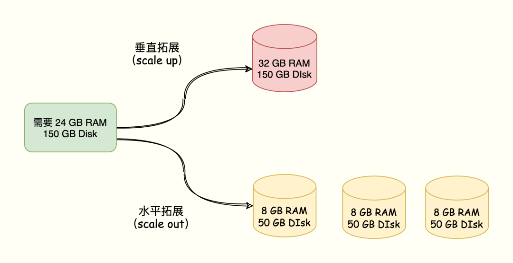
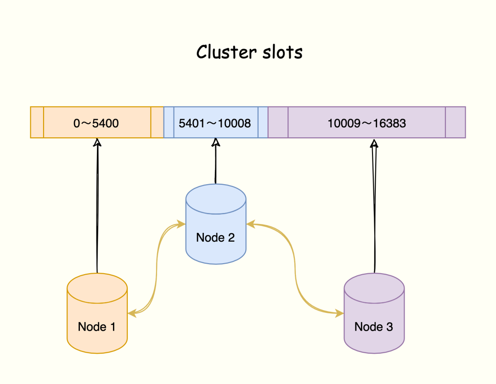
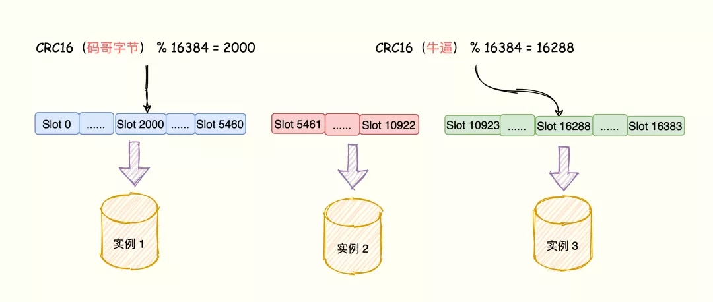
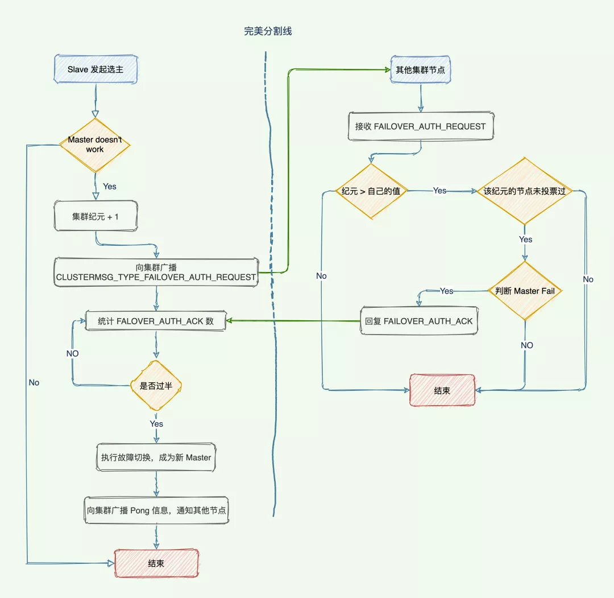
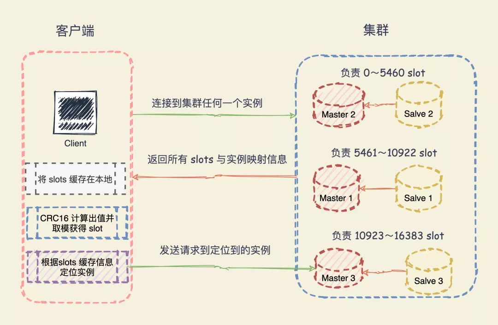

# Redis高可用-Cluster集群

<!-- START doctoc generated TOC please keep comment here to allow auto update -->
<!-- DON'T EDIT THIS SECTION, INSTEAD RE-RUN doctoc TO UPDATE -->

- [零、开篇](#%E9%9B%B6%E5%BC%80%E7%AF%87)
- [一、为什么需要 Cluster](#%E4%B8%80%E4%B8%BA%E4%BB%80%E4%B9%88%E9%9C%80%E8%A6%81-cluster)
- [二、什么是 Cluster 集群](#%E4%BA%8C%E4%BB%80%E4%B9%88%E6%98%AF-cluster-%E9%9B%86%E7%BE%A4)
- [三、Cluster 实现原理](#%E4%B8%89cluster-%E5%AE%9E%E7%8E%B0%E5%8E%9F%E7%90%86)
  - [1. 将数据分成多份存在不同实例上](#1-%E5%B0%86%E6%95%B0%E6%8D%AE%E5%88%86%E6%88%90%E5%A4%9A%E4%BB%BD%E5%AD%98%E5%9C%A8%E4%B8%8D%E5%90%8C%E5%AE%9E%E4%BE%8B%E4%B8%8A)
  - [2. 哈希槽与 Redis 实例映射](#2-%E5%93%88%E5%B8%8C%E6%A7%BD%E4%B8%8E-redis-%E5%AE%9E%E4%BE%8B%E6%98%A0%E5%B0%84)
  - [3. 复制与故障转移](#3-%E5%A4%8D%E5%88%B6%E4%B8%8E%E6%95%85%E9%9A%9C%E8%BD%AC%E7%A7%BB)
    - [故障检测](#%E6%95%85%E9%9A%9C%E6%A3%80%E6%B5%8B)
    - [故障转移](#%E6%95%85%E9%9A%9C%E8%BD%AC%E7%A7%BB)
    - [选主流程](#%E9%80%89%E4%B8%BB%E6%B5%81%E7%A8%8B)
  - [4. 用表保存键值对和实例的关联关系可行么](#4-%E7%94%A8%E8%A1%A8%E4%BF%9D%E5%AD%98%E9%94%AE%E5%80%BC%E5%AF%B9%E5%92%8C%E5%AE%9E%E4%BE%8B%E7%9A%84%E5%85%B3%E8%81%94%E5%85%B3%E7%B3%BB%E5%8F%AF%E8%A1%8C%E4%B9%88)
- [四、客户端如何定位数据所在实例](#%E5%9B%9B%E5%AE%A2%E6%88%B7%E7%AB%AF%E5%A6%82%E4%BD%95%E5%AE%9A%E4%BD%8D%E6%95%B0%E6%8D%AE%E6%89%80%E5%9C%A8%E5%AE%9E%E4%BE%8B)
  - [1. 重新分配哈希槽](#1-%E9%87%8D%E6%96%B0%E5%88%86%E9%85%8D%E5%93%88%E5%B8%8C%E6%A7%BD)
  - [2. MOVED 错误](#2-moved-%E9%94%99%E8%AF%AF)
  - [3. ASK 错误](#3-ask-%E9%94%99%E8%AF%AF)
- [五、集群可以设置多大？](#%E4%BA%94%E9%9B%86%E7%BE%A4%E5%8F%AF%E4%BB%A5%E8%AE%BE%E7%BD%AE%E5%A4%9A%E5%A4%A7)
  - [1. Gossip 消息](#1-gossip-%E6%B6%88%E6%81%AF)
  - [2. 实例的通信频率](#2-%E5%AE%9E%E4%BE%8B%E7%9A%84%E9%80%9A%E4%BF%A1%E9%A2%91%E7%8E%87)
  - [3. 降低实例间的通信开销](#3-%E9%99%8D%E4%BD%8E%E5%AE%9E%E4%BE%8B%E9%97%B4%E7%9A%84%E9%80%9A%E4%BF%A1%E5%BC%80%E9%94%80)

<!-- END doctoc generated TOC please keep comment here to allow auto update -->

[TOC]

## 零、开篇

本文将对集群的节点、槽指派、命令执行、重新分片、转向、故障转移、消息等各个方面进行深入拆解。

目的在于掌握什么是 Cluster ？Cluster 分片原理，客户端定位数据原理、故障切换，选主，什么场景使用 Cluster，如何部署集群 …...

- 将数据分成多份存在不同实例上

- 哈希槽与 Redis 实例映射

- 复制与故障转移

- - 故障检测
  - 故障转移
  - 选主流程

- 用表保存键值对和实例的关联关系可行么

- 重新分配哈希槽

- - MOVED 错误
  - ASK 错误

- Gossip 消息

- 实例的通信频率

- - 降低实例间的通信开销

## 一、为什么需要 Cluster

场景一：

Redis 需要保存 800 万个键值对，占用 20 GB 的内存，使用了一台 32G 的内存主机部署；但是 Redis 响应有时候非常慢，使用 INFO 命令查看 latest_fork_usec 指标（最近一次 fork 耗时），发现特别高。

解答：

主要是 Redis RDB 持久化机制导致的，Redis 会 Fork 子进程完成 RDB 持久化操作，fork 执行的耗时与 Redis 数据量成正相关。

而 Fork 执行的时候会阻塞主线程，由于数据量过大导致阻塞主线程过长，所以出现了 Redis 响应慢的表象。

场景二：

随着业务规模的拓展，数据量越来越大。主从架构升级单个实例硬件难以拓展，且保存大数据量会导致响应慢问题。

解答：

保存大量数据，除了使用大内存主机的方式，我们还可以使用切片集群。俗话说「众人拾材火焰高」，一台机器无法保存所有数据，那就多台分担。

**使用 Redis Cluster 集群，主要解决了大数据量存储导致的各种慢问题，同时也便于横向拓展。**

两种方案对应着 Redis 数据增多的两种拓展方案：**垂直扩展（scale up）、水平扩展（scale out）。**

1. 垂直拓展：升级单个 Redis 的硬件配置，比如增加内存容量、磁盘容量、使用更强大的 CPU。
2. 水平拓展：横向增加 Redis 实例个数，每个节点负责一部分数据。

比如需要一个内存 24 GB 磁盘 150 GB 的服务器资源，有以下两种方案：



**在面向百万、千万级别的用户规模时，横向扩展的 Redis 切片集群会是一个非常好的选择。**

那这两种方案都有什么优缺点呢？

- 垂直拓展部署简单，但是当数据量大并且使用 RDB 实现持久化，会造成阻塞导致响应慢。另外受限于硬件和成本，拓展内存的成本太大，比如拓展到 1T 内存。
- 水平拓展便于拓展，同时不需要担心单个实例的硬件和成本的限制。但是，切片集群会涉及多个实例的分布式管理问题，**需要解决如何将数据合理分布到不同实例，同时还要让客户端能正确访问到实例上的数据**。

## 二、什么是 Cluster 集群

Redis 集群是一种分布式数据库方案，集群通过分片（sharding）来进行数据管理（「分治思想」的一种实践），并提供复制和故障转移功能。

将数据划分为 16384 的 slots，每个节点负责一部分槽位。槽位的信息存储于每个节点中。

它是去中心化的，如图所示，该集群有三个 Redis 节点组成，每个节点负责整个集群的一部分数据，每个节点负责的数据多少可能不一样。



三个节点相互连接组成一个对等的集群，它们之间通过 `Gossip`协议相互交互集群信息，最后每个节点都保存着其他节点的 slots 分配情况。

## 三、Cluster 实现原理

> 数据切片后，需要将数据分布在不同实例上，数据和实例之间如何对应上呢？

Redis 3.0 开始，官方提供了 Redis Cluster 方案实现了切片集群，该方案就实现了数据和实例的规则。Redis Cluster 方案采用哈希槽（Hash Slot，接下来我会直接称之为 Slot），来处理数据和实例之间的映射关系。

### 1. 将数据分成多份存在不同实例上

集群的整个数据库被分为 16384 个槽（slot），数据库中的每个键都属于这 16384 个槽的其中一个，集群中的每个节点可以处理 0 个或最多 16384 个槽。

Key 与哈希槽映射过程可以分为两大步骤：

1. 根据键值对的 key，使用 CRC16 算法，计算出一个 16 bit 的值；
2. 将 16 bit 的值对 16384 执行取模，得到 0 ～ 16383 的数表示 key 对应的哈希槽。

Cluster 还允许用户强制某个 key 挂在特定槽位上，通过在 key 字符串里面嵌入 tag 标记，这就可以强制 key 所挂在的槽位等于 tag 所在的槽位。

### 2. 哈希槽与 Redis 实例映射

> 哈希槽又是如何映射到 Redis 实例上呢？

Redis 会自动将 16384 个 哈希槽平均分布在集群实例上，比如 N 个节点，每个节点上的哈希槽数 = 16384 / N 个。

可以使用 `cluster addslots` 命令，指定每个实例上的哈希槽个数。

> 为啥要手动制定呢？

能者多劳嘛，加入集群中的 Redis 实例配置不一样，如果承担一样的压力，对于垃圾机器来说就太难了，让牛逼的机器多支持一点。

三个实例的集群，通过下面的指令为每个实例分配哈希槽：`实例 1`负责 0 ～ 5460 哈希槽，`实例 2` 负责 5461~10922 哈希槽，`实例 3` 负责 10923 ～ 16383 哈希槽。

```
redis-cli -h 172.16.19.1 –p 6379 cluster addslots 0,5460
redis-cli -h 172.16.19.2 –p 6379 cluster addslots 5461,10922
redis-cli -h 172.16.19.3 –p 6379 cluster addslots 10923,16383
```

键值对数据、哈希槽、Redis 实例之间的映射关系如下：



Redis 键值对的 key 「码哥字节」「牛逼」经过 CRC16 计算后再对哈希槽总个数 16384 取模，模数结果分别映射到实例 1 与实例 3 上。

切记，**当 16384 个槽都分配完全，Redis 集群才能正常工作**。

### 3. 复制与故障转移

> Redis 集群如何实现高可用呢？Master 与 Slave 还是读写分离么？

Master 用于处理槽，Slave 节点则通过 **Redis 主从架构数据同步** 方式同步主节点数据。

当 Master 下线，Slave 代替主节点继续处理请求。主从节点之间并没有读写分离， Slave 只用作 Master 宕机的高可用备份。

Redis Cluster 可以为每个主节点设置若干个从节点，单主节点故障时，集群会自动将其中某个从节点提升为主节点。

**如果某个主节点没有从节点，那么当它发生故障时，集群将完全处于不可用状态**。

不过 Redis 也提供了一个参数`cluster-require-full-coverage`可以允许部分节点故障，其它节点还可以继续提供对外访问。

#### 故障检测

> 我知道哨兵通过监控、自动切换主库、通知客户端实现故障自动切换，`Cluster` 又如何实现故障自动转移呢？

一个节点认为某个节点失联了并不代表所有的节点都认为它失联了。只有当大多数负责处理 slot 节点都认定了某个节点下线了，集群才认为该节点需要进行主从切换。

Redis 集群节点采用 `Gossip` 协议来广播自己的状态以及自己对整个集群认知的改变。比如一个节点发现某个节点失联了 (PFail)，它会将这条信息向整个集群广播，其它节点也就可以收到这点失联信息。

如果一个节点收到了某个节点失联的数量 (PFail Count) 已经达到了集群的大多数，就可以标记该节点为确定下线状态 (Fail)，然后向整个集群广播，强迫其它节点也接收该节点已经下线的事实，并立即对该失联节点进行主从切换。

#### 故障转移

当一个 Slave 发现自己的主节点进入已下线状态后，从节点将开始对下线的主节点进行故障转移。

1. 从下线的 Master 及节点的 Slave 节点列表选择一个节点成为新主节点。
2. 新主节点会撤销所有对已下线主节点的 slot 指派，并将这些 slots 指派给自己。
3. 新的主节点向集群广播一条 PONG 消息，这条 PONG 消息可以让集群中的其他节点立即知道这个节点已经由从节点变成了主节点，并且这个主节点已经接管了原本由已下线节点负责处理的槽。
4. 新的主节点开始接收处理槽有关的命令请求，故障转移完成。

#### 选主流程

> 新的主节点如何选举产生的？

1. 集群的配置纪元 +1，是一个自增计数器，初始值 0 ，每次执行故障转移都会 +1。
2. 检测到主节点下线的从节点向集群广播一条`CLUSTERMSG_TYPE_FAILOVER_AUTH_REQUEST`消息，要求所有收到这条消息、并且具有投票权的主节点向这个从节点投票。
3. 这个主节点尚未投票给其他从节点，那么主节点将向要求投票的从节点返回一条`CLUSTERMSG_TYPE_FAILOVER_AUTH_ACK`消息，表示这个主节点支持从节点成为新的主节点。
4. 参与选举的从节点都会接收`CLUSTERMSG_TYPE_FAILOVER_AUTH_ACK`消息，如果收集到的票 >= (N/2) + 1 支持，那么这个从节点就被选举为新主节点。
5. 如果在一个配置纪元里面没有从节点能收集到足够多的支持票，那么集群进入一个新的配置纪元，并再次进行选举，直到选出新的主节点为止。

跟哨兵类似，两者都是基于 Raft 算法来实现的，流程如图所示：



### 4. 用表保存键值对和实例的关联关系可行么

> Redis Cluster 方案通过哈希槽的方式把键值对分配到不同的实例上，这个过程需要对键值对的 key 做 CRC 计算并对 哈希槽总数取模映射到实例上。如果用一个表直接把键值对和实例的对应关系记录下来（例如键值对 1 在实例 2 上，键值对 2 在实例 1 上），这样就不用计算 key 和哈希槽的对应关系了，只用查表就行了，Redis 为什么不这么做呢

使用一个全局表记录的话，假如键值对和实例之间的关系改变（重新分片、实例增减），需要修改表。如果是单线程操作，所有操作都要串行，性能太慢。

多线程的话，就涉及到加锁，另外，如果键值对数据量非常大，保存键值对与实例关系的表数据所需要的存储空间也会很大。

而哈希槽计算，虽然也要记录哈希槽与实例时间的关系，但是哈希槽的数量少得多，只有 16384 个，开销很小。

## 四、客户端如何定位数据所在实例

> 客户端又怎么确定访问的数据到底分布在哪个实例上呢？

Redis 实例会将自己的哈希槽信息通过 Gossip 协议发送给集群中其他的实例，实现了哈希槽分配信息的扩散。

这样，集群中的每个实例都有所有哈希槽与实例之间的映射关系信息。

在切片数据的时候是将 key 通过 CRC16 计算出一个值再对 16384 取模得到对应的 Slot，这个计算任务可以在客户端上执行发送请求的时候执行。

但是，定位到槽以后还需要进一步定位到该 Slot 所在 Redis 实例。

当客户端连接任何一个实例，实例就将哈希槽与实例的映射关系响应给客户端，客户端就会将哈希槽与实例映射信息缓存在本地。

当客户端请求时，会计算出键所对应的哈希槽，在通过本地缓存的哈希槽实例映射信息定位到数据所在实例上，再将请求发送给对应的实例。



### 1. 重新分配哈希槽

> 哈希槽与实例之间的映射关系由于新增实例或者负载均衡重新分配导致改变了咋办？

集群中的实例通过 Gossip 协议互相传递消息获取最新的哈希槽分配信息，但是，客户端无法感知。

Redis Cluster 提供了重定向机制：**客户端将请求发送到实例上，这个实例没有相应的数据，该 Redis 实例会告诉客户端将请求发送到其他的实例上**。

> Redis 如何告知客户端重定向访问新实例呢？

分为两种情况：**MOVED 错误、ASK 错误**。

### 2. MOVED 错误

**MOVED** 错误（负载均衡，数据已经迁移到其他实例上）：当客户端将一个键值对操作请求发送给某个实例，而这个键所在的槽并非由自己负责的时候，该实例会返回一个 MOVED 错误指引转向正在负责该槽的节点。

```
GET 公众号:码哥字节
(error) MOVED 16330 172.17.18.2:6379
```

该响应表示客户端请求的键值对所在的哈希槽 16330 迁移到了 172.17.18.2 这个实例上，端口是 6379。这样客户端就与 172.17.18.2:6379 建立连接，并发送 GET 请求。

同时，**客户端还会更新本地缓存，将该 slot 与 Redis 实例对应关系更新正确**。

### 3. ASK 错误

> 如果某个 slot 的数据比较多，部分迁移到新实例，还有一部分没有迁移咋办？

如果请求的 key 在当前节点找到就直接执行命令，否则时候就需要 ASK 错误响应了，槽部分迁移未完成的情况下，如果需要访问的 key 所在 Slot 正在从从 实例 1 迁移到 实例 2，实例 1 会返回客户端一条 ASK 报错信息：**客户端请求的 key 所在的哈希槽正在迁移到实例 2 上，你先给实例 2 发送一个 ASKING 命令，接着发发送操作命令**。

```
GET 公众号:码哥字节
(error) ASK 16330 172.17.18.2:6379
```

比如客户端请求定位到 key = 「公众号:码哥字节」的槽 16330 在实例 172.17.18.1 上，节点 1 如果找得到就直接执行命令，否则响应 ASK 错误信息，并指引客户端转向正在迁移的目标节点 172.17.18.2。

注意：**ASK 错误指令并不会更新客户端缓存的哈希槽分配信息**。

所以客户端再次请求 Slot 16330 的数据，还是会先给 `172.17.18.1` 实例发送请求，只不过节点会响应 ASK 命令让客户端给新实例发送一次请求。

`MOVED`指令则更新客户端本地缓存，让后续指令都发往新实例。

## 五、集群可以设置多大？

> 有了 Redis Cluster，再也不怕大数据量了，我可以无限水平拓展么？

答案是否定的，**Redis 官方给的 Redis Cluster 的规模上线是 1000 个实例**。

> 到底是什么限制了集群规模呢？

关键在于实例间的通信开销，Cluster 集群中的每个实例都保存所有哈希槽与实例对应关系信息（Slot 映射到节点的表），以及自身的状态信息。

在集群之间每个实例通过 `Gossip`协议传播节点的数据，`Gossip` 协议工作原理大概如下：

1. 从集群中随机选择一些实例按照一定的频率发送 `PING` 消息发送给挑选出来的实例，用于检测实例状态以及交换彼此的信息。`PING` 消息中封装了发送者自身的状态信息、部分其他实例的状态信息、Slot 与实例映射表信息。
2. 实例接收到 `PING` 消息后，响应 `PONG` 消息，消息包含的信息跟 `PING` 消息一样。

集群之间通过 `Gossip`协议可以在一段时间之后每个实例都能获取其他所有实例的状态信息。

所以在有新节点加入，节点故障，Slot 映射变更都可以通过 `PING`，`PONG` 的消息传播完成集群状态在每个实例的传播同步。

### 1. Gossip 消息

发送的消息结构是 `clusterMsgDataGossip`结构体组成：

```c
typedef struct {
    char nodename[CLUSTER_NAMELEN];  //40字节
    uint32_t ping_sent; //4字节
    uint32_t pong_received; //4字节
    char ip[NET_IP_STR_LEN]; //46字节
    uint16_t port;  //2字节
    uint16_t cport;  //2字节
    uint16_t flags;  //2字节
    uint32_t notused1; //4字节
} clusterMsgDataGossip;
```

所以每个实例发送一个 `Gossip`消息，就需要发送 104 字节。如果集群是 1000 个实例，那么每个实例发送一个 `PING` 消息则会占用 大约 10KB。

除此之外，实例间在传播 Slot 映射表的时候，每个消息还包含了 一个长度为 16384 bit 的 `Bitmap`。

每一位对应一个 Slot，如果值 = 1 则表示这个 Slot 属于当前实例，这个 Bitmap 占用 2KB，所以一个 `PING` 消息大约 12KB。

`PONG`与`PING` 消息一样，一发一回两个消息加起来就是 24 KB。集群规模的增加，心跳消息越来越多就会占据集群的网络通信带宽，降低了集群吞吐量。

### 2. 实例的通信频率

> 发送 PING 消息的频率也会影响集群带宽吧？

Redis Cluster 的实例启动后，默认会每秒从本地的实例列表中随机选出 5 个实例，再从这 5 个实例中找出一个最久没有收到 PING 消息的实例，把 PING 消息发送给该实例。

> 随机选择 5 个，但是无法保证选中的是整个集群最久没有收到 PING 通信的实例，有的实例可能一直没有收到消息，导致他们维护的集群信息早就过期了，咋办呢？

这个问题问的好，Redis Cluster 的实例每 100 ms 就会扫描本地实例列表，当发现有实例最近一次收到 `PONG` 消息的时间 > `cluster-node-timeout / 2`。那么就立刻给这个实例发送 `PING` 消息，更新这个节点的集群状态信息。

当集群规模变大，就会进一步导致实例间网络通信延迟怎加。可能会引起更多的 PING 消息频繁发送。

### 3. 降低实例间的通信开销

- 每个实例每秒发送一条 `PING`消息，降低这个频率可能会导致集群每个实例的状态信息无法及时传播。
- 每 100 ms 检测实例 `PONG`消息接收是否超过 `cluster-node-timeout / 2`，这个是 Redis 实例默认的周期性检测任务频率，我们不会轻易修改。

所以，只能修改 `cluster-node-timeout`的值：集群中判断实例是否故障的心跳时间，默认 15 S。

所以，**为了避免过多的心跳消息占用集群宽带，将 `cluster-node-timeout`调成 20 秒或者 30 秒，这样 `PONG` 消息接收超时的情况就会缓解。**

但是，也不能设置的太大。都则就会导致实例发生故障了，却要等待 `cluster-node-timeout`时长才能检测出这个故障，影响集群正常服务。

