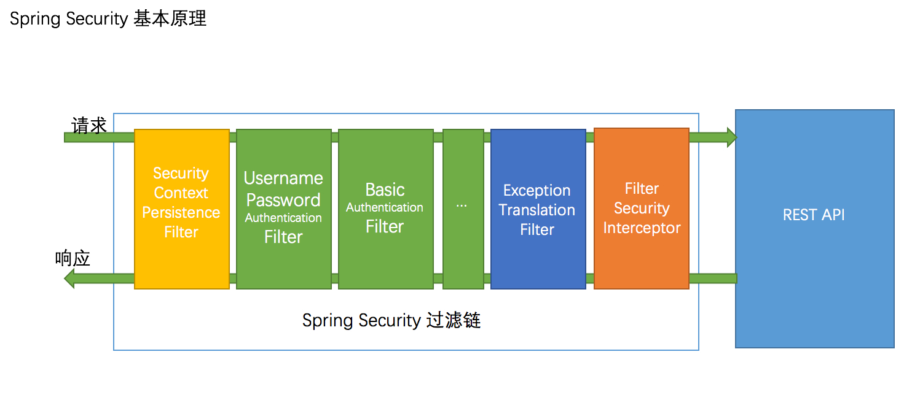
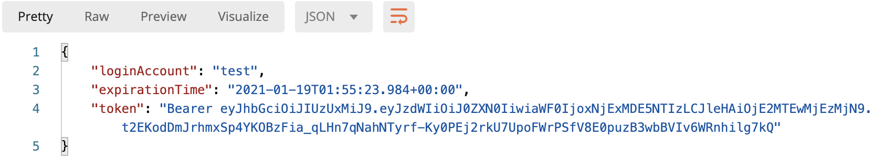

# Spring Security 知识点

目录
+ [SpringSecurity+JWT](#SpringSecurity+JWT)
  + [SpringSecurity的工作流程](#SpringSecurity的工作流程)
  + [SpringSecurity的重要概念](#SpringSecurity的重要概念)
  + [编码前的准备工作](#编码前的准备工作)
  + [代码中的具体实现](#代码中的具体实现)
+ [SpringSecurity动态鉴权](#SpringSecurity动态鉴权)
  + [SpringSecurity的鉴权原理](#SpringSecurity的鉴权原理)
  + [动态鉴权实现](#动态鉴权实现)

## SpringSecurity+JWT
### SpringSecurity的工作流程
**Spring Security 的web基础是Filters：即通过一层层的Filters来对web请求做处理**。

一个web请求会经过一条过滤器链，在经过过滤器链的过程中会完成认证与授权，如果中间发现这条请求未认证或者未授权，会根据被保护API的权限去抛出异常，然后由异常处理器去处理这些异常。



如上图所示，一个请求想要访问到API就会以从左到右的形式经过蓝线框框里面的过滤器，其中绿色部分是负责认证的过滤器，蓝色部分负责异常处理，橙色部分则是负责授权。

图中的这两个绿色过滤器不会去说，因为这是Spring Security对form表单认证和Basic认证内置的两个Filter，而我们的demo是JWT认证方式所以用不上。

因为Spring Security自带的过滤器中是没有针对JWT这种认证方式的，所以我们的demo中会写一个JWT的认证过滤器，然后放在绿色的位置进行认证工作。

### SpringSecurity的重要概念
知道了Spring Security的大致工作流程之后，我们还需要知道一些非常重要的概念也可以说是组件：
- **SecurityContext**：上下文对象，Authentication对象会放在里面；
- **SecurityContextHolder**：用于拿到上下文对象的静态工具类；
- **Authentication**：认证接口，定义了认证对象的数据形式；
- **AuthenticationManager**：用于校验Authentication，返回一个认证完成后的Authentication对象。

#### SecurityContext
上下文对象，认证后的数据就放在这里面，接口定义如下：
```java
public interface SecurityContext extends Serializable {
 // 获取Authentication对象
 Authentication getAuthentication();

 // 放入Authentication对象
 void setAuthentication(Authentication authentication);
}
```
这个接口里面只有两个方法，其主要作用就是get or set Authentication。

#### SecurityContextHolder
```java
public class SecurityContextHolder {

 public static void clearContext() {
  strategy.clearContext();
 }

 public static SecurityContext getContext() {
  return strategy.getContext();
 }
    
    public static void setContext(SecurityContext context) {
  strategy.setContext(context);
 }
}
```
可以说是SecurityContext的工具类，用于get or set or clear SecurityContext，默认会把数据都存储到当前线程中。

#### Authentication
```java
public interface Authentication extends Principal, Serializable {
 
 Collection<? extends GrantedAuthority> getAuthorities();
 Object getCredentials();
 Object getDetails();
 Object getPrincipal();
 boolean isAuthenticated();
 void setAuthenticated(boolean isAuthenticated) throws IllegalArgumentException;
}
```
这几个方法效果如下：
- `getAuthorities`: 获取用户权限，一般情况下获取到的是用户的角色信息；
- `getCredentials`: 获取证明用户认证的信息，通常情况下获取到的是密码等信息；
- `getDetails`: 获取用户的额外信息，（这部分信息可以是我们的用户表中的信息）；
- `getPrincipal`: 获取用户身份信息，在未认证的情况下获取到的是用户名，在已认证的情况下获取到的是 UserDetails；
- `isAuthenticated`: 获取当前 Authentication 是否已认证；
- `setAuthenticated`: 设置当前 Authentication 是否已认证（true or false）。

`Authentication`只是定义了一种在SpringSecurity进行认证过的数据的数据形式应该是怎么样的，要有权限，要有密码，要有身份信息，要有额外信息。

#### AuthenticationManager
```java
public interface AuthenticationManager {
 // 认证方法
 Authentication authenticate(Authentication authentication)
   throws AuthenticationException;
}
```
`AuthenticationManager`定义了一个认证方法，它将一个未认证的`Authentication`传入，返回一个已认证的`Authentication`，默认使用的实现类为：**ProviderManager**。

接下来大家可以构思一下如何将这四个部分，串联起来，构成Spring Security进行认证的流程：
1. 先是一个请求带着身份信息进来；
2. 经过**AuthenticationManager**的认证；
3. 再通过**SecurityContextHolder**获取**SecurityContext**；
4. 最后将认证后的信息放入到**SecurityContext**。

### 编码前的准备工作
首先导入必要的依赖，数据库相关的依赖可以自行选择什么JDBC框架，这里用myabtis-plus
```xml
<dependency>
    <groupId>org.springframework.boot</groupId>
    <artifactId>spring-boot-starter-security</artifactId>
</dependency>

<dependency>
    <groupId>org.springframework.boot</groupId>
    <artifactId>spring-boot-starter-web</artifactId>
</dependency>

<dependency>
    <groupId>org.springframework.boot</groupId>
    <artifactId>spring-boot-starter-validation</artifactId>
</dependency>

<dependency>
    <groupId>io.jsonwebtoken</groupId>
    <artifactId>jjwt</artifactId>
    <version>0.9.0</version>
</dependency>

<dependency>
    <groupId>com.baomidou</groupId>
    <artifactId>mybatis-plus-boot-starter</artifactId>
    <version>3.3.0</version>
</dependency>

<dependency>
    <groupId>mysql</groupId>
    <artifactId>mysql-connector-java</artifactId>
    <version>5.1.47</version>
</dependency>
```

#### 定义加密器Bean
```java
/**
 * 定义加密器Bean
 * @return
 */
@Bean
public PasswordEncoder passwordEncoder() {
    return new BCryptPasswordEncoder();
}
```
这个Bean是不必可少的，Spring Security在认证操作时会使用我们定义的这个加密器，如果没有则会出现异常。

#### 定义AuthenticationManager
```java
@Bean
public AuthenticationManager authenticationManager() throws Exception {
    return super.authenticationManager();
}

```
这里将Spring Security自带的authenticationManager声明成Bean，声明它的作用是用它帮我们进行认证操作，调用这个Bean的authenticate方法会由Spring Security自动帮我们做认证。

#### 实现UserDetailsService
```java
@Slf4j
@Service("userDetailsService")
public class CustomUserDetailsService implements UserDetailsService {
    @Autowired
    private UserInfoService userService;
    @Autowired
    private RoleInfoService roleInfoService;

    @Override
    public UserDetails loadUserByUsername(String s) throws UsernameNotFoundException {
        log.info("开始登陆验证，用户名为: {}", s);

        // 根据用户名验证用户
        QueryWrapper<UserInfo> queryWrapper = new QueryWrapper<>();
        queryWrapper.lambda().eq(UserInfo::getUsername, s);
        UserInfo userInfo = userService.getOne(queryWrapper);
        if (userInfo == null) {
            throw new UsernameNotFoundException("用户名不存在，登陆失败。");
        }

        // 构建UserDetail对象
        UserDetail userDetail = new UserDetail();
        userDetail.setUserInfo(userInfo);
        List<RoleInfo> roleInfoList = roleInfoService.listRoleByUserId(userInfo.getId());
        userDetail.setRoleInfoList(roleInfoList);
        return userDetail;
    }
}
```
实现UserDetailsService的抽象方法并返回一个UserDetails对象，认证过程中SpringSecurity会调用这个方法访问数据库进行对用户的搜索，逻辑什么都可以自定义，无论是从数据库中还是从缓存中，但是我们需要将我们查询出来的用户信息和权限信息组装成一个UserDetails返回。

**UserDetails** 也是一个定义了数据形式的接口，用于保存我们从数据库中查出来的数据，其功能主要是验证账号状态和获取权限。

#### TokenUtil
由于我们是JWT的认证模式，所以我们也需要一个帮我们操作Token的工具类，一般来说它具有以下三个方法就够了：
- 创建token
- 验证token
- 反解析token中的信息

在下文代码里面，JwtProvider充当了Token工具类的角色。

### 代码中的具体实现
用SpringSecurity做JWT认证需要我们自己写一个过滤器来做JWT的校验，然后将这个过滤器放到开篇那张图的绿色部分。

在我们编写这个过滤器之前，我们还需要进行一个认证操作，因为我们要先访问认证接口拿到token，才能把token放到请求头上，进行接下来请求。

#### 认证方法
访问一个系统，一般最先访问的是认证方法，这里写了最简略的认证需要的几个步骤，因为实际系统中我们还要写登录记录啊，前台密码解密啊这些操作。
```java
@Service
public class AuthServiceImpl implements AuthService {

    @Autowired
    private AuthenticationManager authenticationManager;
    @Autowired
    private JwtProvider jwtProvider;

    @Override
    public Object login(String loginAccount, String password) {
        // 1 创建UsernamePasswordAuthenticationToken
        UsernamePasswordAuthenticationToken usernameAuthentication = new UsernamePasswordAuthenticationToken(loginAccount, password);
        // 2 认证
        Authentication authentication = authenticationManager.authenticate(usernameAuthentication);
        // 3 保存认证信息
        SecurityContextHolder.getContext().setAuthentication(authentication);
        // 4 生成自定义token
        UserDetail userDetail = (UserDetail) authentication.getPrincipal();
        AccessToken accessToken = jwtProvider.createToken(userDetail);

        // 5 放入缓存
        // ...
        return JSONUtil.parseObj(accessToken);
    }
}
```
这里一共五个步骤：
1. 传入用户名和密码创建了一个 **UsernamePasswordAuthenticationToken** 对象，这是我们前面说过的 **Authentication** 的实现类，传入用户名和密码做构造参数，这个对象就是我们创建出来的未认证的 **Authentication** 对象。
2. 使用我们先前已经声明过的Bean-**authenticationManager**调用它的**authenticate**方法进行认证，返回一个认证完成的**Authentication**对象。
3. 认证完成没有出现异常，就会走到第三步，使用**SecurityContextHolder**获取**SecurityContext**之后，将认证完成之后的**Authentication**对象，放入上下文对象。
4. 从**Authentication**对象中拿到我们的**UserDetails**对象，之前我们说过，认证后的**Authentication**对象调用它的getPrincipal()方法就可以拿到我们先前数据库查询后组装出来的**UserDetails**对象，然后创建**token**。
5. 把**UserDetails**对象放入缓存中，方便后面过滤器使用。

这样的话就算完成了，感觉上很简单，因为主要认证操作都会由authenticationManager.authenticate()帮我们完成。

接下来我们可以看看源码，从中窥得Spring Security是如何帮我们做这个认证的（省略了一部分）：
```java
// AbstractUserDetailsAuthenticationProvider
public Authentication authenticate(Authentication authentication){
  // 校验未认证的Authentication对象里面有没有用户名
  String username = (authentication.getPrincipal() == null) ? "NONE_PROVIDED": authentication.getName();  
    
     boolean cacheWasUsed = true;
     // 从缓存中去查用户名为XXX的对象
  UserDetails user = this.userCache.getUserFromCache(username);

     // 如果没有就进入到这个方法
  if (user == null) {
   cacheWasUsed = false;

   try {
    // 调用我们重写UserDetailsService的loadUserByUsername方法
    // 拿到我们自己组装好的UserDetails对象
    user = retrieveUser(username,
      (UsernamePasswordAuthenticationToken) authentication);
   }
   catch (UsernameNotFoundException notFound) {
    logger.debug("User '" + username + "' not found");

    if (hideUserNotFoundExceptions) {
     throw new BadCredentialsException(messages.getMessage(
       "AbstractUserDetailsAuthenticationProvider.badCredentials",
       "Bad credentials"));
    }
    else {
     throw notFound;
    }
   }

   Assert.notNull(user,
     "retrieveUser returned null - a violation of the interface contract");
  }
    
    try {
         // 校验账号是否禁用
   preAuthenticationChecks.check(user);
         // 校验数据库查出来的密码，和我们传入的密码是否一致
   additionalAuthenticationChecks(user,
     (UsernamePasswordAuthenticationToken) authentication);
  }
}
```
其主要逻辑也是查数据库然后对比密码。

登录效果如下：  


我们返回token之后，下次请求其他API的时候就要在请求头中带上这个token，都按照JWT的标准来做就可以。

#### JWT过滤器
有了token之后，我们要把过滤器放在过滤器链中，用于解析token，因为我们没有session，所以我们每次去辨别这是哪个用户的请求的时候，都是根据请求中的token来解析出来当前是哪个用户。

所以我们需要一个过滤器去拦截所有请求，前文我们也说过，这个过滤器我们会放在绿色部分用来替代**UsernamePasswordAuthenticationFilter**，所以我们新建一个**JwtAuthenticationTokenFilter**，然后将它注册为Bean，并在编写配置文件的时候需要加上这个：
```java
@Bean
public JwtAuthenticationTokenFilter jwtAuthenticationTokenFilter() {
    return new JwtAuthenticationTokenFilter();
}

@Override
protected void configure(HttpSecurity http) throws Exception {
    http.addFilterBefore(jwtAuthenticationTokenFilter(),UsernamePasswordAuthenticationFilter.class);
}
```
addFilterBefore的语义是添加一个Filter到XXXFilter之前，放在这里就是把**JwtAuthenticationTokenFilter**放在**UsernamePasswordAuthenticationFilter**之前，因为filter的执行也是有顺序的，我们必须要把我们的filter放在过滤器链中绿色的部分才会起到自动认证的效果。

接下来我们可以看看JwtAuthenticationTokenFilter的具体实现了：
```java
@Slf4j
public class JwtAuthenticationTokenFilter extends OncePerRequestFilter {

    @Autowired
    private JwtProvider jwtProvider;
    @Autowired
    private JwtProperties jwtProperties;

    @Override
    protected void doFilterInternal(HttpServletRequest request,
                                    HttpServletResponse response,
                                    FilterChain chain) throws ServletException, IOException {
        log.info("JWT过滤器通过校验请求头token进行自动登录...");

        // 拿到Authorization请求头内的信息
        String authToken = jwtProvider.getToken(request);

        // 判断一下内容是否为空
        if (StrUtil.isNotEmpty(authToken) && authToken.startsWith(jwtProperties.getTokenPrefix())) {
            // 去掉token前缀(Bearer )，拿到真实token
            authToken = authToken.substring(jwtProperties.getTokenPrefix().length());

            // 拿到token里面的登录账号
            String loginAccount = jwtProvider.getSubjectFromToken(authToken);

            if (StrUtil.isNotEmpty(loginAccount) && SecurityContextHolder.getContext().getAuthentication() == null) {
                // 缓存里查询用户，不存在需要重新登陆
                //UserDetail userDetails = caffeineCache.get(CacheName.USER, loginAccount, UserDetail.class);
                UserDetail userDetails = null;

                // 拿到用户信息后验证用户信息与token
                if (userDetails != null && jwtProvider.validateToken(authToken, userDetails)) {

                    // 组装authentication对象，构造参数是Principal Credentials 与 Authorities
                    // 后面的拦截器里面会用到 grantedAuthorities 方法
                    UsernamePasswordAuthenticationToken authentication = new UsernamePasswordAuthenticationToken(userDetails, userDetails.getPassword(), userDetails.getAuthorities());

                    // 将authentication信息放入到上下文对象中
                    SecurityContextHolder.getContext().setAuthentication(authentication);

                    log.info("JWT过滤器通过校验请求头token自动登录成功, user : {}", userDetails.getUsername());
                }
            }
        }
        chain.doFilter(request, response);
    }
}
```
1. 拿到Authorization请求头对应的token信息。
2. 去掉token的头部(Bearer )。
3. 解析token，拿到我们放在里面的登陆账号。
4. 因为我们之前登陆过，所以我们直接从缓存里面拿我们的UserDetail信息即可。
5. 查看是否UserDetail为null，以及查看token是否过期，UserDetail用户名与token中的是否一直。
6. 组装一个authentication对象，把它放在上下文对象中，这样后面的过滤器看到我们上下文对象中有authentication对象，就相当于我们已经认证过了。

这样的话，每一个带有正确token的请求进来之后，都会找到它的账号信息，并放在上下文对象中，我们可以使用SecurityContextHolder很方便的拿到上下文对象中的Authentication对象。


结合认证方法，我们的逻辑链就变成了：
登录👉拿到token👉请求带上token👉JWT过滤器拦截👉校验token👉将从缓存中查出来的对象放到上下文中

## SpringSecurity动态鉴权
### SpringSecurity的鉴权原理
  
整个认证的过程其实一直在围绕图中过滤链的绿色部分，而动态鉴权主要是围绕其橙色部分，也就是图上标的：**FilterSecurityInterceptor**

#### FilterSecurityInterceptor
想知道怎么动态鉴权首先我们要搞明白SpringSecurity的鉴权逻辑，从上图中我们也可以看出：**FilterSecurityInterceptor**是这个过滤链的最后一环，而认证之后就是鉴权，所以我们的**FilterSecurityInterceptor**主要是负责鉴权这部分。

一个请求完成了认证，且没有抛出异常之后就会到达**FilterSecurityInterceptor**所负责的鉴权部分，也就是说鉴权的入口就在**FilterSecurityInterceptor**。

先来看看**FilterSecurityInterceptor**的定义和主要方法：
```java
public class FilterSecurityInterceptor extends AbstractSecurityInterceptor implements
  Filter {

            public void doFilter(ServletRequest request, ServletResponse response,
                    FilterChain chain) throws IOException, ServletException {
                FilterInvocation fi = new FilterInvocation(request, response, chain);
                invoke(fi);
            }
}
```
上文代码可以看出`FilterSecurityInterceptor`是实现了抽象类`AbstractSecurityInterceptor`的一个实现类，这个`AbstractSecurityInterceptor`中预先写好了一段很重要的代码（后面会说到）。

`FilterSecurityInterceptor`的主要方法是doFilter方法，过滤器的特性大家应该都知道，请求过来之后会执行这个doFilter方法，`FilterSecurityInterceptor`的doFilter方法出奇的简单，总共只有两行：

第一行是创建了一个`FilterInvocation`对象，这个`FilterInvocation`对象你可以当作它封装了request，它的主要工作就是拿请求里面的信息，比如请求的URI。  
第二行就调用了自身的invoke方法，并将`FilterInvocation`对象传入。

所以主要逻辑肯定是在这个invoke方法里面了，来打开看看：
```java
public void invoke(FilterInvocation fi) throws IOException, ServletException {
        if ((fi.getRequest() != null)
                && (fi.getRequest().getAttribute(FILTER_APPLIED) != null)
                && observeOncePerRequest) {
            // filter already applied to this request and user wants us to observe
            // once-per-request handling, so don't re-do security checking
            fi.getChain().doFilter(fi.getRequest(), fi.getResponse());
        }
        else {
            // first time this request being called, so perform security checking
            if (fi.getRequest() != null && observeOncePerRequest) {
                fi.getRequest().setAttribute(FILTER_APPLIED, Boolean.TRUE);
            }

            // 进入鉴权
            InterceptorStatusToken token = super.beforeInvocation(fi);

            try {
                fi.getChain().doFilter(fi.getRequest(), fi.getResponse());
            }
            finally {
                super.finallyInvocation(token);
            }

            super.afterInvocation(token, null);
        }
    }
```
invoke方法中只有一个`if-else`，一般都是不满足if中的那三个条件的，然后执行逻辑会来到else。  
else的代码也可以概括为两部分：
1. 调用了super.beforeInvocation(fi)。
2. 调用完之后过滤器继续往下走。

第二步可以不看，每个过滤器都有这么一步，所以我们主要看`super.beforeInvocation(fi)`，前文已经说过，FilterSecurityInterceptor实现了抽象类AbstractSecurityInterceptor，所以这个里super其实指的就是AbstractSecurityInterceptor，那这段代码其实调用了AbstractSecurityInterceptor.beforeInvocation(fi)，
前文说过AbstractSecurityInterceptor中有一段很重要的代码就是这一段，那我们继续来看这个beforeInvocation(fi)方法的源码：
```java
protected InterceptorStatusToken beforeInvocation(Object object) {
        Assert.notNull(object, "Object was null");
        final boolean debug = logger.isDebugEnabled();

        if (!getSecureObjectClass().isAssignableFrom(object.getClass())) {
            throw new IllegalArgumentException(
                    "Security invocation attempted for object "
                            + object.getClass().getName()
                            + " but AbstractSecurityInterceptor only configured to support secure objects of type: "
                            + getSecureObjectClass());
        }

        Collection<ConfigAttribute> attributes = this.obtainSecurityMetadataSource()
                .getAttributes(object);

        Authentication authenticated = authenticateIfRequired();

        try {
            // 鉴权需要调用的接口
            this.accessDecisionManager.decide(authenticated, object, attributes);
        }
        catch (AccessDeniedException accessDeniedException) {
            publishEvent(new AuthorizationFailureEvent(object, attributes, authenticated,
                    accessDeniedException));

            throw accessDeniedException;
        }

    }
```
源码较长，这里精简了中间的一部分，这段代码大致可以分为三步：
1. 拿到了一个`Collection<ConfigAttribute>`对象，这个对象是一个List，其实里面就是我们在配置中配置的过滤规则。
2. 拿到了`Authentication`，这里是调用`authenticateIfRequired`方法拿到了，其实里面还是通过`SecurityContextHolder`拿到的。
3. 调用了`accessDecisionManager.decide(authenticated, object, attributes)`，前两步都是对`decide`方法做参数的准备，第三步才是正式去到鉴权的逻辑，既然这里面才是真正鉴权的逻辑，那也就是说鉴权其实是`accessDecisionManager`在做。

#### AccessDecisionManager
前面通过源码我们看到了鉴权的真正处理者：AccessDecisionManager，是不是觉得一层接着一层，就像套娃一样，别急，下面还有。先来看看源码接口定义：
```java
public interface AccessDecisionManager {
// 主要鉴权方法
void decide(Authentication authentication, Object object,
            Collection<ConfigAttribute> configAttributes) throws AccessDeniedException,
        InsufficientAuthenticationException;

boolean supports(ConfigAttribute attribute);

boolean supports(Class<?> clazz);
}
```
`AccessDecisionManager`是一个接口，它声明了三个方法，除了第一个鉴权方法以外，还有两个是辅助性的方法，其作用都是甄别decide方法中参数的有效性。  
它主要有三个实现类，分别代表了三种不同的鉴权逻辑：
- `AffirmativeBased`：一票通过，只要有一票通过就算通过，默认是它。
- `UnanimousBased`：一票反对，只要有一票反对就不能通过。
- `ConsensusBased`：少数票服从多数票。

这里的表述为什么要用票呢？因为在实现类里面采用了委托的形式，将请求委托给投票器，每个投票器拿着这个请求根据自身的逻辑来计算出能不能通过然后进行投票。

也就是说这三个实现类，其实还不是真正判断请求能不能通过的类，真正判断请求是否通过的是投票器，然后实现类把投票器的结果综合起来来决定到底能不能通过。

实现类把投票器的结果综合起来进行决定，也就是说投票器可以放入多个，每个实现类里的投票器数量取决于构造的时候放入了多少投票器，我们可以看看默认的`AffirmativeBased`的源码：
```java
public class AffirmativeBased extends AbstractAccessDecisionManager {

    public AffirmativeBased(List<AccessDecisionVoter<?>> decisionVoters) {
        super(decisionVoters);
    }

    // 拿到所有的投票器，循环遍历进行投票
    public void decide(Authentication authentication, Object object,
                       Collection<ConfigAttribute> configAttributes) throws AccessDeniedException {
        int deny = 0;

        for (AccessDecisionVoter voter : getDecisionVoters()) {
            int result = voter.vote(authentication, object, configAttributes);

            if (logger.isDebugEnabled()) {
                logger.debug("Voter: " + voter + ", returned: " + result);
            }

            switch (result) {
                case AccessDecisionVoter.ACCESS_GRANTED:
                    return;

                case AccessDecisionVoter.ACCESS_DENIED:
                    deny++;

                    break;

                default:
                    break;
            }
        }

        if (deny > 0) {
            throw new AccessDeniedException(messages.getMessage(
                    "AbstractAccessDecisionManager.accessDenied", "Access is denied"));
        }

        // To get this far, every AccessDecisionVoter abstained
        checkAllowIfAllAbstainDecisions();
    }
}
```
`AffirmativeBased`的构造是传入投票器List，其主要鉴权逻辑交给投票器去判断，投票器返回不同的数字代表不同的结果，然后`AffirmativeBased`根据自身一票通过的策略决定放行还是抛出异常。

`AffirmativeBased`默认传入的构造器只有一个->`WebExpressionVoter`，这个构造器会根据你在配置文件中的配置进行逻辑处理得出投票结果。

所以SpringSecurity默认的鉴权逻辑就是根据配置文件中的配置进行鉴权，这是符合我们现有认知的。

### 动态鉴权实现
既然是动态鉴权了，那我们的权限URI肯定是放在数据库中了，我们要做的就是实时的在数据库中去读取不同角色对应的权限然后与当前登录的用户做个比较。

那我们要做到这一步可以想些方案，比如：
- 直接重写一个`AccessDecisionManager`，将它用作默认的`AccessDecisionManager`，并在里面直接写好鉴权逻辑。
- 再比如重写一个投票器，将它放到默认的`AccessDecisionManager`里面，和之前一样用投票器鉴权。
- 直接去做FilterSecurityInterceptor的改动。

我们选第二种方式，那么我们需要写一个新的投票器，在这个投票器里面拿到当前用户的角色，使其和当前请求所需要的角色做个对比。

单单是这样还不够，因为我们可能在配置文件中也配置的有一些放行的权限，比如登录URI就是放行的，所以我们还需要继续使用我们上文所提到的`WebExpressionVoter`，也就是说我要自定义权限+配置文件双行的模式，所以我们的`AccessDecisionManager`里面就会有两个投票器：`WebExpressionVoter`和**自定义的投票器**。

紧接着我们还需要考虑去使用什么样的投票策略，这里使用的是`UnanimousBased`一票反对策略，而没有使用默认的一票通过策略，因为在我们的配置中配置了除了登录请求以外的其他请求都是需要认证的，这个逻辑会被`WebExpressionVoter`处理，如果使用了一票通过策略，那我们去访问被保护的API的时候，`WebExpressionVoter`发现当前请求认证了，就直接投了赞成票，且因为是一票通过策略，这个请求就走不到我们自定义的投票器了。

注：你也可以不用配置文件中的配置，将你的自定义权限配置都放在数据库中，然后统一交给一个投票器来处理。

#### 重新构造AccessDecisionManager
首先重新构造`AccessDecisionManager`， 因为投票器是系统启动的时候自动添加进去的，所以我们想多加入一个构造器必须自己重新构建`AccessDecisionManager`，然后将它放到配置中去。

而且我们的投票策略已经改变了，要由`AffirmativeBased`换成`UnanimousBased`，所以这一步是必不可少的。并且我们还要自定义一个投票器起来，将它注册成Bean，`AccessDecisionProcessor`就是我们需要自定义的投票器。
```java
@Bean
public AccessDecisionVoter<FilterInvocation> accessDecisionProcessor() {
    return new AccessDecisionProcessor();
}

@Bean
public AccessDecisionManager accessDecisionManager() {
    // 构造一个新的AccessDecisionManager 放入两个投票器
    List<AccessDecisionVoter<?>> decisionVoters = Arrays.asList(new WebExpressionVoter(), accessDecisionProcessor());
    return new UnanimousBased(decisionVoters);
}
```
