# Spring-AOP

[TOC]

## 一、Spring AOP概述

我们在使用Spring框架的时候，经常需要和Spring的2大特性，IOC和AOP打交道，本篇文章就分享一下AOP的底层实现，比较基础的内容本篇文章就不多做介绍了，主要侧重于底层api的设计理念。

**「AOP这种设计理念常见的概念如下」**

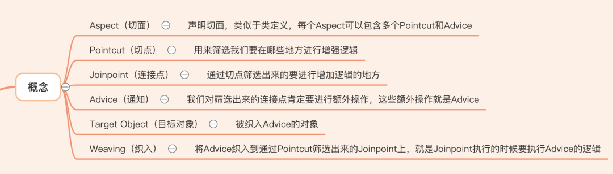

**「AOP的主要应用场景如下」**

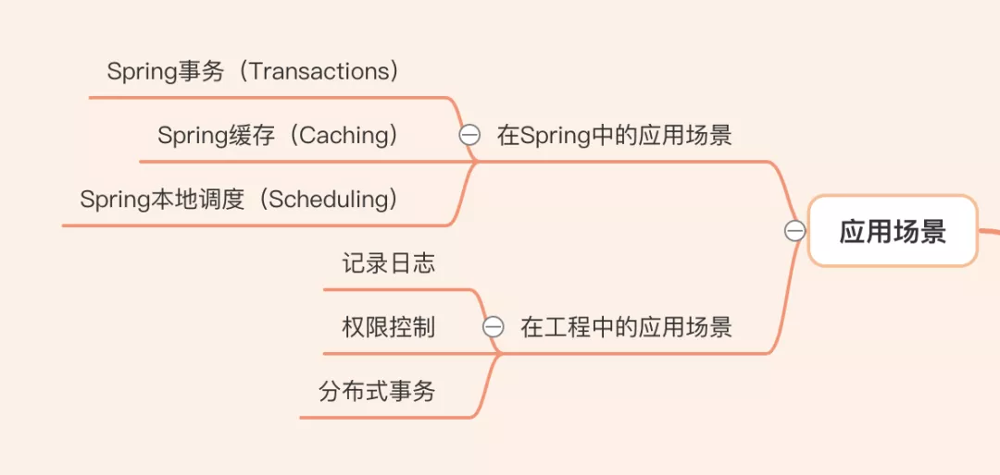

**「Spring AOP的实现主要经历了2代」**

第一代：spring1.x版本，自己实现了AOP的功能 

第二代：spring2.x版本，Spring集成了AspectJ的实现

## 二、Spring AOP一代

**「当我们要基于现成的实现增加横切逻辑时，首先需要找到哪些地方增强，我们就用Pointcut来进行筛选吧」**

先写一个Service方便后面的演示

```java
public interface EchoService {
    String echo(String message);
}

public class DefaultEchoService implements EchoService {
    @Override
    public String echo(String message) {
        return message;
    }
}
```

### 1.  Pointcut

Pointcut接口定义如下

```java
public interface Pointcut {

 // 通过类过滤
 ClassFilter getClassFilter();

 // 通过方法过滤
 MethodMatcher getMethodMatcher();

 Pointcut TRUE = TruePointcut.INSTANCE;

}
```

**「当我们想筛选出EchoService的echo方法时，就可以定义如下的Pointcut」**

```java
public class EchoPointcut implements Pointcut {

    @Override
    public ClassFilter getClassFilter() {
        return new ClassFilter() {
            @Override
            public boolean matches(Class<?> clazz) {
                return EchoService.class.isAssignableFrom(clazz);
            }
        };
    }

    @Override
    public MethodMatcher getMethodMatcher() {
        return new MethodMatcher() {
            @Override
            public boolean matches(Method method, Class<?> targetClass) {
                return "echo".equals(method.getName()) &&
                        method.getParameterTypes().length == 1 &&
                        Objects.equals(String.class, method.getParameterTypes()[0]);
            }

            @Override
            public boolean isRuntime() {
                return false;
            }

            @Override
            public boolean matches(Method method, Class<?> targetClass, Object... args) {
                return false;
            }
        };
    }
}
```

看起来还是很麻烦的，因此Spring内置了很多实现，一般情况下我们用内置的实现即可，不用自己定义，上面的筛选过程就可以改为如下

```java
// 方法名为 echo 会被拦截
NameMatchMethodPointcut pointcut = new NameMatchMethodPointcut();
pointcut.setMappedName("echo");
```

Spring提供的部分Pointcut实现如下：

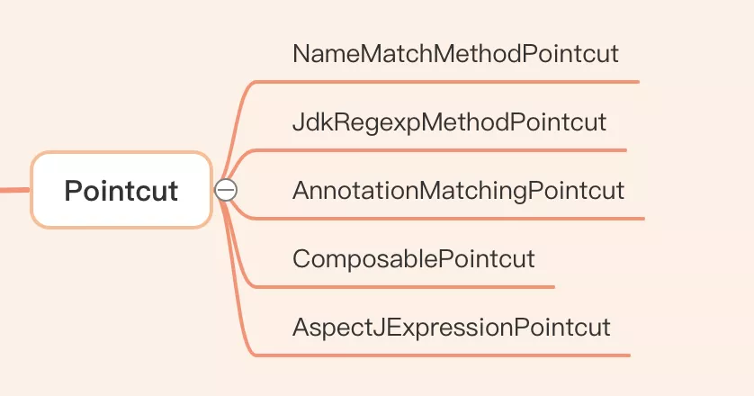

### 2. Jointpoint

**「通过Pointcut筛选出来的要增加横切逻辑的地方就是Jointpoint。」** 在AOP理念中，很多地方可以增加横切逻辑，如方法执行，字段设置等。但是**「Spring只支持方法执行这一种Joinpoint」**，因为这种类型的Jointpoint基本上已经满足80%的场景了

Joinpoint类型中 **「方法调用优于方法执行」**

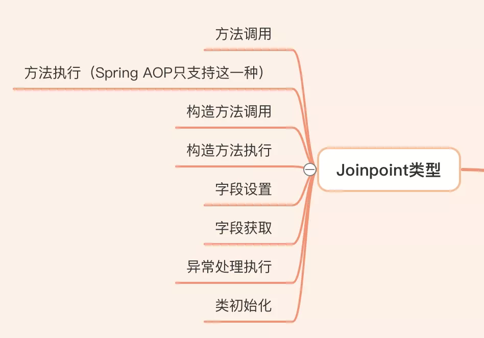

因为Spring中只支持方法执行这一种Joinpoint，所以我们可以从Joinpoint实现类中获取增强的方法信息


### 3. Advice

当筛选出Jointpoint时，我们就需要在这些Jointpoint上增加横切逻辑，这些横切逻辑被称为Advice

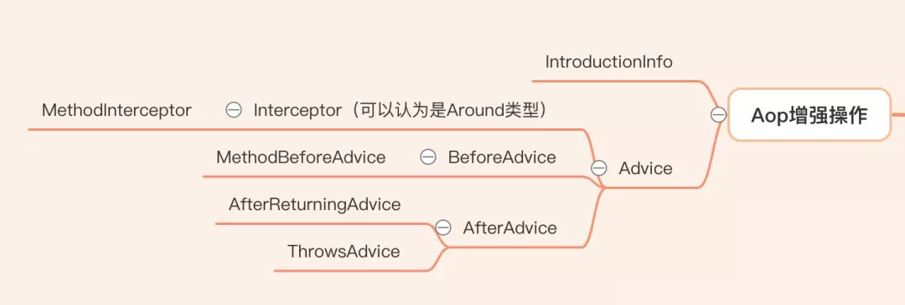

在Spring中实现横切逻辑的方式有两类：

1. 实现Advice接口
2. 实现IntroductionInfo接口

实现Advice接口的方式我们最常用，后面会详细分析。实现IntroductionInfo接口的方式基本不会用，这里演示一下具体的用法，方便理解整个AOP API的设计理念

**「IntroductionInfo主要是通过给目标类实现特定接口来增加新功能」**

```java
public interface SayName {
    String getName();
}

public class DefaultSayName implements SayName {
    @Override
    public String getName() {
        return "I am service";
    }
}

public static void main(String[] args) {
    SayName sayName = new DefaultSayName();
    EchoService echoService = new DefaultEchoService();
    // IntroductionInfo接口的内置实现
    DelegatingIntroductionInterceptor interceptor =
            new DelegatingIntroductionInterceptor(sayName);
    Advisor advisor = new DefaultIntroductionAdvisor(interceptor, SayName.class);
    ProxyFactory proxyFactory = new ProxyFactory(echoService);
    proxyFactory.addAdvisor(advisor);
    // hello world
    EchoService proxyService = (EchoService) proxyFactory.getProxy();
    System.out.println(proxyService.echo("hello world"));
    // I am service
    SayName proxySayName = (SayName) proxyFactory.getProxy();
    System.out.println(proxySayName.getName());
}
```

可能你对这个例子中的Advisor和ProxyFactory比较陌生，不知道起了啥作用，不着急，我们后面会详细分析这2个类的作用


**「实现Advice接口的方式，应该是Spring AOP一代中最常见的使用方式了」**

**「对HashMap的put方法增加执行前的横切逻辑」**, 打印放入HashMap的key和value的值

```java
public static void main(String[] args) {
    JdkRegexpMethodPointcut pointcut = new JdkRegexpMethodPointcut();
    pointcut.setPattern(".*put.*");
    DefaultPointcutAdvisor advisor = new DefaultPointcutAdvisor();
    advisor.setPointcut(pointcut);
    advisor.setAdvice(new MethodBeforeAdvice() {
        @Override
        public void before(Method method, Object[] args, Object target) throws Throwable {
            System.out.printf("当前存放的key为 %s，值为 %s", args[0], args[1]);
        }
    });

    ProxyFactory proxyFactory = new ProxyFactory(new HashMap());
    proxyFactory.addAdvisor(advisor);
    Map<String, String> proxyMap = (Map<String, String>) proxyFactory.getProxy();
    // 当前存放的key为 a，值为 a
    proxyMap.put("a", "a");
}
```

### 4. Advisor

前面我们说过在AOP设计理念中，我们用Aspect来声明切面，每个Aspect可以包含多个Pointcut和Advice。

**「在Spring AOP一代中，Aspect对应的实现为Advisor」**。即Advisor是Pointcut和Advice的容器，但是一个Advisor只能包含一个Pointcut和Advice

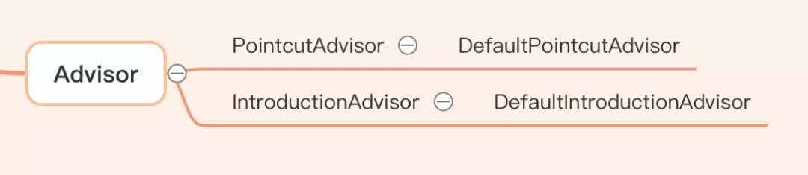

因为Advice的实现方式有两类，因此对应的Advisor也可以分为两类

### 5. 织入

**「在Spring中将Advice织入到Jointpoint的过程是通过动态代理来实现的」**。当然织入的方式有很多种，不仅仅只有动态代理这一种实现

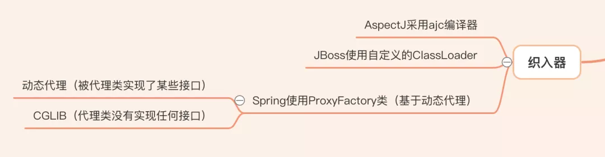

Spring用了jdk动态代理和cglib来实现动态代理。生成代理对象用了工厂模式。从api中就可以很清晰的看出来

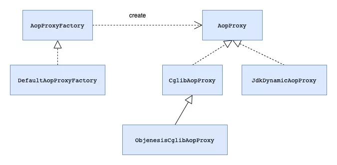

**「jdk动态代理」**

```java
public class CostInvocationHandler implements InvocationHandler {

    private Object target;

    public CostInvocationHandler(Object target) {
        this.target = target;
    }

    @Override
    public Object invoke(Object proxy, Method method, Object[] args) throws Throwable {
        long startTime = System.currentTimeMillis();
        Object result = method.invoke(target, args);
        long cost = System.currentTimeMillis() - startTime;
        System.out.println("cost " + cost);
        return result;
    }
}

public static void main(String[] args) {
    ClassLoader classLoader = Thread.currentThread().getContextClassLoader();
    Object proxy = Proxy.newProxyInstance(classLoader,
            new Class[]{EchoService.class},
            new CostInvocationHandler(new DefaultEchoService()));
    EchoService echoService = (EchoService) proxy;
    // cost 0
    // hello world
    System.out.println(echoService.echo("hello world"));
}
```

**「cglib」**

```java
public static void main(String[] args) {
    Enhancer enhancer = new Enhancer();
    enhancer.setSuperclass(DefaultEchoService.class);
    enhancer.setInterfaces(new Class[] {EchoService.class});
    enhancer.setCallback(new MethodInterceptor() {
        @Override
        public Object intercept(Object source, Method method, Object[] args, MethodProxy methodProxy) throws Throwable {
            long startTime = System.currentTimeMillis();
            Object result = methodProxy.invokeSuper(source, args);
            long cost = System.currentTimeMillis() - startTime;
            System.out.println("cost " + cost);
            return result;
        }
    });
    EchoService echoService = (EchoService) enhancer.create();
    // cost 29
    // hello world
    System.out.println(echoService.echo("hello world"));
}
```

### 6. Spring AOP的自动动态代理

上面我们一直通过API的形式来演示，我们当然也可以把这些对象放入Spring容器，让Spring来管理，并且对Spring容器中的Bean生成代理对象

上面的Demo可以改为如下形式，变化基本不大

**「手动配置」**

```java
public class ProxyConfig {

    // 创建代理对象
    @Bean
    public EchoService echoService() {
        return new DefaultEchoService();
    }

    // 创建advice
    @Bean
    public CostMethodInterceptor costInterceptor() {
        return new CostMethodInterceptor();
    }

    // 使用pointcut和advice创建advisor
    @Bean
    public Advisor advisor() {
        NameMatchMethodPointcutAdvisor advisor = new NameMatchMethodPointcutAdvisor();
        advisor.setMappedName("echo");
        advisor.setAdvice(costInterceptor());
        return advisor;
    }

    // 创建代理对象
    @Bean("echoProxy")
    public ProxyFactoryBean proxyFactoryBean(EchoService echoService) {
        ProxyFactoryBean proxyFactoryBean = new ProxyFactoryBean();
        proxyFactoryBean.setTarget(echoService);
        proxyFactoryBean.setInterceptorNames("advisor");
        return proxyFactoryBean;
    }
}
public static void main(String[] args) {
    AnnotationConfigApplicationContext context = new AnnotationConfigApplicationContext(ProxyConfig.class);
    // 获取代理对象
    EchoService echoService = (EchoService) context.getBean("echoProxy");
    // cost 0
    // hello world
    System.out.println(echoService.echo("hello world"));
}
```

**「可以看到我们对每个生成的代理对象都要配置对应的ProxyFactoryBean，然后从容器中获取代理对象来使用」**。当代理对象很少时还能应付，当代理对象很多时，那还不得累到吐血。有没有什么简单的办法呢？

Spring肯定也想到了这个问题，所以他提供了如下一个类DefaultAdvisorAutoProxyCreator来实现自动代理，我们将这个类放入Spring容器即可，如下所示

**「自动配置」**

```java
public class AutoProxyConfig {

    // 创建代理对象
    @Bean
    public EchoService echoService() {
        return new DefaultEchoService();
    }

    // 创建advice
    @Bean
    public CostMethodInterceptor costInterceptor() {
        return new CostMethodInterceptor();
    }

    // 使用pointcut和advice创建advisor
    @Bean
    public Advisor advisor() {
        NameMatchMethodPointcutAdvisor advisor = new NameMatchMethodPointcutAdvisor();
        advisor.setMappedName("echo");
        advisor.setAdvice(costInterceptor());
        return advisor;
    }

    @Bean
    public DefaultAdvisorAutoProxyCreator autoProxyCreator() {
        return new DefaultAdvisorAutoProxyCreator();
    }
}
public static void main(String[] args) {
    AnnotationConfigApplicationContext context = new AnnotationConfigApplicationContext(AutoProxyConfig.class);
    EchoService echoService = context.getBean(EchoService.class);
    // cost 0
    // hello world
    System.out.println(echoService.echo("hello world"));
}
```

从容器中获取的对象直接就是被代理后的对象，非常方便。**「Spring AOP提供了很多类来实现自动代理，但他们有一个共同的父类AbstractAutoProxyCreator，看来自动代理的秘密就在这个AbstractAutoProxyCreator类中」**

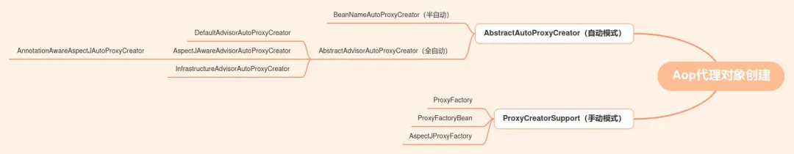

## 三、Spring AOP自动动态代理的实现方式

如果让你实现对象的自动代理，你会怎么做呢？

当然是通过BeanPostProcessor来干预Bean的声明周期，聪明！Spring就是这么干的，来验证一下我们的想法

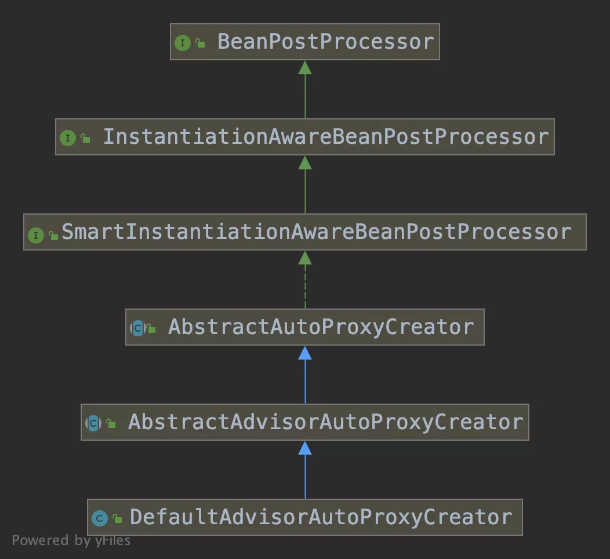

看这个类的继承关系，基本上就验证了我们的想法了。我们只要看看他重写了BeanPostProcessor的哪些方法即可？

**「AbstractAutoProxyCreator重写了如下2个重要的方法」**

1. postProcessBeforeInstantiation（Bean实例化前阶段执行） 
2. postProcessAfterInitialization（Bean初始化后阶段执行）

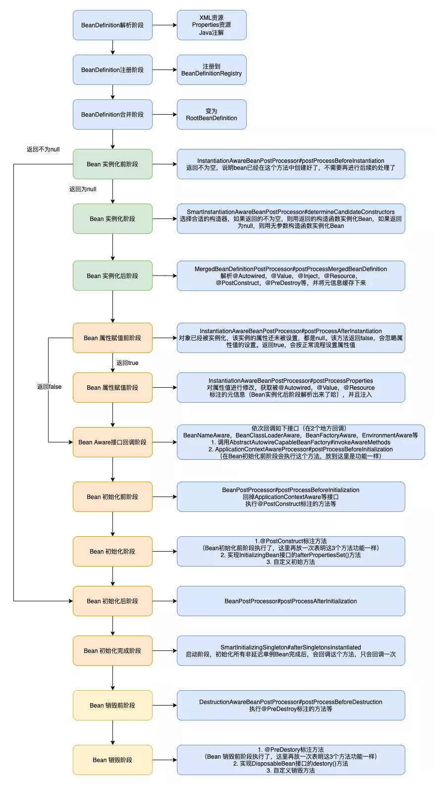

**「postProcessBeforeInstantiation（Bean实例化前阶段执行）」**

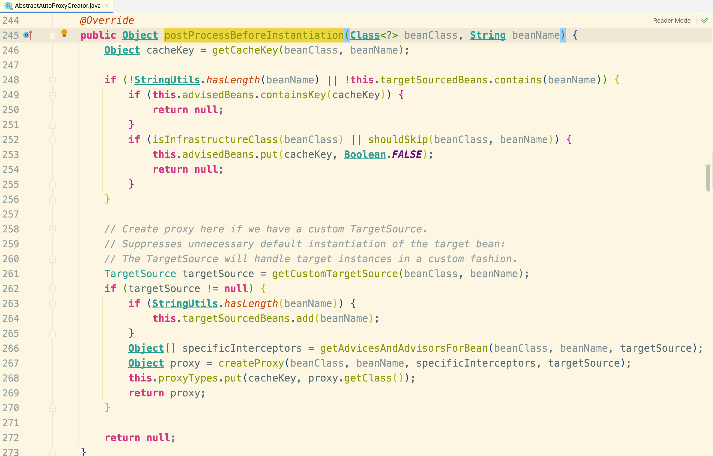

当用户自定义了TargetSource的实现时，会从TargetSource中获取目标对象生成代理。但是一般情况下我们很少会自定义TargetSource的实现。所以这部分就不再分析了。直接看postProcessAfterInitialization

**「postProcessAfterInitialization（Bean初始化后阶段执行）」**

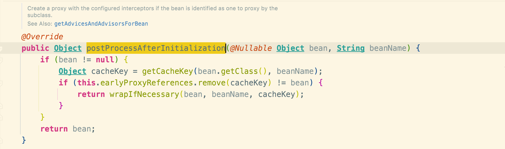

如果没有经过代理的化就会进入wrapIfNecessary方法

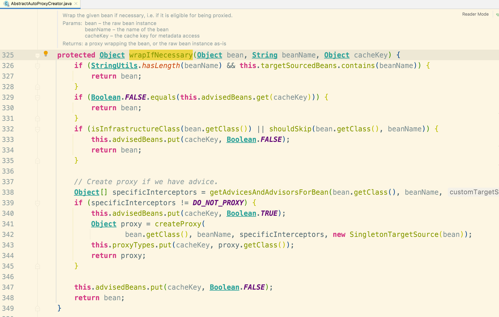

思路很简单，就是根据Bean获取对应的Advisor，然后创建其代理对象，并返回。


**「所以当面试官问你Spring AOP和IOC是如何结合在一起的时候，你是不是知道该如何回答了？」**

在Bean生命周期的Bean初始化后阶段，如果这个Bean需要增加横切逻辑，则会在这个阶段生成对应的代理对象。

