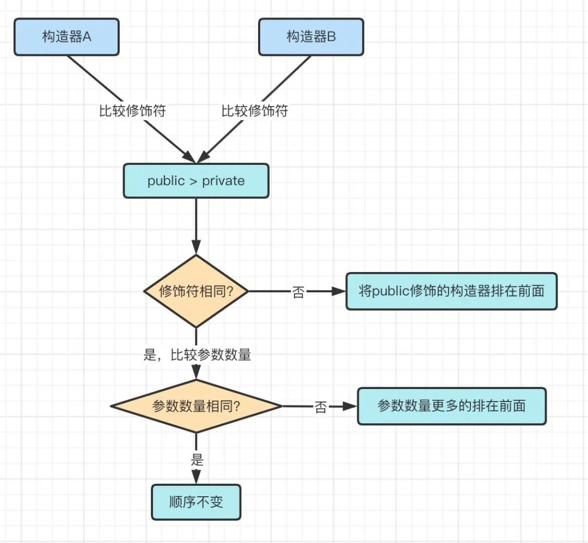

# Spring中Bean的生命周期

<!-- START doctoc generated TOC please keep comment here to allow auto update -->
<!-- DON'T EDIT THIS SECTION, INSTEAD RE-RUN doctoc TO UPDATE -->

- [零、开篇](#%E9%9B%B6%E5%BC%80%E7%AF%87)
- [一、什么是Bean的生命周期](#%E4%B8%80%E4%BB%80%E4%B9%88%E6%98%AFbean%E7%9A%84%E7%94%9F%E5%91%BD%E5%91%A8%E6%9C%9F)
- [二、对象实例化](#%E4%BA%8C%E5%AF%B9%E8%B1%A1%E5%AE%9E%E4%BE%8B%E5%8C%96)
    - [2.1 推导过程](#21-%E6%8E%A8%E5%AF%BC%E8%BF%87%E7%A8%8B)
    - [2.2 构造器推断](#22-%E6%9E%84%E9%80%A0%E5%99%A8%E6%8E%A8%E6%96%AD)
    - [2.3 对象实例化](#23-%E5%AF%B9%E8%B1%A1%E5%AE%9E%E4%BE%8B%E5%8C%96)
        - [2.3.1 构造器的优先级是怎样的？](#231-%E6%9E%84%E9%80%A0%E5%99%A8%E7%9A%84%E4%BC%98%E5%85%88%E7%BA%A7%E6%98%AF%E6%80%8E%E6%A0%B7%E7%9A%84)
        - [2.3.2 Spring是如何处理实例化异常的？](#232-spring%E6%98%AF%E5%A6%82%E4%BD%95%E5%A4%84%E7%90%86%E5%AE%9E%E4%BE%8B%E5%8C%96%E5%BC%82%E5%B8%B8%E7%9A%84)
- [三、处理beanDefinition](#%E4%B8%89%E5%A4%84%E7%90%86beandefinition)
    - [3.1 推导过程](#31-%E6%8E%A8%E5%AF%BC%E8%BF%87%E7%A8%8B)
    - [3.2 处理beanDefinition](#32-%E5%A4%84%E7%90%86beandefinition)
- [四、属性填充](#%E5%9B%9B%E5%B1%9E%E6%80%A7%E5%A1%AB%E5%85%85)
- [五、invokeAwareMethods](#%E4%BA%94invokeawaremethods)
    - [5.1 推导过程](#51-%E6%8E%A8%E5%AF%BC%E8%BF%87%E7%A8%8B)
    - [5.2 invokeAwareMethods](#52-invokeawaremethods)
- [六、初始化前的处理](#%E5%85%AD%E5%88%9D%E5%A7%8B%E5%8C%96%E5%89%8D%E7%9A%84%E5%A4%84%E7%90%86)
    - [6.1 InitDestroyAnnotationBeanPostProcessor](#61-initdestroyannotationbeanpostprocessor)
    - [6.2 ApplicationContextAwareProcessor](#62-applicationcontextawareprocessor)
- [七、初始化方法](#%E4%B8%83%E5%88%9D%E5%A7%8B%E5%8C%96%E6%96%B9%E6%B3%95)
- [八、初始化后的处理](#%E5%85%AB%E5%88%9D%E5%A7%8B%E5%8C%96%E5%90%8E%E7%9A%84%E5%A4%84%E7%90%86)
- [九、其他逻辑](#%E4%B9%9D%E5%85%B6%E4%BB%96%E9%80%BB%E8%BE%91)
    - [9.1 中止创建Bean的过程](#91-%E4%B8%AD%E6%AD%A2%E5%88%9B%E5%BB%BAbean%E7%9A%84%E8%BF%87%E7%A8%8B)
    - [9.2 提前缓存刚实例化的对象](#92-%E6%8F%90%E5%89%8D%E7%BC%93%E5%AD%98%E5%88%9A%E5%AE%9E%E4%BE%8B%E5%8C%96%E7%9A%84%E5%AF%B9%E8%B1%A1)
    - [9.3 中止填充属性操作](#93-%E4%B8%AD%E6%AD%A2%E5%A1%AB%E5%85%85%E5%B1%9E%E6%80%A7%E6%93%8D%E4%BD%9C)
    - [9.4 注册Bean的销毁方法](#94-%E6%B3%A8%E5%86%8Cbean%E7%9A%84%E9%94%80%E6%AF%81%E6%96%B9%E6%B3%95)

<!-- END doctoc generated TOC please keep comment here to allow auto update -->

## 零、开篇

本文主要分为两点进行阐述：

1、什么是Bean的生命周期？

2、Bean的生命周期是怎样的？

先给大家看一下完整的bean生命周期，不懂没关系后面会讲


## 一、什么是Bean的生命周期

我们知道，在Java中，万物皆对象，这些对象有生命周期：实例化 -> gc回收

而Bean同样也是Java中的对象，只是在这同时，Spring又赋予了它更多的意义。

于是乎，我们将Bean从在Spring中创建开始，到Bean被销毁结束，这一过程称之为Bean的生命周期。

那到底Bean在Spring中的创建过程是怎样的呢？

## 二、对象实例化

在Spring中，Bean的创建过程看起来复杂，但实际上逻辑分明。

如果我们将所有**扩展性**流程抛开，你会发现只剩下两个流程：对象的实例化和属性填充

~~我们在《深入浅出Spring架构设计》文中手写的Spring，也只是完成了这两个流程，这足以说明只需要这两个流程就能完成一个简单的Spring框架，~~那其他的流程又是什么呢？他们又有什么作用？

那么我们现在就基于这两个核心流程出发，尝试完善整个Spring的Bean生命周期。

### 2.1 推导过程


开始时，我们只有两个流程：对象的实例化和属性填充

我们知道，对象的实例化就是在Java里使用类构造器进行创建对象。而一个类中可能有很多的构造器，那么我们怎么才能知道使用哪个构造器进行实例化对象呢？

所以说，在实例化之前，还得先做一件事情：确定候选的构造器，也称之为构造器推断。

### 2.2 构造器推断

功能描述：**找寻beanClass中所有符合候选条件的构造器**

负责角色：AutowiredAnnotationBeanPostProcessor

候选条件：构造器上添加了@Autowired注解

推断流程：

1、获取beanClass中的所有构造器进行遍历，判断构造器上是否标识@Autowired注解，是则将构造器添加到候选构造器集合中

2、并进一步判断Autowired注解中required属性是否为true(默认为true)，是则表示该beanClass已存在指定实例化的构造器，不可再有其他加了@Autowired注解的构造器，如果有则抛出异常。

3、如果Autowired注解中required属性为false，则可继续添加其他@Autowired(required=false)标识的构造器

4、如果候选构造器集合不为空(有Autowired标识的构造器)，并且beanClass中还有个空构造器，那么同样将空构造器也加入候选构造器集合中。

5、如果候选构造器集合为空，但是beanClass中只有一个构造器且该构造器有参，那么将该构造器加入候选构造器集合中。

流程图：


当构造器遍历完毕之后，还有些许逻辑


以上判断条件很多，但始终是围绕这一个逻辑：这个beanClass中有没有被`Autowired`标识的构造器，有的话required是true还是false，如果是true, 那其他的构造器都不要了。如果是false，那想加多少个构造器就加多少个。

咦，那要是没有`Autowired`标识的构造器呢？

框架嘛，都是要兜底的，这里就是看beanClass中是不是只有一个构造器且是有参的。

那我要是只有个无参的构造器呢？

那确实就是没有候选的构造器了，但是Spring最后又兜底了一次，在没有候选构造器时默认使用无参构造器

那我要是有很多个构造器呢？

Spring表示那我也不知道用哪个呀，同样进入兜底策略：使用无参构造器(没有将抛出异常)

那么这就是构造器推断流程了，我们将它加入到流程图中


在得到候选的构造器之后，就可以对对象进行实例化了，那么实例化的过程是怎样的呢？

### 2.3 对象实例化

功能描述：根据候选构造器集合中的构造器优先级对beanClass进行实例化。

负责角色：ConstructorResolver

对象实例化的过程主要有两个方面需要关注：

1、构造器的优先级是怎样的？

2、如果有多个构造器，但是有部分构造器的需要的bean并不存在于Spring容器中会发生什么？也就是出现了异常怎么处理？

#### 2.3.1 构造器的优先级是怎样的？

在Java中，多个构造器称之为构造器重载，重载的方式有两种：参数的数量不同，参数的类型不同。

在Spring中，优先级则是由构造器的修饰符(public or private)和参数的数量决定。

规则如下：

1. public修饰的构造器  >  private修饰的构造器

2. 修饰符相同的情况下参数数量更多的优先



这段流程很简单，代码只有两行：

```java
// 如果一个是public,一个不是,那么public优先
int result = Boolean.compare(Modifier.isPublic(e2.getModifiers()), Modifier.isPublic(e1.getModifiers()));
// 都是public，参数多的优先
return result != 0 ? result : Integer.compare(e2.getParameterCount(), e1.getParameterCount());
```

> 文中描述的规则是public > private, 只是为了更好的理解，实际上比较的是public和非public

#### 2.3.2 Spring是如何处理实例化异常的？

当一个beanClass中出现多个构造器，但是有部分构造器的需要的bean并不存在于Spring容器中，此时会发生什么呢？

比如以下案例中，InstanceA具有三个构造方法，其中InstanceB并未注入到Spring中

```java
@Component
public class InstanceA {

 @Autowired(required = false)
 public InstanceA(InstanceB instanceB){
  System.out.println("instance B ...");
 }

 @Autowired(required = false)
 public InstanceA(InstanceC instanceC){
  System.out.println("instance C ...");
 }

 @Autowired(required = false)
 public InstanceA(InstanceB instanceB, InstanceC instanceC, InstanceD InstanceD){
  System.out.println("instance B C D...");
 }
}
```

那么启动时是报错呢？还是选择只有InstanceC的构造器进行实例化？

运行结果会告诉你：Spring最终使用了只有InstanceC的构造器

这一部分的具体过程如下：

1. 将根据优先级规则排序好的构造器进行遍历

2. 逐个进行尝试查找构造器中的需要的bean是否都在Spring容器中，如果成功找到将该构造器标记为有效构造器，并立即退出遍历

3. 否则记录异常继续尝试使用下一个构造器

4. 当所有构造器都遍历完毕仍未找到有效的构造器，抛出记录的异常

5. 使用有效构造器进行实例化


## 三、处理beanDefinition

### 3.1 推导过程

到这里，beanClass实例化了一个bean，接下来需要做的便是对bean进行赋值，但我们知道，Spring中可以进行赋值的对象不仅有通过`@Autowired`标识的属性，还可以是`@Value`,`@Resource`,`@Inject`等等。

为此，Spring为了达到可扩展性，将获取被注解标识的属性的过程与实际赋值的过程进行了分离。

该过程在Spring中被称为**处理beanDefinition**

### 3.2 处理beanDefinition

功能描述：**处理BeanDefintion的元数据信息**

负责角色：

1. AutowiredAnnotationBeanPostProcessor：处理`@Autowird`,`@Value`,`@Inject`注解

2. CommonAnnotationBeanPostProcessor：处理`@PostConstruct`,`@PreDestroy`,`@Resource`注解

这两个后置处理器的处理过程十分类似,  我们以`AutowiredAnnotationBeanPostProcessor`为例：

1. 遍历beanClass中的所有`Field`、`Method`（java中统称为`Member`）

2. 判断`Member`是否标识`@Autowird`,`@Value`,`@Inject`注解

3. 是则将该`Member`保存，封装到一个叫做`InjectionMetadata`的类中

4. 判断`Member`是否已经被解析过，比如一个`Member`同时标识了`@Autowired`和`@Resource`注解，那么这个`Member`就会被这两个后置处理器都处理一遍，就会造成重复保存

5. 如果没被解析过就将该`Member`放置到已检查的元素集合中，用于后续填充属性时从这里直接拿到所有要注入的`Member`


其中，`AutowiredAnnotationBeanPostProcessor`和`InjectionMetadata`的结构如下


同样，我们将这一部分流程也加入到流程图中


## 四、属性填充

功能：**对bean中需要自动装配的属性进行填充**

角色：

1. AutowiredAnnotationBeanPostProcessor

2. CommonAnnotationBeanPostProcessor

在上一个流程中，我们已经找到了所有需要自动装配的`Member`，所以这一部流程就显得非常简单了

我们同样以`AutowiredAnnotationBeanPostProcessor`为例

1. 使用beanName为key，从缓存中取出`InjectionMetadata`

2. 遍历`InjectionMetadata`中的`checkedElements`集合

3. 取出`Element`中的`Member`，根据`Member`的类型在Spring中获取`Bean`

4. 使用反射将获取到的Bean设值到属性中


## 五、invokeAwareMethods

### 5.1 推导过程

在Spring中，Bean填充属性之后还可以做一些初始化的逻辑，比如Spring的线程池`ThreadPoolTaskExecutor`在填充属性之后的创建线程池逻辑，`RedisTemplate`的设置默认值。

Spring的初始化逻辑共分为4个部分：

1. invokeAwareMethods：调用实现特定`Aware`接口的方法

2. applyBeanPostProcessorsBeforeInitialization：初始化前的处理

3. invokeInitMethods：调用初始化方法

4. applyBeanPostProcessorsAfterInitialization：初始化后的处理

### 5.2 invokeAwareMethods

这块逻辑非常简单，我直接把源码粘出来给大家看看就明白了

```java
private void invokeAwareMethods(String beanName, Object bean) {
  if (bean instanceof Aware) {
   if (bean instanceof BeanNameAware) {
    ((BeanNameAware) bean).setBeanName(beanName);
   }
   if (bean instanceof BeanClassLoaderAware) {
    ClassLoader bcl = getBeanClassLoader();
    if (bcl != null) {
     ((BeanClassLoaderAware) bean).setBeanClassLoader(bcl);
    }
   }
   if (bean instanceof BeanFactoryAware) {
    ((BeanFactoryAware) bean).setBeanFactory(AbstractAutowireCapableBeanFactory.this);
   }
  }
 }
```

## 六、初始化前的处理

功能：**调用初始化方法前的一些操作**

角色：

1. InitDestroyAnnotationBeanPostProcessor：处理@PostContrust注解

2. ApplicationContextAwareProcessor：处理一系列Aware接口的回调方法

这一步骤的功能没有太大的关联性，完全按照使用者自己的意愿决定想在初始化方法前做些什么，我们一个一个来过

### 6.1 InitDestroyAnnotationBeanPostProcessor

这里的逻辑与**属性填充**过程非常相似，**属性填充**过程是取出`自动装配`相关的`InjectionMetadata`进行处理，而这一步则是取`@PostContrust`相关的`Metadata`进行处理，这个`Metadata`同样也是在**处理BeanDefinition**过程解析缓存的

1. 取出**处理BeanDefinition**过程解析的`LifecycleMetadata`

2. 遍历`LifecycleMetadata`中的`checkedInitMethods`集合

3. 使用反射进行调用


### 6.2 ApplicationContextAwareProcessor

这一步与**invokeAwareMethods**大同小异，只不过是其他的一些Aware接口，同样直接粘上代码

```java
private void invokeAwareInterfaces(Object bean) {
  if (bean instanceof EnvironmentAware) {
   ((EnvironmentAware) bean).setEnvironment(this.applicationContext.getEnvironment());
  }
  if (bean instanceof EmbeddedValueResolverAware) {
   ((EmbeddedValueResolverAware) bean).setEmbeddedValueResolver(this.embeddedValueResolver);
  }
  if (bean instanceof ResourceLoaderAware) {
   ((ResourceLoaderAware) bean).setResourceLoader(this.applicationContext);
  }
  if (bean instanceof ApplicationEventPublisherAware) {
   ((ApplicationEventPublisherAware) bean).setApplicationEventPublisher(this.applicationContext);
  }
  if (bean instanceof MessageSourceAware) {
   ((MessageSourceAware) bean).setMessageSource(this.applicationContext);
  }
  if (bean instanceof ApplicationContextAware) {
   ((ApplicationContextAware) bean).setApplicationContext(this.applicationContext);
  }
 }
```

## 七、初始化方法

在Spring中的初始化方法有两种

1. 实现`InitializingBean`接口的`afterPropertiesSet`方法

2. `@Bean`注解中的`initMethod`属性

调用顺序是先调用`afterPropertiesSet`再`initMethod`

1. 判断Bean是否实现`InitializingBean`接口

2. 是则将Bean强转成`InitializingBean`，调用`afterPropertiesSet`方法

3. 判断BeanDefinition中是否有`initMethod`

4. 是则找到对应的`initMethod`，通过反射进行调用


## 八、初始化后的处理

在Spring的内置的后置处理器中，该步骤只有`ApplicationListenerDetector`有相应处理逻辑：将实现了ApplicationListener接口的bean添加到事件监听器列表中

> 如果使用了Aop相关功能，则会使用到`AbstractAutoProxyCreator`，进行创建代理对象。

`ApplicationListenerDetector`的流程如下

1、判断Bean是否是个`ApplicationListener`

2、是则将bean存放到`applicationContext`的监听器列表中

到这里，Bean的生命周期主要部分已经介绍完了，我们将流程图补充一下


同样还有其他的一些逻辑

## 九、其他逻辑

### 9.1 中止创建Bean的过程

该过程处于Bean生命周期的最开始部分。

功能：**由后置处理器返回Bean，达到中止创建Bean的效果**

角色：无，Spring的内置后置处理器中，无实现。

Bean的生命周期十分复杂，Spring允许你直接拦截，即在创建Bean之前由自定义的后置处理器直接返回一个Bean给Spring，那么Spring就会使用你给的Bean，不会再走Bean生命周期流程。

案例演示：

```java
@Component
public class Car {

 @Autowired
 private Person person;

 public void checkPerson(){
  if(person == null){
   System.out.println("person is null");
  }
 }
}
```

由于在`Person`属性上加了`@Autowired`，所以正常来说person必然不能为空，因为这是必须要注入的。

现在我们自定义一个BeanPostProcessor进行拦截

```java
@Component
public class InterruptBeanPostProcessor implements InstantiationAwareBeanPostProcessor {

 @Override
 public Object postProcessBeforeInstantiation(Class<?> beanClass, String beanName) throws BeansException {
  if("car".equals(beanName)){
   try {
    return beanClass.newInstance();
   } catch (InstantiationException | IllegalAccessException e) {
    e.printStackTrace();
   }
  }
  return null;
 }
}
```

测试结果如下：

```textile
person is null
```

### 9.2 提前缓存刚实例化的对象

该步骤跟随在Spring实例化bean之后，将bean进行缓存，其目的是为了解决循环依赖问题。

该过程暂时按下不表。

### 9.3 中止填充属性操作

与中止创建Bean逻辑相同，Spring同样也允许你在属性填充前进行拦截。在Spring的内置处理器中同样无该实现。

实现手段为实现`InstantiationAwareBeanPostProcessor`接口，在`postProcessAfterInstantiation`方法中返回false

```java
@Component
public class InterruptBeanPostProcessor implements InstantiationAwareBeanPostProcessor {

 @Override
 public boolean postProcessAfterInstantiation(Object bean, String beanName) throws BeansException {
  if(beanName.equals("car")){
   return false;
  }
  return true;
 }
}
```

### 9.4 注册Bean的销毁方法

Spring中不仅有`@PostContrust`、`afterProperties`、`initMethod`这些bean创建时的初始化方法，同样也有bean销毁时的`@PreDestory`、`destroy`,`destroyMethod`。

所以在Bean的生命周期最后一步，Spring会将具备这些销毁方法的Bean注册到销毁集合中，用于系统关闭时进行回调。

比如线程池的关闭，连接池的关闭，注册中心的取消注册，都是通过它来实现的。