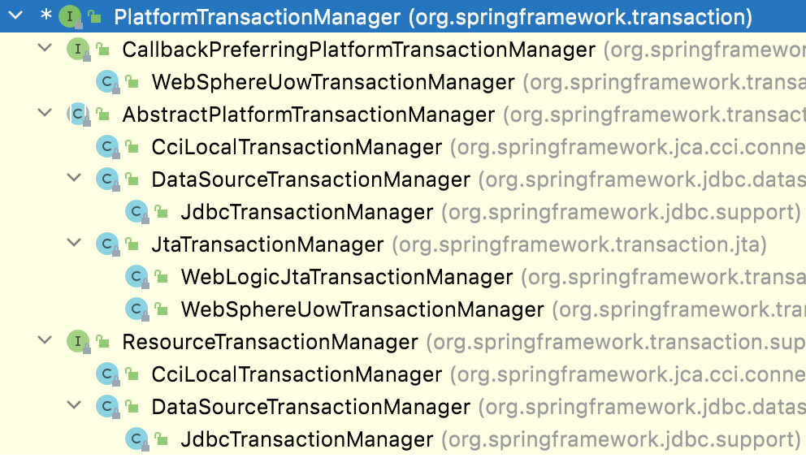
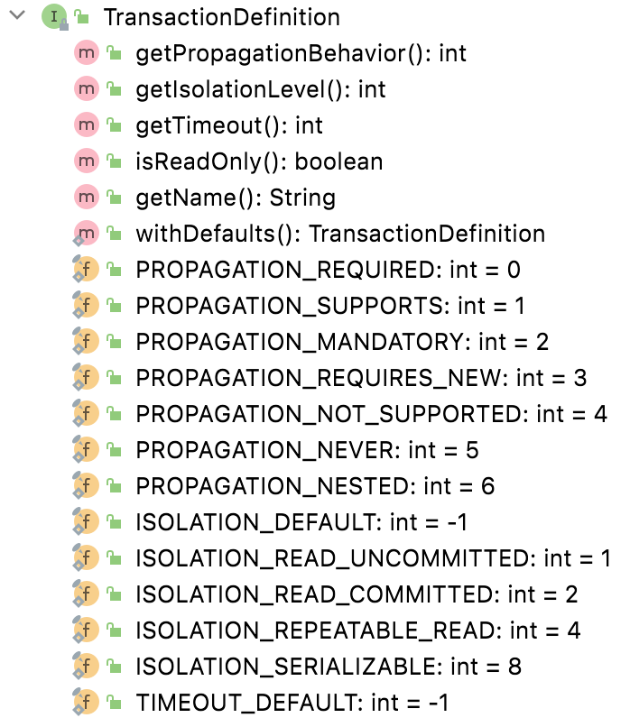
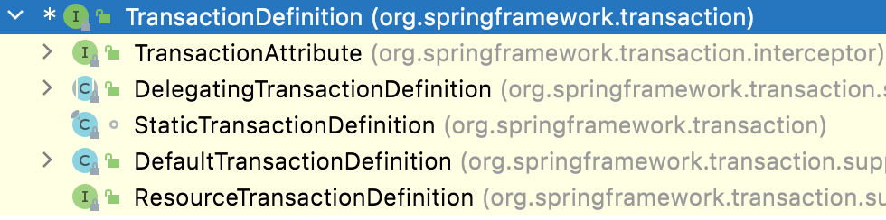

# spring事务管理-传播特性

<!-- START doctoc generated TOC please keep comment here to allow auto update -->
<!-- DON'T EDIT THIS SECTION, INSTEAD RE-RUN doctoc TO UPDATE -->

- [一、Spring 中的事务](#%E4%B8%80spring-%E4%B8%AD%E7%9A%84%E4%BA%8B%E5%8A%A1)
    - [1. 两种用法](#1-%E4%B8%A4%E7%A7%8D%E7%94%A8%E6%B3%95)
    - [2. 三大基础设施](#2-%E4%B8%89%E5%A4%A7%E5%9F%BA%E7%A1%80%E8%AE%BE%E6%96%BD)
- [二、编程式事务](#%E4%BA%8C%E7%BC%96%E7%A8%8B%E5%BC%8F%E4%BA%8B%E5%8A%A1)
- [三、声明式事务](#%E4%B8%89%E5%A3%B0%E6%98%8E%E5%BC%8F%E4%BA%8B%E5%8A%A1)
- [四、事务属性](#%E5%9B%9B%E4%BA%8B%E5%8A%A1%E5%B1%9E%E6%80%A7)
    - [1. 隔离性](#1-%E9%9A%94%E7%A6%BB%E6%80%A7)
    - [2. 传播性](#2-%E4%BC%A0%E6%92%AD%E6%80%A7)
    - [3. 回滚规则](#3-%E5%9B%9E%E6%BB%9A%E8%A7%84%E5%88%99)
    - [4. 是否只读](#4-%E6%98%AF%E5%90%A6%E5%8F%AA%E8%AF%BB)
    - [5. 超时时间](#5-%E8%B6%85%E6%97%B6%E6%97%B6%E9%97%B4)
- [五、注意事项](#%E4%BA%94%E6%B3%A8%E6%84%8F%E4%BA%8B%E9%A1%B9)

<!-- END doctoc generated TOC please keep comment here to allow auto update -->

[TOC]

## 一、Spring 中的事务

### 1. 两种用法

Spring 作为 Java 开发中的基础设施，对于事务也提供了很好的支持，总体上来说，Spring 支持两种类型的事务，声明式事务和编程式事务。

编程式事务类似于 Jdbc 事务的写法，需要将事务的代码嵌入到业务逻辑中，这样代码的耦合度较高，而声明式事务通过 AOP
的思想能够有效的将事务和业务逻辑代码解耦，因此在实际开发中，声明式事务得到了广泛的应用，而编程式事务则较少使用，考虑到文章内容的完整，本文对两种事务方式都会介绍。

### 2. 三大基础设施

Spring 中对事务的支持提供了三大基础设施，我们先来了解下。

1. PlatformTransactionManager
2. TransactionDefinition
3. TransactionStatus

这三个核心类是 Spring 处理事务的核心类。

**PlatformTransactionManager**

PlatformTransactionManager 是事务处理的核心，它有诸多的实现类，如下：



PlatformTransactionManager 的定义如下：

```java
public interface PlatformTransactionManager {
    TransactionStatus getTransaction(@Nullable TransactionDefinition definition);

    void commit(TransactionStatus status) throws TransactionException;

    void rollback(TransactionStatus status) throws TransactionException;
}
```

可以看到 `PlatformTransactionManager` 中定义了基本的事务操作方法，这些事务操作方法都是平台无关的，具体的实现都是由不同的子类来实现的。

这就像 JDBC 一样，SUN 公司制定标准，其他数据库厂商提供具体的实现。这么做的好处就是我们 Java 程序员只需要掌握好这套标准即可，不用去管接口的具体实现。以 `PlatformTransactionManager`
为例，它有众多实现，如果你使用的是 JDBC 那么可以将 `DataSourceTransactionManager` 作为事务管理器；如果你使用的是
Hibernate，那么可以将 `HibernateTransactionManager` 作为事务管理器；如果你使用的是 JPA，那么可以将 `JpaTransactionManager`
作为事务管理器。`DataSourceTransactionManager`、`HibernateTransactionManager` 以及 `JpaTransactionManager`
都是 `PlatformTransactionManager` 的具体实现，但是我们并不需要掌握这些具体实现类的用法，我们只需要掌握好 `PlatformTransactionManager` 的用法即可。

`PlatformTransactionManager` 中主要有如下三个方法：

1. getTransaction()

getTransaction() 是根据传入的 TransactionDefinition 获取一个事务对象，TransactionDefinition 中定义了一些事务的基本规则，例如传播性、隔离级别等。

2. commit()

commit() 方法用来提交事务。

3. rollback()

rollback() 方法用来回滚事务。

**TransactionDefinition**

`TransactionDefinition` 用来描述事务的具体规则，也称作事务的属性。事务有哪些属性呢？

主要是五种属性：

1. 隔离性
2. 传播性
3. 回滚规则
4. 超时时间
5. 是否只读

这五种属性接下来松哥会和大家详细介绍。

`TransactionDefinition` 类中的方法如下：



可以看到一共有五个方法：

1. getIsolationLevel()，获取事务的隔离级别
2. getName()，获取事务的名称
3. getPropagationBehavior()，获取事务的传播性
4. getTimeout()，获取事务的超时时间
5. isReadOnly()，获取事务是否是只读事务

TransactionDefinition 也有诸多的实现类，如下：



如果开发者使用了编程式事务的话，直接使用 `DefaultTransactionDefinition` 即可。

**TransactionStatus**

TransactionStatus 可以直接理解为事务本身，该接口源码如下：

```java
public interface TransactionStatus extends SavepointManager, Flushable {
    boolean isNewTransaction();

    boolean hasSavepoint();

    void setRollbackOnly();

    boolean isRollbackOnly();

    void flush();

    boolean isCompleted();
}
```

1. isNewTransaction() 方法获取当前事务是否是一个新事务。
2. hasSavepoint() 方法判断是否存在 savePoint()。
3. setRollbackOnly() 方法设置事务必须回滚。
4. isRollbackOnly() 方法获取事务只能回滚。
5. flush() 方法将底层会话中的修改刷新到数据库，一般用于 Hibernate/JPA 的会话，对如 JDBC 类型的事务无任何影响。
6. isCompleted() 方法用来获取是一个事务是否结束。

**这就是 Spring 中支持事务的三大基础设施。**

## 二、编程式事务

我们先来看看编程式事务怎么玩。

通过 PlatformTransactionManager 或者 TransactionTemplate 可以实现编程式事务。如果是在 Spring Boot 项目中，这两个对象 Spring Boot
会自动提供，我们直接使用即可。但是如果是在传统的 SSM 项目中，则需要我们通过配置来提供这两个对象，可以自行了解，这里不浪费时间。

有了这两个对象，接下来的代码就简单了：

```java

@Service
public class TransferService {
    @Autowired
    JdbcTemplate jdbcTemplate;
    @Autowired
    PlatformTransactionManager txManager;

    public void transfer() {
        DefaultTransactionDefinition definition = new DefaultTransactionDefinition();
        TransactionStatus status = txManager.getTransaction(definition);
        try {
            jdbcTemplate.update("update user set account=account+100 where username='zhangsan'");
            int i = 1 / 0;
            jdbcTemplate.update("update user set account=account-100 where username='lisi'");
            txManager.commit(status);
        } catch (DataAccessException e) {
            e.printStackTrace();
            txManager.rollback(status);
        }
    }
}
```

这段代码很简单，没啥好解释的，在 `try...catch...` 中进行业务操作，没问题就 commit，有问题就 rollback。如果我们需要配置事务的隔离性、传播性等，可以在 DefaultTransactionDefinition
对象中进行配置。

上面的代码是通过 PlatformTransactionManager 实现的编程式事务，我们也可以通过 TransactionTemplate 来实现编程式事务，如下：

```java

@Service
public class TransferService {
    @Autowired
    JdbcTemplate jdbcTemplate;
    @Autowired
    TransactionTemplate tranTemplate;

    public void transfer() {
        tranTemplate.execute(new TransactionCallbackWithoutResult() {
            @Override
            protected void doInTransactionWithoutResult(TransactionStatus status) {
                try {
                    jdbcTemplate.update("update user set account=account+100 where username='zhangsan'");
                    int i = 1 / 0;
                    jdbcTemplate.update("update user set account=account-100 where username='lisi'");
                } catch (DataAccessException e) {
                    status.setRollbackOnly();
                    e.printStackTrace();
                }
            }
        });
    }
}
```

直接注入 TransactionTemplate，然后在 execute 方法中添加回调写核心的业务即可，当抛出异常时，将当前事务标注为只能回滚即可。注意，execute 方法中，如果不需要获取事务执行的结果，则直接使用
TransactionCallbackWithoutResult 类即可，如果要获取事务执行结果，则使用 TransactionCallback 即可。

这就是两种编程式事务的玩法。

编程式事务由于代码入侵太严重了，因为在实际开发中使用的很少，我们在项目中更多的是使用声明式事务。

## 三、声明式事务

声明式事务如果使用 `XML` 配置，可以做到无侵入；如果使用 `Java` 配置，也只有一个 `@Transactional` 注解侵入而已，相对来说非常容易。哪个方法需要事务就在哪个方法上添加 `@Transactional`
注解即可，向下面这样：

```java
@Transactional(noRollbackFor = ArithmeticException.class)
public void update4(){
        jdbcTemplate.update("update account set money = ? where username=?;",998,"lisi");
        int i=1/0;
        }
```

当然这个稍微有点代码入侵，不过问题不大，日常开发中这种方式使用较多。当`@Transactional` 注解加在类上面的时候，表示该类的所有方法都有事务，该注解加在方法上面的时候，表示该方法有事务。

## 四、事务属性

在前面的配置中，我们只是简单说了事务的用法，并没有和大家详细聊一聊事务的一些属性细节，那么接下来我们就来仔细捋一捋事务中的五大属性。

### 1. 隔离性

首先就是事务的隔离性，也就是事务的隔离级别。

MySQL 中有四种不同的隔离级别，这四种不同的隔离级别在 Spring 中都得到了很好的支持。Spring 中默认的事务隔离级别是 default，即数据库本身的隔离级别是啥就是啥，default 就能满足我们日常开发中的大部分场景。

不过如果项目有需要，我们也可以调整事务的隔离级别。

调整方式如下：

**编程式事务**

如果是编程式事务，通过如下方式修改事务的隔离级别：

**TransactionTemplate**

```
transactionTemplate.setIsolationLevel(TransactionDefinition.ISOLATION_SERIALIZABLE);
```

TransactionDefinition 中定义了各种隔离级别。

**PlatformTransactionManager**

```java
public void update2(){
        //创建事务的默认配置
        DefaultTransactionDefinition definition=new DefaultTransactionDefinition();
        definition.setIsolationLevel(TransactionDefinition.ISOLATION_SERIALIZABLE);
        TransactionStatus status=platformTransactionManager.getTransaction(definition);
        try{
        jdbcTemplate.update("update account set money = ? where username=?;",999,"zhangsan");
        int i=1/0;
        //提交事务
        platformTransactionManager.commit(status);
        }catch(DataAccessException e){
        e.printStackTrace();
        //回滚
        platformTransactionManager.rollback(status);
        }
        }
```

这里是在 DefaultTransactionDefinition 对象中设置事务的隔离级别。

**声明式事务隔离级别**

```java
@Transactional(isolation = Isolation.SERIALIZABLE)
public void update4(){
        jdbcTemplate.update("update account set money = ? where username=?;",998,"lisi");
        int i=1/0;
        }
```

### 2. 传播性

先来说说何谓事务的传播性：

> 事务传播行为是为了解决业务层方法之间互相调用的事务问题，当一个事务方法被另一个事务方法调用时，事务该以何种状态存在？例如新方法可能继续在现有事务中运行，也可能开启一个新事务，并在自己的事务中运行，等等，这些规则就涉及到事务的传播性。

关于事务的传播性，Spring 主要定义了如下几种：

```java
public enum Propagation {
    REQUIRED(TransactionDefinition.PROPAGATION_REQUIRED),
    SUPPORTS(TransactionDefinition.PROPAGATION_SUPPORTS),
    MANDATORY(TransactionDefinition.PROPAGATION_MANDATORY),
    REQUIRES_NEW(TransactionDefinition.PROPAGATION_REQUIRES_NEW),
    NOT_SUPPORTED(TransactionDefinition.PROPAGATION_NOT_SUPPORTED),
    NEVER(TransactionDefinition.PROPAGATION_NEVER),
    NESTED(TransactionDefinition.PROPAGATION_NESTED);
    private final int value;

    Propagation(int value) {
        this.value = value;
    }

    public int value() {
        return this.value;
    }
}
```

具体含义如下：

| 传播性        | 描述                                                         |
| :------------ | :----------------------------------------------------------- |
| REQUIRED      | 如果当前存在事务，则加入该事务；如果当前没有事务，则创建一个新的事务 |
| SUPPORTS      | 如果当前存在事务，则加入该事务；如果当前没有事务，则以非事务的方式继续运行 |
| MANDATORY     | 如果当前存在事务，则加入该事务；如果当前没有事务，则抛出异常 |
| REQUIRES_NEW  | 创建一个新的事务，如果当前存在事务，则把当前事务挂起         |
| NOT_SUPPORTED | 以非事务方式运行，如果当前存在事务，则把当前事务挂起         |
| NEVER         | 以非事务方式运行，如果当前存在事务，则抛出异常               |
| NESTED        | 如果当前存在事务，则创建一个事务作为当前事务的嵌套事务来运行；如果当前没有事务，则该取值等价于 TransactionDefinition.PROPAGATION_REQUIRED |

一共是七种传播性，具体配置也简单：

**TransactionTemplate中的配置**

```java
transactionTemplate.setPropagationBehavior(TransactionDefinition.PROPAGATION_REQUIRED);
```

**PlatformTransactionManager中的配置**

```java
public void update2(){
        //创建事务的默认配置
        DefaultTransactionDefinition definition=new DefaultTransactionDefinition();
        definition.setIsolationLevel(TransactionDefinition.ISOLATION_SERIALIZABLE);
        definition.setPropagationBehavior(TransactionDefinition.PROPAGATION_REQUIRED);
        TransactionStatus status=platformTransactionManager.getTransaction(definition);
        try{
        jdbcTemplate.update("update account set money = ? where username=?;",999,"zhangsan");
        int i=1/0;
        //提交事务
        platformTransactionManager.commit(status);
        }catch(DataAccessException e){
        e.printStackTrace();
        //回滚
        platformTransactionManager.rollback(status);
        }
        }
```

**声明式事务的配置（Java）**

```java
@Transactional(noRollbackFor = ArithmeticException.class, propagation = Propagation.REQUIRED)
public void update4(){
        jdbcTemplate.update("update account set money = ? where username=?;",998,"lisi");
        int i=1/0;
        }
```

用就是这么来用，至于七种传播的具体含义，一个一个说。

1. **REQUIRED**

REQUIRED 表示如果当前存在事务，则加入该事务；如果当前没有事务，则创建一个新的事务。

例如我有如下一段代码：

```java

@Service
public class AccountService {
    @Autowired
    JdbcTemplate jdbcTemplate;

    @Transactional
    public void handle1() {
        jdbcTemplate.update("update user set money = ? where id=?;", 1, 2);
    }
}

@Service
public class AccountService2 {
    @Autowired
    JdbcTemplate jdbcTemplate;
    @Autowired
    AccountService accountService;

    public void handle2() {
        jdbcTemplate.update("update user set money = ? where username=?;", 1, "zhangsan");
        accountService.handle1();
    }
}
```

我在 handle2 方法中调用 handle1。

那么：

1. 如果 handle2 方法本身是有事务的，则 handle1 方法就会加入到 handle2 方法所在的事务中，这样两个方法将处于同一个事务中，一起成功或者一起失败（不管是 handle2 还是 handle1
   谁抛异常，都会导致整体回滚）。
2. 如果 handle2 方法本身是没有事务的，则 handle1 方法就会自己开启一个新的事务，自己玩。

举一个简单的例子：handle2 方法有事务，handle1 方法也有事务（小伙伴们根据前面的讲解自行配置事务），项目打印出来的事务日志如下：

```
o.s.jdbc.support.JdbcTransactionManager  : Creating new transaction with name [org.javaboy.spring_tran02.AccountService2.handle2]: PROPAGATION_REQUIRED,ISOLATION_DEFAULT
o.s.jdbc.support.JdbcTransactionManager  : Acquired Connection [HikariProxyConnection@875256468 wrapping com.mysql.cj.jdbc.ConnectionImpl@9753d50] for JDBC transaction
o.s.jdbc.support.JdbcTransactionManager  : Switching JDBC Connection [HikariProxyConnection@875256468 wrapping com.mysql.cj.jdbc.ConnectionImpl@9753d50] to manual commit
o.s.jdbc.core.JdbcTemplate               : Executing prepared SQL update
o.s.jdbc.core.JdbcTemplate               : Executing prepared SQL statement [update user set money = ? where username=?;]
o.s.jdbc.support.JdbcTransactionManager  : Participating in existing transaction  <----看这里
o.s.jdbc.core.JdbcTemplate               : Executing prepared SQL update
o.s.jdbc.core.JdbcTemplate               : Executing prepared SQL statement [update user set money = ? where id=?;]
o.s.jdbc.support.JdbcTransactionManager  : Initiating transaction commit
o.s.jdbc.support.JdbcTransactionManager  : Committing JDBC transaction on Connection [HikariProxyConnection@875256468 wrapping com.mysql.cj.jdbc.ConnectionImpl@9753d50]
o.s.jdbc.support.JdbcTransactionManager  : Releasing JDBC Connection [HikariProxyConnection@875256468 wrapping com.mysql.cj.jdbc.ConnectionImpl@9753d50] after transaction
```

从日志中可以看到，前前后后一共就开启了一个事务，日志中有这么一句：

```
Participating in existing transaction (翻译：加入到一个存在的事务中)
```

这个就说明 handle1 方法没有自己开启事务，而是加入到 handle2 方法的事务中了。

2. **REQUIRES_NEW**

REQUIRES_NEW 表示创建一个新的事务，如果当前存在事务，则把**当前事务挂起**。换言之，不管外部方法是否有事务，REQUIRES_NEW 都会开启自己的事务。

这块就要多说两句，有的小伙伴可能觉得 REQUIRES_NEW 和 REQUIRED 太像了，似乎没啥区别。其实你要是单纯看最终回滚效果，可能确实看不到啥区别。但是，大家注意上面的加粗，在 REQUIRES_NEW
中可能会同时存在两个事务，外部方法的事务被挂起，内部方法的事务独自运行，而在 REQUIRED 中则不会出现这种情况，如果内外部方法传播性都是 REQUIRED，那么最终也只是一个事务。

还是上面那个例子，假设 handle1 和 handle2 方法都有事务，handle2 方法的事务传播性是 REQUIRED，而 handle1 方法的事务传播性是 REQUIRES_NEW，那么最终打印出来的事务日志如下：

```
o.s.jdbc.support.JdbcTransactionManager  : Creating new transaction with name [org.javaboy.spring_tran02.AccountService2.handle2]: PROPAGATION_REQUIRED,ISOLATION_DEFAULT
o.s.jdbc.support.JdbcTransactionManager  : Acquired Connection [HikariProxyConnection@422278016 wrapping com.mysql.cj.jdbc.ConnectionImpl@732405c2] for JDBC transaction
o.s.jdbc.support.JdbcTransactionManager  : Switching JDBC Connection [HikariProxyConnection@422278016 wrapping com.mysql.cj.jdbc.ConnectionImpl@732405c2] to manual commit
o.s.jdbc.core.JdbcTemplate               : Executing prepared SQL update
o.s.jdbc.core.JdbcTemplate               : Executing prepared SQL statement [update user set money = ? where username=?;]
o.s.jdbc.support.JdbcTransactionManager  : Suspending current transaction, creating new transaction with name [org.javaboy.spring_tran02.AccountService.handle1]
o.s.jdbc.support.JdbcTransactionManager  : Acquired Connection [HikariProxyConnection@247691344 wrapping com.mysql.cj.jdbc.ConnectionImpl@14ad4b95] for JDBC transaction
com.zaxxer.hikari.pool.HikariPool        : HikariPool-1 - Added connection com.mysql.cj.jdbc.ConnectionImpl@14ad4b95
o.s.jdbc.support.JdbcTransactionManager  : Switching JDBC Connection [HikariProxyConnection@247691344 wrapping com.mysql.cj.jdbc.ConnectionImpl@14ad4b95] to manual commit
o.s.jdbc.core.JdbcTemplate               : Executing prepared SQL update
o.s.jdbc.core.JdbcTemplate               : Executing prepared SQL statement [update user set money = ? where id=?;]
o.s.jdbc.support.JdbcTransactionManager  : Initiating transaction commit
o.s.jdbc.support.JdbcTransactionManager  : Committing JDBC transaction on Connection [HikariProxyConnection@247691344 wrapping com.mysql.cj.jdbc.ConnectionImpl@14ad4b95]
o.s.jdbc.support.JdbcTransactionManager  : Releasing JDBC Connection [HikariProxyConnection@247691344 wrapping com.mysql.cj.jdbc.ConnectionImpl@14ad4b95] after transaction
o.s.jdbc.support.JdbcTransactionManager  : Resuming suspended transaction after completion of inner transaction
o.s.jdbc.support.JdbcTransactionManager  : Initiating transaction commit
o.s.jdbc.support.JdbcTransactionManager  : Committing JDBC transaction on Connection [HikariProxyConnection@422278016 wrapping com.mysql.cj.jdbc.ConnectionImpl@732405c2]
o.s.jdbc.support.JdbcTransactionManager  : Releasing JDBC Connection [HikariProxyConnection@422278016 wrapping com.mysql.cj.jdbc.ConnectionImpl@732405c2] after transaction
```

分析这段日志我们可以看到：

1. 首先为 handle2 方法开启了一个事务。
2. 执行完 handle2 方法的 SQL 之后，事务被刮起（Suspending）。
3. 为 handle1 方法开启了一个新的事务。
4. 执行 handle1 方法的 SQL。
5. 提交 handle1 方法的事务。
6. 恢复被挂起的事务（Resuming）。
7. 提交 handle2 方法的事务。

从这段日志中大家可以非常明确的看到 REQUIRES_NEW 和 REQUIRED 的区别。

再来简单总结下(假设 handle1 方法的事务传播性是 REQUIRES_NEW)：

1. 如果 handle2 方法没有事务，handle1 方法自己开启一个事务自己玩。
2. 如果 handle2 方法有事务，handle1 方法还是会开启一个事务。此时，如果 handle2 发生了异常进行回滚，并不会导致 handle1 方法回滚，因为 handle1 方法是独立的事务；如果 handle1
   方法发生了异常导致回滚，并且 handle1 方法的异常没有被捕获处理传到了 handle2 方法中，那么也会导致 handle2 方法回滚。

> 这个地方小伙伴们要稍微注意一下，我们测试的时候，由于是两个更新 SQL，如果更新的查询字段不是索引字段，那么 InnoDB 将使用表锁，这样就会发生死锁（handle2 方法执行时开启表锁，导致 handle1 方法陷入等待中，而必须 handle1 方法执行完，handle2 才能释放锁）。所以，在上面的测试中，我们要将 username 字段设置为索引字段，这样默认就使用行锁了。

3. **NESTED**

NESTED 表示如果当前存在事务，则创建一个事务作为当前事务的嵌套事务来运行；如果当前没有事务，则该取值等价于 TransactionDefinition.PROPAGATION_REQUIRED。

假设 handle2 方法有事务，handle1 方法也有事务且传播性为 NESTED，那么最终执行的事务日志如下：

```
o.s.jdbc.support.JdbcTransactionManager  : Creating new transaction with name [org.javaboy.demo.AccountService2.handle2]: PROPAGATION_REQUIRED,ISOLATION_DEFAULT
o.s.jdbc.support.JdbcTransactionManager  : Acquired Connection [HikariProxyConnection@2025689131 wrapping com.mysql.cj.jdbc.ConnectionImpl@2ed3628e] for JDBC transaction
o.s.jdbc.support.JdbcTransactionManager  : Switching JDBC Connection [HikariProxyConnection@2025689131 wrapping com.mysql.cj.jdbc.ConnectionImpl@2ed3628e] to manual commit
o.s.jdbc.core.JdbcTemplate               : Executing prepared SQL update
o.s.jdbc.core.JdbcTemplate               : Executing prepared SQL statement [update user set money = ? where username=?;]
o.s.jdbc.support.JdbcTransactionManager  : Creating nested transaction with name [org.javaboy.demo.AccountService.handle1]
o.s.jdbc.core.JdbcTemplate               : Executing prepared SQL update
o.s.jdbc.core.JdbcTemplate               : Executing prepared SQL statement [update user set money = ? where id=?;]
o.s.jdbc.support.JdbcTransactionManager  : Releasing transaction savepoint
o.s.jdbc.support.JdbcTransactionManager  : Initiating transaction commit
o.s.jdbc.support.JdbcTransactionManager  : Committing JDBC transaction on Connection [HikariProxyConnection@2025689131 wrapping com.mysql.cj.jdbc.ConnectionImpl@2ed3628e]
o.s.jdbc.support.JdbcTransactionManager  : Releasing JDBC Connection [HikariProxyConnection@2025689131 wrapping com.mysql.cj.jdbc.ConnectionImpl@2ed3628e] after transaction
```

关键一句在 `Creating nested transaction`。

此时，NESTED 修饰的内部方法（handle1）属于外部事务的子事务，外部主事务回滚的话，子事务也会回滚，而内部子事务可以单独回滚而不影响外部主事务和其他子事务（需要处理掉内部子事务的异常）。

4. **MANDATORY**

MANDATORY 表示如果当前存在事务，则加入该事务；如果当前没有事务，则抛出异常。

这个好理解，我举两个例子：

假设 handle2 方法有事务，handle1 方法也有事务且传播性为 MANDATORY，那么最终执行的事务日志如下：

```
o.s.jdbc.support.JdbcTransactionManager  : Creating new transaction with name [org.javaboy.demo.AccountService2.handle2]: PROPAGATION_REQUIRED,ISOLATION_DEFAULT
o.s.jdbc.support.JdbcTransactionManager  : Acquired Connection [HikariProxyConnection@768820610 wrapping com.mysql.cj.jdbc.ConnectionImpl@14840df2] for JDBC transaction
o.s.jdbc.support.JdbcTransactionManager  : Switching JDBC Connection [HikariProxyConnection@768820610 wrapping com.mysql.cj.jdbc.ConnectionImpl@14840df2] to manual commit
o.s.jdbc.core.JdbcTemplate               : Executing prepared SQL update
o.s.jdbc.core.JdbcTemplate               : Executing prepared SQL statement [update user set money = ? where username=?;]
o.s.jdbc.support.JdbcTransactionManager  : Participating in existing transaction
o.s.jdbc.core.JdbcTemplate               : Executing prepared SQL update
o.s.jdbc.core.JdbcTemplate               : Executing prepared SQL statement [update user set money = ? where id=?;]
o.s.jdbc.support.JdbcTransactionManager  : Initiating transaction commit
o.s.jdbc.support.JdbcTransactionManager  : Committing JDBC transaction on Connection [HikariProxyConnection@768820610 wrapping com.mysql.cj.jdbc.ConnectionImpl@14840df2]
o.s.jdbc.support.JdbcTransactionManager  : Releasing JDBC Connection [HikariProxyConnection@768820610 wrapping com.mysql.cj.jdbc.ConnectionImpl@14840df2] after transaction
```

从这段日志可以看出：

1. 首先给 handle2 方法开启事务。
2. 执行 handle2 方法的 SQL。
3. handle1 方法加入到已经存在的事务中。
4. 执行 handle1 方法的 SQL。
5. 提交事务。

假设 handle2 方法无事务，handle1 方法有事务且传播性为 MANDATORY，那么最终执行时会抛出如下异常：

```
No existing transaction found for transaction marked with propagation 'mandatory'
```

由于没有已经存在的事务，所以出错了。

5. **SUPPORTS**

SUPPORTS 表示如果当前存在事务，则加入该事务；如果当前没有事务，则以非事务的方式继续运行。

这个也简单，举两个例子大家就明白了。

假设 handle2 方法有事务，handle1 方法也有事务且传播性为 SUPPORTS，那么最终事务执行日志如下：

```
o.s.jdbc.support.JdbcTransactionManager  : Creating new transaction with name [org.javaboy.demo.AccountService2.handle2]: PROPAGATION_REQUIRED,ISOLATION_DEFAULT
o.s.jdbc.support.JdbcTransactionManager  : Acquired Connection [HikariProxyConnection@1780573324 wrapping com.mysql.cj.jdbc.ConnectionImpl@44eafcbc] for JDBC transaction
o.s.jdbc.support.JdbcTransactionManager  : Switching JDBC Connection [HikariProxyConnection@1780573324 wrapping com.mysql.cj.jdbc.ConnectionImpl@44eafcbc] to manual commit
o.s.jdbc.core.JdbcTemplate               : Executing prepared SQL update
o.s.jdbc.core.JdbcTemplate               : Executing prepared SQL statement [update user set money = ? where username=?;]
o.s.jdbc.support.JdbcTransactionManager  : Participating in existing transaction
o.s.jdbc.core.JdbcTemplate               : Executing prepared SQL update
o.s.jdbc.core.JdbcTemplate               : Executing prepared SQL statement [update user set money = ? where id=?;]
o.s.jdbc.support.JdbcTransactionManager  : Initiating transaction commit
o.s.jdbc.support.JdbcTransactionManager  : Committing JDBC transaction on Connection [HikariProxyConnection@1780573324 wrapping com.mysql.cj.jdbc.ConnectionImpl@44eafcbc]
o.s.jdbc.support.JdbcTransactionManager  : Releasing JDBC Connection [HikariProxyConnection@1780573324 wrapping com.mysql.cj.jdbc.ConnectionImpl@44eafcbc] after transaction
```

这段日志很简单，没啥好说的，认准 `Participating in existing transaction` 表示加入到已经存在的事务中即可。

假设 handle2 方法无事务，handle1 方法有事务且传播性为 SUPPORTS，这个最终就不会开启事务了，也没有相关日志。

6. **NOT_SUPPORTED**

NOT_SUPPORTED 表示以非事务方式运行，如果当前存在事务，则把当前事务挂起。

假设 handle2 方法有事务，handle1 方法也有事务且传播性为 NOT_SUPPORTED，那么最终事务执行日志如下：

```
o.s.jdbc.support.JdbcTransactionManager  : Creating new transaction with name [org.javaboy.demo.AccountService2.handle2]: PROPAGATION_REQUIRED,ISOLATION_DEFAULT
o.s.jdbc.support.JdbcTransactionManager  : Acquired Connection [HikariProxyConnection@1365886554 wrapping com.mysql.cj.jdbc.ConnectionImpl@3198938b] for JDBC transaction
o.s.jdbc.support.JdbcTransactionManager  : Switching JDBC Connection [HikariProxyConnection@1365886554 wrapping com.mysql.cj.jdbc.ConnectionImpl@3198938b] to manual commit
o.s.jdbc.core.JdbcTemplate               : Executing prepared SQL update
o.s.jdbc.core.JdbcTemplate               : Executing prepared SQL statement [update user set money = ? where username=?;]
o.s.jdbc.support.JdbcTransactionManager  : Suspending current transaction
o.s.jdbc.core.JdbcTemplate               : Executing prepared SQL update
o.s.jdbc.core.JdbcTemplate               : Executing prepared SQL statement [update user set money = ? where id=?;]
o.s.jdbc.datasource.DataSourceUtils      : Fetching JDBC Connection from DataSource
o.s.jdbc.support.JdbcTransactionManager  : Resuming suspended transaction after completion of inner transaction
o.s.jdbc.support.JdbcTransactionManager  : Initiating transaction commit
o.s.jdbc.support.JdbcTransactionManager  : Committing JDBC transaction on Connection [HikariProxyConnection@1365886554 wrapping com.mysql.cj.jdbc.ConnectionImpl@3198938b]
o.s.jdbc.support.JdbcTransactionManager  : Releasing JDBC Connection [HikariProxyConnection@1365886554 wrapping com.mysql.cj.jdbc.ConnectionImpl@3198938b] after transaction
```

这段日志大家认准这两句就行了 ：`Suspending current transaction` 表示挂起当前事务；`Resuming suspended transaction` 表示恢复挂起的事务。

7. **NEVER**

NEVER 表示以非事务方式运行，如果当前存在事务，则抛出异常。

假设 handle2 方法有事务，handle1 方法也有事务且传播性为 NEVER，那么最终会抛出如下异常：

```
Existing transaction found for transaction marked with propagation 'never'
```

### 3. 回滚规则

默认情况下，事务只有遇到运行期异常（RuntimeException 的子类）以及 Error 时才会回滚，在遇到检查型（Checked Exception）异常时不会回滚。

像 1/0，空指针这些是 RuntimeException，而 IOException 则算是 Checked Exception，换言之，默认情况下，如果发生 IOException 并不会导致事务回滚。

如果我们希望发生 IOException 时也能触发事务回滚，那么可以按照如下方式配置：

Java 配置：

```java
@Transactional(rollbackFor = IOException.class)
public void handle2(){
        jdbcTemplate.update("update user set money = ? where username=?;",1,"zhangsan");
        accountService.handle1();
        }
```

另外，我们也可以指定在发生某些异常时不回滚，例如当系统抛出 ArithmeticException 异常并不要触发事务回滚，配置方式如下：

Java 配置：

```java
@Transactional(noRollbackFor = ArithmeticException.class)
public void handle2(){
        jdbcTemplate.update("update user set money = ? where username=?;",1,"zhangsan");
        accountService.handle1();
        }
```

### 4. 是否只读

只读事务一般设置在查询方法上，但不是所有的查询方法都需要只读事务，要看具体情况。

一般来说，如果这个业务方法只有一个查询 SQL，那么就没必要添加事务，强行添加最终效果适得其反。

但是如果一个业务方法中有多个查询 SQL，情况就不一样了：多个查询 SQL，默认情况下，每个查询 SQL 都会开启一个独立的事务，这样，如果有并发操作修改了数据，那么多个查询 SQL
就会查到不一样的数据。此时，如果我们开启事务，并设置为只读事务，那么多个查询 SQL 将被置于同一个事务中，多条相同的 SQL 在该事务中执行将会获取到相同的查询结果。

设置事务只读的方式如下：

Java 配置：

```java
@Transactional(readOnly = true)
```

### 5. 超时时间

超时时间是说一个事务允许执行的最长时间，如果超过该时间限制但事务还没有完成，则自动回滚事务。

事务超时时间配置方式如下(单位为秒)：

Java 配置：

```java
@Transactional(timeout = 10)
```

在 `TransactionDefinition` 中以 int 的值来表示超时时间，其单位是秒，默认值为-1。

## 五、注意事项

1. 事务只能应用到 public 方法上才会有效。
2. 事务需要从外部调用，**Spring 自调事务用会失效**。即相同类里边，A 方法没有事务，B 方法有事务，A 方法调用 B 方法，则 B
   方法的事务会失效，这点尤其要注意，因为代理模式只拦截通过代理传入的外部方法调用，所以自调用事务是不生效的。
3. 建议事务注解 @Transactional 一般添加在实现类上，而不要定义在接口上，如果加在接口类或接口方法上时，只有配置基于接口的代理这个注解才会生效。

