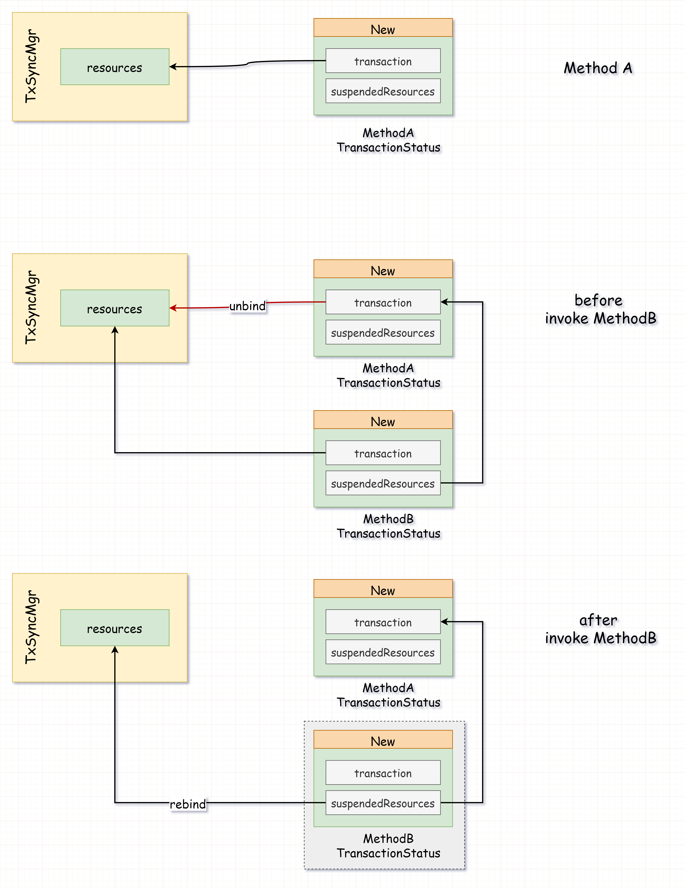
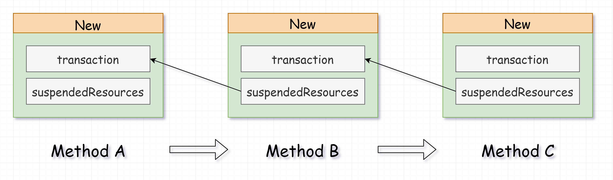
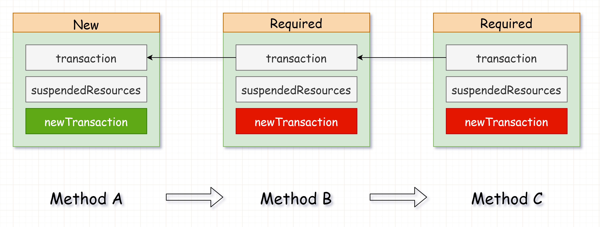
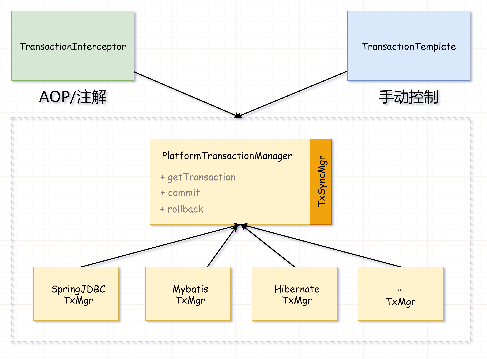

# spring事务管理

<!-- START doctoc generated TOC please keep comment here to allow auto update -->
<!-- DON'T EDIT THIS SECTION, INSTEAD RE-RUN doctoc TO UPDATE -->

- [零、开篇](#%E9%9B%B6%E5%BC%80%E7%AF%87)
- [一、为什么需要事务管理？](#%E4%B8%80%E4%B8%BA%E4%BB%80%E4%B9%88%E9%9C%80%E8%A6%81%E4%BA%8B%E5%8A%A1%E7%AE%A1%E7%90%86)
- [二、Spring 事务管理解决了什么问题？](#%E4%BA%8Cspring-%E4%BA%8B%E5%8A%A1%E7%AE%A1%E7%90%86%E8%A7%A3%E5%86%B3%E4%BA%86%E4%BB%80%E4%B9%88%E9%97%AE%E9%A2%98)
    - [1. 什么是嵌套事务？](#1-%E4%BB%80%E4%B9%88%E6%98%AF%E5%B5%8C%E5%A5%97%E4%BA%8B%E5%8A%A1)
    - [2. 什么是事务传播行为？](#2-%E4%BB%80%E4%B9%88%E6%98%AF%E4%BA%8B%E5%8A%A1%E4%BC%A0%E6%92%AD%E8%A1%8C%E4%B8%BA)
    - [3. 有哪些事务传播行为？](#3-%E6%9C%89%E5%93%AA%E4%BA%9B%E4%BA%8B%E5%8A%A1%E4%BC%A0%E6%92%AD%E8%A1%8C%E4%B8%BA)
    - [4. 看个栗子](#4-%E7%9C%8B%E4%B8%AA%E6%A0%97%E5%AD%90)
    - [5. 怎么回滚？](#5-%E6%80%8E%E4%B9%88%E5%9B%9E%E6%BB%9A)
    - [6. 每个事务/连接使用不同配置](#6-%E6%AF%8F%E4%B8%AA%E4%BA%8B%E5%8A%A1%E8%BF%9E%E6%8E%A5%E4%BD%BF%E7%94%A8%E4%B8%8D%E5%90%8C%E9%85%8D%E7%BD%AE)
    - [7. 功能总结](#7-%E5%8A%9F%E8%83%BD%E6%80%BB%E7%BB%93)
- [三、事务管理器（TransactionManager）模型](#%E4%B8%89%E4%BA%8B%E5%8A%A1%E7%AE%A1%E7%90%86%E5%99%A8transactionmanager%E6%A8%A1%E5%9E%8B)
    - [1. 事务定义 - TransactionDefinition](#1-%E4%BA%8B%E5%8A%A1%E5%AE%9A%E4%B9%89---transactiondefinition)
    - [2. 事务状态 - TransactionStatus](#2-%E4%BA%8B%E5%8A%A1%E7%8A%B6%E6%80%81---transactionstatus)
    - [3. 获取事务资源](#3-%E8%8E%B7%E5%8F%96%E4%BA%8B%E5%8A%A1%E8%B5%84%E6%BA%90)
    - [4. 挂起（Suspend）和恢复（Resume）](#4-%E6%8C%82%E8%B5%B7suspend%E5%92%8C%E6%81%A2%E5%A4%8Dresume)
    - [5. 提交事务](#5-%E6%8F%90%E4%BA%A4%E4%BA%8B%E5%8A%A1)
    - [6. 回滚事务](#6-%E5%9B%9E%E6%BB%9A%E4%BA%8B%E5%8A%A1)
- [四、自动挡与手动挡](#%E5%9B%9B%E8%87%AA%E5%8A%A8%E6%8C%A1%E4%B8%8E%E6%89%8B%E5%8A%A8%E6%8C%A1)
    - [1. 自动挡](#1-%E8%87%AA%E5%8A%A8%E6%8C%A1)
    - [2. 手动挡](#2-%E6%89%8B%E5%8A%A8%E6%8C%A1)
    - [3. 为什么有这么方便的自动挡，还要手动挡？](#3-%E4%B8%BA%E4%BB%80%E4%B9%88%E6%9C%89%E8%BF%99%E4%B9%88%E6%96%B9%E4%BE%BF%E7%9A%84%E8%87%AA%E5%8A%A8%E6%8C%A1%E8%BF%98%E8%A6%81%E6%89%8B%E5%8A%A8%E6%8C%A1)
    - [4. 手自一体可以吗？](#4-%E6%89%8B%E8%87%AA%E4%B8%80%E4%BD%93%E5%8F%AF%E4%BB%A5%E5%90%97)
- [五、总结](#%E4%BA%94%E6%80%BB%E7%BB%93)

<!-- END doctoc generated TOC please keep comment here to allow auto update -->

[TOC]

## 零、开篇

**事务管理**，一个被说烂的也被看烂的话题，还是八股文中的基础股之一。但除了八股文中需要熟读并背诵的那些个传播行为之外，背后的“为什么”和核心原理更为重要。 

本文会从设计角度，一步步的剖析 Spring 事务管理的设计思路（都会设计事务管理器了，还能不不会用么？）

## 一、为什么需要事务管理？

先看看如果没有事务管理器的话，如果**想让多个操作（方法/类）处在一个事务里**应该怎么做：

```java
// MethodA:
public void methodA(){
	Connection connection = acquireConnection();
    try{
        int updated = connection.prepareStatement().executeUpdate();
        methodB(connection);
        connection.commit();
    }catch (Exception e){
        rollback(connection);
    }finally {
        releaseConnection(connection);
    }
}

// MethodB:
public void methodB(Connection connection){
	int updated = connection.prepareStatement().executeUpdate();
}
```

或者用 ThreadLocal 存储 Connection？

```java
static ThreadLocal<Connection> connHolder = new ThreadLocal<>();

// MethodA:
public void methodA(){
	Connection connection = acquireConnection();
	connHolder.set(connection);
    try{
        int updated = connection.prepareStatement().executeUpdate();
        methodB();
        connection.commit();
    }catch (Exception e){
        rollback(connection);
    }finally {
        releaseConnection(connection);
        connHolder.remove();
    }
}

// MethodB:
public void methodB(){
    Connection connection = connHolder.get();
	int updated = connection.prepareStatement().executeUpdate();
}
```

还是有点恶心，再抽象一下？将绑定 Connection 的操作提取为公共方法：

```java
static ThreadLocal<Connection> connHolder = new ThreadLocal<>();

private void bindConnection(){
	Connection connection = acquireConnection();
  connHolder.set(connection);
}

private void unbindConnection(){
	releaseConnection(connection);
    connHolder.remove();
}

// MethodA:
public void methodA(){
    try{
        bindConnection();
        int updated = connHolder.get().prepareStatement().executeUpdate();
        methoB();
        connection.commit();
    }catch (Exception e){
        rollback(connection);
    }finally {
        unbindConnection();
    }
}

// MethodB:
public void methodB(){
  Connection connection = connHolder.get();
	int updated = connection.prepareStatement().executeUpdate();
}
```

现在看起来好点了，不过我有一个新的需求：想让 methodB 独立一个新事务，单独提交和回滚，不影响 methodA 

这……可就有点难搞了，ThreadLocal 中已经绑定了一个 Connection，再新事务的话就不好办了 

那如果再复杂点呢，methodB 中需要调用 methodC，methodC 也需要一个独立事务…… 

而且，每次 bind/unbind 的操作也有点太傻了，万一哪个方法忘了写 unbind ，最后来一个连接泄露那不是完蛋了！ 

好在 Spring 提供了事务管理器，帮我们解决了这一系列痛点。

## 二、Spring 事务管理解决了什么问题？

Spring 提供的事务管理可以帮我们管理事务相关的资源，比如 JDBC 的 Connection、Hibernate 的 Session、Mybatis 的 SqlSession。如说上面的 Connection 绑定到 ThreadLocal 来解决共享一个事务的这种方式，Spring 事务管理就已经帮我们做好了。 

还可以帮我们处理复杂场景下的嵌套事务，比如前面说到的 methodB/methodC 独立事务。

### 1. 什么是嵌套事务？

还是拿上面的例子来说，  methodA 中调用了 methodB，两个方法都有对数据库的操作，而且都需要事务：

```java
// MethodA:
public void methodA(){
    int updated = connection.prepareStatement().executeUpdate();
    methodB();
    // ...
}

// MethodB:
public void methodB(){
    // ...
}
```

**这种多个方法调用链中都有事务的场景，就是嵌套事务。**不过要注意的是，并不是说多个方法使用一个事务才叫嵌套，哪怕是不同的事务，只要在这个方法的调用链中，都是嵌套事务。

### 2. 什么是事务传播行为？

那调用链中的子方法，是用一个新事务，还是使用当前事务呢？这个子方法决定使用新事务还是当前事务（或不使用事务）的策略，就叫事务传播。

在 Spring 的事务管理中，**这个子方法的事务处理策略叫做事务传播行为（Propogation Behavior）**。

### 3. 有哪些事务传播行为？

Spring 的事务管理支持多种传播行为，这里就不贴了，八股文里啥都有。 

但给这些传播行为分类之后，无非是以下三种：

1. 优先使用当前事务
2. 不使用当前事务，新建事务
3. 不使用任何事务

比如上面的例子中，methodB/methodC 独立事务，就属于第 2 种传播行为 - 不使用当前事务，新建事务。

### 4. 看个栗子

以 Spring JDBC + Spring **注解版**的事务举例。在默认的事务传播行为下，methodA 和 methodB 会使用同一个 Connection，在一个事务中

```java
@Transactional
public void methodA(){
    jdbcTemplate.batchUpdate(updateSql, params);
    methodB();
}

@Transactional
public void methodB(){
    jdbcTemplate.batchUpdate(updateSql, params);
}
```

如果我想让 methodB 不使用 methodA 的事务，自己新建一个连接/事务呢？只需要简单的配置一下 @Transactional 注解：

```java
@Transactional
public void methodA(){
    jdbcTemplate.batchUpdate(updateSql, params);
    methodB();
}

// 传播行为配置为 - 方式2，不使用当前事务，独立一个新事务
@Transactional(propagation = Propagation.REQUIRES_NEW)
public void methodB(){
    jdbcTemplate.batchUpdate(updateSql, params);
}
```

就是这么简单，获取 Connection/多方法共享 Connection/多方法共享+独享 Connection/提交/释放连接之类的操作，完全不需要我们操心，Spring 都替我们做好了。

### 5. 怎么回滚？

在注解版的事务管理中，默认的的回滚策略是：抛出异常就回滚。这个默认策略挺好，连回滚都帮我们解决了，再也不用手动回滚。 

但是如果在嵌套事务中，子方法独立新事务呢？这个时候哪怕抛出异常，也只能回滚子事务，不能直接影响前一个事务

可如果这个抛出的异常不是 sql 导致的，比如校验不通过或者其他的异常，此时应该将当前的事务回滚吗？ 

这个还真不一定，谁说抛异常就要回滚，异常也不回滚行不行？ 

当然可以！抛异常和回滚事务本来就是两个问题，可以连在一起，也可以分开处理

```java
// 传播行为配置为 - 方式2，不使用当前事务，独立一个新事务

// 指定 Exception 也不会滚
@Transactional(propagation = Propagation.REQUIRES_NEW, noRollbackFor = Exception.class)
public void methodB(){
    jdbcTemplate.batchUpdate(updateSql, params);
}
```

### 6. 每个事务/连接使用不同配置

除了传播和回滚之外，还可以给每个事务/连接使用不同的配置，比如不同的隔离级别：

```java
@Transactional
public void methodA(){
    jdbcTemplate.batchUpdate(updateSql, params);
    methodB();
}

// 传播行为配置为 - 方式2，不使用当前事务，独立一个新事务
// 这个事务/连接中使用 RU 隔离级别，而不是默认的 RR
@Transactional(propagation = Propagation.REQUIRES_NEW, isolation = Isolation.READ_UNCOMMITTED)
public void methodB(){
    jdbcTemplate.batchUpdate(updateSql, params);
}
```

除了隔离级别之外，其他的 JDBC Connection 配置当然也是支持的，比如 readOnly。这样一来，虽然我们不用显示的获取 connection/session，但还是可以给嵌套中的每一个事务配置不同的参数，非常灵活。

### 7. 功能总结

好了，现在已经了解了 Spring 事务管理的所有核心功能，来总结一下这些核心功能点：

1. 连接/资源管理 - 无需手动获取资源、共享资源、释放资源
2. 嵌套事务的支持 - 支持嵌套事务中使用不同的资源策略、回滚策略
3. 每个事务/连接使用不同的配置

## 三、事务管理器（TransactionManager）模型

其实仔细想想，事务管理的核心操作只有两个：提交和回滚。前面所谓的传播、嵌套、回滚之类的，都是基于这两个操作。 

所以 Spring 将事务管理的核心功能抽象为一个**事务管理器（Transaction Manager）**，基于这个事务管理器核心，可以实现多种事务管理的方式。 

这个核心的事务管理器只有三个功能接口：

1. **获取事务资源**，资源可以是任意的，比如jdbc connection/hibernate mybatis session之类，然后绑定并存储
2. **提交事务** - 提交指定的事务资源
3. **回滚事务** - 回滚指定的事务资源

```java
interface PlatformTransactionManager{
    // 获取事务资源，资源可以是任意的，比如jdbc connection/hibernate mybatis session之类
	TransactionStatus getTransaction(TransactionDefinition definition) throws TransactionException;
    
  // 提交事务
  void commit(TransactionStatus status) throws TransactionException;
    
  // 回滚事务
  void rollback(TransactionStatus status) throws TransactionException;
}
```

### 1. 事务定义 - TransactionDefinition

还记得上面的 @Transactional 注解吗，里面定义了传播行为、隔离级别、回滚策略、只读之类的属性，这个就是一次事务操作的定义。 

在获取事务资源时，需要根据这个事务的定义来进行不同的配置：

1. 比如配置了使用新事务，那么在获取事务资源时就需要创建一个新的，而不是已有的
2. 比如配置了隔离级别，那么在首次创建资源（Connection）时，就需要给 Connection 设置 propagation
3. 比如配置了只读属性，那么在首次创建资源（Connection）时，就需要给 Connection 设置 readOnly

为什么要单独用一个 TransactionDefinition 来存储事务定义，直接用注解的属性不行吗？ 

当然可以，但注解的事务管理只是 Spring 提供的自动挡，还有适合老司机的手动挡事务管理（后面会介绍）；手动挡可用不了注解，所以单独建一个事务定义的模型，这样就可以实现通用。

### 2. 事务状态 - TransactionStatus

那既然嵌套事务下，每个子方法的事务可能不同，所以还得有一个子方法事务的状态 - TransactionStatus，用来存储当前事务的一些数据和状态，比如事务资源（Connection）、回滚状态等。

### 3. 获取事务资源

事务管理器的第一步，就是根据事务定义来获取/创建资源了，这一步最麻烦的是要区分传播行为，不同传播行为下的逻辑不太一样。 

“默认的传播行为下，使用当前事务”，怎么算有当前事务呢？ 

把事务资源存起来嘛，只要已经存在那就是有当前事务，直接获取已存储的事务资源就行。文中开头的例子也演示了，如果想让多个方法无感的使用同一个事务，可以用 ThreadLocal 存储起来，简单粗暴。 

Spring 也是这么做的，不过它实现的更复杂一些，抽象了一层**事务资源同步管理器 - TransactionSynchronizationManager（本文后面会简称 TxSyncMgr）**，在这个同步管理器里使用 ThreadLocal 存储了事务资源（本文为了方便理解，尽可能的不贴非关键源码）。 

剩下的就是根据不同传播行为，执行不同的策略了，分类之后只有 3 个条件分支：

1. 当前有事务 - 根据不同传播行为处理不同
2. 当前没事务，但需要开启新事务
3. 彻底不用事务 - 这个很少用

```java
public final TransactionStatus getTransaction(TransactionDefinition definition) {
    //创建事务资源 - 比如 Connection
    Object transaction = doGetTransaction();
    
    if (isExistingTransaction(transaction)) {
        // 处理当前已有事务的场景
        return handleExistingTransaction(def, transaction, debugEnabled);
    }else if (def.getPropagationBehavior() == TransactionDefinition.PROPAGATION_REQUIRED ||
				def.getPropagationBehavior() == TransactionDefinition.PROPAGATION_REQUIRES_NEW ||
				def.getPropagationBehavior() == TransactionDefinition.PROPAGATION_NESTED){
        
        // 开启新事务
    	return startTransaction(def, transaction, debugEnabled, suspendedResources);
    }else {
    	// 彻底不用事务
    }
    
    // ...
}
```

先介绍一下**分支 2 - 当前没事务，但需要开启新事务**，这个逻辑相对简单一些。只需要新建事务资源，然后绑定到 ThreadLocal 即可：

```java
private TransactionStatus startTransaction(TransactionDefinition definition, Object transaction,
			boolean debugEnabled, SuspendedResourcesHolder suspendedResources) {
		
    	// 创建事务
		DefaultTransactionStatus status = newTransactionStatus(
				definition, transaction, true, newSynchronization, debugEnabled, suspendedResources);
    	
    	// 开启事务（beginTx或者setAutoCommit之类的操作）
    	// 然后将事务资源绑定到事务资源管理器 TransactionSynchronizationManager
		doBegin(transaction, definition);
}
```

现在回到分支 **1 - 当前有事务 - 根据不同传播行为处理不同**，这个就稍微有点麻烦了。因为有子方法独立事务的需求，可是 TransactionSynchronizationManager 却只能存一个事务资源。

### 4. 挂起（Suspend）和恢复（Resume）

Spring 采用了一种**挂起（Suspend） - 恢复（Resume）**的设计来解决这个嵌套资源处理的问题。当子方法需要独立事务时，就将当前事务挂起，从 TxSyncMgr 中移除当前事务资源，创建新事务的状态时，将挂起的事务资源保存至新的事务状态 TransactionStatus 中；在子方法结束时，只需要再从子方法的事务状态中，再次拿出挂起的事务资源，重新绑定至 TxSyncMgr 即可完成恢复的操作。 

整个挂起 - 恢复的流程，如下图所示： 



**注意：挂起操作是在获取事务资源这一步做的，而恢复的操作是在子方法结束时（提交或者回滚）中进行的。** 

这样一来，每个 TransactionStatus 都会保存挂起的前置事务资源，如果方法调用链很长，每次都是新事务的话，那这个 TransactionStatus 看起来就会像一个链表：



### 5. 提交事务

获取资源、操作完毕后来到了提交事务这一步，这个提交操作比较简单，只有两步：

1. 当前是新事务才提交
2. 处理挂起资源

怎么知道是新事务？ 

每经过一次事务嵌套，都会创建一个新的 TransactionStatus，这个事务状态里会记录当前是否是新事务。如果多个子方法都使用一个事务资源，那么除了第一个创建事务资源的 TransactionStatus 之外，其他都不是新事务。 

如下图所示，A -> B -> C 时，由于 BC 都使用当前事务，那么虽然 ABC 所使用的事务资源是一样的，但是只有 A 的 TransactionStatus 是新事务，BC 并不是；那么在 BC 提交事务时，就不会真正的调用提交，只有回到 A 执行 commit 操作时，才会真正的调用提交操作。



这里再解释下，为什么新事务才需要提交，而已经有事务却什么都不用做：

因为对于新事务来说，这里的提交操作已经是事务完成了；而对于非新事务的场景，前置事务（即当前事务）还没有执行完，可能后面还有其他数据库操作，所以这个提交的操作得让当前事务创建方去做，这里并不能提交。

### 6. 回滚事务

除了提交，还有回滚呢，回滚事务的逻辑和提交事务类似：

1. 如果是新事务才回滚，原因上面已经介绍过了
2. 如果不是新事务则只设置回滚标记
3. 处理挂起资源

**注意：事务管理器是不包含回滚策略这个东西的，回滚策略是 AOP 版的事务管理增强的功能，但这个功能并不属于核心的事务管理器**

## 四、自动挡与手动挡

Spring 的事务管理功能都是围绕着上面这个事务管理器运行的，提供了三种管理事务的方式，分别是：

1. XML AOP 的事务管理 - 比较古老现在用的不多
2. 注解版本的事务管理 - @Transactional
3. TransactionTemplate - 手动挡的事务管理，也称编程式事务管理

### 1. 自动挡

XML/@Transactional 两种基于 AOP 的注解管理，其入口类是 TransactionInterceptor，是一个 AOP 的 Interceptor，负责调用事务管理器来实现事务管理。 

因为核心功能都在事务管理器里实现，所以这个 AOP Interceptor 很简单，只是调用一下事务管理器，核心（伪）代码如下：

```java
public Object invoke(MethodInvocation invocation) throws Throwable {
  // 获取事务资源
	Object transaction = transactionManager.getTransaction(txAttr);    
  Object retVal;

  try {
    // 执行业务代码
    retVal = invocation.proceedWithInvocation();

    // 提交事务
    transactionManager.commit(txStatus);
  } catch (Throwable ex){
    // 先判断异常回滚策略，然后调用事务管理器的 rollback
    rollbackOn(ex, txStatus);
  } 
}
```

并且 AOP 这种自动挡的事务管理还增加了一个回滚策略的玩法，这个是手动挡 TransactionTemplate 所没有的，但这个功能并不在事务管理器中，只是 AOP 版事务的一个增强。

### 2. 手动挡

`TransactionTemplate` 这个是手动挡的事务管理，虽然没有注解的方便，但是好在灵活，异常/回滚啥的都可以自己控制。 

所以这个实现更简单，连异常回滚策略都没有，特殊的回滚方式还要自己设置（默认是任何异常都会回滚），核心（伪）代码如下：

```java
public <T> T execute(TransactionCallback<T> action) throws TransactionException {
    // 获取事务资源
    TransactionStatus status = this.transactionManager.getTransaction(this);
    T result;
    try {
        
        // 执行 callback 业务代码
        result = action.doInTransaction(status);
    }
    catch (Throwable ex) {
        
        // 调用事务管理器的 rollback
        rollbackOnException(status, ex);
    }
    
    提交事务
    this.transactionManager.commit(status);
	}
}
```

### 3. 为什么有这么方便的自动挡，还要手动挡？

因为自动挡更灵活啊，想怎么玩就怎么玩，比如我可以在一个方法中，执行多个数据库操作，但使用不同的事务资源：

```java
Integer rows = new TransactionTemplate((PlatformTransactionManager) transactionManager,
                                       new DefaultTransactionDefinition(TransactionDefinition.ISOLATION_READ_UNCOMMITTED))
    .execute(new TransactionCallback<Integer>() {
        @Override
        public Integer doInTransaction(TransactionStatus status) {
			// update 0
            int rows0 = jdbcTemplate.update(...);
            
            // update 1
            int rows1 = jdbcTemplate.update(...);
            return rows0 + rows1;
        }
    });

Integer rows2 = new TransactionTemplate((PlatformTransactionManager) transactionManager,
                                        new DefaultTransactionDefinition(TransactionDefinition.ISOLATION_READ_UNCOMMITTED))
    .execute(new TransactionCallback<Integer>() {
        @Override
        public Integer doInTransaction(TransactionStatus status) {
            
            // update 2
            int rows2 = jdbcTemplate.update(...);
            return rows2;
        }
    });
```

在上面这个例子里，通过 TransactionTemplate 我们可以精确的控制 update0/update1 使用同一个事务资源和隔离级别，而 update2 单独使用一个事务资源，并且不需要新建类加注解的方式。

### 4. 手自一体可以吗？

当然可以，只要我们使用的是同一个事务管理器的实例，因为绑定资源到同步资源管理器这个操作是在事务管理器中进行的。 

AOP 版本的事务管理里，同样可以使用手动挡的事务管理继续操作，而且还可以使用同一个事务资源 。 

比如下面这段代码，update1/update2 仍然在一个事务内，并且 update2 的 callback 结束后并不会提交事务，事务最终会在 methodA 结束时，TransactionInterceptor 中才会提交

```java
@Transactional
public void methodA(){
    
    // update 1
	jdbcTemplate.update(...);
    new TransactionTemplate((PlatformTransactionManager) transactionManager,
                                        new DefaultTransactionDefinition(TransactionDefinition.ISOLATION_READ_UNCOMMITTED))
    .execute(new TransactionCallback<Integer>() {
        @Override
        public Integer doInTransaction(TransactionStatus status) {
            
            // update 2
            int rows2 = jdbcTemplate.update(...);
            return rows2;
        }
    });
   
}
```

## 五、总结

Spring 的事务管理，其核心是一个抽象的事务管理器，XML/@Transactional/TransactionTemplate 几种方式都是基于这个事务管理器的，三中方式的核心实现区别并不大，只是入口不同而已。



本文为了方便理解，省略了大量的非关键实现细节，可能会导致有部分描述不严谨的地方。