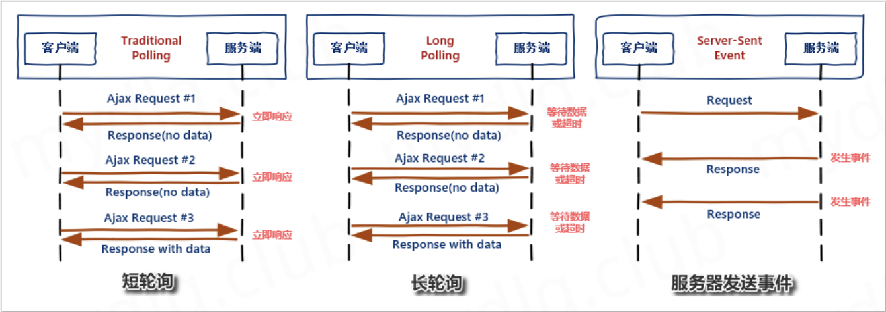
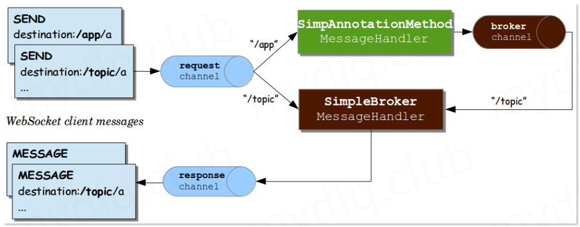

# WebSocket 知识点

目录
+ [WebSocket简介](#WebSocket简介)
+ [WebSocket特点](#WebSocket特点)
+ [为什么需要WebSocket](#为什么需要WebSocket)
+ [WebSocket连接流程](#WebSocket连接流程)
+ [WebSocket使用场景](#WebSocket使用场景)
+ [WebSocket中子协议支持](#WebSocket中子协议支持)
+ [STOMP协议](#STOMP协议)
  - [STOMP协议介绍](#STOMP协议介绍)
  - [STOMP帧](#STOMP帧)
  - [Stomp与WebSocket的关系](#Stomp与WebSocket的关系)
  - [使用STOMP作为WebSocket子协议的好处](#使用STOMP作为WebSocket子协议的好处)
+ [Spring封装的STOMP](#Spring封装的STOMP)
+ [实现简单的广播模式示例](#实现简单的广播模式示例)
+ [SpringBoot结合WebSocket的常用方法示例](#SpringBoot结合WebSocket的常用方法示例)


## WebSocket简介
WebSocket 是一种基于 TCP 的网络协议，也是一种全双工通信的协议，既允许客户端向服务器主动发送消息，也允许服务器主动向客户端发送消息。在 WebSocket 中，浏览器和服务器只需要**完成**(不是只进行一次)一次握手，两者之间就可以建立持久性的连接，进行双向数据传输。

## WebSocket特点
1. 连接握手阶段使用 HTTP 协议；
2. 协议标识符是 ws，如果采用加密则是 wss；
3. 数据格式比较轻量，性能开销小，通信高效；
4. 没有同源限制，客户端可以与任意服务器通信；
5. 建立在 TCP 协议之上，服务器端的实现比较容易；
6. 通过 WebSocket 可以发送文本，也可以发送二进制数据；
7. 与 HTTP 协议有着良好的兼容性。默认端口也是 80 和 443，并且握手阶段采用 HTTP 协议，因此握手时不容易屏蔽，能通过各种 HTTP 代理服务器。


> **同源限制**  
> 早就猜到你个憨批可能会不知道啥是同源策略，爷特地找了个  
> 同源策略限制从一个源（协议、域名、端口）加载的文档或脚本如何与来自另一个源的资源进行交互；这是一个用于隔离潜在的恶意文件的关键的安全机制；如果源不一样就是协议、域名、端口有一个不一样的话，就是非同源策略，就跨域了。  
> 什么是限制呢？就是说不是一个源的文档，你没有权力去操作另一个源的文档，主要限制的几个方面如下：
> 1. Cookie 、LocalStorage 和 IndexDB无法读取；
> 2. 无法获取或操作另一个资源的DOM；
> 3. AJAX请求不能发送。

## 为什么需要WebSocket
在没有 WebSocket 时，基于 Web 的消息基本上是靠 Http 协议进行通信，而经常有”聊天室”、”消息推送”、”股票信息实时动态”等这样需求，而实现这样的需求常用的有以下几种解决方案：  


1. 短轮询(Traditional Polling)  
短轮询是指客户端每隔一段时间就询问一次服务器是否有新的消息，如果有就接收消息；这样方式会增加很多次无意义的发送请求信息，每次都会耗费流量及处理器资源。
- 优点：短连接，服务器处理简单，支持跨域、浏览器兼容性较好；
- 缺点：有一定延迟、服务器压力较大，浪费带宽流量、大部分是无效请求。

2. 长轮询(Long Polling)  
长轮询是段轮询的改进，客户端执行 HTTP 请求发送消息到服务器后，等待服务器回应，如果没有新消息就一直等待，直到服务器有新消息传回或者超时。  
这也是个反复的过程，这种做法只是减小了网络带宽和处理器的消耗，但是带来的问题是导致消息实时性低，延迟严重，而且也是基于循环，最根本的带宽及处理器资源占用并没有得到有效的解决。
- 优点：减少轮询次数，低延迟，浏览器兼容性较好；
- 缺点：服务器需要保持大量连接。

3. 服务器发送事件(Server-Sent Event)  
服务器发送事件是一种服务器向浏览器客户端发起数据传输的技术。一旦创建了初始连接，事件流将保持打开状态，直到客户端关闭。该技术通过传统的 HTTP 发送，并具有 WebSockets 缺乏的各种功能，例如”自动重新连接”、”事件ID” 及 “发送任意事件”的能力。  
服务器发送事件是单向通道，只能服务器向浏览器发送，因为流信息本质上就是下载。
- 优点：适用于更新频繁、低延迟并且数据都是从服务端发到客户端；
- 缺点：浏览器兼容难度高(目前除了 IE/Edge，其他浏览器都支持)。

上面这几种方式都有各自的优缺点，虽然靠轮询方式能够实现这些一些功能，但是其对性能的开销和低效率是非常致命的，尤其是在移动端流行的现在。

现在客户端与服务端双向通信的需求越来越多，且现在的浏览器大部分都支持 WebSocket。所以对实时性和双向通信及其效率有要求的话，比较推荐使用 WebSocket。

## WebSocket连接流程
### 第一步
客户端先用带有 Upgrade:Websocket 请求头的 HTTP 请求，向服务器端发起连接请求，实现握手(HandShake)。  
客户端 HTTP 请求的 Header 头信息如下：
```
Connection: Upgrade
Sec-WebSocket-Extensions: permessage-deflate; client_max_window_bits
Sec-WebSocket-Key: IRQYhWINfX5Fh1zdocDl6Q==
Sec-WebSocket-Version: 13
Upgrade: websocket
```
- **Connection: Upgrade** 表示要升级协议；
- **Sec-WebSocket-Extensions**：表示客户端所希望执行的扩展(如消息压缩插件)；
- **Sec-WebSocket-Key**：主要用于WebSocket协议的校验，对应服务端响应头的 Sec-WebSocket-Accept；
- **Sec-WebSocket-Version**：表示 websocket 的版本；如果服务端不支持该版本，需要返回一个Sec-WebSocket-Versionheader，里面包含服务端支持的版本号；
- **Upgrade: Websocket**：要升级协议到 websocket 协议。

### 第二步
握手成功后，由 HTTP 协议升级成 Websocket 协议，进行长连接通信，两端相互传递信息。  
服务端响应的 HTTP Header 头信息如下：
```
Connection: upgrade
Sec-Websocket-Accept: TSF8/KitM+yYRbXmjclgl7DwbHk=
Upgrade: websocket
```
**Sec-Websocket-Accept**：对应 Sec-WebSocket-Key 生成的值，主要是返回给客户端，让客户端对此值进行校验，证明服务端支持 WebSocket。

## WebSocket使用场景
1. 数据流状态：比如说上传下载文件，文件进度，文件是否上传成功；
2. 协同编辑文档：同一份文档，编辑状态要同步到所有参与的用户界面上；
3. 社交订阅：有时候我们需要及时收到订阅消息，比如说开奖通知，比如说在线邀请，支付结果等；  
4. ...

## WebSocket中子协议支持
WebSocket 确实指定了一种消息传递体系结构，但并不强制使用任何特定的消息传递协议。而且它是 TCP 上的一个非常薄的层，它将字节流转换为消息流（文本或二进制）仅此而已。由应用程序来解释消息的含义。

与 HTTP（它是应用程序级协议）不同，在 WebSocket 协议中，传入消息中根本没有足够的信息供框架或容器知道如何路由或处理它。因此，对于非常琐碎的应用程序而言 WebSocket 协议的级别可以说太低了。

可以做到的是引导在其上面再创建一层框架。这就相当于当今大多数 Web 应用程序使用的是 Web 框架，而不直接仅使用 Servlet API 进行编码一样。

WebSocket RFC 定义了子协议的使用。在握手过程中，客户机和服务器可以使用头 Sec-WebSocket 协议商定子协议，即使不需要使用子协议，而是用更高的应用程序级协议，但应用程序仍需要选择客户端和服务器都可以理解的消息格式。且该格式可以是自定义的、特定于框架的或标准的消息传递协议。

Spring 框架支持使用 STOMP，这是一个简单的消息传递协议。

> 简单来说子协议就是内容传输格式 **吧**


## STOMP协议
### STOMP协议介绍
STOMP（Simple Text-Orientated Messaging Protocol）是一种简单的面向文本的消息传递协议，它提供了一个可互操作的连接格式，允许 STOMP 客户端与任意 STOMP 消息代理（Broker）进行交互。STOMP 协议由于设计简单，易于开发客户端，因此在多种语言和多种平台上得到广泛地应用。

简单介绍可以分为以下几点：
1. STOMP 是基于帧的协议，其帧以 HTTP 为模型；
2. STOMP 框架由命令，一组可选的标头和可选的主体组成；
3. STOMP 基于文本，但也允许传输二进制消息；
4. STOMP 的默认编码为 UTF-8，但它支持消息正文的替代编码的规范。

### STOMP帧
STOMP 客户端是一种用户代理：  
- 作为**生产者**，通过 SEND 帧将消息发送到目标服务器上；
- 作为**消费者**，对目标地址发送 SUBSCRIBE 帧，并作为 MESSAGE 帧从服务器接收消息。

STOMP 是基于帧的协议，其帧以 HTTP 为模型。STOMP 结构为：
```
COMMAND
header1:value1
header2:value2

Body^@
```
客户端可以使用 SEND 或 SUBSCRIBE 命令发送或订阅消息，还可以使用 “destination” 头来描述消息的内容和接收者。  
这支持一种简单的发布-订阅机制，可用于通过代理将消息发送到其他连接的客户端，或将消息发送到服务器以请求执行某些工作。

#### 常用帧
STOMP 的客户端和服务器之间的通信是通过"帧"（Frame）实现的，每个帧由多"行"（Line）组成，其包含的帧如下：
- Connecting Frames：
  - CONNECT（连接）
  - CONNECTED（成功连接）
- Client Frames：
  - SEND（发送）
  - SUBSRIBE（订阅）
  - UNSUBSCRIBE（取消订阅）
  - BEGIN（开始）
  - COMMIT（提交）
  - ABORT（中断）
  - ACK（确认）
  - NACK（否认）
  - DISCONNECT（断开连接）
- Server Frames：
  - MESSAGE（消息）
  - RECEIPT（接收）
  - ERROR（错误）
  
### Stomp与WebSocket的关系
直接使用 WebSocket 就很类似于使用 TCP 套接字来编写 Web 应用，因为没有高层级的应用协议（wire protocol），因而就需要我们定义应用之间所发送消息的语义，还需要确保连接的两端都能遵循这些语义。

同 HTTP 在 TCP 套接字上添加请求-响应模型层一样，STOMP 在 WebSocket 之上提供了一个基于帧的线路格式层，用来定义消息语义。

### 使用STOMP作为WebSocket子协议的好处
1. 无需发明自定义消息格式；
2. 在浏览器中使用现有的stomp.js客户端(前端的东西，不需要管)
3. 能够根据目的地将消息路由到；
4. 可以使用成熟的消息代理（例如RabbitMQ，ActiveMQ等）进行广播的选项；
5. 使用STOMP（相对于普通 WebSocket）使 Spring Framework 能够为应用程序级使用提供编程模型，就像 Spring MVC 提供基于 HTTP 的编程模型一样。

## Spring封装的STOMP
使用 Spring 的 STOMP 支持时，Spring WebSocket 应用程序充当客户端的 STOMP 代理。

消息被路由到 **@Controller** 消息处理方法或简单的内存中代理，该代理跟踪订阅并向订阅的用户广播消息。

还可以将 Spring 配置为与专用的 STOMP 代理（例如RabbitMQ，ActiveMQ等）一起使用，以实际广播消息。在那种情况下，Spring 维护与代理的 TCP 连接，将消息中继到该代理，并将消息从该代理向下传递到已连接的 WebSocket 客户端。

因此 Spring Web 应用程序可以依赖基于统一 HTTP 的安全性，通用验证以及熟悉的编程模型消息处理工作。

Spring 官方提供的处理流图：


上面中的一些概念关键词：
- Message：消息，里面带有 header 和 payload；
- MessageHandler：处理 client 消息的实体；
- MessageChannel：解耦消息发送者与消息接收者的实体
  - clientInboundChannel：用于从 WebSocket 客户端接收消息；
  - clientOutboundChannel：用于将服务器消息发送给 WebSocket 客户端；
  - brokerChannel：用于从服务器端、应用程序中向消息代理发送消息；
- Broker：存放消息的中间件，client 可以订阅 broker 中的消息。

## 实现简单的广播模式示例
WebSocket 常分为**广播**与**队列**模式，广播模式是向订阅广播的用户发送信息，只要订阅相关广播就能收到对应信息。

### Maven 引入相关依赖
这个没什么好说的
```xml
<dependencies>
        <!-- SpringBoot WebSocket -->
        <dependency>
            <groupId>org.springframework.boot</groupId>
            <artifactId>spring-boot-starter-websocket</artifactId>
        </dependency>
        <!-- Lombok -->
        <dependency>
            <groupId>org.projectlombok</groupId>
            <artifactId>lombok</artifactId>
            <scope>provided</scope>
        </dependency>
</dependencies>
```

### 创建测试实体类
创建便于传输消息的实体类，里面字段内容如下：
```java
@Data
@Accessors(chain = true)
public class MessageBody {
    /**
     * 消息内容
     */
    private String content;

    /**
     * 广播转发的目标地址（告知 STOMP 代理转发到哪个地方）
     */
    private String destination;
}
```

### 创建 WebSocket 配置类
```java
@Configuration
@EnableWebSocketMessageBroker
public class WebSocketConfig implements WebSocketMessageBrokerConfigurer {

    /**
     * 配置 WebSocket 进入点，及开启使用 SockJS，这些配置主要用配置连接端点，用于 WebSocket 连接
     * @param registry STOMP 端点
     */
    @Override
    public void registerStompEndpoints(StompEndpointRegistry registry) {
        registry.addEndpoint("/mydlq").withSockJS();
    }

    /**
     * 配置消息代理选项
     * @param registry 消息代理注册配置
     */
    @Override
    public void configureMessageBroker(MessageBrokerRegistry registry) {
        // 配置客户端发送请求消息的一个或多个前缀，该前缀会筛选消息目标转发到 Controller 类中注解对应的方法里
        registry.setApplicationDestinationPrefixes("/app");
        // 设置一个或者多个代理前缀，在 Controller 类中的方法里面发送的消息，会首先转发到代理从而发送到对应广播或者队列中。
        registry.enableSimpleBroker("/topic");
    }
}
```

### 创建测试 Controller 类
在方法上面添加 @MessageMapping 注解，当客户端发送消息请求的前缀匹配上 WebSocket 配置类中的 **/app** 前缀后，会进入到 Controller 类中进行匹配，如果匹配成功则执行注解所在的方法内容。
```java
@Controller
public class MessageController {

    /**
     * 消息发送工具对象
     */
    @Autowired
    private SimpMessageSendingOperations simpMessageSendingOperations;

    /**
     * 广播发送消息，将消息发送到指定的目标地址
     *
     * @param messageBody
     */
    @MessageMapping("/test")
    public void sendTopicMessage(MessageBody messageBody) {
        // 将消息发送到 WebSocket 配置类中配置的代理中（/topic）进行消息转发
        simpMessageSendingOperations.convertAndSend(messageBody.getDestination(), messageBody);
    }
}
```

### 创建测试脚本
创建用于操作 WebSocket 的 JS 文件 app-websocket.js，内容如下：
```js
// 设置 STOMP 客户端
var stompClient = null;
// 设置 WebSocket 进入端点
var SOCKET_ENDPOINT = "/mydlq";
// 设置订阅消息的请求前缀
var SUBSCRIBE_PREFIX = "/topic"
// 设置订阅消息的请求地址
var SUBSCRIBE = "";
// 设置服务器端点，访问服务器中哪个接口
var SEND_ENDPOINT = "/app/test";

/* 进行连接 */
function connect() {
    // 设置 SOCKET
    var socket = new SockJS(SOCKET_ENDPOINT);
    // 配置 STOMP 客户端
    stompClient = Stomp.over(socket);
    // STOMP 客户端连接
    stompClient.connect({}, function (frame) {
        alert("连接成功");
    });
}

/* 订阅信息 */
function subscribeSocket(){
    // 设置订阅地址
    SUBSCRIBE = SUBSCRIBE_PREFIX + $("#subscribe").val();
    // 输出订阅地址
    alert("设置订阅地址为：" + SUBSCRIBE);
    // 执行订阅消息
    stompClient.subscribe(SUBSCRIBE, function (responseBody) {
        var receiveMessage = JSON.parse(responseBody.body);
        $("#information").append("<tr><td>" + receiveMessage.content + "</td></tr>");
    });
}

/* 断开连接 */
function disconnect() {
    stompClient.disconnect(function() {
        alert("断开连接");
    });
}

/* 发送消息并指定目标地址（这里设置的目标地址为自身订阅消息的地址，当然也可以设置为其它地址） */
function sendMessageNoParameter() {
    // 设置发送的内容
    var sendContent = $("#content").val();
    // 设置待发送的消息内容
    var message = '{"destination": "' + SUBSCRIBE + '", "content": "' + sendContent + '"}';
    // 发送消息
    stompClient.send(SEND_ENDPOINT, {}, message);
}
```

### 创建 WebSocket HTML
```html
<!DOCTYPE html>
<html lang="zh">
<head>
    <title>Hello WebSocket</title>
    <link href="https://cdn.bootcdn.net/ajax/libs/twitter-bootstrap/3.4.1/css/bootstrap.min.css" rel="stylesheet">
    <meta http-equiv="Content-Type" content="text/html; charset=utf-8"/>
    <script src="https://cdn.bootcdn.net/ajax/libs/jquery/3.5.1/jquery.js"></script>
    <script src="https://cdn.bootcdn.net/ajax/libs/sockjs-client/1.4.0/sockjs.min.js"></script>
    <script src="https://cdn.bootcdn.net/ajax/libs/stomp.js/2.3.3/stomp.min.js"></script>
    <script src=app-websocket.js></script>
</head>

<body>
<div id="main-content" class="container" style="margin-top: 10px;">
    <div class="row">
        <form class="navbar-form" style="margin-left:0px">
            <div class="col-md-12">
                <div class="form-group">
                    <label>WebSocket 连接：</label>
                    <button class="btn btn-primary" type="button" onclick="connect();">进行连接</button>
                    <button class="btn btn-danger" type="button" onclick="disconnect();">断开连接</button>
                </div>
                <label>订阅地址：</label>
                <div class="form-group">
                    <input type="text" id="subscribe" class="form-control" placeholder="订阅地址">
                </div>
                <button class="btn btn-warning" onclick="subscribeSocket();" type="button">订阅</button>
            </div>
        </form>
    </div>
    </br>
    <div class="row">
        <div class="form-group">
            <label for="content">发送的消息内容：</label>
            <input type="text" id="content" class="form-control" placeholder="消息内容">
        </div>
        <button class="btn btn-info" onclick="sendMessageNoParameter();" type="button">发送</button>
    </div>
    </br>
    <div class="row">
        <div class="col-md-12">
            <h5 class="page-header" style="font-weight:bold">接收到的消息：</h5>
            <table class="table table-striped">
                <tbody id="information"></tbody>
            </table>
        </div>
    </div>
</div>
</body>
</html>
```

### 启动并进行测试
输入地址 http://localhost:8080/index.html 访问测试的前端页面，然后执行下面步骤进行测试：
1. 点击进行连接按钮，连接 WebSocket 服务端；
2. 在订阅地址栏输入订阅地址（因为设置的订阅地址和接收消息的地址是一个，所以随意输入）；
3. 点击订阅按钮订阅对应地址的消息；
4. 在发送消息内容的输入框中输入hello world!，然后点击发送按钮发送消息；
5. 执行完上面步骤成后，可以观察到成功接收到订阅地址的消息。

##  SpringBoot结合WebSocket的常用方法示例

### WebSocket 开启跨域选项
WebSocket 配置类，里面设置允许跨域，内容如下：
```java
@Override
    public void registerStompEndpoints(StompEndpointRegistry registry) {
        registry.addEndpoint("/mydlq")
        // 设置允许跨域，设置为"*"则为允许全部域名
        .setAllowedOrigins("*")
        .withSockJS();
    }
```

### WebSocket 用户上、下线监听
```java
@Configuration
public class HttpWebSocketHandlerDecoratorFactory implements WebSocketHandlerDecoratorFactory {
    /**
     * 配置 webSocket 处理器
     *
     * @param webSocketHandler webSocket 处理器
     * @return webSocket 处理器
     */
    @Override
    public WebSocketHandler decorate(WebSocketHandler webSocketHandler) {
        return new WebSocketHandlerDecorator(webSocketHandler) {
            /**
             * websocket 连接时执行的动作
             * @param session    websocket session 对象
             * @throws Exception 异常对象
             */
            @Override
            public void afterConnectionEstablished(final WebSocketSession session) throws Exception {
                // 输出进行 websocket 连接的用户信息
                if (session.getPrincipal() != null) {
                    String username = session.getPrincipal().getName();
                    System.out.println("用户:" + username + "上线");
                    super.afterConnectionEstablished(session);
                }
            }

            /**
             * websocket 关闭连接时执行的动作
             * @param session websocket session 对象
             * @param closeStatus 关闭状态对象
             * @throws Exception 异常对象
             */
            @Override
            public void afterConnectionClosed(final WebSocketSession session, CloseStatus closeStatus) throws Exception {
                // 输出关闭 websocket 连接的用户信息
                if (session.getPrincipal() != null) {
                    String username = session.getPrincipal().getName();
                    System.out.println("用户:" + username + "下线");
                    super.afterConnectionClosed(session, closeStatus);
                }
            }
        };
    }
}
```
WebSocket 配置类中实现 configureWebSocketTransport() 方法，将上面 WebSocket 处理器加到其中，如下：
```java
    /**
     * 添加 WebSocket 用户上、下线监听器
     */
    @Override
    public void configureWebSocketTransport(WebSocketTransportRegistration registry) {
        registry.addDecoratorFactory(new HttpWebSocketHandlerDecoratorFactory());
    }
```